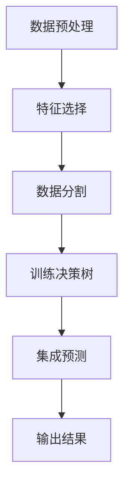
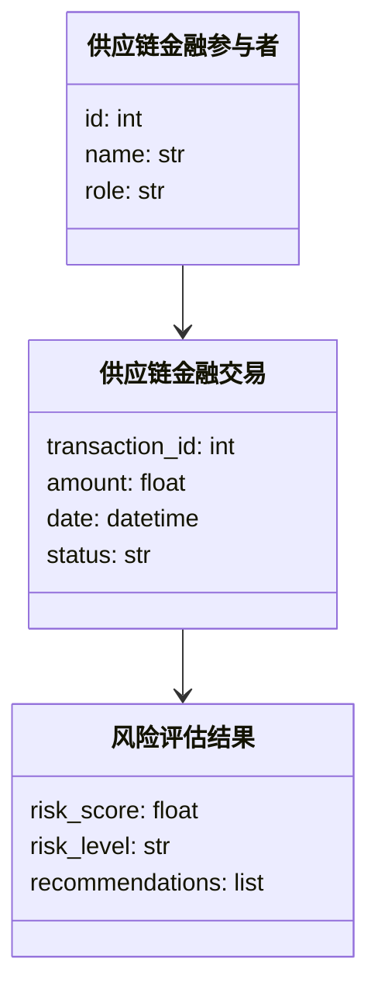
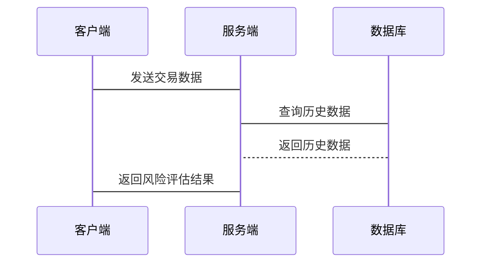

                 


# 智能供应链金融风险评估

> 关键词：供应链金融、智能风控、机器学习、系统架构、风险管理

> 摘要：本文将深入探讨智能供应链金融风险评估的核心概念、算法原理、系统架构及实战应用，通过结合实际案例，分析如何利用人工智能技术优化供应链金融的风险管理流程，从而提升企业供应链的整体效率和安全性。

---

## 第1章: 供应链金融与智能供应链金融概述

### 1.1 供应链金融的基本概念

#### 1.1.1 供应链金融的定义
供应链金融是指通过整合供应链上下游企业的资源和信息，提供融资、支付、结算等金融服务，以支持供应链整体运作的金融模式。其核心在于通过控制物流、信息流和资金流，降低企业间的交易风险。

#### 1.1.2 供应链金融的核心要素
- **参与方**：包括核心企业、供应商、客户、金融机构等。
- **资金流**：融资、支付、结算等金融服务。
- **信息流**：供应链中的数据交换和共享。
- **物流**：货物的运输和管理。

#### 1.1.3 供应链金融的运作模式
传统的供应链金融模式依赖于核心企业的信用背书，通过应收账款质押等方式为上下游企业提供融资支持。然而，这种模式存在信息不对称、风险分散难等问题。

---

### 1.2 智能供应链金融的定义与特点

#### 1.2.1 智能供应链金融的定义
智能供应链金融是将人工智能、大数据等技术融入供应链金融，通过实时数据分析和智能决策，优化融资流程、降低风险、提高效率的新型金融模式。

#### 1.2.2 智能供应链金融的核心特点
- **数据驱动**：依赖实时数据进行风险评估和决策。
- **智能化**：利用机器学习、自然语言处理等技术，实现自动化、智能化的风控。
- **透明化**：通过区块链等技术，实现供应链信息的透明共享。
- **个性化**：根据企业需求提供定制化金融服务。

#### 1.2.3 智能供应链金融与传统供应链金融的区别
| 特性       | 传统供应链金融          | 智能供应链金融          |
|------------|------------------------|-------------------------|
| 数据来源   | 依赖核心企业数据       | 多源数据（含外部数据）  |
| 决策方式   | 人工审核               | 智能算法驱动           |
| 处理速度   | 较慢                   | 实时或近实时            |
| 风险控制   | 依赖核心企业信用       | 多维度数据建模          |

---

### 1.3 智能供应链金融的应用场景

#### 1.3.1 供应链中的信用风险
通过智能风控模型，评估供应商和客户的信用状况，降低应收账款逾期风险。

#### 1.3.2 供应链中的操作风险
利用智能监控系统，实时检测供应链中的操作异常，如货物延迟、单据不符等。

#### 1.3.3 供应链中的市场风险
通过市场数据预测模型，评估供应链中因市场需求波动带来的风险。

---

### 1.4 智能供应链金融的行业价值

#### 1.4.1 提高供应链效率
通过智能化的融资和支付流程，减少审批时间和成本，加快资金周转。

#### 1.4.2 降低供应链风险
通过智能风控技术，提前识别和预警潜在风险，降低供应链中断的可能性。

#### 1.4.3 优化企业融资成本
通过智能评估模型，为上下游企业提供更精准的融资定价，降低整体融资成本。

---

### 1.5 本章小结
本章介绍了供应链金融的基本概念和智能供应链金融的核心特点，分析了其在不同场景下的应用价值和行业意义。

---

## 第2章: 供应链金融风险评估的核心概念

### 2.1 供应链金融风险评估的定义

#### 2.1.1 风险评估的定义
风险评估是指通过分析潜在风险因素，量化风险的可能性和影响程度，制定相应的风险管理策略。

#### 2.1.2 供应链金融风险评估的定义
供应链金融风险评估是指对供应链中的信用风险、操作风险和市场风险进行量化分析，制定相应的风险管理措施。

---

### 2.2 供应链金融风险评估的关键要素

#### 2.2.1 信用风险
- **定义**：因债务人无法履行债务而产生的风险。
- **影响因素**：企业信用历史、财务状况、市场地位等。

#### 2.2.2 操作风险
- **定义**：因供应链操作中的失误或漏洞而产生的风险。
- **影响因素**：流程复杂度、人员操作规范性、系统稳定性等。

#### 2.2.3 市场风险
- **定义**：因市场价格波动而产生的风险。
- **影响因素**：市场需求变化、原材料价格波动、汇率变化等。

---

### 2.3 供应链金融风险评估的流程

#### 2.3.1 数据收集
- 收集供应链中的交易数据、企业信用数据、市场数据等。

#### 2.3.2 数据分析
- 使用统计分析、机器学习等方法，对数据进行建模和分析。

#### 2.3.3 风险评估与结果输出
- 根据分析结果，生成风险评估报告，并提出风险管理建议。

---

## 第3章: 核心概念与联系

### 3.1 核心概念原理

#### 3.1.1 信用风险的评估模型
- 使用 logistic regression 或随机森林模型，基于企业的信用历史、财务状况等因素进行评估。

#### 3.1.2 操作风险的评估模型
- 使用时间序列分析或神经网络模型，分析供应链操作中的异常行为。

#### 3.1.3 市场风险的评估模型
- 使用 ARCH/GARCH 模型或支持向量机（SVM）模型，预测市场价格波动。

---

### 3.2 核心概念属性特征对比表

| 风险类型 | 核心属性         | 特征描述                                                                 |
|----------|------------------|--------------------------------------------------------------------------|
| 信用风险 | 债务人信用状况   | 借款人还款能力与意愿，信用历史，财务状况等。                            |
| 操作风险 | 业务流程规范性   | 供应链操作中的失误与漏洞，如货物延迟、单据不符等。                      |
| 市场风险 | 市场波动性       | 价格波动、需求变化，如原材料价格上涨、市场需求下降等。                  |

---

### 3.3 ER实体关系图

```mermaid
erd
    actor 供应链金融参与者
    actor 企业
    actor 金融机构
    actor 供应商
    actor 客户
    entity 供应链金融交易
    entity 信用评估结果
    entity 风险评估报告
    entity 供应链操作记录
    entity 市场数据

    供应链金融参与者 --> 供应链金融交易
    企业 --> 信用评估结果
    金融机构 --> 风险评估报告
    供应商 --> 供应链操作记录
    客户 --> 市场数据
```

---

## 第4章: 算法原理与实现

### 4.1 算法原理

#### 4.1.1 随机森林模型
随机森林是一种基于决策树的集成学习算法，通过构建多棵决策树并进行投票或平均，提高模型的准确性和稳定性。

#### 4.1.2 模型流程


---

### 4.2 算法实现

#### 4.2.1 Python代码示例
```python
import pandas as pd
from sklearn.ensemble import RandomForestClassifier
from sklearn.model_selection import train_test_split
from sklearn.metrics import accuracy_score

# 数据加载与预处理
data = pd.read_csv('supply_chain_data.csv')
X = data.drop('label', axis=1)
y = data['label']

# 数据分割
X_train, X_test, y_train, y_test = train_test_split(X, y, test_size=0.2, random_state=42)

# 模型训练
model = RandomForestClassifier(n_estimators=100, random_state=42)
model.fit(X_train, y_train)

# 模型预测
y_pred = model.predict(X_test)

# 模型评估
print('准确率:', accuracy_score(y_test, y_pred))
```

#### 4.2.2 算法公式
随机森林模型的预测概率可以表示为：
$$ P(y=1|x) = \frac{1}{N} \sum_{i=1}^{N} H_i(x) $$
其中，\( H_i(x) \) 是第 \( i \) 棵决策树的预测结果，\( N \) 是决策树的数量。

---

## 第5章: 系统分析与架构设计

### 5.1 问题场景介绍
我们设计一个智能供应链金融风险评估系统，旨在通过实时数据分析和智能算法，评估供应链中的信用风险、操作风险和市场风险。

---

### 5.2 系统功能设计

#### 5.2.1 领域模型


---

#### 5.2.2 系统架构


---

### 5.3 系统接口设计

#### 5.3.1 接口描述
- **输入接口**：接收供应链金融交易数据。
- **输出接口**：返回风险评估结果。

#### 5.3.2 接口交互流程


---

## 第6章: 项目实战

### 6.1 环境安装
安装必要的库：
```bash
pip install pandas scikit-learn mermaid
```

---

### 6.2 核心实现

#### 6.2.1 数据预处理
```python
import pandas as pd

data = pd.read_csv('supply_chain_data.csv')
data = data.dropna()
```

#### 6.2.2 特征选择
```python
from sklearn.feature_selection import SelectKBest

selector = SelectKBest(k=10)
X_new = selector.fit_transform(data.drop('label', axis=1), data['label'])
```

---

### 6.3 实际案例分析
假设我们有一个供应链金融交易数据集，包含以下字段：
- 交易金额
- 交易时间
- 交易地点
- 供应商信用评分
- 客户信用评分

通过随机森林模型进行风险评估，输出每个交易的风险评分和风险等级。

---

## 第7章: 总结与展望

### 7.1 本章小结
本文深入探讨了智能供应链金融风险评估的核心概念、算法原理和系统架构，通过实际案例展示了如何利用人工智能技术优化供应链金融的风险管理流程。

### 7.2 最佳实践 tips
- 数据质量是模型准确性的重要保障。
- 结合业务场景，选择合适的算法和模型。
- 定期更新模型，以适应市场变化。

### 7.3 注意事项
- 数据隐私和安全问题需要高度重视。
- 模型的可解释性需要在实际应用中不断优化。

### 7.4 拓展阅读
- 《供应链金融：理论与实践》
- 《机器学习实战》
- 《区块链与供应链金融》

---

## 作者：AI天才研究院/AI Genius Institute & 禅与计算机程序设计艺术 /Zen And The Art of Computer Programming

