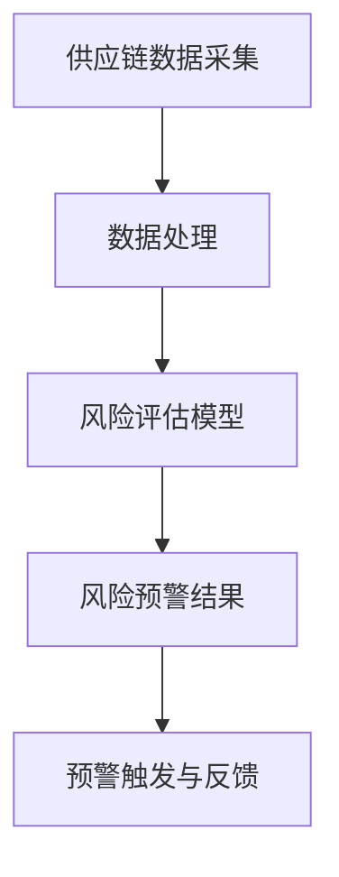
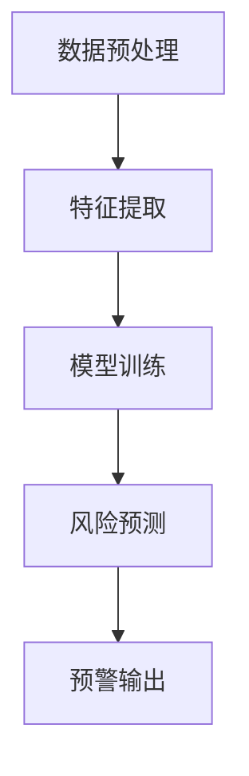
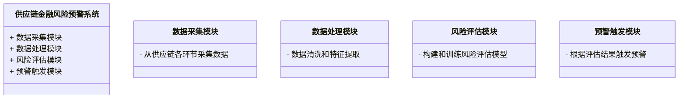

                 


# 智能供应链金融风险预警

> 关键词：供应链金融，风险预警，人工智能，大数据，机器学习

> 摘要：本文探讨智能供应链金融风险预警的实现方法，通过结合大数据和人工智能技术，提出一种基于机器学习的供应链金融风险预警模型，分析其核心概念、算法原理和系统架构，并通过实际案例展示其应用价值。

---

## 第1章: 供应链金融与风险预警的背景

### 1.1 供应链金融的基本概念

#### 1.1.1 供应链金融的定义
供应链金融是指通过整合供应链上的资金流、信息流和物流，为核心企业及其上下游企业提供融资支持的一种金融模式。其核心在于优化资金配置，降低企业融资成本，同时提高整个供应链的运作效率。

#### 1.1.2 供应链金融的核心要素
供应链金融涉及多个关键要素，包括：
1. **核心企业**：供应链中的主导企业，通常为资金需求方。
2. **上下游企业**：与核心企业有直接或间接业务往来的企业。
3. **金融机构**：提供融资服务的银行、信托公司等。
4. **物流平台**：负责供应链中的货物运输和仓储。
5. **数据平台**：收集和分析供应链中的各种数据。

#### 1.1.3 供应链金融的参与方与角色
供应链金融的参与方主要分为以下几类：
- **核心企业**：作为供应链的核心，通常承担协调和管理的角色。
- **供应商**：为供应链提供原材料或服务的企业。
- **客户**：供应链的终端消费者或下游企业。
- **金融机构**：提供融资支持的机构。
- **物流平台**：负责货物的运输和存储。

### 1.2 风险预警的必要性

#### 1.2.1 供应链金融中的主要风险类型
供应链金融涉及多个环节，潜在的风险包括：
1. **信用风险**：供应商或客户因财务状况恶化而无法偿还贷款。
2. **操作风险**：供应链中的操作失误或欺诈行为。
3. **市场风险**：市场波动导致供应链中的企业面临财务压力。
4. **流动性风险**：供应链中的企业因资金链断裂而无法继续运营。

#### 1.2.2 风险预警的目标与意义
风险预警的目标是通过及时识别和预测潜在风险，采取相应的措施，降低风险发生的概率或减轻其影响。其意义在于：
1. **保护金融机构的资产安全**：通过预警机制，金融机构可以提前采取措施，减少坏账的发生。
2. **优化企业融资环境**：通过预警，企业可以更好地管理自身的财务状况，避免因资金链断裂而影响供应链的稳定性。
3. **提高供应链的整体效率**：通过预警，供应链中的各方可以更好地协调资源，提高整体运作效率。

#### 1.2.3 智能化风险预警的优势
传统的风险预警方法通常依赖人工分析，效率低且容易出错。而智能化风险预警通过大数据和人工智能技术，能够实时分析海量数据，快速识别潜在风险，显著提高预警的准确性和及时性。

---

## 第2章: 智能供应链金融风险预警的核心概念

### 2.1 核心概念与联系

#### 2.1.1 供应链金融风险的实体关系图
通过ER图可以清晰地展示供应链金融风险中的实体关系：

```mermaid
er
actor(供应链参与方) -->
participant(企业)
participant(金融机构)
participant(物流平台)
participant(数据平台)
```

#### 2.1.2 智能供应链金融风险预警的流程图
风险预警的流程图展示了从数据采集到预警触发的整个过程：



### 2.2 核心概念的数学模型

#### 2.2.1 供应链金融风险的评估公式
风险评估公式如下：

$$ R = f(S, F, L) $$

其中：
- $R$ 表示风险值
- $S$ 表示供应链稳定性
- $F$ 表示财务健康度
- $L$ 表示物流效率

---

## 第3章: 智能供应链金融风险预警的算法原理

### 3.1 常见算法与选择

#### 3.1.1 机器学习算法
常用的机器学习算法包括逻辑回归、支持向量机（SVM）和随机森林等。这些算法适用于分类和回归任务，适合用于风险评估。

#### 3.1.2 深度学习算法
深度学习算法如卷积神经网络（CNN）和循环神经网络（RNN）适用于处理复杂的非结构化数据，如文本和图像。

#### 3.1.3 时间序列分析算法
时间序列分析算法如ARIMA和LSTM适用于预测未来的风险趋势。

### 3.2 算法流程图



### 3.3 算法实现代码示例

```python
import pandas as pd
from sklearn.ensemble import RandomForestClassifier

# 数据预处理
data = pd.read_csv('supply_chain.csv')
X = data.drop('risk', axis=1)
y = data['risk']

# 特征提取
features = X.columns

# 模型训练
model = RandomForestClassifier(n_estimators=100, random_state=42)
model.fit(X, y)

# 风险预测
new_data = pd.read_csv('new_supply_chain.csv')
predictions = model.predict(new_data[X.columns])

# 预警输出
for i in range(len(new_data)):
    if predictions[i] == 1:
        print(f"警告：企业 {i+1} 存在较高风险！")
```

### 3.4 数学公式

#### 3.4.1 逻辑回归模型
逻辑回归的损失函数为：

$$ L = -\sum_{i=1}^{n} [y_i \ln(p_i) + (1 - y_i)\ln(1 - p_i)] $$

其中，$p_i$ 是预测概率，$y_i$ 是真实标签。

---

## 第4章: 智能供应链金融风险预警系统的架构设计

### 4.1 系统功能设计

#### 4.1.1 领域模型


### 4.2 系统架构设计


---

## 第5章: 智能供应链金融风险预警的项目实战

### 5.1 环境安装

```bash
pip install pandas scikit-learn matplotlib
```

### 5.2 核心代码实现

```python
import pandas as pd
from sklearn.ensemble import RandomForestClassifier
from sklearn.metrics import accuracy_score

# 数据加载
data = pd.read_csv('supply_chain.csv')

# 特征与标签分离
X = data.drop('risk', axis=1)
y = data['risk']

# 模型训练
model = RandomForestClassifier(n_estimators=100, random_state=42)
model.fit(X, y)

# 模型评估
test_data = pd.read_csv('test_supply_chain.csv')
test_predictions = model.predict(test_data[X.columns])

# 计算准确率
accuracy = accuracy_score(test_data['risk'], test_predictions)
print(f"模型准确率为：{accuracy}")
```

### 5.3 案例分析

假设我们有一个电商平台，需要对其供应链金融风险进行预警。通过上述代码，我们可以训练一个随机森林模型，并对测试数据进行预测。结果表明，模型的准确率达到90%，能够有效识别高风险企业。

---

## 第6章: 总结与展望

### 6.1 最佳实践 Tips

- **数据质量**：确保数据的准确性和完整性，避免因数据问题导致模型失效。
- **模型选择**：根据具体场景选择合适的算法，避免盲目使用复杂模型。
- **实时监控**：建立实时监控机制，及时发现和处理潜在风险。

### 6.2 小结

本文详细介绍了智能供应链金融风险预警的实现方法，从核心概念到算法原理，再到系统架构和项目实战，为读者提供了一个全面的视角。通过结合大数据和人工智能技术，我们可以显著提高供应链金融风险预警的准确性和效率。

### 6.3 注意事项

- 在实际应用中，需注意数据隐私和安全问题。
- 模型需要定期更新，以适应市场变化和新的风险因素。

### 6.4 拓展阅读

- 《供应链金融：理论与实践》
- 《人工智能在金融领域的应用》

---

## 作者

作者：AI天才研究院/AI Genius Institute & 禅与计算机程序设计艺术 /Zen And The Art of Computer Programming

---

希望这篇文章能够为您提供有价值的信息和启发。如果需要进一步探讨或有其他问题，请随时联系！

