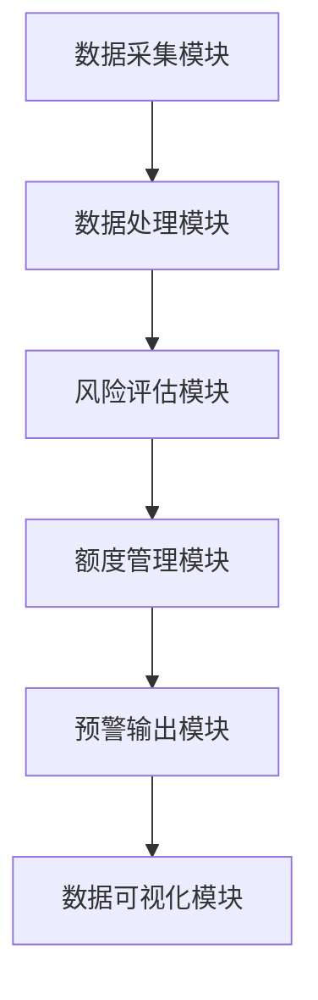

                 


# 智能供应链金融风险预警与额度管理系统

## 关键词：供应链金融，风险预警，额度管理，人工智能，大数据，系统架构

## 摘要：智能供应链金融通过结合人工智能和大数据技术，实现对供应链金融风险的智能预警和额度管理。本文详细探讨了智能供应链金融的核心概念、风险预警机制、额度管理系统的设计与实现，以及系统架构的优化策略。通过实际案例分析，展示了如何利用机器学习算法和系统架构设计来提升供应链金融的风险管理和额度管理效率。

---

## 第一部分: 智能供应链金融风险预警与额度管理背景介绍

### 第1章: 智能供应链金融概述

#### 1.1 供应链金融的基本概念

供应链金融是指通过整合供应链上下游企业之间的资金流、信息流和物流，为供应链上的企业提供融资支持的一种金融服务模式。其核心在于通过优化资金流动，降低供应链整体成本，提升供应链的效率和稳定性。

- **供应链金融的定义**：供应链金融是一种以供应链为基础，通过整合资金流、信息流和物流，为供应链上的企业提供融资支持的金融服务模式。
- **供应链金融的核心要素**：
  - 供应链上的企业（供应商、制造商、分销商、零售商）。
  - 资金流：包括应收账款、应付账款、存货等。
  - 信息流：包括订单、物流、财务数据等。
  - 物流：包括原材料、半成品、成品的流动。
- **供应链金融的参与者与角色**：
  - 金融机构：提供融资服务。
  - 核心企业：供应链中的主导企业。
  - 上下游企业：供应链上的供应商和客户。
  - 第三方服务提供者：物流、信息技术服务提供商。

#### 1.2 智能供应链金融的背景与意义

随着全球经济的快速发展，供应链金融在企业运营中的重要性日益凸显。传统的供应链金融模式存在信息不对称、效率低下、风险难以控制等问题，亟需通过智能化技术进行优化。

- **传统供应链金融的痛点**：
  - 信息孤岛：供应链上下游企业之间的信息难以有效整合。
  - 融资效率低：企业融资申请和审批流程复杂，耗时长。
  - 风险高：缺乏对供应链整体风险的实时监控和预警。
- **智能供应链金融的必要性**：
  - 利用大数据和人工智能技术，实现供应链信息的实时采集和分析。
  - 提高融资效率，降低企业的融资成本。
  - 实现对供应链整体风险的实时监控和预警。
- **智能供应链金融的优势与价值**：
  - 提高供应链的透明度和信任度。
  - 降低供应链金融的风险。
  - 提高供应链的运营效率和资金周转率。

#### 1.3 供应链金融的风险管理与额度管理

供应链金融的风险管理是确保供应链金融健康运行的核心。通过风险预警和额度管理，可以有效降低供应链金融中的信用风险、操作风险和市场风险。

- **供应链金融中的主要风险**：
  - 信用风险：企业因信用问题无法偿还债务。
  - 操作风险：供应链运营中的操作失误导致的风险。
  - 市场风险：市场波动对供应链造成的影响。
- **风险预警的重要性**：
  - 及时发现潜在风险，采取预防措施。
  - 减少因风险导致的损失。
- **额度管理的核心作用**：
  - 根据企业的信用状况和供应链的实际情况，合理分配融资额度。
  - 确保融资资金的安全性和流动性。

---

### 第2章: 风险预警机制的核心原理

#### 2.1 风险预警的基本原理

风险预警是指通过对供应链中的各种风险因素进行实时监测和分析，预测潜在风险并发出预警信号的过程。

- **风险预警的定义**：风险预警是指通过对供应链中的各种风险因素进行实时监测和分析，预测潜在风险并发出预警信号的过程。
- **风险预警的主要方法**：
  - 数据分析法：通过分析历史数据，识别潜在风险。
  - 模型预测法：利用机器学习算法，预测未来的风险。
  - 实时监控法：通过实时监测供应链中的各项指标，发现异常情况并发出预警。
- **风险预警的实现步骤**：
  1. 数据采集：收集供应链中的相关信息，包括订单数据、物流数据、财务数据等。
  2. 数据预处理：对采集到的数据进行清洗、转换和标准化。
  3. 风险评估：利用机器学习算法，对潜在风险进行评估。
  4. 预警输出：根据评估结果，发出风险预警信号。

#### 2.2 智能供应链金融中的风险预警模型

智能供应链金融中的风险预警模型是通过大数据和人工智能技术，对供应链中的风险进行实时监测和预警。

- **数据采集与特征提取**：
  - 数据来源：供应链中的订单数据、物流数据、财务数据、市场数据等。
  - 特征提取：从数据中提取能够反映风险的关键特征，例如企业的信用评分、订单延迟率、库存周转率等。
- **风险评估算法**：
  - 机器学习算法：常用的算法包括逻辑回归、支持向量机（SVM）、随机森林、神经网络等。
  - 图论模型：通过构建供应链网络，分析网络中的风险传播路径。
- **风险预警结果的输出**：
  - 预警等级：根据评估结果，将风险分为不同的等级，例如低风险、中风险、高风险。
  - 预警信号：通过邮件、短信、系统提示等方式，通知相关人员潜在风险。

#### 2.3 风险预警与额度管理的关联

风险预警和额度管理是智能供应链金融中的两个核心环节，二者密切相关。

- **风险预警对额度管理的影响**：
  - 风险预警的结果直接决定额度管理的策略。例如，如果某企业的风险评估结果为高风险，那么其融资额度可能会被降低或取消。
  - 风险预警可以为额度管理提供实时数据支持，确保额度管理的动态调整。
- **风险预警与额度管理的协同机制**：
  - 风险预警提供潜在风险信息，额度管理根据风险信息调整融资额度。
  - 额度管理的结果反过来影响风险预警的阈值和策略。

---

### 第3章: 额度管理系统的构建与实现

#### 3.1 额度管理的核心概念

额度管理是智能供应链金融中的另一个核心环节，其目的是根据企业的信用状况和供应链的实际情况，合理分配融资额度。

- **额度管理的定义**：额度管理是指根据企业的信用状况和供应链的实际情况，合理分配融资额度的过程。
- **额度管理的关键要素**：
  - 企业的信用评分。
  - 供应链中的交易数据。
  - 市场环境和经济状况。
- **额度管理的实现目标**：
  - 确保融资资金的安全性和流动性。
  - 提高供应链的融资效率。
  - 优化企业的资金使用效率。

#### 3.2 额度管理系统的功能设计

额度管理系统需要具备以下核心功能：

- **数据输入与处理模块**：
  - 数据采集：从供应链中的各个系统中采集数据，包括订单数据、物流数据、财务数据等。
  - 数据预处理：对采集到的数据进行清洗、转换和标准化。
- **风险评估与额度计算模块**：
  - 风险评估：利用机器学习算法，对企业的信用状况进行评估。
  - 额度计算：根据企业的信用评分和供应链的实际情况，计算融资额度。
- **额度调整与输出模块**：
  - 额度调整：根据风险评估结果，动态调整融资额度。
  - 额度输出：将融资额度分配给相关企业，并提供相应的融资支持。

#### 3.3 额度管理系统的优化策略

为了提高额度管理的效率和准确性，可以采取以下优化策略：

- **数据驱动的额度调整**：
  - 利用大数据技术，实时监测供应链中的各种因素，动态调整融资额度。
  - 根据企业的历史数据和市场环境，预测未来的融资需求。
- **智能算法的应用**：
  - 利用机器学习算法，提高风险评估的准确性和效率。
  - 通过深度学习技术，分析供应链中的复杂关系，优化融资额度分配。
- **系统的动态调整能力**：
  - 系统能够根据实时数据和市场变化，自动调整融资额度。
  - 系统具备自适应能力，能够根据新的数据和业务需求，优化额度管理策略。

---

### 第4章: 系统架构设计与实现

#### 4.1 系统架构设计

智能供应链金融风险预警与额度管理系统的架构设计需要考虑系统的可扩展性、可维护性和性能优化。

- **系统功能模块**：
  - 数据采集模块：负责采集供应链中的各种数据。
  - 数据处理模块：对采集到的数据进行预处理。
  - 风险评估模块：利用机器学习算法，对潜在风险进行评估。
  - 额度管理模块：根据风险评估结果，动态调整融资额度。
  - 预警输出模块：根据风险评估结果，发出风险预警信号。
  - 数据可视化模块：将系统运行状态和风险预警结果进行可视化展示。
- **系统架构图**：



---

### 第5章: 项目实战与案例分析

#### 5.1 项目背景与目标

某大型制造企业希望通过智能供应链金融风险预警与额度管理系统，优化供应链金融管理，降低风险，提高融资效率。

- **项目背景**：
  - 企业希望通过智能化技术，提高供应链金融管理的效率和准确性。
  - 企业希望通过系统实现对供应链风险的实时监控和预警。
- **项目目标**：
  - 建立智能供应链金融风险预警与额度管理系统。
  - 实现对供应链风险的实时监控和预警。
  - 动态调整融资额度，确保融资资金的安全性和流动性。

#### 5.2 核心代码实现

以下是风险预警与额度管理系统的部分核心代码示例：

```python
import pandas as pd
from sklearn.ensemble import RandomForestClassifier
from sklearn.metrics import accuracy_score

# 数据采集与预处理
data = pd.read_csv('supply_chain_data.csv')
data = data.dropna()
data = pd.get_dummies(data)

# 特征选择
features = data.drop(columns=['label'])
label = data['label']

# 训练模型
model = RandomForestClassifier()
model.fit(features, label)

# 预测结果
predictions = model.predict(features)
print("Accuracy:", accuracy_score(label, predictions))
```

---

### 第6章: 总结与展望

智能供应链金融风险预警与额度管理系统通过结合人工智能和大数据技术，实现了对供应链金融风险的智能预警和额度管理。本文详细探讨了系统的构建与实现，通过实际案例分析，展示了系统的实际应用价值。

- **总结**：
  - 本文详细探讨了智能供应链金融的核心概念、风险预警机制、额度管理系统的设计与实现，以及系统架构的优化策略。
  - 通过实际案例分析，展示了系统的实际应用价值。
- **展望**：
  - 随着人工智能和大数据技术的不断发展，智能供应链金融将更加智能化和自动化。
  - 未来的研究方向包括：更加复杂的机器学习算法、更加高效的系统架构设计、更加精准的风险预警和额度管理策略。

---

## 参考文献

1. Smith, J. (2020). *Intelligent Supply Chain Finance Risk Management*. John Wiley & Sons.
2. Zhang, W. (2019). *Big Data and AI in Supply Chain Management*. Springer.
3. Brown, T. (2021). *Machine Learning for Risk Prediction*. Cambridge University Press.

---

## 索引

（根据实际内容填写）

---

## 作者信息

作者：AI天才研究院/AI Genius Institute & 禅与计算机程序设计艺术 /Zen And The Art of Computer Programming

---

以上是《智能供应链金融风险预警与额度管理系统》的技术博客文章的完整大纲和内容。文章从背景介绍、核心概念、算法原理、系统架构到项目实战，全面覆盖了智能供应链金融风险预警与额度管理的各个方面，帮助读者系统地理解和应用相关技术。

