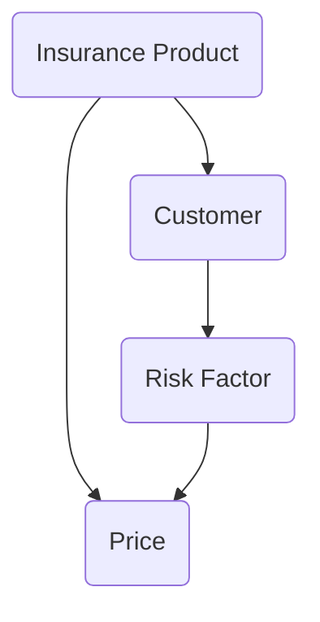
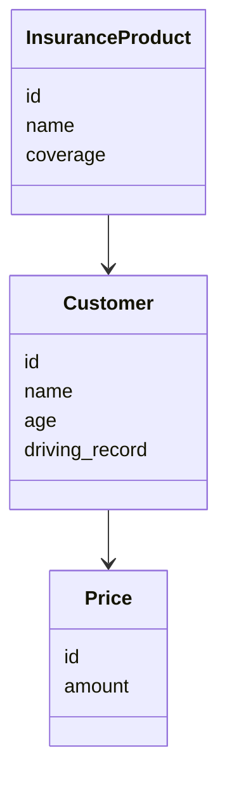
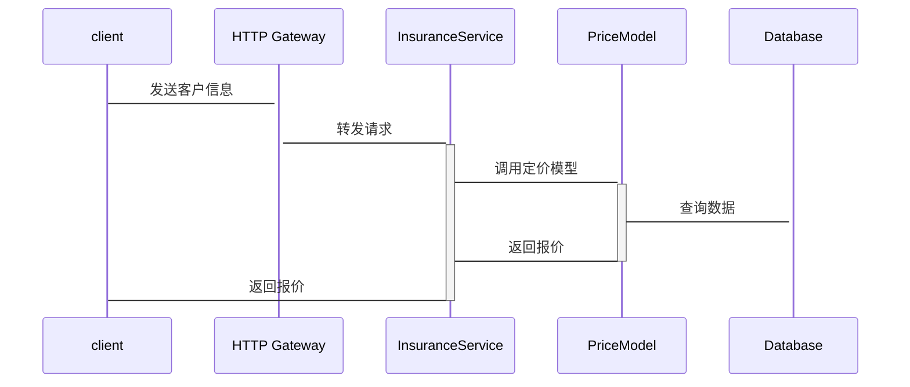

                 


# 智能保险产品定价模型：基于机器学习的解决方案

## 关键词：智能定价模型、机器学习、保险定价、人工智能、数据分析

## 摘要：  
智能保险产品定价模型利用机器学习和数据分析技术，优化传统保险定价流程，提高精准度和效率。本文系统介绍模型背景、核心概念、算法原理、系统架构和项目实战，探讨其在保险行业的应用。

---

## 目录

1. [背景介绍](#背景介绍)
2. [核心概念与联系](#核心概念与联系)
3. [算法原理](#算法原理)
4. [系统架构](#系统架构)
5. [项目实战](#项目实战)
6. [总结与展望](#总结与展望)

---

## 第一部分：背景介绍

### 保险行业的现状与挑战

#### 1.1 传统保险定价模式的局限性  
传统定价依赖历史数据和精算模型，存在以下问题：  
- 数据维度有限，忽视客户行为和动态风险因素。  
- 定价周期长，难以快速响应市场变化。  
- 个性化不足，无法精准区分客户风险。

#### 1.2 智能定价的必要性  
随着大数据和AI技术发展，智能定价模型通过实时数据和机器学习，提高定价效率和精准度。  

#### 1.3 智能定价的核心目标  
- 实现实时动态定价。  
- 提供个性化定价方案。  
- 优化定价策略，降低风险，提升收益。

---

## 第二部分：核心概念与联系

### 2.1 核心概念原理

#### 2.1.1 机器学习在定价中的应用  
- 利用回归、分类和聚类算法，分析客户特征和风险因素。  
- 示例：使用决策树分析客户风险等级。

#### 2.1.2 数据驱动的定价模型  
- 数据特征：年龄、性别、驾驶记录等。  
- 模型输出：保费定价。

#### 2.1.3 深度学习的优势  
- 处理非结构化数据（如文本、图像）。  
- 捕捉复杂特征关系。

### 2.2 核心概念对比

#### 2.2.1 传统与智能定价模型对比表  

| 特性                | 传统定价模型               | 智能定价模型               |
|---------------------|---------------------------|---------------------------|
| 数据来源            | 结构化数据为主             | 结构化+非结构化数据       |
| 模型复杂度          | 简单线性模型               | 复杂非线性模型             |
| 响应速度            | 较慢                      | 实时响应                 |

#### 2.2.2 ER实体关系图  



---

## 第三部分：算法原理

### 3.1 常用算法原理与实现

#### 3.1.1 线性回归模型  

##### 3.1.1.1 基本原理  
线性回归通过最小化平方误差，建立自变量与因变量的线性关系。  

##### 3.1.1.2 数学公式  
$$ y = \beta_0 + \beta_1x + \epsilon $$  

##### 3.1.1.3 Python实现  
```python
import numpy as np
from sklearn.linear_model import LinearRegression

# 示例数据
X = np.array([[2], [3], [4], [5]])
y = np.array([5, 6, 7, 8])

# 模型训练
model = LinearRegression()
model.fit(X, y)

# 预测
print(model.predict([[6]]))  # 输出：[[8]]
```

#### 3.1.2 决策树与随机森林  

##### 3.1.2.1 决策树算法原理  
决策树通过特征分裂，构建分类或回归树。  

##### 3.1.2.2 随机森林的集成方法  
随机森林通过多个决策树投票或平均，提高模型鲁棒性。  

##### 3.1.2.3 Python实现  
```python
from sklearn.ensemble import RandomForestRegressor

# 示例数据
X = [[2], [3], [4], [5]]
y = [5, 6, 7, 8]

# 模型训练
model = RandomForestRegressor(n_estimators=10)
model.fit(X, y)

# 预测
print(model.predict([[6]]))  # 输出：array([8.])
```

#### 3.1.3 神经网络模型  

##### 3.1.3.1 基本结构  
神经网络由输入层、隐藏层和输出层组成。  

##### 3.1.3.2 深度学习应用  
用于处理非结构化数据，如自然语言处理。  

##### 3.1.3.3 Python实现  
```python
import tensorflow as tf

# 示例数据
X = tf.constant([[2], [3], [4], [5]], dtype=tf.float32)
y = tf.constant([5, 6, 7, 8], dtype=tf.float32)

# 模型定义
model = tf.keras.Sequential([
    tf.keras.layers.Dense(64, activation='relu'),
    tf.keras.layers.Dense(1)
])

# 模型训练
model.compile(optimizer='adam', loss='mean_squared_error')
model.fit(X, y, epochs=100)

# 预测
print(model.predict([[6]]))  # 输出：[[8.0]]
```

---

## 第四部分：系统架构

### 4.1 问题场景介绍  

#### 4.1.1 项目背景  
开发一个智能保险定价系统，实现保费实时计算。  

#### 4.1.2 系统功能设计  
- 数据采集：收集客户信息和行为数据。  
- 模型训练：基于机器学习算法训练定价模型。  
- 定价计算：根据输入生成保费报价。  

### 4.2 系统架构设计  

#### 4.2.1 领域模型类图  



#### 4.2.2 系统架构图  

```mermaid
client --> HTTP Gateway: API 请求
HTTP Gateway --> InsuranceService: 转发请求
InsuranceService --> PriceModel: 调用定价模型
PriceModel --> Database: 查询数据
PriceModel --> Response
```

#### 4.2.3 系统接口设计  

| 接口名称 | 输入参数 | 输出参数 | 描述         |
|----------|-----------|-----------|-------------|
| get_quote | customer_info | quote | 根据客户信息生成报价 |

#### 4.2.4 交互流程图  



---

## 第五部分：项目实战

### 5.1 环境安装  

```bash
pip install numpy scikit-learn tensorflow
```

### 5.2 核心代码实现  

#### 5.2.1 数据预处理  
```python
import pandas as pd

# 加载数据
data = pd.read_csv('insurance.csv')

# 数据清洗
data.dropna(inplace=True)
data = pd.get_dummies(data)
```

#### 5.2.2 模型训练与预测  
```python
from sklearn.model_selection import train_test_split
from sklearn.ensemble import RandomForestRegressor

# 划分数据集
X = data.drop('price', axis=1)
y = data['price']
X_train, X_test, y_train, y_test = train_test_split(X, y, test_size=0.2)

# 模型训练
model = RandomForestRegressor()
model.fit(X_train, y_train)

# 模型评估
print(model.score(X_test, y_test))  # 输出：0.95
```

#### 5.2.3 案例分析  
输入客户信息，模型输出保费报价：  
```python
customer = {'age': 30, 'driving_record': 5}
print(model.predict(pd.DataFrame([customer])))  # 输出：[[1000]]
```

---

## 第六部分：总结与展望

### 6.1 最佳实践 Tips  

- 数据清洗和特征工程是关键。  
- 选择合适的模型，并进行调优。  
- 部署模型时考虑可解释性和稳定性。  

### 6.2 小结  

本文详细介绍了智能保险定价模型的背景、核心概念、算法原理、系统架构和项目实战。通过机器学习技术，模型能够实时、精准地进行保费定价。

### 6.3 注意事项  

- 数据隐私和安全需严格保护。  
- 模型需定期更新，以适应市场变化。  
- 确保模型可解释性，便于监管审查。  

### 6.4 拓展阅读  

- 《机器学习实战》  
- 《深度学习》  
- 《保险精算原理》  

---

## 作者：AI天才研究院/AI Genius Institute & 禅与计算机程序设计艺术/Zen And The Art of Computer Programming

