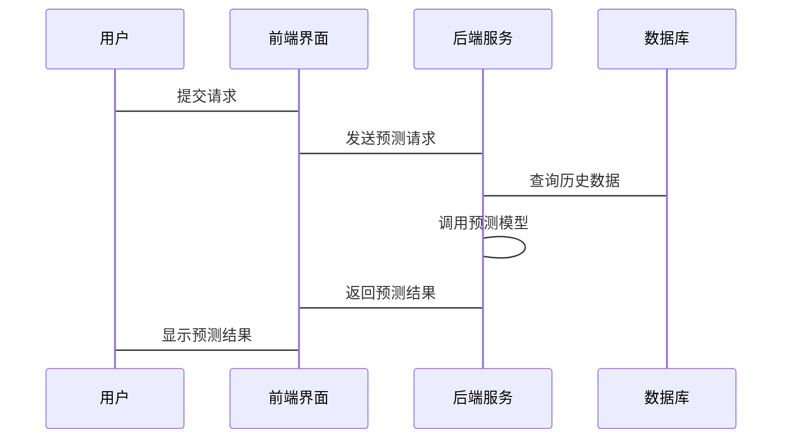

                 


# 智能保险产品需求预测模型优化

## 关键词：智能保险、需求预测、机器学习、模型优化、保险产品

## 摘要：智能保险产品需求预测模型优化是通过运用机器学习和数据挖掘技术，对保险产品的需求进行精准预测，并对模型进行持续优化，以提高预测准确性和效率。本文从背景介绍、核心概念、算法原理、系统架构、项目实战到最佳实践，全面阐述智能保险产品需求预测模型优化的全过程，帮助读者理解并掌握相关技术和方法。

---

## 第1章: 智能保险产品需求预测的背景与意义

### 1.1 保险行业的数字化转型

#### 1.1.1 保险行业的现状与挑战
保险行业正面临数字化转型的浪潮，传统的保险业务模式逐渐被智能化、数据驱动的模式所取代。随着大数据和人工智能技术的快速发展，保险公司需要更加精准地预测客户需求，优化产品设计和销售策略。

#### 1.1.2 数字化转型的必要性
数字化转型不仅是技术发展的趋势，更是保险公司提升竞争力的必经之路。通过智能化手段，保险公司可以更高效地收集和分析数据，从而更好地理解客户行为和市场需求。

#### 1.1.3 智能保险产品的定义与特点
智能保险产品是指利用人工智能技术，能够根据客户实时数据和行为变化，自动调整产品条款、保费和理赔流程的保险产品。其特点是个性化、实时性和高效性。

### 1.2 需求预测在保险产品中的重要性

#### 1.2.1 需求预测的基本概念
需求预测是指通过分析历史数据和市场趋势，预测未来某一时间段内某种保险产品的市场需求量。在保险行业中，准确的需求预测可以帮助保险公司制定合理的销售目标和市场策略。

#### 1.2.2 需求预测在保险产品中的应用场景
- 新产品上市前的市场需求评估
- 现有产品的销售预测和库存管理
- 客户需求细分与精准营销

#### 1.2.3 智能化需求预测的优势
- 提高预测准确性
- 降低预测成本
- 提升客户体验

### 1.3 模型优化的核心目标

#### 1.3.1 提高预测准确性
通过优化模型结构和参数，提升预测结果的准确性，从而更好地指导业务决策。

#### 1.3.2 降低预测成本
通过简化模型复杂度和优化数据处理流程，降低计算和数据存储成本。

#### 1.3.3 提升模型的可解释性
确保模型的预测结果具有合理的解释，便于业务人员理解和应用。

---

## 第2章: 智能保险产品需求预测的核心概念

### 2.1 需求预测的基本原理

#### 2.1.1 数据采集与处理
- 数据来源：客户行为数据、市场数据、历史销售数据等。
- 数据清洗：处理缺失值、异常值和重复数据。
- 数据转换：对数据进行标准化、归一化处理，以便模型更好地学习。

#### 2.1.2 特征工程
- 特征选择：筛选对需求预测影响较大的特征，如客户年龄、收入水平、购买历史等。
- 特征提取：通过主成分分析（PCA）等方法提取新的特征。
- 特征变换：对特征进行对数变换、标准化处理等，以改善模型性能。

#### 2.1.3 模型训练与评估
- 训练数据集：用于模型训练。
- 测试数据集：用于模型评估。
- 评估指标：均方误差（MSE）、平均绝对误差（MAE）、R平方值等。

### 2.2 模型优化的关键点

#### 2.2.1 算法选择
- 线性回归：适用于线性关系的数据。
- 支持向量回归（SVR）：适用于非线性关系的数据。
- 随机森林：适用于高维数据和复杂关系的数据。

#### 2.2.2 超参数调优
- 调整模型的参数，如学习率、树深度、正则化系数等，以优化模型性能。

#### 2.2.3 模型融合
- 将多个模型的预测结果进行加权平均或投票，以提高预测准确性。

### 2.3 数据特征分析

#### 2.3.1 时间序列特征
- 趋势：数据的长期趋势。
- 季节性：数据的周期性波动。
- 噪声：随机波动。

#### 2.3.2 客户行为特征
- 购买频率：客户购买保险产品的频率。
- 购买周期：客户购买保险产品的周期。
- 客户忠诚度：客户对某一保险产品的偏好程度。

#### 2.3.3 市场环境特征
- 经济指标：GDP增长率、通货膨胀率等。
- 行业竞争：市场占有率、竞争对手的产品策略等。

### 2.4 本章小结

---

## 第3章: 智能保险产品需求预测模型的算法原理

### 3.1 常见的预测算法

#### 3.1.1 线性回归
- 简单线性回归：$$ y = \beta_0 + \beta_1 x + \epsilon $$
- 多元线性回归：$$ y = \beta_0 + \beta_1 x_1 + \beta_2 x_2 + \dots + \beta_n x_n + \epsilon $$

#### 3.1.2 随机森林
- 基于决策树的集成学习方法，通过随机采样和特征选择，提高模型的泛化能力。

#### 3.1.3 神经网络
- 使用多层感知机（MLP）进行非线性拟合。
- 网络结构：输入层、隐藏层、输出层。
- 激活函数：ReLU、Sigmoid、Tanh等。

### 3.2 算法选择与优化

#### 3.2.1 算法优缺点对比
| 算法名称 | 优点 | 缺点 |
|----------|------|------|
| 线性回归 | 简单、解释性强 | 仅适用于线性关系 |
| 随机森林 | 高准确性、抗过拟合 | 计算复杂度高 |
| 神经网络 | 高准确性、非线性拟合 | 需要大量数据、难解释 |

#### 3.2.2 基于性能的算法选择
- 根据数据规模和复杂度选择合适的算法。
- 小数据集：线性回归或支持向量回归。
- 大数据集：随机森林或神经网络。

#### 3.2.3 超参数调优
- 使用网格搜索（Grid Search）或随机搜索（Random Search）进行超参数优化。
- 调整参数：学习率、树深度、正则化系数等。

### 3.3 算法实现与优化

#### 3.3.1 算法实现步骤
1. 数据预处理：清洗、转换、特征选择。
2. 模型训练：选择算法，设置超参数，训练模型。
3. 模型评估：计算评估指标，分析预测结果。
4. 模型优化：调整超参数，对比不同算法的性能。

#### 3.3.2 模型优化策略
- 正则化：L1正则化（Lasso）、L2正则化（Ridge）。
- 增加数据多样性：数据增强、混合数据源。
- 集成学习：Bagging、Boosting。

#### 3.3.3 模型评估指标
- 均方误差（MSE）：$$ MSE = \frac{1}{n}\sum_{i=1}^{n}(y_i - \hat{y}_i)^2 $$
- 平均绝对误差（MAE）：$$ MAE = \frac{1}{n}\sum_{i=1}^{n}|y_i - \hat{y}_i| $$
- R平方值：$$ R^2 = 1 - \frac{SSE}{SST} $$

### 3.4 本章小结

---

## 第4章: 智能保险产品需求预测模型的系统架构设计

### 4.1 系统需求分析

#### 4.1.1 功能需求
- 数据采集与处理：实时采集客户行为数据、市场数据等。
- 预测模型训练：基于历史数据，训练预测模型。
- 预测结果展示：可视化预测结果，提供决策支持。

#### 4.1.2 性能需求
- 响应时间：秒级响应。
- 扩展性：支持大规模数据处理和模型训练。

#### 4.1.3 用户需求
- 保险业务人员：需要直观的预测结果和决策支持。
- 数据科学家：需要灵活的模型训练和调优工具。

### 4.2 系统架构设计

#### 4.2.1 分层架构
- 数据层：数据存储、数据处理。
- 服务层：模型训练、预测服务。
- 表现层：用户界面、结果展示。

#### 4.2.2 微服务架构
- 数据采集服务：负责实时数据采集。
- 模型训练服务：负责模型训练和优化。
- 预测服务：负责实时预测和结果返回。

#### 4.2.3 数据流设计
- 数据采集 -> 数据处理 -> 模型训练 -> 预测服务 -> 结果展示。

### 4.3 系统接口设计

#### 4.3.1 接口定义
- 数据接口：数据采集模块与数据处理模块之间的接口。
- 模型接口：模型训练模块与预测服务模块之间的接口。
- 用户接口：前端界面与后端服务之间的接口。

#### 4.3.2 交互流程图


### 4.4 本章小结

---

## 第5章: 智能保险产品需求预测模型的项目实战

### 5.1 环境安装

#### 5.1.1 安装Python
- 使用Anaconda安装Python 3.8及以上版本。
- 安装必要的库：scikit-learn、xgboost、lightgbm、pandas、numpy、matplotlib。

#### 5.1.2 安装机器学习框架
- 安装scikit-learn：pip install scikit-learn
- 安装xgboost：pip install xgboost
- 安装lightgbm：pip install lightgbm

#### 5.1.3 安装可视化工具
- 安装matplotlib：pip install matplotlib
- 安装seaborn：pip install seaborn

### 5.2 核心代码实现

#### 5.2.1 数据预处理
```python
import pandas as pd
import numpy as np

# 读取数据
data = pd.read_csv('insurance_demand.csv')

# 数据清洗
data = data.dropna()
data = data.replace([np.inf, -np.inf], np.nan).dropna()

# 特征选择
features = ['age', 'income', 'purchase_history']
target = 'demand'

X = data[features]
y = data[target]

# 特征工程
from sklearn.preprocessing import StandardScaler
scaler = StandardScaler()
X_scaled = scaler.fit_transform(X)
```

#### 5.2.2 模型训练与优化
```python
from sklearn.model_selection import train_test_split
from sklearn.linear

