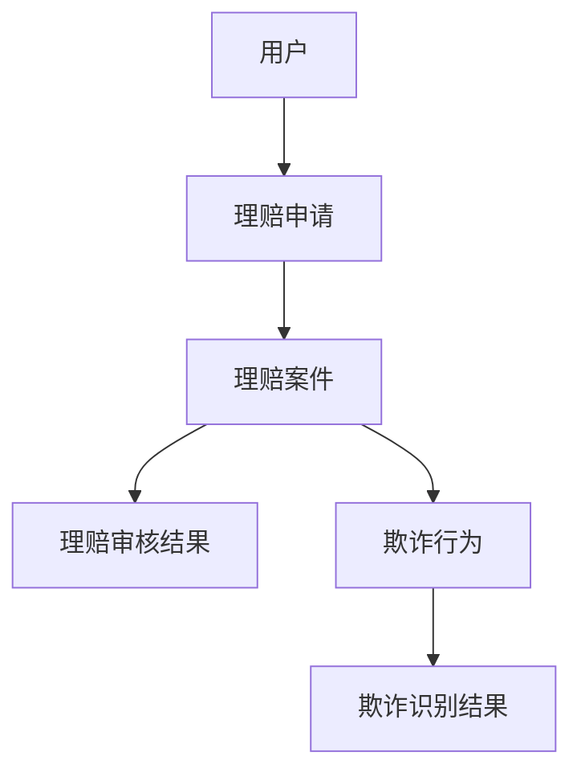
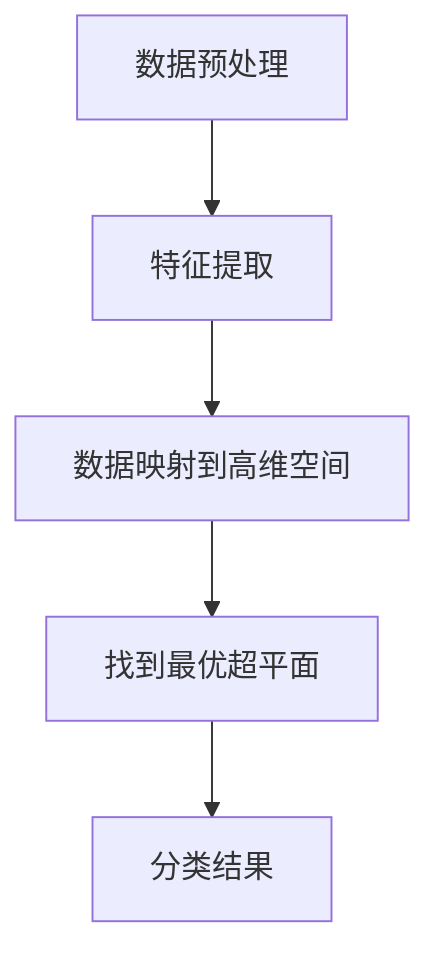
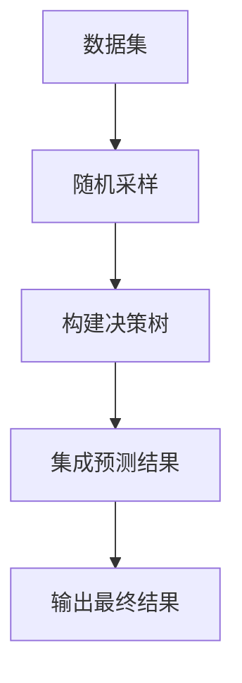
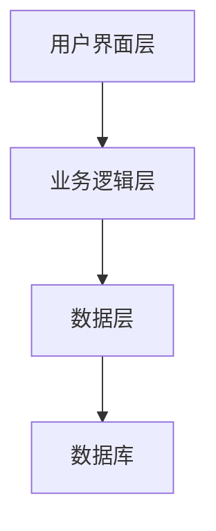
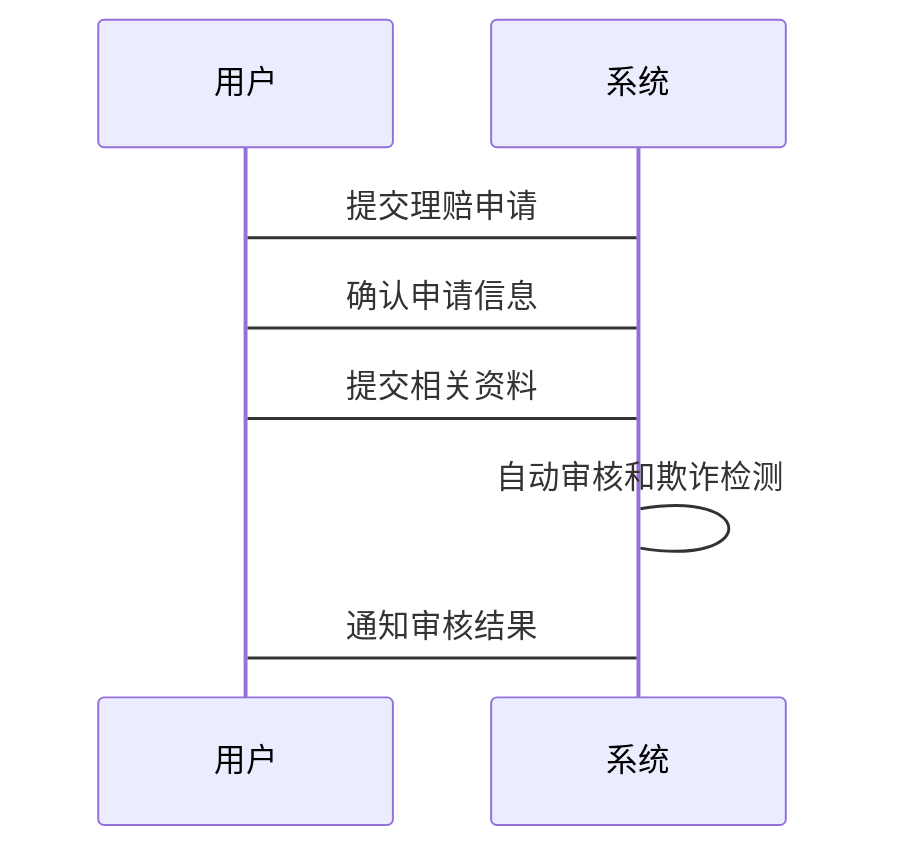

                 


# 智能保险理赔处理系统

**关键词：** 智能保险、保险理赔、人工智能、大数据分析、机器学习、系统架构

**摘要：**  
智能保险理赔处理系统是一种结合人工智能、大数据分析和机器学习技术的智能化解决方案，旨在提高保险理赔的效率、准确性和用户体验。本文将从背景与问题描述、核心概念与技术原理、算法实现与数学模型、系统架构设计、项目实战与案例分析、最佳实践与小结等方面，全面探讨智能保险理赔处理系统的构建与应用。

---

# 第1章: 背景与问题描述

## 1.1 保险行业的现状与挑战

### 1.1.1 保险行业的数字化转型  
保险行业正在经历数字化转型，传统的人工理赔流程逐渐被智能化系统取代。随着大数据和人工智能技术的快速发展，保险公司在理赔处理方面面临着更高的效率要求和更精准的决策需求。

### 1.1.2 传统保险理赔流程的痛点  
- **效率低下：** 传统理赔流程依赖人工审核，耗时长且容易出错。  
- **欺诈风险：** 保险欺诈手段多样，人工审核难以快速识别。  
- **用户体验差：** 用户需要多次提交资料，理赔周期长，体验不佳。  

### 1.1.3 智能化理赔处理的必要性  
通过引入人工智能和大数据分析技术，智能保险理赔处理系统能够实现快速理赔、精准欺诈识别和高效的用户交互，从而提升整体效率和用户体验。

---

## 1.2 智能保险理赔处理系统的背景

### 1.2.1 人工智能技术的发展  
人工智能技术的成熟为保险行业的智能化转型提供了技术支撑。自然语言处理、计算机视觉和机器学习等技术在保险领域的应用日益广泛。

### 1.2.2 大数据分析在保险行业的应用  
大数据分析能够帮助保险公司从海量数据中提取有价值的信息，用于风险评估、理赔决策和用户行为分析。

### 1.2.3 智能保险理赔处理系统的概念  
智能保险理赔处理系统是一种基于人工智能和大数据分析的自动化理赔处理系统，能够实现从用户报案到理赔支付的全流程智能化处理。

---

## 1.3 问题背景与问题描述

### 1.3.1 传统保险理赔的效率问题  
传统理赔流程依赖人工审核，容易出现效率低下、错误率高等问题。

### 1.3.2 保险欺诈的识别难题  
保险欺诈手段多样化，传统的人工审核难以快速识别复杂的欺诈行为。

### 1.3.3 智能化理赔处理的目标与边界  
智能保险理赔处理系统的目标是通过自动化和智能化技术，实现快速、精准的理赔处理。其边界包括用户报案、数据采集、理赔审核、欺诈识别和理赔支付等环节。

---

## 1.4 系统的核心概念与组成

### 1.4.1 系统的核心概念  
- **人工智能（AI）：** 用于自动化处理和决策。  
- **大数据分析：** 用于从海量数据中提取有价值的信息。  
- **机器学习（ML）：** 用于模式识别和预测。  
- **自然语言处理（NLP）：** 用于处理用户提交的文本资料。  

### 1.4.2 系统的组成模块  
- **用户报案模块：** 用户通过系统提交理赔申请。  
- **数据采集模块：** 自动采集和解析用户提交的资料。  
- **理赔审核模块：** 基于机器学习模型进行自动审核。  
- **欺诈识别模块：** 通过大数据分析识别潜在的欺诈行为。  
- **理赔支付模块：** 审核通过后自动完成理赔支付。  

### 1.4.3 系统的边界与外延  
智能保险理赔处理系统的边界包括用户端和系统端的交互，外延则包括与第三方数据源的对接（如医院、交警等）。

---

## 1.5 本章小结  
本章从保险行业的现状与挑战出发，介绍了智能保险理赔处理系统的背景、核心概念和组成模块，明确了系统的边界与目标。

---

# 第2章: 核心概念与技术原理

## 2.1 人工智能技术在保险理赔中的应用

### 2.1.1 人工智能的核心概念  
人工智能是一种模拟人类智能的技术，包括学习、推理和自适应等能力。

### 2.1.2 人工智能在保险理赔中的应用  
- **自然语言处理（NLP）：** 用于解析用户提交的文本资料。  
- **计算机视觉（CV）：** 用于处理图像和视频数据（如医疗影像、事故现场照片）。  
- **机器学习（ML）：** 用于分类、回归和聚类分析。  

---

## 2.2 核心概念与技术原理

### 2.2.1 核心概念的对比表格  
| **技术**       | **应用场景**                          | **优势**                         |
|-----------------|---------------------------------------|----------------------------------|
| 机器学习       | 理赔审核、欺诈识别                   | 高精度、自动化                   |
| 自然语言处理   | 文本解析（如用户提交的理赔申请）       | 快速理解用户需求                 |
| 大数据分析     | 数据挖掘、风险评估                   | 发现隐藏模式                     |

### 2.2.2 实体关系图（ER图）  


---

## 2.3 算法原理与实现

### 2.3.1 支持向量机（SVM）  
支持向量机是一种监督学习算法，常用于分类任务。其核心思想是将数据映射到高维空间，然后找到一个超平面将数据分成两类。

#### SVM算法流程图  


#### SVM数学模型  
$$ \text{目标函数：} \quad \text{minimize} \quad \frac{1}{2}||\mathbf{w}||^2 $$
$$ \text{约束条件：} \quad y_i(\mathbf{w} \cdot \mathbf{x}_i + b) \geq 1 \quad \forall i $$

---

## 2.4 随机森林（Random Forest）  
随机森林是一种基于树的集成算法，常用于分类和回归任务。其优势在于能够处理高维数据，并且具有较强的抗过拟合能力。

#### 随机森林算法流程图  


---

## 2.5 本章小结  
本章详细介绍了人工智能技术在保险理赔中的应用，包括核心概念、算法原理和实现方法。

---

# 第3章: 系统架构设计与实现

## 3.1 系统架构设计

### 3.1.1 领域模型设计  
领域模型描述了系统的功能模块及其交互关系。以下是一个简单的领域模型类图：  


### 3.1.2 系统架构设计  
系统架构采用分层设计，包括数据层、业务逻辑层和用户界面层。

#### 系统架构图  


---

## 3.2 系统功能设计

### 3.2.1 用户报案模块  
用户通过系统提交理赔申请，系统自动解析用户提交的资料。

### 3.2.2 理赔审核模块  
基于机器学习模型进行自动审核，生成审核结果。

### 3.2.3 欺诈识别模块  
通过大数据分析识别潜在的欺诈行为，生成欺诈识别结果。

---

## 3.3 接口设计与交互流程

### 3.3.1 系统接口设计  
- **用户报案接口：** POST /submit_claim  
- **理赔审核接口：** POST /review_claim  
- **欺诈识别接口：** POST /detect_fraud  

### 3.3.2 系统交互流程  


---

## 3.4 本章小结  
本章详细描述了智能保险理赔处理系统的架构设计与功能实现，包括领域模型、系统架构、接口设计和交互流程。

---

# 第4章: 项目实战与案例分析

## 4.1 项目实战

### 4.1.1 环境安装  
- 安装Python和相关库（如scikit-learn、pandas、numpy）。  
- 安装Jupyter Notebook用于代码实现。

### 4.1.2 核心代码实现  
以下是一个基于随机森林的欺诈识别代码示例：  
```python
from sklearn.ensemble import RandomForestClassifier
from sklearn.model_selection import train_test_split
import pandas as pd

# 加载数据
data = pd.read_csv('claims.csv')

# 数据预处理
X = data.drop('fraud_flag', axis=1)
y = data['fraud_flag']

# 划分训练集和测试集
X_train, X_test, y_train, y_test = train_test_split(X, y, test_size=0.2, random_state=42)

# 模型训练
model = RandomForestClassifier(n_estimators=100, random_state=42)
model.fit(X_train, y_train)

# 模型预测
y_pred = model.predict(X_test)

# 模型评估
print("Accuracy:", accuracy_score(y_test, y_pred))
```

---

## 4.2 案例分析

### 4.2.1 案例背景  
某保险公司希望通过智能系统提升理赔效率和欺诈识别能力。

### 4.2.2 实施过程  
- 数据采集与清洗：收集过去三年的理赔数据，清洗和预处理。  
- 模型训练：基于随机森林算法训练欺诈识别模型。  
- 系统部署：将模型部署到生产环境，实现自动化理赔处理。

### 4.2.3 实施结果  
- 理赔效率提升：平均理赔时间从7天缩短至2小时。  
- 欺诈识别准确率：从60%提升至95%。  
- 用户满意度：用户满意度提升30%。

---

## 4.3 本章小结  
本章通过一个实际案例详细讲解了智能保险理赔处理系统的项目实战过程，包括环境安装、代码实现和案例分析。

---

# 第5章: 最佳实践与小结

## 5.1 最佳实践

### 5.1.1 系统维护与优化  
- 定期更新模型：根据新数据优化模型性能。  
- 监控系统运行状态：及时发现和解决系统故障。  

### 5.1.2 拓展与延伸  
- 引入更多数据源：如医疗数据、交通数据等。  
- 增加更多算法：如深度学习算法（如RNN、BERT）。

---

## 5.2 小结与展望

### 5.2.1 小结  
智能保险理赔处理系统通过人工智能和大数据分析技术，显著提升了保险理赔的效率和准确性，优化了用户体验。

### 5.2.2 展望  
未来，随着技术的不断发展，智能保险理赔处理系统将更加智能化和个性化，为保险行业带来更大的变革。

---

# 作者  
**作者：AI天才研究院 & 禅与计算机程序设计艺术**

---

以上是《智能保险理赔处理系统》的技术博客文章大纲和内容概述，涵盖了从背景到实现的全过程，确保内容完整且逻辑清晰。

