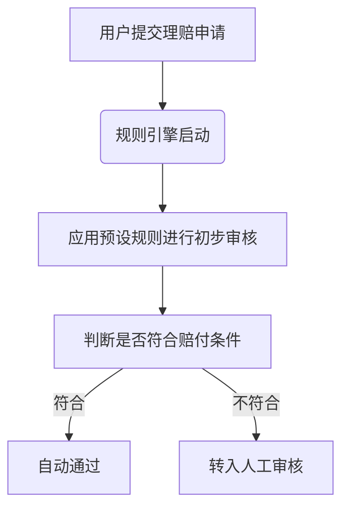
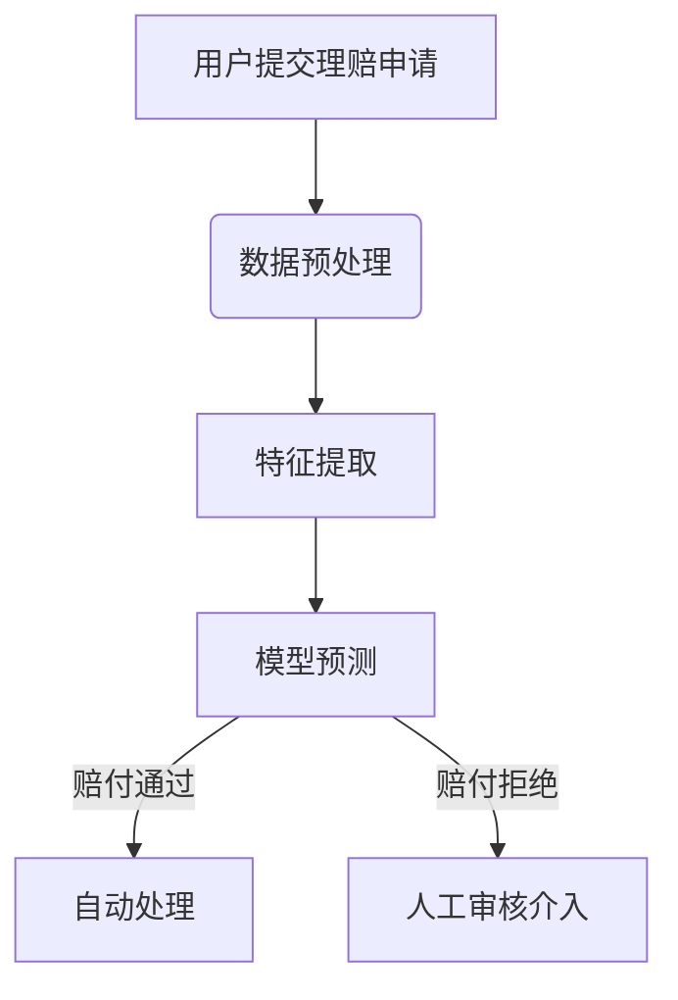
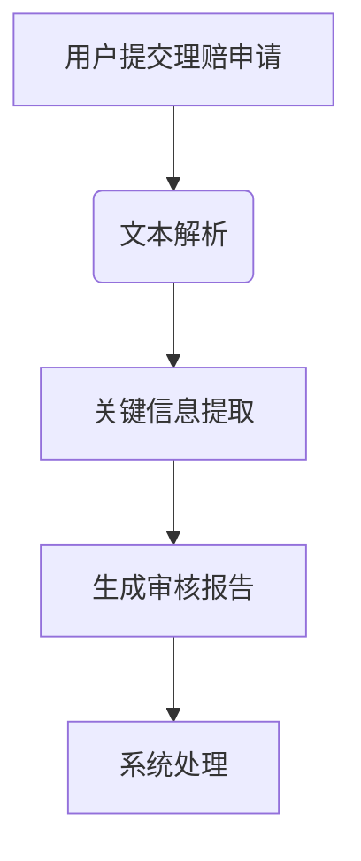
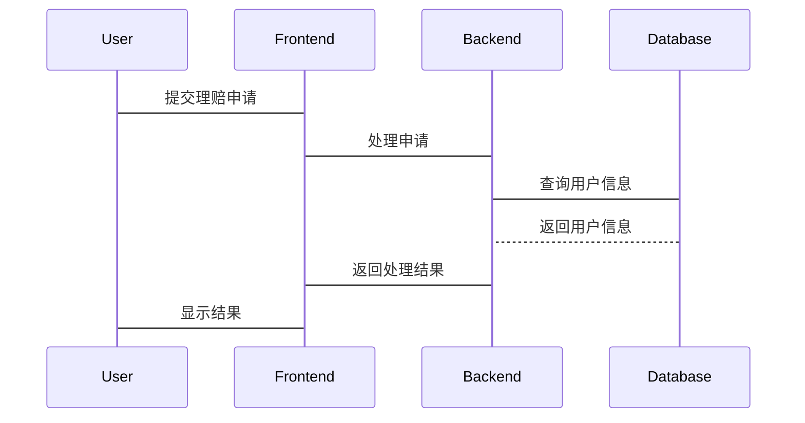

                 


# 《智能保险理赔快速处理系统》

## 关键词：智能保险，理赔系统，人工智能，机器学习，规则引擎，系统架构，项目实战

## 摘要：  
智能保险理赔快速处理系统是一种结合人工智能技术的创新解决方案，旨在解决传统保险理赔流程中的低效、错误率高和用户体验差等问题。本文将详细分析系统的背景、核心概念、算法原理、系统架构以及实际项目中的实现与应用，最终总结系统的最佳实践和未来发展方向。

---

## # 第一部分: 保险理赔的痛点与智能化需求

### ## 第1章: 保险理赔的痛点与智能化需求

#### ### 1.1 传统保险理赔的痛点
- 传统保险理赔流程的复杂性
- 人工审核的低效性
- 数据处理的不准确性
- 用户体验的不佳

#### ### 1.2 保险理赔智能化的必要性
- 技术进步对保险行业的推动
- 用户对快速理赔的需求
- 保险公司的成本压力

#### ### 1.3 问题背景与问题描述
- 保险理赔中的信息不对称问题
- 理赔流程中的重复性工作
- 理赔中的欺诈行为

#### ### 1.4 问题解决与边界
- 智能保险理赔系统的解决方案
- 系统的边界与外延
- 系统的适用范围与限制

#### ### 1.5 核心概念与结构
- 系统的核心要素：用户、理赔案件、保险公司
- 系统的运行流程：申请、审核、赔付
- 系统的架构特点：智能化、自动化、高效性

## # 第二部分: 智能保险理赔系统的核心概念与联系

### ## 第2章: 智能保险理赔系统的原理与架构

#### ### 2.1 系统的核心原理
- 规则引擎的原理
- 机器学习模型的应用
- 自然语言处理技术的作用

#### ### 2.2 系统的架构特点
- 分层架构：前端、后端、数据库
- 模块化设计：用户模块、理赔模块、审核模块
- 高可用性与扩展性

#### ### 2.3 核心概念的ER实体关系图

```mermaid
er
actor: 用户
actor: 保险公司
actor: 理赔案件
actor: 理赔结果
```

## # 第三部分: 智能保险理赔系统的算法原理

### ## 第3章: 算法原理与实现

#### ### 3.1 规则引擎的原理
- 规则引擎的基本概念
- 规则引擎的流程图展示



#### ### 3.2 机器学习模型的应用
- 机器学习在理赔中的应用
- 机器学习模型的流程图



#### ### 3.3 自然语言处理技术的作用
- 文本分析与信息提取
- 自然语言处理流程图



#### ### 3.4 算法实现的Python代码示例
```python
# 简单的规则引擎示例
def process_claim(claim):
    if claim['amount'] > 1000:
        return '自动拒绝'
    elif claim['amount'] < 0:
        return '无效申请'
    else:
        return '人工审核'
```

#### ### 3.5 算法原理的数学模型
- 逻辑回归模型的公式：

$$ P(y=1|x) = \frac{1}{1 + e^{-w x - b}} $$

其中，$w$ 是权重，$b$ 是偏置，$x$ 是输入特征。

## # 第四部分: 智能保险理赔系统的系统架构设计

### ## 第4章: 系统架构设计

#### ### 4.1 问题场景介绍
- 用户提交理赔申请
- 系统自动处理或人工干预

#### ### 4.2 系统功能设计
- 用户模块：提交申请、查询状态
- 理赔模块：自动审核、生成报告
- 审核模块：人工复核、最终决策

#### ### 4.3 系统架构设计
- 前端：用户界面
- 后端：业务逻辑处理
- 数据库：存储用户信息和理赔记录


#### ### 4.4 系统接口设计
- API接口：提交理赔申请、查询状态
- 接口交互流程图



## # 第五部分: 智能保险理赔系统的项目实战

### ## 第5章: 项目实战

#### ### 5.1 环境安装
- 安装Python和必要的库（如TensorFlow、Pandas）
- 安装Jupyter Notebook进行数据分析

#### ### 5.2 核心代码实现
- 数据预处理代码
- 模型训练代码
- 接口调用代码

```python
# 数据预处理示例
import pandas as pd

data = pd.read_csv('claims.csv')
data_processed = data.dropna()
```

```python
# 模型训练示例
from sklearn.linear_model import LogisticRegression

model = LogisticRegression()
model.fit(X_train, y_train)
```

#### ### 5.3 实际案例分析
- 案例背景：用户提交车险理赔申请
- 系统处理流程：自动审核、生成报告、人工复核
- 处理结果：赔付通过或拒绝

#### ### 5.4 项目小结
- 项目成果
- 经验总结
- 改进建议

## # 第六部分: 智能保险理赔系统的最佳实践

### ## 第6章: 最佳实践

#### ### 6.1 小结
- 系统的优势：高效、准确、节省成本
- 系统的局限性：数据隐私、模型优化

#### ### 6.2 注意事项
- 数据隐私保护
- 模型的持续优化
- 系统的可扩展性

#### ### 6.3 拓展阅读
- 推荐书籍：《机器学习实战》
- 推荐资源：Kaggle上的保险数据集

## # 第七部分: 总结与展望

### ## 第7章: 总结与展望

#### ### 7.1 全文总结
- 系统的核心功能与优势
- 技术实现的关键点

#### ### 7.2 未来展望
- 技术的发展趋势
- 系统的优化方向

---

## 作者：AI天才研究院/AI Genius Institute & 禅与计算机程序设计艺术 /Zen And The Art of Computer Programming

