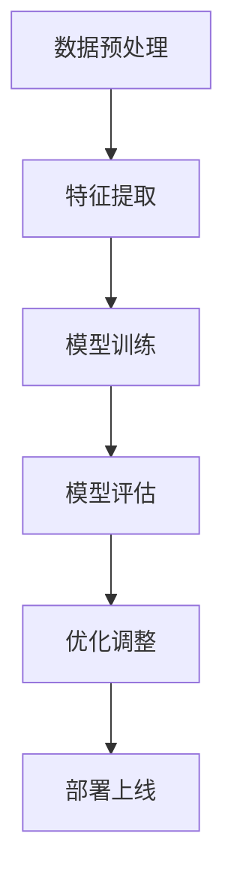

                 


```markdown
# 智能保险理赔欺诈预防系统

> 关键词：保险，保险欺诈，机器学习，人工智能，大数据，风险管理

> 摘要：本文介绍了一种基于人工智能和大数据技术的智能保险理赔欺诈预防系统。该系统通过分析保险理赔数据，识别潜在的欺诈行为，帮助保险公司降低理赔风险。文章从系统背景、核心概念、算法原理、系统架构、项目实现等多个方面进行了详细阐述，提供了系统的整体解决方案。

---

## 第1章: 保险理赔欺诈预防的背景与挑战

### 1.1 保险理赔的基本概念

#### 1.1.1 保险理赔的定义
保险理赔是指在保险事故发生后，保险公司根据保险合同的约定，对被保险人或受益人进行赔偿或给付保险金的过程。它是保险服务的核心环节之一。

#### 1.1.2 保险理赔的主要流程
1. **报案**：被保险人或受益人在事故发生后，向保险公司提出理赔申请。
2. **资料收集**：保险公司收集与事故相关的各类资料，包括事故报告、医疗记录、维修费用等。
3. **审核**：保险公司对提交的资料进行审核，确认事故的真实性、责任划分以及是否符合保险条款。
4. **赔付**：审核通过后，保险公司根据保险合同的约定进行赔付。

#### 1.1.3 保险理赔的重要性
保险理赔不仅是保险公司履行合同义务的重要环节，也是维护客户信任和公司声誉的关键。高效的理赔过程能够提升客户满意度，而复杂的理赔问题则可能影响公司的财务健康和市场竞争力。

### 1.2 欺诈理赔的现状与问题

#### 1.2.1 欺诈理赔的定义与类型
欺诈理赔是指故意制造或虚构保险事故，以骗取保险金的行为。常见的欺诈类型包括：
- **假保单**：使用伪造的保险单进行理赔。
- **夸大损失**：夸大事故损失，以获得更多的赔偿。
- **虚构事故**：编造不存在的事故进行理赔。
- **恶意重复理赔**：同一事故多次理赔，或不同保险公司重复理赔。

#### 1.2.2 欺诈理赔的常见手段
1. **伪造证据**：如伪造医疗记录、事故报告等。
2. **虚构身份**：冒用他人身份进行理赔。
3. **合谋欺诈**：与维修商、医疗机构等合谋，虚增维修费用或医疗费用。

#### 1.2.3 欺诈理赔对保险行业的影响
- **财务损失**：欺诈行为导致保险公司赔付虚假理赔，造成直接经济损失。
- **信任危机**：频繁的欺诈行为会损害客户对保险公司的信任，影响公司声誉。
- **管理成本增加**：为了防范欺诈，保险公司需要投入更多的人力和资源。

### 1.3 智能化欺诈预防的必要性

#### 1.3.1 传统欺诈预防的局限性
传统的欺诈预防主要依赖人工审核和简单的规则匹配，存在以下问题：
- **效率低**：人工审核耗时长，难以应对海量的理赔请求。
- **漏判率高**：规则匹配难以覆盖所有可能的欺诈手段，容易漏判。
- **成本高**：需要大量专业人员进行审核，增加了公司的运营成本。

#### 1.3.2 智能化技术在欺诈预防中的优势
人工智能和大数据技术的快速发展，为保险行业的欺诈预防提供了新的解决方案。智能化技术能够通过分析海量数据，发现隐藏在数据中的欺诈模式，显著提高欺诈检测的准确性和效率。

#### 1.3.3 保险行业智能化转型的趋势
随着保险行业的竞争加剧，保险公司纷纷将智能化技术应用于理赔流程中。通过智能化欺诈预防系统，保险公司可以显著降低理赔风险，提升客户体验，同时优化运营成本。

## 第2章: 智能保险理赔欺诈预防系统的概念与架构

### 2.1 系统的核心概念

#### 2.1.1 数据来源与处理
系统从多个渠道获取保险理赔数据，包括：
- **结构化数据**：如理赔申请表、事故报告等。
- **非结构化数据**：如图像、视频、音频等。
- **外部数据**：如公共安全记录、医疗数据库等。

数据处理包括数据清洗、特征提取和数据增强等步骤，确保数据质量和可用性。

#### 2.1.2 智能分析与预测
系统利用机器学习、深度学习等技术，对处理后的数据进行分析和预测。通过训练模型，系统能够识别潜在的欺诈行为，并提供风险评估和决策支持。

#### 2.1.3 风险评估与决策支持
系统基于分析结果，生成风险评估报告，并为保险公司的理赔决策提供支持。例如，系统可以推荐是否批准理赔申请，或者进一步调查核实。

### 2.2 系统的关键组成部分

#### 2.2.1 数据采集模块
负责从多个数据源采集理赔数据，并进行初步处理。数据来源包括保险公司内部数据库、第三方数据源等。

#### 2.2.2 数据分析模块
对采集到的数据进行深入分析，提取特征并构建模型。分析方法包括统计分析、机器学习、自然语言处理等。

#### 2.2.3 智能预测模块
利用训练好的模型，对新的理赔请求进行预测，识别潜在的欺诈行为。预测结果包括欺诈概率、风险等级等。

#### 2.2.4 决策支持模块
根据预测结果，生成风险评估报告，并为保险公司的理赔决策提供支持。例如，建议拒绝某些理赔申请，或者进行进一步调查。

### 2.3 系统的架构设计

#### 2.3.1 分层架构
系统采用分层架构，包括数据层、应用层和表现层。数据层负责数据的存储和管理，应用层负责业务逻辑的实现，表现层负责用户界面的展示。

#### 2.3.2 微服务架构
系统采用微服务架构，将功能模块化，每个服务独立运行。这提高了系统的可扩展性和维护性。

#### 2.3.3 数据流与模块交互
数据从数据源流向数据采集模块，经过处理后进入数据分析模块，最终由智能预测模块生成预测结果，并通过决策支持模块提供决策支持。

### 2.4 系统的核心目标与边界

#### 2.4.1 核心目标
- **降低欺诈风险**：通过智能化技术识别潜在的欺诈行为，减少虚假理赔。
- **提高理赔效率**：通过自动化处理和智能预测，缩短理赔周期。
- **优化成本**：通过减少人工审核和欺诈赔付，降低运营成本。

#### 2.4.2 系统边界
系统主要关注保险理赔过程中的欺诈预防，不涉及其他业务流程。系统与保险公司内部数据库、第三方数据源等进行交互。

#### 2.4.3 外部依赖与接口
系统需要依赖外部数据源，如公共安全记录、医疗数据库等。系统通过API接口与其他系统进行交互。

## 第3章: 智能保险理赔欺诈预防系统的数学模型与算法原理

### 3.1 欺诈行为识别的数学模型

#### 3.1.1 概率论基础
概率论是机器学习的基础，用于模型的不确定性分析。例如，欺诈行为的概率可以用概率论中的贝叶斯定理进行计算。

#### 3.1.2 统计学习方法
统计学习方法，如逻辑回归、支持向量机（SVM）等，用于分类和回归分析。这些方法可以帮助识别欺诈行为的模式和特征。

#### 3.1.3 机器学习模型
机器学习模型，如决策树、随机森林、神经网络等，用于构建欺诈行为识别的分类器。这些模型能够从大量数据中学习，提取复杂的特征关系。

### 3.2 常见算法原理

#### 3.2.1 决策树算法
决策树是一种基于树结构的分类方法，能够将数据分成不同的叶子节点。每个内部节点表示一个判断条件，叶子节点表示最终的分类结果。

#### 3.2.2 支持向量机（SVM）
SVM是一种监督学习算法，用于分类和回归。它通过构建一个超平面，将数据分成不同的类别。支持向量机在高维空间中表现优异，适合处理非线性问题。

#### 3.2.3 神经网络模型
神经网络是一种模仿人脑结构的模型，能够通过多层神经元之间的连接，学习复杂的特征关系。深度学习中的卷积神经网络（CNN）和循环神经网络（RNN）常用于处理图像和序列数据。

### 3.3 模型训练与优化

#### 3.3.1 数据预处理
数据预处理包括数据清洗、特征选择、数据增强等步骤，确保数据质量和一致性。例如，处理缺失值、去除异常值、标准化特征等。

#### 3.3.2 模型训练
使用训练数据对模型进行训练，调整模型参数，使其能够准确地分类欺诈行为。例如，使用随机梯度下降（SGD）优化器训练神经网络模型。

#### 3.3.3 模型评估与优化
通过交叉验证、准确率、召回率、F1分数等指标评估模型性能。根据评估结果，优化模型参数或调整模型结构，提高分类准确率。

### 3.4 算法实现与流程图

#### 3.4.1 算法流程图（Mermaid）


#### 3.4.2 Python实现示例代码
```python
import pandas as pd
from sklearn.tree import DecisionTreeClassifier
from sklearn.metrics import accuracy_score

# 数据加载与预处理
data = pd.read_csv('fraud_data.csv')
X = data.drop('fraud_flag', axis=1)
y = data['fraud_flag']

# 模型训练
model = DecisionTreeClassifier()
model.fit(X, y)

# 模型评估
predictions = model.predict(X)
print("Accuracy:", accuracy_score(y, predictions))
```

## 第4章: 系统功能设计与实现

### 4.1 系统功能模块划分

#### 4.1.1 数据采集模块
负责从多个数据源采集理赔数据，并进行初步处理。例如，从保险公司数据库、公共安全记录、医疗数据库等获取数据。

#### 4.1.2 数据处理模块
对采集到的数据进行清洗、特征提取和数据增强。例如，处理缺失值、去除异常值、标准化特征等。

### 4.2 系统分析与架构设计

#### 4.2.1 问题场景介绍
假设某保险公司每天处理大量的理赔请求，其中部分请求存在欺诈行为。为了提高欺诈检测的准确性，公司决定引入智能化欺诈预防系统。

#### 4.2.2 系统功能设计（领域模型）


#### 4.2.3 系统架构设计（架构图）
```mermaid
container 系统架构 {
    service 数据采集模块 {
        - 数据来源：数据库、API接口
    }
    service 数据处理模块 {
        - 数据清洗、特征提取
    }
    service 智能预测模块 {
        - 模型训练、预测
    }
    service 决策支持模块 {
        - 风险评估、理赔建议
    }
}
```

### 4.3 项目实战

#### 4.3.1 环境安装
- **Python**：安装Python 3.8及以上版本。
- **库的安装**：使用pip安装所需的库，如pandas、scikit-learn、tensorflow等。

#### 4.3.2 核心代码实现
```python
import pandas as pd
from sklearn.ensemble import RandomForestClassifier
from sklearn.metrics import classification_report

# 数据加载与预处理
data = pd.read_csv('fraud_data.csv')
X = data.drop('fraud_flag', axis=1)
y = data['fraud_flag']

# 模型训练
model = RandomForestClassifier()
model.fit(X, y)

# 模型预测
predictions = model.predict(X)

# 模型评估
print(classification_report(y, predictions))
```

#### 4.3.3 案例分析与结果解读
假设我们有一个理赔请求，系统预测其欺诈概率为90%。这表明该请求很可能存在欺诈行为。保险公司可以进一步调查，确认是否存在虚构的医疗记录或夸大损失。

### 4.4 本章小结

## 第5章: 系统优化与部署

### 5.1 系统优化策略
- **模型优化**：通过超参数调优、特征工程等方法，提高模型的准确率和召回率。
- **系统性能优化**：优化数据处理流程，提高系统的响应速度和处理能力。
- **部署优化**：采用容器化部署（如Docker）、微服务架构等，提高系统的可扩展性和稳定性。

### 5.2 系统部署流程
1. **环境准备**：搭建服务器、安装必要的软件和库。
2. **代码部署**：将系统代码部署到服务器，配置运行环境。
3. **数据部署**：将数据加载到系统中，确保数据源的连通性。
4. **系统测试**：进行功能测试、性能测试和安全测试，确保系统正常运行。
5. **监控与维护**：部署监控工具，实时监控系统运行状态，及时发现和解决问题。

### 5.3 系统维护与更新
- **定期更新模型**：随着新的数据积累，定期重新训练模型，保持模型的准确性。
- **系统升级**：根据技术发展，对系统进行功能升级和性能优化。
- **安全维护**：加强系统安全防护，防止数据泄露和系统攻击。

## 第6章: 结论与展望

### 6.1 本系统的总结
智能保险理赔欺诈预防系统通过智能化技术，显著提高了欺诈检测的准确性和效率，降低了保险公司的理赔风险和运营成本。

### 6.2 未来展望
未来，随着人工智能和大数据技术的进一步发展，智能保险理赔欺诈预防系统将更加智能化和自动化。例如，可以引入自然语言处理技术，分析非结构化数据；或者利用区块链技术，提高数据的安全性和可信度。

### 6.3 最佳实践 Tips
- 在部署系统前，确保数据源的多样性和高质量。
- 定期更新模型，保持模型的准确性和适应性。
- 加强系统安全防护，防止数据泄露和系统攻击。

### 6.4 小结
通过智能化技术的应用，保险行业可以更高效地预防和打击欺诈行为，提升整体风险管理能力。

### 6.5 注意事项
- 数据隐私保护：在处理个人数据时，必须遵守相关法律法规，保护用户隐私。
- 系统稳定性：确保系统的稳定运行，避免因系统故障导致业务中断。
- 模型可解释性：选择可解释性较强的模型，便于分析和优化。

### 6.6 拓展阅读
- 推荐阅读《机器学习实战》、《深度学习》等书籍，深入了解机器学习和深度学习的技术细节。
- 关注行业动态，了解最新的欺诈预防技术和工具。

## 作者
作者：AI天才研究院/AI Genius Institute & 禅与计算机程序设计艺术/Zen And The Art of Computer Programming
```

---

### 总结
《智能保险理赔欺诈预防系统》一文详细介绍了基于人工智能和大数据技术的保险欺诈预防系统，从系统背景、核心概念、算法原理、系统架构到项目实战，进行了全面而深入的阐述。通过智能化技术的应用，保险公司可以更高效地识别和预防欺诈行为，降低理赔风险，提升整体风险管理能力。未来，随着技术的进一步发展，智能保险理赔欺诈预防系统将更加智能化和自动化，为保险行业带来更大的价值。

