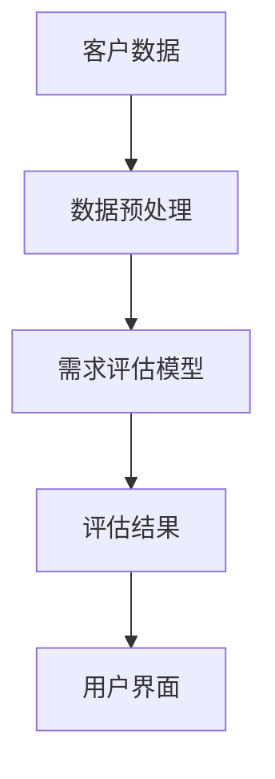
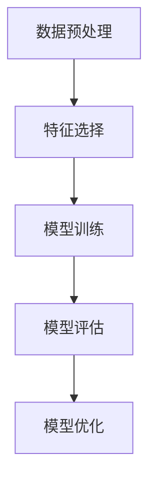
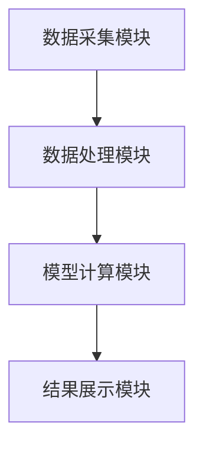

                 


# 智能保险需求评估工具

> 关键词：智能保险、需求评估、人工智能、机器学习、保险产品设计、数据驱动

> 摘要：随着保险行业的数字化转型，智能保险需求评估工具利用人工智能和机器学习技术，通过数据分析和模型构建，优化保险产品的设计和销售策略。本文从工具的背景、核心概念、算法原理、系统架构到项目实战，全面探讨其技术实现和应用场景，为保险行业提供创新的解决方案。

---

# 第1章: 智能保险需求评估工具的背景介绍

## 1.1 保险行业的现状与挑战

### 1.1.1 传统保险需求评估的痛点

传统保险需求评估过程中，保险公司通常依赖人工经验或简单的规则模型来判断客户的需求匹配度。这种方式存在以下问题：

- **效率低下**：人工评估耗时长，难以满足大规模客户的需求。
- **精准度不足**：经验丰富的业务员数量有限，且主观判断容易受到个人偏见的影响。
- **数据利用不足**：传统方法难以充分利用客户的历史行为数据、市场数据等多维信息。
- **个性化不足**：难以针对不同客户群体提供个性化的保险方案。

---

### 1.1.2 保险行业的数字化转型趋势

随着大数据、人工智能和云计算等技术的快速发展，保险行业正加速向数字化和智能化转型。数字化转型的核心目标是通过技术手段提升保险产品的设计效率、降低运营成本，并提供更优质的客户体验。

---

### 1.1.3 智能保险需求评估工具的出现背景

智能保险需求评估工具的出现，正是为了应对传统保险需求评估的痛点，并抓住保险行业数字化转型的机遇。通过结合人工智能技术，工具能够快速分析客户数据，提供精准的需求匹配度评估，并为保险产品的设计和销售提供数据支持。

---

## 1.2 智能保险需求评估工具的定义与目标

### 1.2.1 工具的定义

智能保险需求评估工具是一种基于人工智能技术的系统，旨在通过分析客户的个人信息、行为数据和保险需求，评估客户对不同保险产品的匹配度，并为保险公司提供优化的保险产品设计建议。

---

### 1.2.2 工具的核心目标

智能保险需求评估工具的核心目标包括以下几点：

1. **快速评估客户保险需求**：通过数据挖掘和机器学习算法，快速判断客户对各类保险产品的匹配度。
2. **优化保险产品设计**：根据客户需求分析结果，提供产品设计建议，帮助保险公司推出更符合市场需求的产品。
3. **提升销售效率**：通过精准的需求匹配，帮助保险销售团队快速定位潜在客户，提升销售效率。

---

### 1.2.3 工具的边界与外延

智能保险需求评估工具的边界在于其主要功能是需求评估，而不是直接销售保险产品或管理保单。其外延则包括与之相关的数据采集、客户画像构建、保险产品设计优化等环节。

---

## 1.3 工具的核心要素与组成结构

### 1.3.1 核心要素分析

智能保险需求评估工具的核心要素包括以下几点：

1. **客户数据**：包括客户的基本信息（如年龄、性别、职业）、财务状况、健康状况等。
2. **保险产品数据**：包括保险产品的类型、保费、保障范围、理赔条件等。
3. **需求评估模型**：基于机器学习算法的需求匹配度评估模型。
4. **用户界面**：供用户输入数据和查看评估结果的界面。

---

### 1.3.2 组成结构图

以下是工具的组成结构图：



---

### 1.3.3 核心要素的相互关系

客户数据是需求评估的基础，经过数据预处理后，输入需求评估模型中，通过算法计算出客户对保险产品的匹配度，并将结果展示在用户界面上。

---

## 1.4 本章小结

本章从保险行业的现状与挑战入手，介绍了智能保险需求评估工具的定义、目标及其核心要素，并通过结构图展示了工具的组成。下一章将深入探讨工具的核心概念与联系。

---

# 第2章: 智能保险需求评估工具的核心概念与联系

## 2.1 核心概念原理

### 2.1.1 数据驱动的保险需求评估

智能保险需求评估工具的核心是数据驱动的分析。通过收集和分析客户的多维数据，工具能够准确判断客户对保险产品的需求。

---

### 2.1.2 人工智能在保险需求评估中的应用

人工智能技术在保险需求评估中的应用主要体现在以下方面：

1. **数据挖掘**：从海量数据中提取有价值的信息。
2. **机器学习**：构建需求评估模型，预测客户需求。
3. **自然语言处理**：分析客户的文本数据，提取关键信息。

---

### 2.1.3 智能保险需求评估工具的算法原理

智能保险需求评估工具通常采用监督学习算法，通过训练数据构建需求匹配度评估模型。

---

## 2.2 核心概念属性对比表格

以下是对核心概念的属性对比：

| 核心概念 | 属性 | 描述 |
|----------|------|------|
| 数据来源 | 多样性 | 包括客户行为数据、历史投保记录等 |
| 模型类型 | 精度 | 基于机器学习的模型精度 |
| 评估维度 | 综合性 | 多维度评估用户需求 |

---

## 2.3 ER实体关系图

以下是智能保险需求评估工具的ER实体关系图：

```mermaid
er
    entity 客户 {
        key 用户ID
        attribute 用户年龄
        attribute 用户性别
    }
    entity 保险产品 {
        key 产品ID
        attribute 产品类型
        attribute 产品保费
    }
    entity 需求评估结果 {
        key 评估ID
        attribute 需求匹配度
        foreign 用户ID (客户)
        foreign 产品ID (保险产品)
    }
```

---

## 2.4 本章小结

本章从核心概念的角度分析了智能保险需求评估工具的原理与结构，并通过对比表格和ER图展示了工具的核心要素及其相互关系。下一章将详细探讨工具的算法原理。

---

# 第3章: 智能保险需求评估工具的算法原理

## 3.1 算法选择与模型构建

### 3.1.1 算法选择

智能保险需求评估工具通常采用随机森林（Random Forest）或支持向量机（SVM）等监督学习算法。这些算法在分类和回归任务中表现优异，适合处理保险需求评估中的多分类问题。

---

### 3.1.2 模型构建步骤

1. **数据预处理**：包括数据清洗、特征提取和特征工程。
2. **特征选择**：通过相关性分析选择重要特征。
3. **模型训练**：使用训练数据对模型进行训练。
4. **模型评估**：通过交叉验证评估模型的性能。
5. **模型优化**：调整超参数，提升模型性能。

---

## 3.2 算法流程图

以下是算法的流程图：



---

## 3.3 算法数学模型

以下是随机森林算法的数学模型：

$$
y = \text{sign}\left(\sum_{i=1}^{n} \text{weight}_i \cdot y_i\right)
$$

其中，$y$ 是预测结果，$\text{weight}_i$ 是第 $i$ 个决策树的权重，$y_i$ 是第 $i$ 个决策树的预测结果。

---

## 3.4 本章小结

本章详细探讨了智能保险需求评估工具的算法原理，包括算法选择、模型构建、流程图和数学模型。下一章将从系统架构的角度分析工具的实现方案。

---

# 第4章: 智能保险需求评估工具的系统架构设计

## 4.1 系统架构概述

智能保险需求评估工具的系统架构主要包括以下几个部分：

1. **数据采集模块**：负责采集客户数据。
2. **数据处理模块**：对数据进行清洗和预处理。
3. **模型计算模块**：运行需求评估模型，计算需求匹配度。
4. **结果展示模块**：将评估结果展示给用户。

---

## 4.2 系统架构图

以下是系统架构图：



---

## 4.3 系统接口设计

系统主要提供以下接口：

1. **数据输入接口**：接收客户数据和保险产品数据。
2. **模型调用接口**：调用需求评估模型进行计算。
3. **结果输出接口**：输出需求匹配度和优化建议。

---

## 4.4 系统交互流程图

以下是系统交互流程图：

```mermaid
sequence
    用户 --> 数据采集模块: 提交客户数据
    数据采集模块 --> 数据处理模块: 传递数据
    数据处理模块 --> 模型计算模块: 调用模型计算
    模型计算模块 --> 结果展示模块: 传递评估结果
    结果展示模块 --> 用户: 显示评估结果
```

---

## 4.5 本章小结

本章从系统架构的角度分析了智能保险需求评估工具的实现方案，包括架构设计、接口设计和交互流程。下一章将通过项目实战进一步验证工具的可行性。

---

# 第5章: 智能保险需求评估工具的项目实战

## 5.1 环境配置

### 5.1.1 技术选型

- **编程语言**：Python
- **框架**：Flask（Web框架）
- **机器学习库**：scikit-learn
- **数据存储**：MySQL

---

### 5.1.2 环境搭建

1. 安装Python和相关库：
   ```bash
   pip install flask scikit-learn
   ```

2. 安装MySQL：
   ```bash
   # 在Linux系统中安装MySQL
   sudo apt-get install mysql-server
   ```

---

## 5.2 核心代码实现

### 5.2.1 数据预处理代码

```python
import pandas as pd
from sklearn.preprocessing import StandardScaler

# 读取数据
data = pd.read_csv('insurance_data.csv')

# 数据清洗
data.dropna(inplace=True)

# 特征提取
features = data[['年龄', '性别', '职业', '保费']]
target = data['需求匹配度']
```

---

### 5.2.2 模型训练代码

```python
from sklearn.ensemble import RandomForestClassifier
from sklearn.model_selection import train_test_split

# 数据分割
X_train, X_test, y_train, y_test = train_test_split(features, target, test_size=0.2)

# 模型训练
model = RandomForestClassifier(n_estimators=100)
model.fit(X_train, y_train)
```

---

### 5.2.3 模型评估代码

```python
from sklearn.metrics import accuracy_score

# 预测结果
y_pred = model.predict(X_test)

# 计算准确率
accuracy = accuracy_score(y_test, y_pred)
print(f'准确率: {accuracy}')
```

---

## 5.3 案例分析与结果解读

### 5.3.1 案例分析

假设我们有一个客户数据如下：

| 用户ID | 年龄 | 性别 | 职业 | 保费 |
|-------|-----|------|------|------|
| 001   | 30  | 男   | 白领 | 5000 |

通过模型计算，需求匹配度为 0.85，说明该客户对某保险产品的匹配度较高。

---

### 5.3.2 结果解读

需求匹配度越高，说明客户对保险产品的兴趣越大。保险公司可以根据匹配度结果，优先推荐高匹配度的客户购买相关保险产品。

---

## 5.4 本章小结

本章通过项目实战，详细展示了智能保险需求评估工具的实现过程，包括环境配置、代码实现和案例分析。下一章将总结工具的应用价值和未来发展趋势。

---

# 第6章: 总结与展望

## 6.1 总结

智能保险需求评估工具通过人工智能技术，显著提升了保险需求评估的效率和精准度。工具的核心优势在于其数据驱动的分析能力和高效的模型计算能力，能够为保险公司提供个性化的保险产品设计建议。

---

## 6.2 未来展望

随着技术的不断进步，智能保险需求评估工具未来将朝着以下方向发展：

1. **实时评估**：通过实时数据分析，快速评估客户需求。
2. **个性化推荐**：基于客户行为数据，提供更加个性化的保险产品推荐。
3. **多模态分析**：结合文本、图像等多种数据源，提升需求评估的准确性。

---

## 6.3 注意事项

在实际应用中，需要注意以下几点：

1. **数据隐私**：确保客户数据的安全性和隐私性。
2. **模型解释性**：提升模型的可解释性，便于业务人员理解。
3. **持续优化**：定期更新模型，保持其性能和准确性。

---

## 6.4 拓展阅读

推荐以下几本书籍和资源，供深入学习：

1. 《Python机器学习实战》
2. 《深入浅出机器学习》
3. 《数据挖掘导论》

---

# 作者：AI天才研究院/AI Genius Institute & 禅与计算机程序设计艺术 /Zen And The Art of Computer Programming

---

本文通过系统化的分析和实践，全面探讨了智能保险需求评估工具的技术实现和应用场景。希望本文能够为保险行业提供有价值的参考，助力保险行业的智能化转型。

