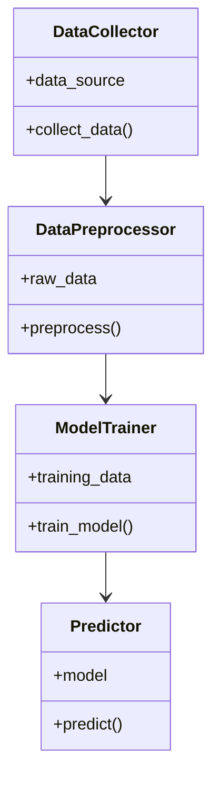
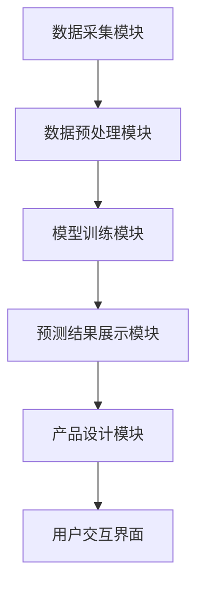
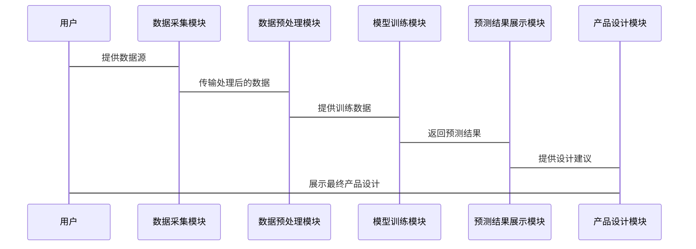

                 


```markdown
# 智能保险需求预测与产品设计系统

## 关键词：智能保险需求预测、产品设计系统、机器学习、数据驱动、保险行业

## 摘要：本文详细探讨了智能保险需求预测与产品设计系统的构建与应用，通过分析保险行业数字化转型的背景，提出了基于机器学习和数据分析的智能预测方法，并结合系统架构设计和实际案例，展示了如何利用智能化工具优化保险产品设计，以满足用户需求和市场变化。

# 第一部分: 智能保险需求预测与产品设计系统概述

## 第1章: 智能保险需求预测与产品设计系统背景介绍

### 1.1 问题背景
#### 1.1.1 保险行业的数字化转型
随着科技的快速发展，保险行业正经历着数字化转型，传统的保险业务模式逐渐被智能化、数据驱动的方法所取代。智能保险需求预测与产品设计系统正是这一转型的重要体现。

#### 1.1.2 智能保险需求预测的必要性
传统的需求预测方法依赖于经验和市场调研，存在效率低、准确性差的问题。通过引入人工智能和大数据分析技术，可以显著提高需求预测的准确性和效率。

#### 1.1.3 产品设计与用户需求的匹配
保险产品的设计需要紧密围绕用户需求，传统的设计方法往往无法及时捕捉市场变化和用户需求的变化，导致产品与市场需求脱节。

### 1.2 问题描述
#### 1.2.1 传统保险需求预测的局限性
传统的需求预测方法依赖于历史数据和经验判断，难以应对市场变化和用户需求的多样性，预测结果往往不够精准。

#### 1.2.2 智能化需求预测的挑战
智能化需求预测需要大量的数据支持，同时需要克服数据质量和模型选择等技术挑战。

#### 1.2.3 保险产品设计与用户需求的脱节
传统的产品设计方法往往忽视用户的个性化需求，导致产品难以满足用户的实际需求。

### 1.3 问题解决
#### 1.3.1 智能保险需求预测的核心目标
通过机器学习和数据分析技术，建立准确的需求预测模型，帮助企业更好地把握市场动向和用户需求。

#### 1.3.2 数据驱动的产品设计方法
利用大数据分析和用户行为数据，设计出更符合用户需求的保险产品。

#### 1.3.3 智能化工具在保险产品设计中的应用
引入智能化工具，如推荐系统和自动化设计系统，提高产品设计的效率和精准度。

### 1.4 边界与外延
#### 1.4.1 智能保险需求预测的边界条件
明确需求预测的范围和适用场景，避免超出系统的处理能力。

#### 1.4.2 保险产品设计的范围界定
确定产品设计的核心功能和目标用户群体，确保设计的针对性和有效性。

#### 1.4.3 系统功能的外延与扩展
在系统设计中留有扩展空间，方便未来功能的添加和优化。

### 1.5 核心概念与要素
#### 1.5.1 智能保险需求预测的核心要素
包括数据采集、模型建立、预测结果分析等关键步骤。

#### 1.5.2 保险产品设计的关键属性
涵盖产品功能、用户体验、市场定位等方面。

#### 1.5.3 系统架构的核心组件
包括数据处理模块、预测模型、用户交互界面等核心部分。

## 第2章: 智能保险需求预测与产品设计系统的核心概念与联系

### 2.1 核心概念原理
#### 2.1.1 智能保险需求预测的基本原理
通过机器学习算法，对历史数据进行分析，预测未来的需求趋势。

#### 2.1.2 数据驱动的产品设计方法
利用用户行为数据和市场数据，指导产品设计的各个环节。

#### 2.1.3 人工智能在保险领域的应用
人工智能技术在保险需求预测、产品设计、客户服务等领域的具体应用。

### 2.2 概念属性特征对比
#### 2.2.1 传统保险需求预测与智能预测的对比
从准确性、效率、成本等方面进行对比，突出智能预测的优势。

#### 2.2.2 数据驱动设计与传统设计的对比
分析两种设计方法在数据利用、用户需求匹配等方面的差异。

#### 2.2.3 不同保险产品的设计特点
根据不同类型保险产品的特点，提出差异化的设计策略。

### 2.3 ER实体关系图
```mermaid
erd
    entity Insurer {
        id
        name
        address
    }
    entity Policyholder {
        id
        name
        contact_info
    }
    entity Insurance_Policy {
        id
        policyholder_id
        product_id
        coverage
        premium
        start_date
        end_date
    }
    entity Insurance_Product {
        id
        product_name
        coverage_details
        premium_range
        target_market
    }
    Insurer -[1..n]-> Insurance_Policy
    Policyholder -[1]-> Insurance_Policy
    Insurance_Product -[1..n]-> Insurance_Policy
```

# 第三部分: 算法原理讲解

## 第3章: 智能保险需求预测算法原理

### 3.1 算法原理
#### 3.1.1 机器学习模型的选择
根据需求预测的场景和数据特点，选择合适的机器学习模型，如线性回归、随机森林等。

#### 3.1.2 算法步骤
详细说明算法的实现步骤，包括数据预处理、特征选择、模型训练、结果评估等。

### 3.2 代码实现
```python
import pandas as pd
from sklearn.linear_model import LinearRegression
from sklearn.metrics import mean_squared_error

# 加载数据
data = pd.read_csv('insurance.csv')

# 特征选择
X = data[['age', 'sex', 'bmi', 'children', 'smoker', 'region']]
y = data['charges']

# 模型训练
model = LinearRegression()
model.fit(X, y)

# 预测结果
y_pred = model.predict(X)

# 评估指标
mse = mean_squared_error(y, y_pred)
print(f'Mean Squared Error: {mse}')
```

### 3.3 数学模型与公式
#### 3.3.1 线性回归模型
$$ y = \beta_0 + \beta_1 x_1 + \beta_2 x_2 + \ldots + \beta_n x_n $$

#### 3.3.2 随机森林模型
随机森林是一种基于决策树的集成学习方法，通过构建多个决策树并进行投票或平均来提高模型的准确性和鲁棒性。

### 3.4 实例分析
通过实际案例分析，展示算法在保险需求预测中的应用效果，对比不同算法的优劣。

### 3.5 算法优缺点
总结各种算法的优缺点，帮助读者选择适合特定场景的算法。

## 第4章: 数据驱动产品设计的算法实现

### 4.1 数据分析与特征工程
#### 4.1.1 数据清洗
处理缺失值、异常值，确保数据质量。

#### 4.1.2 特征提取
从原始数据中提取有助于预测的特征，如用户年龄、性别、保费等。

### 4.2 模型训练与评估
#### 4.2.1 训练集与测试集的划分
将数据集划分为训练集和测试集，用于模型训练和验证。

#### 4.2.2 模型评估指标
使用均方误差（MSE）、R平方值等指标评估模型的性能。

### 4.3 产品推荐算法
#### 4.3.1 基于协同过滤的推荐
通过用户行为数据，推荐相似产品的保险产品。

#### 4.3.2 基于内容的推荐
根据产品的特性和用户需求，推荐相关产品。

### 4.4 代码实现
```python
from sklearn.metrics.pairwise import cosine_similarity

# 计算产品相似度矩阵
product_similarity = cosine_similarity(product_features)

# 根据用户偏好推荐产品
def recommend_products(user_preferences, product_similarity):
    similar_products = []
    for i in range(len(user_preferences)):
        if user_preferences[i] > 0.5:
            similar_products.append(product_similarity[i])
    return similar_products
```

### 4.5 模型优化
通过调整模型参数、优化特征选择等方法，提升模型的预测准确率和运行效率。

# 第四部分: 数学模型与公式

## 第5章: 智能保险需求预测的数学模型

### 5.1 线性回归模型
#### 5.1.1 单变量线性回归
$$ y = \beta_0 + \beta_1 x $$

#### 5.1.2 多变量线性回归
$$ y = \beta_0 + \beta_1 x_1 + \beta_2 x_2 + \ldots + \beta_n x_n $$

### 5.2 非线性回归模型
#### 5.2.1 对数线性回归
$$ \log(y) = \beta_0 + \beta_1 x $$

#### 5.2.2 多项式回归
$$ y = \beta_0 + \beta_1 x + \beta_2 x^2 + \ldots + \beta_n x^n $$

### 5.3 时间序列分析
#### 5.3.1 ARIMA模型
$$ ARIMA(p, d, q) $$

#### 5.3.2 LSTM网络
使用长短期记忆网络进行时间序列预测，模型结构包括输入层、LSTM层、 Dense层和输出层。

### 5.4 集成学习模型
#### 5.4.1 随机森林
通过集成多个决策树模型，提高预测的准确性和鲁棒性。

#### 5.4.2 梯度提升树
使用梯度提升算法，构建多个弱分类器，最终形成强分类器。

## 第6章: 数据驱动产品设计的数学模型

### 6.1 用户需求分析
#### 6.1.1 用户画像构建
通过数据分析，构建用户画像，了解不同用户群体的需求特点。

#### 6.1.2 需求预测模型
$$ D_i = \beta_0 + \beta_1 A_i + \beta_2 S_i + \beta_3 P_i + \epsilon $$

### 6.2 产品推荐模型
#### 6.2.1 基于协同过滤的推荐公式
$$ S_{u,i} = \frac{\sum_{k} w_{u,k} \cdot r_{k,i}}{\sum_{k} w_{u,k}}} $$

#### 6.2.2 基于内容的推荐公式
$$ S_{u,i} = \sum_{j} w_j \cdot (f_{u,j} \cdot f_{i,j}) $$

### 6.3 模型优化与调参
通过交叉验证等方法，优化模型的参数，提高预测的准确率。

# 第五部分: 系统分析与架构设计

## 第7章: 智能保险需求预测系统分析

### 7.1 问题场景
#### 7.1.1 数据采集
从多个数据源获取用户信息、历史销售数据等。

#### 7.1.2 数据处理
清洗、转换和整合数据，确保数据的一致性和完整性。

### 7.2 系统功能设计
#### 7.2.1 数据分析模块
实现数据的可视化展示和初步分析。

#### 7.2.2 模型训练模块
支持多种算法的训练和模型的保存。

#### 7.2.3 预测结果展示模块
展示预测结果，并提供可视化的分析工具。

### 7.3 领域模型类图


## 第8章: 智能保险产品设计系统架构设计

### 8.1 系统架构设计
#### 8.1.1 分层架构
将系统分为数据层、业务逻辑层和用户界面层。

#### 8.1.2 微服务架构
将系统功能模块化，每个模块作为一个独立的服务，便于扩展和维护。

### 8.2 系统架构图


### 8.3 接口设计
#### 8.3.1 数据接口
定义数据输入和输出的格式，确保不同模块之间的数据兼容性。

#### 8.3.2 API接口
提供RESTful API，方便其他系统调用需求预测和产品设计功能。

### 8.4 交互序列图


## 第9章: 系统接口设计与交互设计

### 9.1 系统接口设计
#### 9.1.1 数据接口规范
定义数据的输入输出格式，确保各模块之间的数据交换顺利进行。

#### 9.1.2 API接口设计
提供RESTful API，支持JSON格式的数据传输，方便第三方系统调用。

### 9.2 系统交互设计
#### 9.2.1 用户界面设计
设计直观、易用的用户界面，提升用户体验。

#### 9.2.2 交互流程设计
详细设计用户与系统之间的交互流程，确保系统的高效运行。

### 9.3 交互序列图
通过绘制交互序列图，展示用户与系统之间的交互过程，确保设计的合理性。

# 第六部分: 项目实战

## 第10章: 智能保险需求预测与产品设计系统项目实战

### 10.1 环境安装
#### 10.1.1 安装Python
安装最新版本的Python，确保环境满足项目需求。

#### 10.1.2 安装依赖库
安装所需的第三方库，如pandas、scikit-learn、flask等。

### 10.2 系统核心实现
#### 10.2.1 数据采集模块实现
编写代码，从数据库或其他数据源采集数据。

#### 10.2.2 数据预处理模块实现
对采集到的数据进行清洗、转换和标准化处理。

#### 10.2.3 模型训练模块实现
选择合适的机器学习算法，训练模型并保存模型参数。

#### 10.2.4 预测结果展示模块实现
将预测结果可视化，方便用户查看和分析。

#### 10.2.5 产品设计模块实现
根据预测结果，生成保险产品的设计方案，并展示给用户。

### 10.3 代码实现
#### 10.3.1 数据采集模块
```python
import sqlite3
import pandas as pd

# 连接到SQLite数据库
conn = sqlite3.connect('insurance.db')

# 查询数据
query = 'SELECT * FROM insurance_policy'
data = pd.read_sql(query, conn)
```

#### 10.3.2 数据预处理模块
```python
from sklearn.preprocessing import StandardScaler

# 标准化处理
scaler = StandardScaler()
data_scaled = scaler.fit_transform(data)
```

#### 10.3.3 模型训练模块
```python
from sklearn.ensemble import RandomForestRegressor

# 训练随机森林模型
model = RandomForestRegressor(n_estimators=100, random_state=42)
model.fit(X_train, y_train)
```

#### 10.3.4 预测结果展示模块
```python
import matplotlib.pyplot as plt

# 绘制预测结果对比图
plt.scatter(y_test, y_pred)
plt.xlabel('真实值')
plt.ylabel('预测值')
plt.show()
```

#### 10.3.5 产品设计模块
```python
from flask import Flask, jsonify

app = Flask(__name__)

@app.route('/recommend_products', methods=['POST'])
def recommend_products():
    # 获取输入数据
    data = request.json
    # 调用推荐算法
    recommendation = recommend_algorithm(data)
    return jsonify(recommendation)

if __name__ == '__main__':
    app.run(debug=True)
```

### 10.4 案例分析
#### 10.4.1 数据分析与预测
通过实际案例，展示系统如何根据用户数据预测保险需求。

#### 10.4.2 产品设计与优化
根据预测结果，设计保险产品，并通过用户反馈不断优化产品方案。

### 10.5 项目总结
总结项目实施过程中的经验教训，提出改进建议，为后续项目的开展提供参考。

# 第七部分: 最佳实践与总结

## 第11章: 智能保险需求预测与产品设计系统最佳实践

### 11.1 最佳实践
#### 11.1.1 数据质量的重要性
确保数据的准确性和完整性，是系统运行的基础。

#### 11.1.2 模型选择与调优
根据具体场景选择合适的算法，并通过调参优化模型性能。

#### 11.1.3 系统架构的可扩展性
设计模块化、可扩展的系统架构，便于未来的功能扩展和维护。

### 11.2 小结
总结全文的主要内容和关键点，强调智能保险需求预测与产品设计系统的重要性和应用前景。

### 11.3 注意事项
在实施系统过程中，需要注意数据隐私保护、模型的泛化能力、系统的稳定性和安全性等问题。

### 11.4 拓展阅读
推荐相关领域的书籍和论文，供读者深入学习和研究。

## 第12章: 作者总结与展望

### 12.1 作者总结
作为人工智能专家和软件架构师，我认为智能保险需求预测与产品设计系统的应用前景广阔，能够显著提升保险行业的效率和用户体验。

### 12.2 未来展望
未来，随着人工智能技术的不断发展，智能保险系统将更加智能化和个性化，为企业和用户提供更优质的服务。

---

# 作者：AI天才研究院/AI Genius Institute & 禅与计算机程序设计艺术 /Zen And The Art of Computer Programming
```

