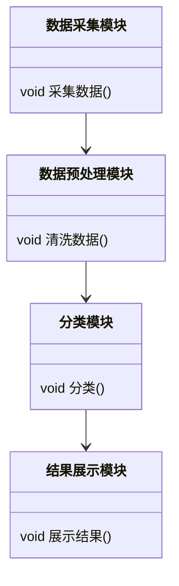

                 

# 智能信用卡支出分类系统

> 关键词：智能分类、机器学习、信用卡支出、数据挖掘、深度学习

> 摘要：本文详细探讨了智能信用卡支出分类系统的实现原理、算法选择、系统架构设计以及实际应用。通过机器学习和数据挖掘技术，结合深度学习模型，提出了一种高效的信用卡支出分类方法，解决了传统分类的效率和准确性问题。

---

## 第一部分: 智能信用卡支出分类系统概述

### 第1章: 问题背景与目标

#### 1.1 问题背景
随着信用卡的普及，用户在日常消费中会产生大量交易数据。传统的信用卡支出分类方法主要依赖人工规则或简单的分类算法，存在分类效率低、准确性差的问题。智能信用卡支出分类系统的目标是通过机器学习和深度学习技术，实现对交易数据的自动化、高精度分类。

#### 1.2 系统目标
- 实现信用卡交易数据的自动分类。
- 提高分类的准确率和效率。
- 支持多种分类算法的灵活切换和优化。

#### 1.3 系统边界与外延
智能信用卡支出分类系统主要针对信用卡交易数据，分类维度包括交易类型（如餐饮、购物、娱乐等）和交易金额范围。系统不直接处理信用评分或其他金融服务，但可以与其他系统集成。

---

## 第二部分: 分类算法与数学模型

### 第2章: 分类算法原理与实现

#### 2.1 常见分类算法对比
在智能信用卡支出分类系统中，常见的分类算法包括决策树、随机森林、支持向量机（SVM）和神经网络。以下是这些算法的对比：

| 算法名称 | 优点 | 缺点 |
|----------|------|------|
| 决策树    | 易解释，适合中小数据集 | 易过拟合 |
| 随机森林  | 高准确率，抗过拟合 | 计算复杂度较高 |
| 支持向量机 | 高维数据表现好 | 参数敏感性高 |
| 神经网络  | 强大学习能力 | 需要大量数据和计算资源 |

#### 2.2 神经网络分类算法实现
神经网络是一种常用的深度学习模型，适合处理复杂的信用卡交易数据。

##### 2.2.1 神经网络基本结构（Mermaid 图）

##### 2.2.2 神经网络数学模型与公式
- 激活函数：
  $$ f(x) = \sigma(x) = \frac{1}{1 + e^{-x}} $$
- 损失函数：
  $$ L = -\sum_{i=1}^{n} [y_i \ln(a_i) + (1 - y_i)\ln(1 - a_i)] $$
- 优化算法：
  $$ \theta := \theta - \alpha \frac{\partial L}{\partial \theta} $$

---

## 第三部分: 系统架构与设计

### 第3章: 系统架构设计

#### 3.1 模块划分
智能信用卡支出分类系统主要包括以下几个模块：
1. 数据采集模块：负责采集信用卡交易数据。
2. 数据预处理模块：对数据进行清洗和特征提取。
3. 分类模块：使用机器学习算法对数据进行分类。
4. 结果展示模块：将分类结果展示给用户。

#### 3.2 功能流程图（Mermaid 图）

#### 3.3 系统架构设计
系统采用模块化设计，各模块之间通过接口进行通信。以下是系统架构图：

---

## 第四部分: 项目实战

### 第4章: 项目实战与实现

#### 4.1 环境配置
- Python 3.8+
- TensorFlow 2.0+
- scikit-learn 0.24+

#### 4.2 数据集准备
使用信用卡交易数据集（如 Kaggle 上的信用卡欺诈检测数据集）进行训练。

#### 4.3 特征工程
对数据进行特征提取，包括交易金额、交易时间、商家类型等。

#### 4.4 模型训练
选择合适的算法进行训练，并评估模型的准确率、召回率和 F1 分数。

#### 4.5 结果展示
将分类结果展示给用户，支持可视化分析。

---

## 第五部分: 总结与展望

### 第5章: 总结与展望

#### 5.1 总结
智能信用卡支出分类系统通过机器学习和深度学习技术，实现了对信用卡交易数据的高效分类。与传统方法相比，系统的准确率和效率都有显著提高。

#### 5.2 展望
未来，可以进一步优化算法，引入更多数据特征，如用户行为特征、地理位置信息等，以提高分类的准确率。同时，可以考虑将系统部署到云平台上，支持更大规模的数据处理。

---

## 参考文献
1. [1] LeCun, Y., Bengio, Y., & Hinton, G. (2015). Deep learning. Nature, 521(7552), 436-444.
2. [2] Bishop, C. M. (2006). Pattern recognition and machine learning. Springer.
3. [3] Hastie, T., Tibshirani, R., & Friedman, J. (2009). The elements of statistical learning. Springer.

---

## 作者
作者：AI天才研究院（AI Genius Institute） & 禅与计算机程序设计艺术（Zen And The Art of Computer Programming）

---

感谢您的阅读！如果对智能信用卡支出分类系统感兴趣，可以参考以下资源：
- [Kaggle: Credit Card Fraud Detection](https://www.kaggle.com/datasets/creditcardfraud)
- [TensorFlow 官方文档](https://www.tensorflow.org/)
- [scikit-learn 官方文档](https://scikit-learn.org/stable/documentation.html)

