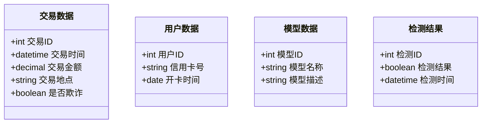
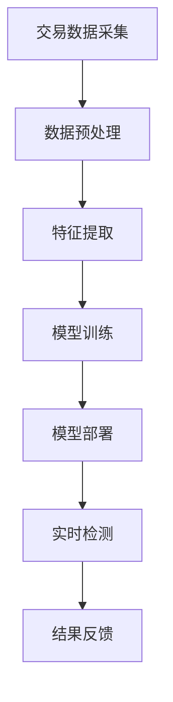
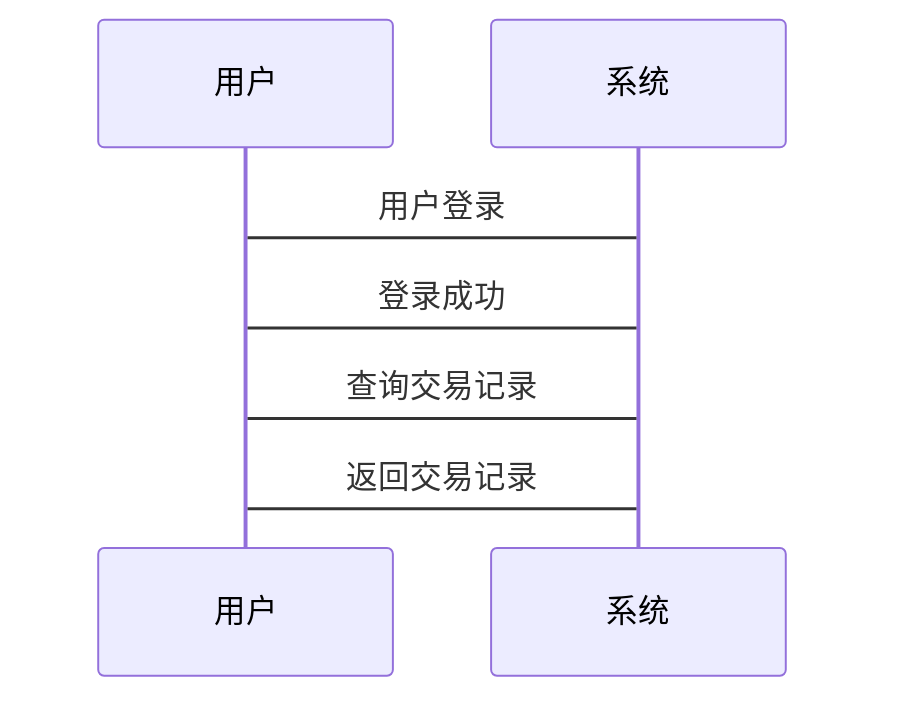
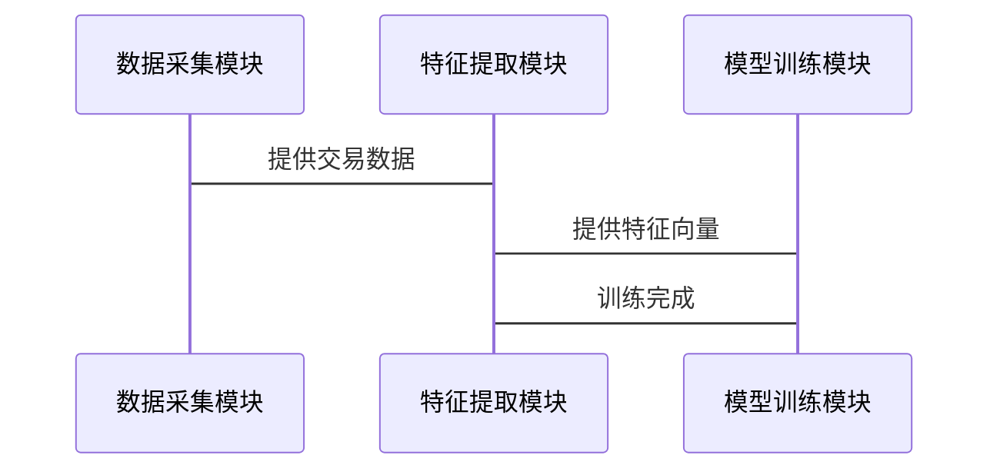

                 


# 智能信用卡欺诈检测系统

## 关键词：智能信用卡、欺诈检测、机器学习、系统架构、数据安全、人工智能

## 摘要：智能信用卡欺诈检测系统通过结合先进的机器学习算法和大数据处理技术，实现对信用卡交易的实时监控和欺诈行为的精准识别。本文从背景介绍、核心概念、算法原理、系统架构到项目实战，全面解析智能信用卡欺诈检测系统的构建与优化。

---

# 第一部分: 智能信用卡欺诈检测系统概述

## 第1章: 智能信用卡欺诈检测系统背景介绍

### 1.1 问题背景

#### 1.1.1 信用卡欺诈的现状与挑战
随着信用卡的普及，欺诈交易的频率和复杂性也在不断增加。根据最新统计，全球每年因信用卡欺诈造成的损失高达数百亿美元。传统的基于规则的欺诈检测方法逐渐暴露出效率低下、误报率高等问题。

#### 1.1.2 传统欺诈检测方法的局限性
传统欺诈检测主要依赖于基于规则的检测方法，例如单一的金额阈值或时间间隔检查。这种方法在处理复杂欺诈模式时显得力不从心，且难以适应欺诈手段的不断进化。

#### 1.1.3 智能化欺诈检测的必要性
为了应对日益复杂的欺诈行为，智能信用卡欺诈检测系统应运而生。通过结合机器学习、大数据分析和实时计算技术，智能系统能够更高效、更准确地识别欺诈交易。

### 1.2 问题描述

#### 1.2.1 信用卡欺诈的定义与分类
信用卡欺诈是指在未经授权的情况下，通过非法手段使用信用卡进行交易的行为。常见的欺诈类型包括盗刷、伪卡交易、账单分期欺诈等。

#### 1.2.2 欺诈交易的特征分析
欺诈交易通常具有以下特征：交易金额异常、交易时间集中、交易地点异常、交易行为模式异常等。

#### 1.2.3 智能检测系统的目标与边界
智能信用卡欺诈检测系统的目标是通过实时或近实时的交易数据分析，识别潜在的欺诈行为，并及时发出预警。系统的边界包括交易数据的采集、特征提取、模型训练与部署等环节。

### 1.3 问题解决

#### 1.3.1 数据驱动的欺诈检测方法
数据驱动的欺诈检测方法通过分析历史交易数据，识别出欺诈交易的模式和特征，从而构建预测模型。

#### 1.3.2 机器学习在欺诈检测中的应用
机器学习算法（如逻辑回归、随机森林、神经网络等）能够从大量数据中提取非线性特征，提高欺诈检测的准确率。

#### 1.3.3 系统设计的核心要素与组成
智能信用卡欺诈检测系统的核心要素包括数据采集模块、特征工程模块、模型训练模块、实时检测模块和结果反馈模块。

### 1.4 概念结构与核心要素

#### 1.4.1 智能检测系统的组成模块
智能检测系统由数据采集、特征提取、模型训练、实时检测和结果反馈五个模块组成。

#### 1.4.2 数据流与信息处理流程
数据从交易系统采集后，经过特征提取、模型训练等步骤，最终生成欺诈检测结果并反馈给交易系统。

#### 1.4.3 系统功能与性能指标
系统功能包括数据采集、特征提取、模型训练、实时检测和结果反馈。性能指标包括检测准确率、召回率、误报率和处理时延等。

## 1.5 本章小结
本章介绍了智能信用卡欺诈检测系统的背景、问题描述和解决方案，为后续章节的深入分析奠定了基础。

---

# 第二部分: 智能信用卡欺诈检测的核心概念与联系

## 第2章: 智能信用卡欺诈检测的核心概念与联系

### 2.1 核心概念原理

#### 2.1.1 欺诈检测的定义与分类
欺诈检测是指通过分析交易数据，识别潜在的欺诈行为。根据检测方法的不同，可以分为基于规则的检测和基于机器学习的检测。

#### 2.1.2 机器学习在欺诈检测中的应用原理
机器学习通过训练模型，从历史数据中学习欺诈交易的特征，从而实现对新交易的分类和预测。

#### 2.1.3 数据特征与模型选择的关系
数据特征的选择直接影响模型的性能。常用的特征包括交易金额、时间间隔、地理位置、交易类型等。

### 2.2 核心概念属性特征对比

#### 2.2.1 不同检测方法的特征对比
| 方法 | 优点 | 缺点 |
|------|------|------|
| 基于规则的检测 | 实现简单 | 难以应对复杂的欺诈模式 |
| 机器学习检测 | 准确率高 | 需要大量数据训练 |

#### 2.2.2 数据特征与模型性能的关系
特征选择的合理性直接影响模型的性能。例如，交易时间间隔的分布特征可以帮助识别异常交易。

#### 2.2.3 系统性能指标的对比分析
| 指标 | 定义 | 重要性 |
|------|------|------|
| 准确率 | 正确分类的交易比例 | 高准确率可以减少误报 |
| 召回率 | 检测到的欺诈交易比例 | 高召回率可以减少漏检 |

### 2.3 ER实体关系图架构

```mermaid
erDiagram
    user信用卡用户 {
        key 用户ID
        +string 姓名
        +string 身份证号
        +string 信用卡号
        +date 开卡时间
        +status 用户状态
    }
    transaction交易记录 {
        key 交易ID
        +datetime 交易时间
        +decimal 交易金额
        +string 交易地点
        +string 交易类型
        +boolean 是否欺诈
    }
    model模型 {
        key 模型ID
        +string 模型名称
        +string 模型描述
        +date 创建时间
    }
    link 用户-交易 {
        +string 用户ID
        +string 交易ID
        +datetime 关联时间
    }
    link 模型-交易 {
        +string 模型ID
        +string 交易ID
        +boolean 检测结果
    }
```

---

# 第三部分: 智能信用卡欺诈检测系统的算法原理

## 第3章: 算法原理

### 3.1 逻辑回归算法

#### 3.1.1 算法原理
逻辑回归是一种用于分类的经典算法。其核心思想是通过sigmoid函数将线性回归的结果映射到概率空间，从而实现二分类。

#### 3.1.2 算法实现
以下是逻辑回归的Python实现示例：

```python
import numpy as np

def sigmoid(x):
    return 1 / (1 + np.exp(-x))

def logit_regression(X, y, learning_rate=0.01, iterations=100):
    theta = np.zeros(X.shape[1])
    for _ in range(iterations):
        z = np.dot(X, theta)
        h = sigmoid(z)
        gradient = np.dot(X.T, (h - y)) / len(y)
        theta -= learning_rate * gradient
    return theta

# 示例数据
X = np.array([[1, 2], [3, 4], [5, 6]])
y = np.array([0, 1, 1])

theta = logit_regression(X, y)
print(theta)
```

#### 3.1.3 数学模型
逻辑回归的数学模型如下：

$$ P(y=1|x) = \frac{1}{1 + e^{-\theta^T x}} $$

---

### 3.2 随机森林算法

#### 3.2.1 算法原理
随机森林是一种基于决策树的集成学习算法。通过构建多棵决策树并进行投票或加权平均，随机森林可以有效提高模型的准确率和鲁棒性。

#### 3.2.2 算法实现
以下是随机森林的Python实现示例：

```python
from sklearn.ensemble import RandomForestClassifier

# 示例数据
X = [[1, 2], [3, 4], [5, 6]]
y = [0, 1, 1]

model = RandomForestClassifier(n_estimators=3)
model.fit(X, y)

print(model.predict(X))
```

#### 3.2.3 数学模型
随机森林通过特征重要性分析，可以识别出对欺诈检测最关键的特征。

---

### 3.3 神经网络算法

#### 3.3.1 算法原理
神经网络是一种模仿人脑结构的深度学习算法。通过多层神经元的组合，神经网络可以学习复杂的非线性特征。

#### 3.3.2 算法实现
以下是神经网络的Python实现示例：

```python
import tensorflow as tf

# 示例数据
X = [[1, 2], [3, 4], [5, 6]]
y = [0, 1, 1]

model = tf.keras.Sequential([
    tf.keras.layers.Dense(4, activation='relu'),
    tf.keras.layers.Dense(1, activation='sigmoid')
])

model.compile(optimizer='adam', loss='binary_crossentropy', metrics=['accuracy'])
model.fit(X, y, epochs=100)
```

#### 3.3.3 数学模型
神经网络的数学模型包括输入层、隐藏层和输出层，通过激活函数和损失函数实现非线性分类。

---

# 第四部分: 智能信用卡欺诈检测系统的系统分析与架构设计

## 第4章: 系统分析与架构设计

### 4.1 项目背景

#### 4.1.1 项目目标
构建一个高效的智能信用卡欺诈检测系统，实现对信用卡交易的实时监控和欺诈行为的精准识别。

#### 4.1.2 项目范围
系统需要处理大规模的交易数据，支持多种机器学习算法，并实现实时检测和结果反馈。

### 4.2 系统功能设计

#### 4.2.1 领域模型类图


#### 4.2.2 系统架构图


### 4.3 系统接口设计

#### 4.3.1 用户接口
- 登录与退出
- 交易查询
- 检测结果查看

#### 4.3.2 系统接口
- 数据采集接口
- 模型训练接口
- 实时检测接口

### 4.4 系统交互流程

#### 4.4.1 用户登录流程


#### 4.4.2 模型训练流程


---

# 第五部分: 智能信用卡欺诈检测系统的项目实战

## 第5章: 项目实战

### 5.1 环境安装

#### 5.1.1 安装Python
```bash
python --version
pip install --upgrade pip
```

#### 5.1.2 安装依赖库
```bash
pip install numpy pandas scikit-learn tensorflow
```

### 5.2 核心代码实现

#### 5.2.1 数据预处理
```python
import pandas as pd

# 加载数据
df = pd.read_csv('credit_card_trans.csv')

# 数据清洗
df.dropna(inplace=True)

# 特征提取
X = df.drop('is_fraud', axis=1)
y = df['is_fraud']
```

#### 5.2.2 模型训练
```python
from sklearn.ensemble import RandomForestClassifier

model = RandomForestClassifier()
model.fit(X, y)
```

#### 5.2.3 模型评估
```python
from sklearn.metrics import accuracy_score

y_pred = model.predict(X)
print(accuracy_score(y, y_pred))
```

### 5.3 实际案例分析

#### 5.3.1 案例背景
某信用卡用户在短时间内发生了多笔异常交易，系统需要识别并标记这些交易为欺诈。

#### 5.3.2 数据分析
交易金额、交易时间间隔、交易地点等特征可以帮助识别异常交易。

#### 5.3.3 模型预测
模型预测结果显示，这些交易的欺诈概率较高，系统发出欺诈预警。

### 5.4 项目小结
通过实际案例分析，可以验证智能信用卡欺诈检测系统的有效性和准确性。

---

# 第六部分: 智能信用卡欺诈检测系统的最佳实践

## 第6章: 最佳实践

### 6.1 系统优化

#### 6.1.1 特征工程优化
选择更有效的特征，例如使用PCA进行降维。

#### 6.1.2 模型调优
通过网格搜索等方法优化模型参数，提高检测准确率。

### 6.2 系统部署

#### 6.2.1 线上部署
将模型部署到云平台，实现实时检测。

#### 6.2.2 监控与维护
实时监控系统性能，定期更新模型。

### 6.3 法律与合规性

#### 6.3.1 数据隐私保护
确保交易数据的安全性和隐私性。

#### 6.3.2 合规性要求
符合相关法律法规，避免法律风险。

## 6.4 小结

智能信用卡欺诈检测系统的构建与优化是一个复杂而重要的任务。通过本文的分析，我们可以更好地理解如何利用机器学习技术提升欺诈检测的准确率和效率。

---

# 作者

作者：AI天才研究院/AI Genius Institute & 禅与计算机程序设计艺术/Zen And The Art of Computer Programming

