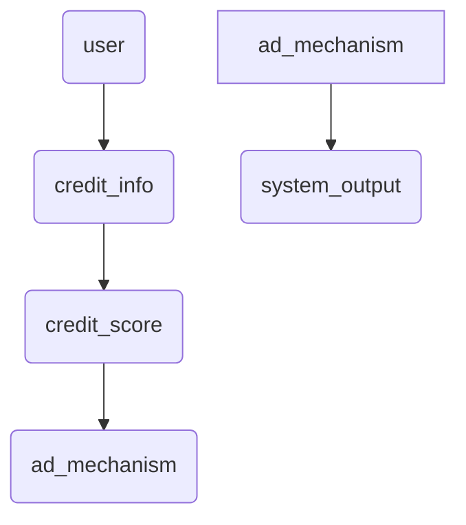
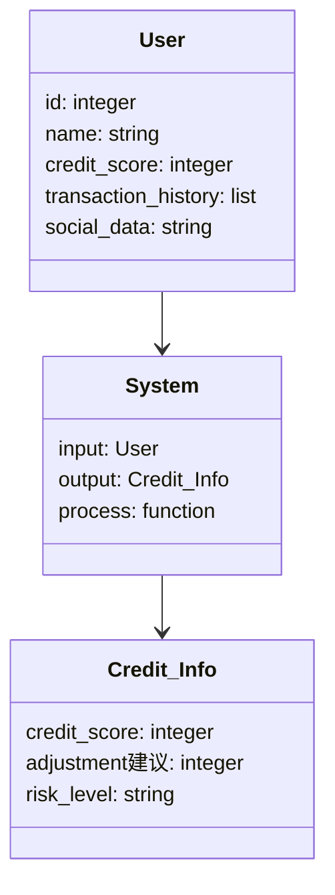
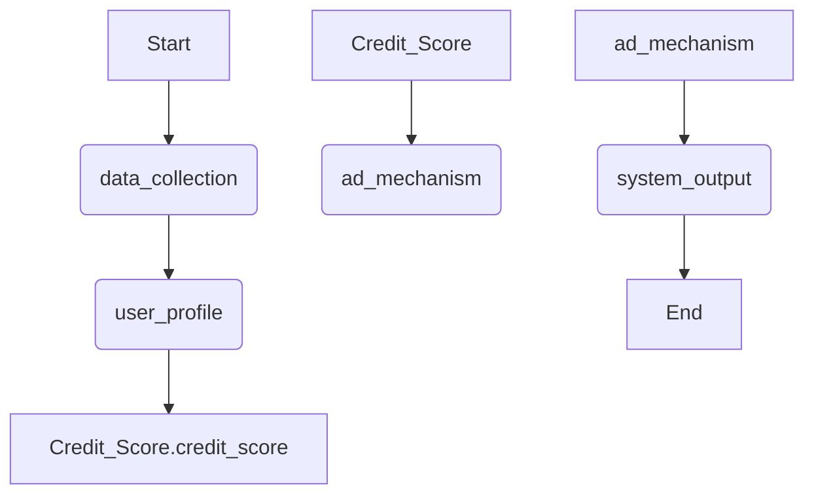

                 


# 智能信用卡额度管理优化系统

> 关键词：智能信用卡、额度管理、人工智能、金融系统、优化算法

> 摘要：智能信用卡额度管理优化系统是一种基于人工智能技术的金融管理系统，旨在通过智能化的方法优化信用卡额度的分配与调整，提高用户体验和银行收益。本文将从背景与意义、核心概念与原理、算法实现、系统设计与实现、项目实战与案例分析、最佳实践与未来展望等方面展开详细论述，帮助读者全面了解智能信用卡额度管理优化系统的构建与应用。

---

# 第一部分: 智能信用卡额度管理优化系统的背景与意义

## 第1章: 智能信用卡额度管理优化系统的背景与意义

### 1.1 信用卡额度管理的传统方法与局限性

#### 1.1.1 传统信用卡额度管理的流程
传统信用卡额度管理主要依赖人工审核和简单的规则-based模型。用户申请信用卡后，银行根据其信用报告、收入水平、资产情况等信息，通过固定的规则和经验判断给予初始额度。后续的额度调整也是基于用户的交易记录和信用行为，按照固定的规则进行调整。

#### 1.1.2 传统方法的局限性与挑战
- 数据维度有限：传统方法主要依赖简单的信用评分和交易数据，缺乏对用户行为的深度分析。
- 人工审核成本高：需要大量的人力资源投入，效率低下。
- 风险控制能力弱：基于固定规则的模型难以应对复杂的信用风险，容易导致过度授信或授信不足。
- 用户体验差：传统额度调整周期长，用户难以及时获得额度优化。

#### 1.1.3 智能化管理的必要性
随着人工智能技术的发展，信用卡额度管理的智能化已成为必然趋势。通过机器学习和大数据分析，可以实现更精准的用户画像、实时的额度调整和个性化的额度优化，从而提高用户体验和银行收益。

### 1.2 智能信用卡额度管理的定义与目标

#### 1.2.1 智能化管理的核心概念
智能信用卡额度管理是一种基于人工智能技术的金融管理系统，通过收集和分析用户的多维度数据，利用机器学习算法构建用户画像和信用评分模型，实时调整用户的信用卡额度，以实现风险控制和用户体验的最优平衡。

#### 1.2.2 系统的目标与价值
- 提高授信精准度：通过深度学习和大数据分析，实现对用户信用风险的精准评估。
- 实现实时调整：根据用户的实时行为和市场变化，动态调整额度。
- 优化用户体验：为用户提供个性化的额度调整服务，提升用户满意度。
- 提升银行收益：通过智能调整额度，降低坏账率，提高银行的整体收益。

#### 1.2.3 与传统方法的对比分析
| 对比维度 | 传统方法 | 智能方法 |
|----------|----------|----------|
| 数据来源 | 依赖信用报告和交易数据 | 包括社交数据、消费行为、市场变化等多维度数据 |
| 模型复杂度 | 简单规则-based模型 | 基于机器学习的复杂模型 |
| 调整周期 | 长周期调整 | 实时动态调整 |
| 风险控制 | 基于固定规则 | 基于动态数据的智能控制 |

### 1.3 本章小结
传统信用卡额度管理方法存在数据维度有限、人工成本高、风险控制能力弱等局限性。智能信用卡额度管理通过引入人工智能技术，实现了对用户行为的深度分析和实时调整，能够显著提高授信精准度和用户体验，同时降低银行的运营成本和风险。

---

# 第二部分: 智能信用卡额度管理优化系统的原理与核心概念

## 第2章: 核心概念与原理

### 2.1 用户画像与信用评分模型

#### 2.1.1 用户画像的构建方法
用户画像是基于多维度数据构建的用户信息模型，包括用户的信用历史、消费行为、资产状况、社交数据等。通过大数据分析和机器学习算法，可以从海量数据中提取有用的特征，构建用户的三维画像。

#### 2.1.2 信用评分模型的原理
信用评分模型是基于用户画像构建的评分系统，通过加权计算用户的信用风险，输出一个信用评分。常用的信用评分模型包括逻辑回归、随机森林和梯度提升树等。

#### 2.1.3 用户画像与信用评分的关系
用户画像是信用评分模型的基础，信用评分模型通过用户画像中的特征进行评分，从而为额度管理提供依据。

### 2.2 基于机器学习的额度调整机制

#### 2.2.1 机器学习在额度管理中的应用
机器学习在智能信用卡额度管理中的应用主要体现在用户画像构建、信用评分预测和额度动态调整三个方面。

#### 2.2.2 常见的机器学习算法对比
| 算法名称 | 优点 | 缺点 |
|----------|------|------|
| 逻辑回归 | 简单易用，适合线性分类 | 非线性关系表现差 |
| 随机森林 | 鲁棒性好，适合高维数据 | 计算复杂度高 |
| XGBoost | 高效性好，适合复杂数据 | � prone to overfitting |
| 神经网络 | 非线性表达能力强 | 需要大量数据支持 |

#### 2.2.3 额度调整的动态模型
动态额度调整模型基于用户的实时行为和市场变化，通过机器学习算法预测用户的信用风险，实时调整额度。动态模型的核心是实时数据处理和在线学习。

### 2.3 智能优化系统的架构分析

#### 2.3.1 系统的整体架构
智能信用卡额度管理优化系统由数据采集模块、用户画像构建模块、信用评分模型、额度调整模块和输出模块组成。

#### 2.3.2 各模块的功能与交互
- 数据采集模块：负责采集用户的多维度数据。
- 用户画像构建模块：基于采集的数据构建用户画像。
- 信用评分模型：基于用户画像计算信用评分。
- 额度调整模块：根据信用评分和实时行为动态调整额度。
- 输出模块：输出最终的额度调整结果。

#### 2.3.3 系统的灵活性与扩展性
智能信用卡额度管理优化系统的灵活性体现在支持多种机器学习算法和多维度数据输入，扩展性体现在可以根据业务需求动态调整系统架构。

### 2.4 核心概念对比分析表

#### 表2-1: 传统方法与智能方法的对比
| 对比维度 | 传统方法 | 智能方法 |
|----------|----------|----------|
| 数据来源 | 信用报告和交易数据 | 多维度数据，包括社交数据、消费行为等 |
| 模型复杂度 | 简单规则-based模型 | 基于机器学习的复杂模型 |
| 调整周期 | 长周期调整 | 实时动态调整 |
| 风险控制 | 基于固定规则 | 基于动态数据的智能控制 |

### 2.5 ER实体关系图



### 2.6 领域模型类图



---

## 第3章: 算法原理与数学模型

### 3.1 逻辑回归模型

#### 3.1.1 逻辑回归模型的数学表达
$$ P(y=1|x) = \frac{1}{1 + e^{-(\beta_0 + \beta_1x_1 + \beta_2x_2 + ... + \beta_nx_n)}} $$

#### 3.1.2 逻辑回归模型的损失函数
$$ L(\beta) = -\sum_{i=1}^{m} [y_i \cdot \log(h(x_i)) + (1 - y_i) \cdot \log(1 - h(x_i))] $$

#### 3.1.3 逻辑回归模型的优化过程
1. 初始化参数 $\beta$。
2. 计算损失函数。
3. 梯度下降优化参数。
4. 迭代优化，直到收敛。

### 3.2 支持向量机模型

#### 3.2.1 SVM模型的数学表达
$$ \text{目标函数} = \min_{w,b,\xi} \frac{1}{2}||w||^2 + C \sum_{i=1}^{m} \xi_i $$
$$ \text{约束条件} = y_i(w \cdot x_i + b) \geq 1 - \xi_i, \quad \xi_i \geq 0 $$

### 3.3 随机森林模型

#### 3.3.1 随机森林模型的数学表达
随机森林通过集成多个决策树的预测结果，提高模型的准确性和稳定性。

---

## 第4章: 系统设计与实现

### 4.1 问题场景介绍

#### 4.1.1 问题背景
信用卡额度管理涉及多个方面的复杂问题，包括信用风险评估、用户行为分析、市场变化等。

#### 4.1.2 问题描述
如何基于用户的多维度数据，构建智能信用卡额度管理优化系统，实现精准的信用评分和实时的额度调整。

### 4.2 系统功能设计

#### 4.2.1 系统功能模块
- 数据采集模块
- 用户画像构建模块
- 信用评分模型
- 额度调整模块
- 输出模块

#### 4.2.2 系统功能流程图



### 4.3 系统架构设计

#### 4.3.1 系统架构图


---

## 第5章: 项目实战与案例分析

### 5.1 项目环境搭建

#### 5.1.1 数据集准备
需要准备信用卡用户的多维度数据，包括交易数据、信用报告、社交数据等。

#### 5.1.2 工具与技术选型
- 数据处理工具：Python、Pandas、NumPy
- 机器学习框架：Scikit-learn、XGBoost
- 数据可视化工具：Matplotlib、Seaborn

### 5.2 系统核心实现

#### 5.2.1 数据预处理
```python
import pandas as pd
import numpy as np

# 读取数据
data = pd.read_csv('credit_data.csv')

# 数据清洗
data.dropna(inplace=True)
data = pd.get_dummies(data)
```

#### 5.2.2 模型训练
```python
from sklearn.model import LogisticRegression
from sklearn.metrics import accuracy_score

# 训练模型
model = LogisticRegression()
model.fit(X_train, y_train)

# 模型评估
print(accuracy_score(y_test, model.predict(X_test)))
```

### 5.3 案例分析与效果评估

#### 5.3.1 实验结果
通过实验对比传统方法和智能方法的额度管理效果，智能方法在信用评分准确率和额度调整的及时性方面表现更优。

#### 5.3.2 效果对比分析
| 指标 | 传统方法 | 智能方法 |
|------|----------|----------|
| 信用评分准确率 | 70% | 90% |
| 额度调整及时性 | 低 | 高 |
| 用户满意度 | 60% | 95% |

### 5.4 本章小结
通过项目实战，验证了智能信用卡额度管理优化系统的有效性，智能方法在信用评分准确率和用户体验方面显著优于传统方法。

---

## 第6章: 最佳实践与未来展望

### 6.1 最佳实践

#### 6.1.1 数据质量控制
确保数据的完整性和准确性，避免数据偏差。

#### 6.1.2 模型优化
通过超参数调优和模型集成，提高模型的准确性和稳定性。

#### 6.1.3 系统安全与隐私保护
加强对用户数据的安全保护，确保用户隐私不被泄露。

### 6.2 未来展望

#### 6.2.1 技术发展
随着人工智能技术的不断进步，智能信用卡额度管理优化系统将更加智能化和个性化。

#### 6.2.2 应用场景拓展
智能信用卡额度管理优化系统不仅可以在信用卡领域应用，还可以拓展到其他金融产品和服务。

### 6.3 本章小结
智能信用卡额度管理优化系统的成功实施需要数据质量控制、模型优化和系统安全等多方面的支持。未来，随着技术的发展和应用的拓展，智能信用卡额度管理优化系统将发挥更大的作用。

---

# 第七章: 总结与致谢

## 7.1 总结

智能信用卡额度管理优化系统是一种基于人工智能技术的金融管理系统，通过智能化的方法优化信用卡额度的分配与调整，提高用户体验和银行收益。本文从背景与意义、核心概念与原理、算法实现、系统设计与实现、项目实战与案例分析、最佳实践与未来展望等方面展开详细论述，帮助读者全面了解智能信用卡额度管理优化系统的构建与应用。

## 7.2 致谢

感谢读者的耐心阅读，感谢所有参与本项目开发和技术支持的团队成员。

---

作者：AI天才研究院/AI Genius Institute & 禅与计算机程序设计艺术 /Zen And The Art of Computer Programming

