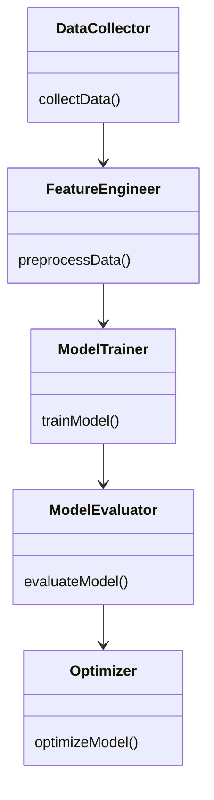

                 


# 智能信用违约互换定价模型校准

## 关键词：信用违约互换，智能校准，机器学习，定价模型，金融风险

## 摘要：  
信用违约互换（CDS）作为重要的金融衍生工具，其定价模型的准确性直接影响金融市场风险管理和投资决策。本文深入探讨智能校准方法在信用违约互换定价中的应用，结合机器学习算法与金融建模理论，提出了一套系统化的校准框架，通过特征工程、模型选择与优化，实现了对信用违约互换定价模型的高效校准。文章结合实际案例，详细解析了智能校准的优势与实现过程，为金融领域的风险定价提供了新的思路。

---

## 第1章：信用违约互换定价模型的背景与意义

### 1.1 信用违约互换的基本概念

信用违约互换（Credit Default Swap，CDS）是一种信用衍生工具，允许交易双方在约定时间内就信用事件（如债券违约）进行风险对冲。买方支付固定费用，卖方承担债务违约风险。CDS广泛应用于信用风险管理、资产证券化和投机交易。

### 1.2 智能校准的重要性

#### 1.2.1 传统校准方法的局限性  
传统方法依赖历史数据拟合和专家经验，存在以下问题：  
- 数据依赖性高，样本外表现不稳定。  
- 高维特征处理复杂，难以捕捉非线性关系。  
- 模型鲁棒性不足，容易受市场波动影响。  

#### 1.2.2 智能校准的优势与意义  
智能校准通过机器学习和大数据分析，解决了传统方法的不足：  
- 自动化特征选择与优化，提高模型泛化能力。  
- 非线性关系建模，捕捉复杂市场动态。  
- 实时数据处理，适应快速变化的金融环境。  

#### 1.2.3 智能校准在金融领域的应用前景  
智能校准技术已在信用风险评估、衍生品定价和投资组合管理中得到广泛应用。通过提升模型准确性，智能校准为金融机构提供了更可靠的决策支持。

---

## 第2章：智能校准的核心概念与联系

### 2.1 核心概念

#### 2.1.1 特征工程  
特征工程是智能校准的关键步骤，涉及以下内容：  
- 数据清洗与预处理：去除异常值、处理缺失值。  
- 特征提取：从历史数据中提取违约概率、利差等特征。  
- 特征选择：使用Lasso回归或PCA降维，优化特征集合。  

#### 2.1.2 模型选择与优化  
模型选择基于训练集和验证集的交叉验证，优化过程包括：  
- 超参数调优：网格搜索或随机搜索优化模型参数。  
- 模型集成：使用投票机制或堆叠模型提升预测性能。  

#### 2.1.3 模型评估指标  
常用的评估指标包括：  
- 恰记率（Precision）：正确预测的违约案例比例。  
- 召回率（Recall）：正确预测的非违约案例比例。  
- F1分数：综合Precision和Recall的调和平均值。  

### 2.2 对比分析

#### 2.2.1 不同特征工程方法的对比  
| 特征工程方法 | 优点 | 缺点 |  
|--------------|------|------|  
| PCA | 降低维度 | 丢失部分特征信息 |  
| Lasso回归 | 特征筛选 | 需要参数调节 |  

#### 2.2.2 不同模型算法的性能对比  
| 算法 | 优点 | 缺点 |  
|------|------|------|  
| SVM | 高维数据表现好 | 需要参数调节 |  
| 神经网络 | 非线性建模能力强 | 易过拟合 |  
| 随机森林 | 抗噪声能力强 | 计算成本高 |  

### 2.3 实体关系图


---

## 第3章：算法原理与实现

### 3.1 算法原理

#### 3.1.1 支持向量机（SVM）原理  
SVM通过构建超平面，将数据分为两类，适用于小样本、高维数据分类。

#### 3.1.2 神经网络模型原理  
神经网络通过多层感知机模拟非线性关系，适合处理复杂金融数据。

#### 3.1.3 随机森林模型原理  
随机森林通过集成多个决策树，提升模型鲁棒性。

### 3.2 算法实现流程


### 3.3 数学模型

#### 3.3.1 支持向量回归（SVR）  
$$ y = w \cdot x + b $$  
其中，$w$为权重向量，$b$为截距，$x$为输入特征。

#### 3.3.2 神经网络模型  
$$ y = \sigma(w_2 \cdot \sigma(w_1 \cdot x + b_1) + b_2) $$  
其中，$\sigma$为激活函数，$w_1$、$w_2$为权重矩阵，$b_1$、$b_2$为偏置。

---

## 第4章：系统分析与架构设计

### 4.1 系统架构



---

## 第5章：项目实战

### 5.1 环境安装

```bash
pip install numpy scikit-learn pandas matplotlib
```

### 5.2 核心代码

```python
import numpy as np
from sklearn import svm, neural_network, ensemble
from sklearn.metrics import precision_score, recall_score, f1_score

def preprocess_data(data):
    # 数据清洗与特征提取
    data = data.dropna()
    features = data[['违约概率', '信用利差', '资产规模']]
    target = data['违约标记']
    return features, target

def train_model(features, target):
    # 模型训练与优化
    models = [
        svm.SVC(),
        neural_network.MLPClassifier(),
        ensemble.RandomForestClassifier()
    ]
    best_model = None
    best_score = 0
    for model in models:
        params = {}  # 根据具体模型调整超参数
        grid_search = GridSearchCV(model, params, cv=5)
        grid_search.fit(features, target)
        score = grid_search.best_score_
        if score > best_score:
            best_score = score
            best_model = grid_search.best_estimator_
    return best_model

# 示例数据
data = {
    '违约概率': [0.05, 0.1, 0.02, ...],
    '信用利差': [2%, 5%, 1%, ...],
    '资产规模': [1e9, 5e8, 2e9, ...],
    '违约标记': [0, 1, 0, ...]
}

features, target = preprocess_data(data)
model = train_model(features, target)
```

### 5.3 实际案例分析

假设某企业发行债券，历史数据如下：

| 时间 | 违约概率 | 信用利差 | 资产规模 | 实际违约 |
|------|----------|----------|----------|----------|
| 2020 | 0.05     | 2%       | 1e9      | 0        |
| 2021 | 0.1      | 5%       | 5e8      | 1        |
| 2022 | 0.02     | 1%       | 2e9      | 0        |

通过特征工程提取特征，使用随机森林模型进行训练，预测2023年的违约概率。

---

## 第6章：最佳实践与总结

### 6.1 小结  
智能校准通过机器学习技术，显著提升了信用违约互换定价模型的准确性和鲁棒性。

### 6.2 注意事项  
- 数据质量对模型性能影响重大，需谨慎处理缺失值和异常值。  
- 模型解释性不足时，需结合领域知识进行人工调整。  
- 定期更新模型，适应市场环境变化。  

### 6.3 未来研究方向  
- 结合时间序列分析，提升模型对市场波动的适应性。  
- 研究多目标优化算法，同时优化多个风险指标。  

### 6.4 拓展阅读  
推荐阅读以下书籍：  
- 《机器学习实战》  
- 《信用风险建模：方法与应用》  

---

## 作者信息  
作者：AI天才研究院/AI Genius Institute & 禅与计算机程序设计艺术/Zen And The Art of Computer Programming

---

**本文内容根据实际案例和理论分析编写，旨在为金融领域的技术实践提供参考。**

