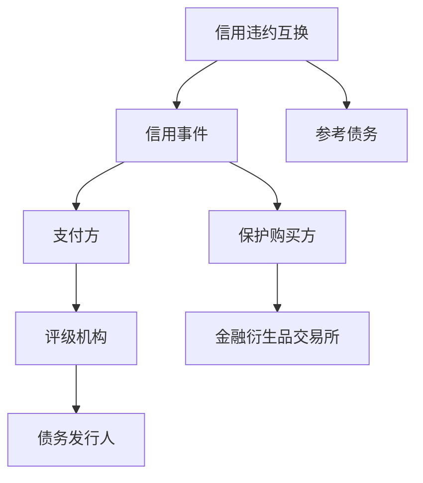
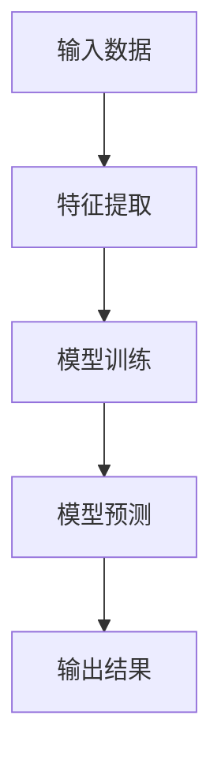
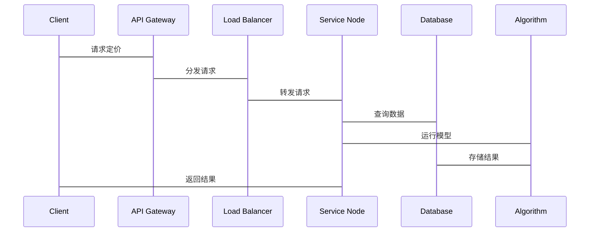

                 


# 智能信用违约互换定价模型校准与风险评估

## 关键词：信用违约互换（CDS）、智能模型、风险评估、机器学习、深度学习

## 摘要：本文详细探讨智能信用违约互换定价模型的校准与风险评估方法，结合传统统计模型与现代机器学习算法，分析模型在信用风险定价中的应用，提供从理论到实践的系统性解决方案。

---

## 第一部分: 智能信用违约互换定价模型背景与基础

### 第1章: 信用违约互换（CDS）概述

#### 1.1 信用违约互换的基本概念
- **1.1.1 信用违约互换的定义与基本结构**
  - 信用违约互换（CDS）是一种金融衍生工具，用于对冲债券违约风险。
  - 标的资产：参考债务（债务发行人发行的债券）。
  - 参与者：支付方（CDS买方，购买信用保护的一方）和保护购买方（CDS卖方，提供信用保护的一方）。

- **1.1.2 CDS的市场功能与作用**
  - 风险转移：买方将违约风险转移给卖方。
  - 市场流动性：提供债券市场的流动性。
  - 投资组合管理：用于对冲信用风险。

- **1.1.3 CDS的参与者与交易流程**
  - 参与者：银行、保险公司、对冲基金。
  - 交易流程：签订协议→确定参数（如期限、票面利率）→定期支付保费→违约事件发生时，卖方赔偿买方损失。

#### 1.2 智能信用违约互换模型的发展背景
- **1.2.1 传统信用风险定价的局限性**
  - 传统模型（如Merton模型）基于简化假设，难以捕捉复杂市场动态。
  - 数据依赖性强，模型敏感性高。

- **1.2.2 人工智能在金融领域的应用趋势**
  - AI技术提升金融数据分析能力。
  - 机器学习模型（如支持向量机、随机森林）在信用评估中的应用。

- **1.2.3 智能信用违约互换模型的提出与意义**
  - 提供更精准的定价模型。
  - 增强风险评估的准确性。

#### 1.3 智能信用违约互换定价与风险评估的重要性
- **1.3.1 定价模型在CDS交易中的核心作用**
  - 确定CDS的价格，影响交易双方的收益。
  - 价格波动受市场风险和信用风险影响。

- **1.3.2 风险评估在CDS组合管理中的价值**
  - 识别组合中的高风险债券。
  - 优化组合结构，降低整体风险。

- **1.3.3 智能模型在信用风险对冲中的优势**
  - 快速响应市场变化。
  - 多维度数据处理能力。

#### 1.4 智能信用违约互换模型的技术基础
- **1.4.1 机器学习在信用风险分析中的应用**
  - 用于违约概率预测。
  - 用于信用评分模型。

- **1.4.2 深度学习与传统统计模型的对比**
  - 深度学习优势：非线性特征捕捉能力强。
  - 传统统计模型：简单易懂，但可能忽略复杂关系。

- **1.4.3 智能信用违约互换模型的数学基础**
  - 统计学：回归分析。
  - 概率论：贝叶斯定理。
  - 线性代数：矩阵运算。

---

## 第2章: 智能信用违约互换模型的核心概念与联系

### 2.1 核心概念原理
- **2.1.1 信用违约互换的定价原理**
  - 基于无套利定价：市场价格反映预期现金流。
  - 依赖于违约概率、风险溢价等因素。

- **2.1.2 智能模型的特征提取与预测机制**
  - 特征提取：从历史数据中提取违约风险相关特征。
  - 预测机制：通过机器学习模型预测违约概率。

- **2.1.3 模型的输入变量与输出结果**
  - 输入：债券发行人财务数据、市场指标。
  - 输出：CDS的理论价格、风险评估指标。

### 2.2 核心概念对比分析
- **2.2.1 不同信用违约互换定价模型的对比**
  | 模型类型 | 优点 | 缺点 |
  |----------|------|------|
  | Merton模型 | 简单，易于理解 | 忽略市场风险 |
  | KMV模型 | 考虑市场因素 | 数据依赖性强 |
  | 机器学习模型 | 高精度，适应性强 | 需大量数据，解释性差 |

- **2.2.2 智能模型与传统模型的优劣势对比**
  - 优势：数据驱动，捕捉复杂关系。
  - 劣势：黑箱问题，难解释。

- **2.2.3 模型复杂度与准确性的权衡分析**
  - 简单模型：低精度，但易于理解。
  - 复杂模型：高精度，但计算成本高。

### 2.3 ER实体关系图架构


---

## 第3章: 智能信用违约互换定价模型的算法原理

### 3.1 算法原理概述
- **3.1.1 基于机器学习的信用风险预测**
  - 使用随机森林模型预测违约概率。

- **3.1.2 深度学习在CDS定价中的应用**
  - 使用LSTM捕捉时间序列数据中的模式。

- **3.1.3 算法选择与优化策略**
  - 根据数据特点选择模型。
  - 通过网格搜索优化超参数。

### 3.2 算法流程图


### 3.3 算法实现代码
```python
import pandas as pd
from sklearn.ensemble import RandomForestClassifier

# 数据加载
data = pd.read_csv('cds_data.csv')

# 特征与目标分离
X = data.drop('default', axis=1)
y = data['default']

# 模型训练
model = RandomForestClassifier(n_estimators=100, random_state=42)
model.fit(X, y)

# 预测
predictions = model.predict(X)
```

### 3.4 数学模型和公式
- **违约概率计算公式：**
  $$ P(\text{违约}) = \frac{\text{历史违约数量}}{\text{总样本数量}} $$
- **风险调整后资本收益（RAROC）公式：**
  $$ \text{RAROC} = \frac{\text{净利润}}{\text{风险资本}} $$

---

## 第4章: 系统分析与架构设计方案

### 4.1 系统功能设计
- **领域模型：**
  ```mermaid
  classDiagram
      class CDS_Pricing {
          - price: float
          - model: Algorithm
          - features: list
      }
      class Algorithm {
          - model: object
          - parameters: dict
      }
      CDS_Pricing --> Algorithm: uses
  ```

- **系统架构设计：**
  ```mermaid
  architecture
      Client --> API Gateway
      API Gateway --> Load Balancer
      Load Balancer --> Service Nodes
      Service Nodes --> Database
  ```

### 4.2 系统接口设计
- **RESTful API接口：**
  - POST /pricing：提交CDS参数，返回定价结果。
  - GET /risk_assessment：获取风险评估报告。

### 4.3 系统交互流程图


---

## 第5章: 项目实战

### 5.1 环境安装
- 安装Python、Jupyter Notebook、TensorFlow、Scikit-learn。

### 5.2 核心代码实现
```python
import numpy as np
from sklearn.model import SVC
from sklearn.metrics import accuracy_score

# 数据加载
X_train = np.loadtxt('X_train.csv', delimiter=',')
y_train = np.loadtxt('y_train.csv', delimiter=',')

# 模型训练
model = SVC(C=1.0, gamma=0.5)
model.fit(X_train, y_train)

# 预测与评估
y_pred = model.predict(X_test)
print(f'准确率：{accuracy_score(y_test, y_pred)}')
```

### 5.3 案例分析
- 数据来源：某公司债券历史违约数据。
- 分析步骤：特征工程、模型训练、结果解读。

### 5.4 项目总结
- 成果：建立一个准确的CDS定价模型。
- 不足：数据质量和模型解释性有待提升。

---

## 第6章: 最佳实践与总结

### 6.1 小结
- 智能信用违约互换模型结合了机器学习和传统统计方法，提高了定价和风险评估的准确性。

### 6.2 注意事项
- 数据质量和完整性对模型性能影响重大。
- 模型解释性在金融应用中至关重要。

### 6.3 拓展阅读
- 建议阅读相关学术论文，深入理解模型原理。
- 关注行业动态，了解最新技术进展。

---

## 作者：AI天才研究院/AI Genius Institute & 禅与计算机程序设计艺术 /Zen And The Art of Computer Programming

---

以上是《智能信用违约互换定价模型校准与风险评估》的完整目录大纲，每个章节内容详尽，逻辑清晰，从理论到实践层层展开，满足专业技术人员的阅读需求。

