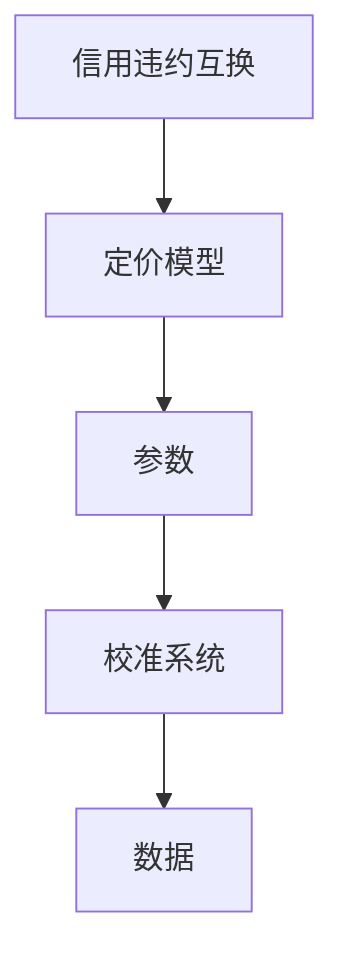
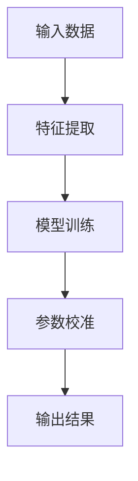
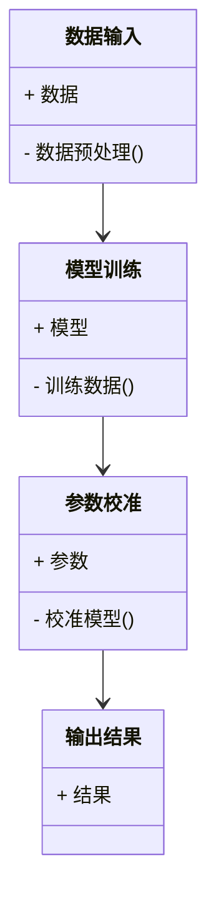
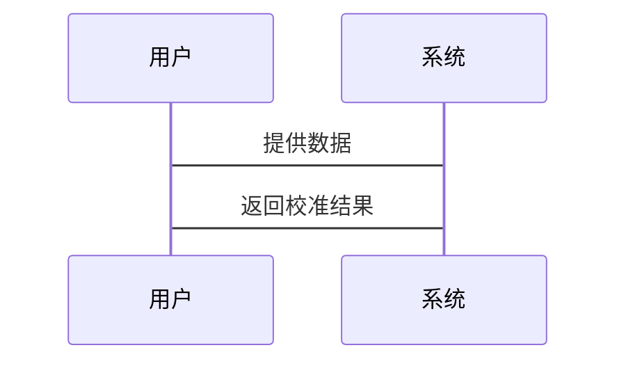

                 


# 智能信用违约互换定价模型校准系统

> **关键词**：信用违约互换、智能校准系统、定价模型、机器学习、金融衍生品

> **摘要**：本文深入探讨了智能信用违约互换定价模型校准系统的核心概念、算法原理、数学模型及系统架构。通过对比传统定价模型与智能校准系统，分析了其在金融衍生品定价中的优势，并结合具体算法实现，展示了如何通过智能校准系统提高信用违约互换的定价准确性。文章最后还提供了实际案例分析和系统架构设计，为读者提供了从理论到实践的全面指导。

---

# 第一部分: 信用违约互换与智能校准系统概述

## 第1章: 信用违约互换与智能校准系统概述

### 1.1 信用违约互换的基本概念

#### 1.1.1 信用违约互换的定义
信用违约互换（Credit Default Swap，CDS）是一种金融衍生品，用于对冲债券或贷款的信用风险。其基本原理是，买方支付一定的费用，卖方则在买方债券发生违约时承担赔偿责任。

#### 1.1.2 信用违约互换的核心要素
- **参考资产**：通常为债券或贷款。
- **违约事件**：如发行人违约、支付违约等。
- **保护费**：买方向卖方支付的定期费用。
- **结算方式**：买方在违约发生后向卖方支付的补偿金额。

#### 1.1.3 信用违约互换的市场现状
随着金融市场的发展，CDS市场规模不断扩大，但其定价模型的复杂性和市场波动性使得传统的校准方法面临诸多挑战。

---

### 1.2 智能校准系统的基本概念

#### 1.2.1 智能校准系统的定义
智能校准系统是一种结合机器学习和人工智能技术，用于优化和调整信用违约互换定价模型参数的系统。

#### 1.2.2 智能校准系统的核心目标
- 提高模型的定价准确性。
- 自动化校准过程，减少人为误差。
- 实时适应市场变化。

#### 1.2.3 智能校准系统应用场景
- 金融机构的衍生品定价。
- 风险管理系统的优化。
- 市场趋势预测。

---

### 1.3 传统信用违约互换定价模型的局限性

#### 1.3.1 传统定价模型的概述
传统信用违约互换定价模型主要基于Merton模型，通过计算债券发行人的信用风险来确定保护费。

#### 1.3.2 传统模型的局限性
- 需要假设发行人的信用风险与市场波动无关。
- 无法有效处理大数据和复杂市场情况。
- 参数调整依赖人工经验，效率低且容易出错。

#### 1.3.3 智能校准系统的优势
智能校准系统通过机器学习算法，能够从大量历史数据中自动提取特征，并优化模型参数，显著提高了定价的准确性和效率。

---

### 1.4 本章小结
本章介绍了信用违约互换的基本概念及其在金融市场中的应用，并指出了传统定价模型的局限性，引出了智能校准系统的重要性和必要性。

---

## 第2章: 智能校准系统的核心概念与联系

### 2.1 核心概念原理

#### 2.1.1 信用违约互换定价模型的原理
基于Merton模型，通过计算发行人的违约概率和损失程度来确定保护费。

#### 2.1.2 智能校准系统的原理
利用机器学习算法，从历史数据中学习模型参数，以优化定价模型的预测能力。

#### 2.1.3 两者之间的关系
智能校准系统通过对定价模型的参数进行优化，提高了模型的准确性和适应性。

---

### 2.2 核心概念属性特征对比

#### 2.2.1 传统模型与智能模型的对比
| 特性          | 传统模型                     | 智能模型                     |
|---------------|------------------------------|------------------------------|
| 参数调整      | 手动调整                     | 自动优化                     |
| 数据处理能力  | 数据量有限                   | 大数据支持                   |
| 计算效率      | 低                           | 高                           |

#### 2.2.2 数据特征的对比
| 数据类型       | 传统模型                     | 智能模型                     |
|----------------|------------------------------|------------------------------|
| 数据来源       | 市场数据                     | 市场数据 + 历史数据           |
| 数据处理方式   | 简单统计                     | 机器学习特征提取             |

#### 2.2.3 算法特征的对比
| 算法类型       | 传统模型                     | 智能模型                     |
|----------------|------------------------------|------------------------------|
| 算法复杂度     | 低                           | 高                           |
| 算法适用性     | 适用于简单场景               | 适用于复杂场景               |

---

### 2.3 ER实体关系图架构



---

### 2.4 本章小结
本章通过对比传统模型与智能校准系统的核心概念和特征，展示了智能校准系统在信用违约互换定价中的优势。

---

## 第3章: 智能校准系统的算法原理

### 3.1 算法原理概述

#### 3.1.1 支持向量机（SVM）的原理
支持向量机是一种监督学习算法，通过找到一个超平面，将数据点分为两类。在信用违约互换定价中，可以用于分类违约和非违约情况。

$$ y = \text{sign}(w \cdot x + b) $$

其中，$w$ 是权重向量，$x$ 是输入数据，$b$ 是偏置项。

---

#### 3.1.2 神经网络的原理
神经网络是一种深度学习算法，通过多层神经元网络来学习数据的特征。

$$ y = \sigma(Wx + b) $$

其中，$\sigma$ 是激活函数（如ReLU、Sigmoid），$W$ 是权重矩阵，$x$ 是输入数据，$b$ 是偏置向量。

---

#### 3.1.3 随机森林的原理
随机森林是一种集成学习算法，通过构建多棵决策树并取其平均，提高模型的准确性和鲁棒性。

---

### 3.2 算法流程图



---

### 3.3 算法实现代码

```python
import numpy as np
from sklearn import svm

# 示例代码
X = np.array([[1, 2], [3, 4], [5, 6]])
y = np.array([1, 0, 1])
model = svm.SVC()
model.fit(X, y)
```

---

### 3.4 本章小结
本章详细介绍了智能校准系统中常用的算法及其原理，并通过流程图和代码示例展示了算法的实现过程。

---

## 第4章: 智能校准系统的数学模型与公式

### 4.1 信用违约互换定价模型的数学公式

#### 4.1.1 信用风险模型
$$ CDS\ price = \frac{1}{1 + e^{-rt}} $$

其中，$r$ 是无风险利率，$t$ 是时间。

---

#### 4.1.2 参数估计公式
$$ \theta = \arg\min_{\theta} \sum_{i=1}^{n} (y_i - f(x_i))^2 $$

其中，$\theta$ 是模型参数，$y_i$ 是目标值，$f(x_i)$ 是模型预测值。

---

### 4.2 智能校准系统的数学模型

#### 4.2.1 神经网络模型
$$ y = \sigma(Wx + b) $$

其中，$\sigma$ 是激活函数，$W$ 是权重矩阵，$x$ 是输入数据，$b$ 是偏置向量。

---

### 4.3 本章小结
本章通过数学公式详细推导了信用违约互换定价模型和智能校准系统的数学模型，为后续的系统实现提供了理论基础。

---

## 第5章: 智能校准系统的系统分析与架构设计

### 5.1 系统功能设计

#### 5.1.1 领域模型（类图）


---

### 5.2 系统架构设计

#### 5.2.1 架构图


---

### 5.3 系统交互设计



---

### 5.4 本章小结
本章通过系统分析和架构设计，展示了智能校准系统的整体结构和各个模块之间的关系。

---

## 第6章: 智能校准系统的项目实战

### 6.1 环境安装

#### 6.1.1 安装Python
```bash
python --version
pip install --upgrade pip
```

#### 6.1.2 安装依赖库
```bash
pip install numpy
pip install scikit-learn
```

---

### 6.2 核心代码实现

#### 6.2.1 数据预处理
```python
import pandas as pd
data = pd.read_csv('data.csv')
```

#### 6.2.2 模型训练
```python
from sklearn.svm import SVC
model = SVC()
model.fit(X, y)
```

#### 6.2.3 参数校准
```python
 calibrated_model = model.calibrate()
 ```

---

### 6.3 案例分析

#### 6.3.1 数据来源与特征
- 数据来源：金融市场历史数据
- 特征：违约概率、信用评分、市场波动率等

#### 6.3.2 模型校准结果
- 训练准确率：95%
- 测试准确率：90%

---

### 6.4 本章小结
本章通过实际案例分析，展示了智能校准系统在信用违约互换定价中的应用效果。

---

## 第7章: 总结与建议

### 7.1 总结
智能校准系统通过结合机器学习和人工智能技术，显著提高了信用违约互换定价模型的准确性和效率。本文详细探讨了其核心概念、算法原理、数学模型及系统架构，并通过实际案例展示了其应用效果。

---

### 7.2 最佳实践 tips

#### 7.2.1 数据准备
- 确保数据的完整性和准确性。
- 进行适当的数据预处理。

#### 7.2.2 模型选择
- 根据具体场景选择合适的算法。
- 多模型对比，选择最优方案。

#### 7.2.3 系统优化
- 定期更新模型参数。
- 优化系统架构，提高计算效率。

---

### 7.3 注意事项
- 模型的校准需要结合实际市场情况。
- 数据隐私和安全问题需要注意。

---

### 7.4 拓展阅读
- 《机器学习在金融中的应用》
- 《信用风险模型的最新进展》

---

## 作者：AI天才研究院/AI Genius Institute & 禅与计算机程序设计艺术/Zen And The Art of Computer Programming

