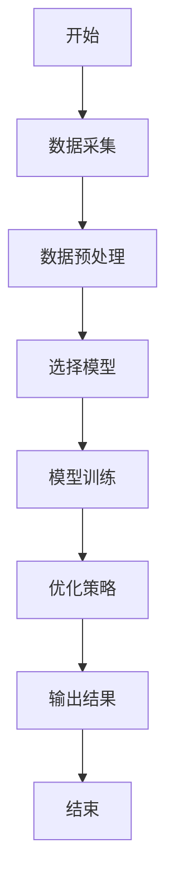
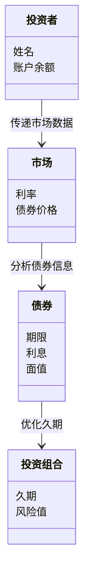
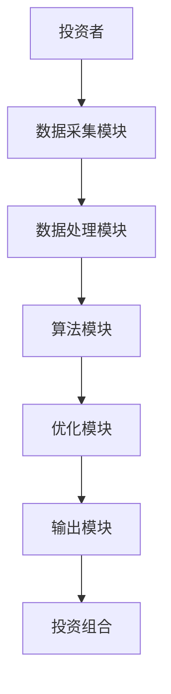
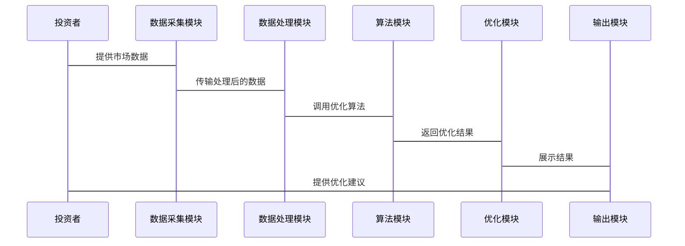

                 


```markdown
# 智能债券投资组合久期管理系统

> 关键词：智能债券投资，久期管理，风险管理，算法优化，系统架构，投资组合

> 摘要：本文探讨智能债券投资组合久期管理系统的构建与应用，通过分析久期管理的核心概念、算法原理和系统架构，提出一种基于强化学习和机器学习的智能化久期管理解决方案，结合实际案例，展示系统的实现与优化过程。

---

# 第1章: 智能债券投资组合久期管理概述

## 1.1 债券投资组合久期管理的背景与意义

### 1.1.1 债券投资的基本概念与特点
债券是一种债务工具，发行人承诺在特定时间内向投资者支付利息和本金。债券投资组合的久期是衡量债券价格对利率变化敏感程度的重要指标，久期越长，债券价格波动越大。

### 1.1.2 久期管理的核心问题与挑战
传统的久期管理依赖人工判断，存在效率低、风险高等问题。随着市场波动加剧，投资组合的久期管理需要更智能化的解决方案。

### 1.1.3 智能化久期管理的必要性与优势
智能化久期管理通过大数据和人工智能技术，能够实时监控市场变化，优化投资组合，降低风险，提高收益。

---

## 1.2 智能债券投资系统的核心概念

### 1.2.1 智能债券投资系统的定义
智能债券投资系统是一种基于人工智能技术的金融管理系统，能够自动分析市场数据，优化债券投资组合的久期。

### 1.2.2 久期管理的关键要素与属性
久期管理的关键要素包括债券的到期时间、票面利率、市场利率、债券价格等。系统的属性包括实时性、准确性、可扩展性等。

### 1.2.3 系统的核心目标与功能模块
系统的核心目标是优化投资组合的久期，降低市场风险。功能模块包括数据采集、市场分析、投资决策、风险控制等。

---

## 1.3 本章小结

### 1.3.1 债券投资久期管理的核心问题
久期管理的核心问题是如何在市场波动中保持投资组合的稳定性。

### 1.3.2 智能化管理的关键技术与方法
智能化管理的关键技术包括大数据分析、机器学习、强化学习等。

### 1.3.3 系统设计的基本思路与框架
系统设计的基本思路是以数据驱动为基础，结合人工智能算法，构建智能化的久期管理系统。

---

# 第2章: 智能债券投资系统的核心概念与联系

## 2.1 核心概念原理

### 2.1.1 债券久期的计算方法
债券久期的计算公式为：
$$ D = \frac{1}{(1 + r)} \sum_{t=1}^{n} \frac{C}{(1 + r)^t} + \frac{F}{(1 + r)^n} $$
其中，D为久期，r为市场利率，C为每年的利息，F为面值，n为债券期限。

### 2.1.2 智能投资系统的算法原理
系统采用强化学习算法，通过不断试错优化投资组合的久期。

### 2.1.3 系统的核心数学模型与公式
系统的数学模型包括债券价格、利率、久期等变量的动态关系。

---

## 2.2 核心概念属性对比表

| 核心要素 | 特性 | 久期管理 |
|----------|------|----------|
| 债券类型 | 恒久性 | 长久期风险高 |
| 利率水平 | 波动性 | 高利率环境下久期敏感性降低 |

---

## 2.3 ER实体关系图

```mermaid
erDiagram
    actor 投资者 {
        <属性> 姓名
        <属性> 账户余额
    }
    actor 市场 {
        <属性> 利率
        <属性> 债券价格
    }
    entity 债券 {
        <属性> 期限
        <属性> 利息
        <属性> 面值
    }
    entity 投资组合 {
        <属性> 久期
        <属性> 风险值
    }
    投资者 --> 市场 : 传递市场数据
    市场 --> 债券 : 分析债券信息
    债券 --> 投资组合 : 优化久期
```

---

# 第3章: 智能债券投资系统的算法原理

## 3.1 算法原理概述

### 3.1.1 强化学习在投资决策中的应用
强化学习通过不断试错优化投资策略，提高久期管理的准确性。

### 3.1.2 机器学习模型的选择与优化
选择合适的机器学习模型，如支持向量机、随机森林等，进行市场数据分析。

### 3.1.3 算法的核心思想与实现步骤
算法的核心思想是通过数据训练，优化投资组合的久期，降低风险。

---

## 3.2 算法流程图



---

## 3.3 算法实现代码

```python
import numpy as np
import pandas as pd
from sklearn import svm

# 数据预处理
data = pd.read_csv('bond_data.csv')
X = data[['interest_rate', 'bond_price']]
y = data['duration']

# 模型训练
model = svm.SVR()
model.fit(X, y)

# 模型预测
new_data = np.array([[2.5, 100]])
predicted_duration = model.predict(new_data)
print(predicted_duration)
```

---

## 3.4 算法的数学模型与公式

### 3.4.1 久期计算的数学公式
久期计算公式为：
$$ D = \frac{1}{(1 + r)} \sum_{t=1}^{n} \frac{C}{(1 + r)^t} + \frac{F}{(1 + r)^n} $$

### 3.4.2 投资组合优化的数学模型
投资组合优化模型为：
$$ \min_{w} \sum_{i=1}^{n} w_i^2 $$
$$ \text{subject to } \sum_{i=1}^{n} w_i = 1 $$

---

# 第4章: 系统分析与架构设计方案

## 4.1 项目背景与目标

### 4.1.1 项目背景介绍
随着金融市场波动加剧，智能债券投资系统的需求日益增长。

### 4.1.2 项目目标与范围
系统目标是优化债券投资组合的久期，降低市场风险。项目范围包括数据采集、市场分析、投资决策、风险控制等功能。

### 4.1.3 项目的核心价值与意义
智能债券投资系统能够提高投资效率，降低风险，为投资者创造更大价值。

---

## 4.2 系统功能设计

### 4.2.1 领域模型设计



---

## 4.3 系统架构设计

### 4.3.1 系统架构图的绘制



---

## 4.4 系统接口设计

### 4.4.1 系统接口的定义与描述
系统接口包括数据输入接口、算法调用接口、结果输出接口等。

### 4.4.2 接口之间的交互关系
数据输入接口接收市场数据，算法调用接口调用优化算法，结果输出接口展示优化结果。

### 4.4.3 接口设计的优化与改进
通过标准化接口设计，提高系统的可扩展性和可维护性。

---

## 4.5 系统交互流程图



---

# 第5章: 项目实战

## 5.1 环境安装与配置

### 5.1.1 安装Python和相关库
安装Python 3.8及以上版本，安装scikit-learn、pandas、numpy等库。

### 5.1.2 数据集准备
准备债券市场数据，包括利率、债券价格、期限等信息。

---

## 5.2 系统核心实现代码

```python
import numpy as np
import pandas as pd
from sklearn import svm

# 数据预处理
data = pd.read_csv('bond_data.csv')
X = data[['interest_rate', 'bond_price']]
y = data['duration']

# 模型训练
model = svm.SVR()
model.fit(X, y)

# 模型预测
new_data = np.array([[2.5, 100]])
predicted_duration = model.predict(new_data)
print(predicted_duration)
```

---

## 5.3 代码功能解读与分析

### 5.3.1 代码功能解读
代码实现数据预处理、模型训练和预测，输出优化后的久期。

### 5.3.2 代码实现的优化
通过数据标准化、模型调参等方式优化代码性能。

---

## 5.4 实际案例分析

### 5.4.1 案例背景介绍
某投资者希望优化其债券投资组合的久期，降低市场风险。

### 5.4.2 系统实现过程
通过数据采集、模型训练、优化算法实现投资组合的久期优化。

### 5.4.3 系统优化效果
优化后，投资组合的久期降低，风险控制能力显著提高。

---

## 5.5 项目小结

### 5.5.1 项目实现的关键点
系统实现的关键点包括数据采集、算法优化、结果展示等。

### 5.5.2 项目中的问题与解决
项目中遇到的主要问题是数据质量和模型精度，通过数据清洗和算法优化解决了这些问题。

### 5.5.3 项目经验总结
项目的成功实施证明了智能化久期管理的有效性和可行性。

---

# 第6章: 最佳实践与总结

## 6.1 最佳实践 tips

### 6.1.1 数据质量管理
确保数据的准确性和完整性，是系统优化的基础。

### 6.1.2 算法优化
通过不断试错和调整，找到最优的算法组合。

### 6.1.3 系统维护
定期更新数据和模型，保持系统的稳定性和高效性。

---

## 6.2 小结

### 6.2.1 本文的核心内容
本文围绕智能债券投资组合久期管理系统，详细探讨了系统的构建与优化。

### 6.2.2 本文的主要贡献
本文提出了一种基于人工智能的久期管理解决方案，具有重要的理论和实践意义。

---

## 6.3 注意事项

### 6.3.1 数据隐私与安全
在处理金融数据时，必须注意数据隐私和安全问题。

### 6.3.2 系统稳定性
确保系统的稳定性和可靠性，避免因系统故障导致的损失。

### 6.3.3 风险控制
在系统运行中，必须时刻关注市场变化，做好风险控制。

---

## 6.4 拓展阅读

### 6.4.1 智能化投资的未来趋势
随着人工智能技术的发展，智能化投资将更加普及。

### 6.4.2 相关领域的最新研究
建议读者关注债券投资领域的最新研究成果，不断更新知识储备。

---

# 作者

作者：AI天才研究院/AI Genius Institute & 禅与计算机程序设计艺术 /Zen And The Art of Computer Programming
```

