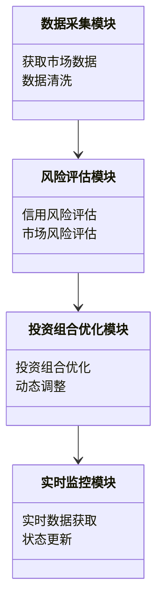
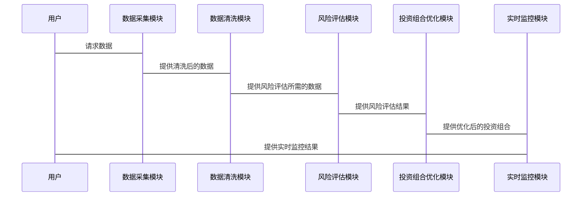

                 


```markdown
# 智能债券投资组合管理工具

> 关键词：智能债券投资、投资组合管理、人工智能、机器学习、算法优化

> 摘要：智能债券投资组合管理工具是一种结合人工智能和大数据分析的金融工具，旨在优化债券投资组合的构建和管理。本文将详细探讨其背景、核心概念、算法原理、系统架构、项目实战以及最佳实践，帮助读者全面理解这一工具的优势和应用场景。

---

# 第一部分：智能债券投资组合管理工具的背景与概念

## 第1章：智能债券投资组合管理工具的背景与概念

### 1.1 债券投资的传统挑战

#### 1.1.1 债券投资的基本概念
债券是一种债务工具，债券投资者通过购买债券，成为债务人，债务人到期后还本付息。传统债券投资面临的主要挑战包括市场波动、信用风险、流动性风险和再投资风险等。

#### 1.1.2 传统债券投资的局限性
传统债券投资依赖于人工分析和经验判断，存在以下局限性：
- 数据处理能力有限：人工难以处理海量数据，难以捕捉市场中的微小变化。
- 风险评估不足：人工分析难以全面评估信用风险和市场风险。
- 决策效率低下：人工决策耗时较长，难以应对快速变化的市场环境。

#### 1.1.3 智能化投资的必要性
随着金融市场的复杂化和数据量的爆炸式增长，智能化投资工具成为必要。通过人工智能技术，可以提高数据处理效率，优化投资决策，降低投资风险。

### 1.2 智能债券投资组合管理工具的定义

#### 1.2.1 工具的核心功能
智能债券投资组合管理工具是一种利用人工智能技术，帮助投资者优化债券投资组合的工具。其核心功能包括：
- 数据采集与处理：从多种来源获取债券相关信息，并进行清洗和预处理。
- 风险评估：利用机器学习算法评估债券的信用风险和市场风险。
- 投资组合优化：通过算法优化，生成最优的投资组合方案。
- 实时监控：实时跟踪市场变化，动态调整投资组合。

#### 1.2.2 工具的工作原理
智能债券投资组合管理工具通过以下步骤实现其功能：
1. **数据采集**：从金融市场数据源获取债券相关信息，包括债券评级、收益率、期限等。
2. **数据预处理**：对数据进行清洗和标准化处理，确保数据质量。
3. **模型训练**：利用机器学习算法训练风险评估模型和投资组合优化模型。
4. **投资组合优化**：基于模型结果，生成最优投资组合。
5. **实时监控与调整**：实时跟踪市场变化，动态调整投资组合。

#### 1.2.3 工具的边界与外延
智能债券投资组合管理工具的边界包括数据处理、模型训练和投资组合优化。其外延包括市场研究、投资策略制定和风险控制等。

### 1.3 智能债券投资组合管理工具的优势

#### 1.3.1 数据驱动的优势
智能债券投资组合管理工具通过大数据分析，能够捕捉市场中的微小变化，提供更精准的投资决策。

#### 1.3.2 算法驱动的优势
利用机器学习算法，工具能够快速分析海量数据，优化投资组合，降低投资风险。

#### 1.3.3 人机协同的优势
人机协同能够结合人类的经验和机器的计算能力，提供更全面的投资决策支持。

### 1.4 当前市场上的智能债券投资工具

#### 1.4.1 主流工具介绍
目前市场上的智能债券投资工具主要包括：
- 基于机器学习的债券评级工具。
- 基于算法交易的债券投资工具。
- 基于大数据分析的债券组合优化工具。

#### 1.4.2 工具的特点对比
以下是对当前主流智能债券投资工具的特点对比：

| 工具名称       | 核心功能                     | 优缺点分析                       |
|----------------|-----------------------------|----------------------------------|
| 工具A          | 信用风险评估                | 数据来源广，模型精度高；学习曲线陡峭 |
| 工具B          | 市场风险评估                | 实时监控能力强；用户体验友好       |
| 工具C          | 组合优化与调整              | 优化效果显著；技术支持不足         |

---

# 第二部分：智能债券投资组合管理工具的核心概念与联系

## 第2章：智能债券投资组合管理工具的核心概念与联系

### 2.1 核心概念与原理

#### 2.1.1 数据驱动的概念
数据驱动是指通过分析大量数据来驱动决策，是智能债券投资工具的核心概念之一。

#### 2.1.2 算法驱动的概念
算法驱动是指通过算法优化投资组合，是智能债券投资工具的另一个核心概念。

#### 2.1.3 人机协同的概念
人机协同是指结合人类经验和机器计算能力，提供更全面的投资决策支持。

### 2.2 核心概念的联系

#### 2.2.1 核心概念的属性特征对比
以下是核心概念的属性特征对比：

| 概念       | 数据驱动 | 算法驱动 | 人机协同 |
|------------|----------|----------|----------|
| 核心功能   | 数据分析 | 算法优化 | 综合决策 |
| 优缺点     | 数据量大，分析精准；数据获取成本高 | 模型优化能力强；算法复杂 | 综合能力强；依赖人类经验 |
| 应用场景   | 数据预处理、风险评估 | 投资组合优化、算法交易 | 综合决策支持、动态调整 |

#### 2.2.2 ER实体关系图
以下是智能债券投资组合管理工具的ER实体关系图：

```mermaid
er
    entity 投资者 {
        id
        名称
        资产规模
    }
    entity 债券 {
        id
        名称
        发行方
        期限
        利率
        评级
    }
    entity 市场数据 {
        id
        时间
        收益率
        指数
    }
    entity 风险评估 {
        id
        评估时间
        信用风险
        市场风险
    }
    entity 投资组合 {
        id
        名称
        组合构成
        风险收益比
    }
    relation 投资者拥有投资组合
    relation 债券属于投资组合
    relation 市场数据影响风险评估
    relation 风险评估影响投资组合
```

---

## 第3章：智能债券投资组合管理工具的算法原理

### 3.1 算法原理概述

#### 3.1.1 基于机器学习的信用风险评估

##### 3.1.1.1 机器学习模型的选择
常用的机器学习模型包括逻辑回归、支持向量机（SVM）和随机森林等。

##### 3.1.1.2 信用风险评估的流程
1. **数据预处理**：清洗数据，处理缺失值和异常值。
2. **特征提取**：从债券数据中提取关键特征，如评级、期限、发行方行业等。
3. **模型训练**：利用机器学习算法训练信用风险评估模型。
4. **模型评估**：通过准确率、召回率等指标评估模型性能。

##### 3.1.1.3 信用风险评估的数学模型
以下是信用风险评估的数学模型：

$$ P(\text{违约} | X) = \frac{e^{X\beta + \beta_0}}{1 + e^{X\beta + \beta_0}} $$

其中，$X$ 是特征向量，$\beta$ 是系数向量，$\beta_0$ 是截距。

#### 3.1.2 基于强化学习的投资组合优化

##### 3.1.2.1 强化学习模型的选择
常用的强化学习模型包括Q-Learning和Deep Q-Network（DQN）。

##### 3.1.2.2 投资组合优化的流程
1. **状态空间定义**：定义状态空间，包括当前市场状态、投资组合状态等。
2. **动作空间定义**：定义动作空间，包括买入、卖出、持有等操作。
3. **奖励函数设计**：设计奖励函数，用于衡量投资组合的表现。
4. **模型训练**：通过强化学习算法训练投资组合优化模型。
5. **模型评估**：通过回测等方式评估模型的性能。

##### 3.1.2.3 投资组合优化的数学模型
以下是投资组合优化的数学模型：

$$ \min_{w} \frac{1}{2}w^T \Sigma w + \lambda |w|^2 $$

其中，$w$ 是投资权重向量，$\Sigma$ 是协方差矩阵，$\lambda$ 是正则化参数。

### 3.2 算法实现与优化

#### 3.2.1 算法实现的步骤
以下是算法实现的步骤：

1. **数据预处理**：清洗数据，处理缺失值和异常值。
2. **特征提取**：从债券数据中提取关键特征。
3. **模型训练**：利用机器学习或强化学习算法训练模型。
4. **模型评估**：评估模型性能，调整参数。
5. **投资组合优化**：基于模型结果优化投资组合。

#### 3.2.2 算法优化的技巧
以下是一些算法优化的技巧：
- **特征选择**：选择对信用风险评估或投资组合优化影响较大的特征。
- **模型调参**：通过网格搜索等方式优化模型参数。
- **数据增强**：通过数据增强技术增加数据多样性。

### 3.3 算法的数学推导与分析

#### 3.3.1 信用风险评估的数学推导
以下是信用风险评估的数学推导：

$$ P(\text{违约} | X) = \frac{e^{X\beta + \beta_0}}{1 + e^{X\beta + \beta_0}} $$

其中，$P(\text{违约} | X)$ 是在特征向量 $X$ 下的违约概率。

#### 3.3.2 投资组合优化的数学分析
以下是投资组合优化的数学分析：

$$ \min_{w} \frac{1}{2}w^T \Sigma w + \lambda |w|^2 $$

其中，目标函数是投资组合的波动率加上正则化项，用于控制投资权重的稀疏性。

---

## 第4章：智能债券投资组合管理工具的系统分析与架构设计

### 4.1 系统分析

#### 4.1.1 问题场景描述
智能债券投资组合管理工具需要解决的主要问题包括：
- 数据获取与处理
- 风险评估与预测
- 投资组合优化与调整

#### 4.1.2 项目介绍
本项目旨在开发一款智能债券投资组合管理工具，利用人工智能技术优化债券投资组合。

### 4.2 系统功能设计

#### 4.2.1 系统功能模块
以下是系统功能模块：



#### 4.2.2 系统功能实现
以下是系统功能实现的详细步骤：
1. **数据采集模块**：从金融市场数据源获取债券相关信息。
2. **数据清洗模块**：清洗数据，处理缺失值和异常值。
3. **风险评估模块**：利用机器学习算法评估债券的信用风险和市场风险。
4. **投资组合优化模块**：基于风险评估结果优化投资组合。
5. **实时监控模块**：实时跟踪市场变化，动态调整投资组合。

### 4.3 系统架构设计

#### 4.3.1 系统架构概述
以下是系统架构概述：


#### 4.3.2 系统架构图
以下是系统架构图：

```mermaid
client
    账户管理
    投资组合管理
    数据可视化
server
    数据采集模块
    风险评估模块
    投资组合优化模块
    实时监控模块
database
    用户数据
    债券数据
    市场数据
接口
    API接口
```

### 4.4 系统接口设计

#### 4.4.1 接口设计概述
以下是接口设计概述：
- **数据接口**：与金融市场数据源对接，获取债券相关信息。
- **用户接口**：与用户交互，获取用户需求和反馈。
- **第三方接口**：与第三方服务对接，获取外部数据和计算资源。

#### 4.4.2 接口实现
以下是接口实现的详细步骤：
1. **数据接口**：通过API接口获取市场数据。
2. **用户接口**：通过Web界面获取用户需求和反馈。
3. **第三方接口**：通过云服务接口获取外部数据和计算资源。

### 4.5 系统交互设计

#### 4.5.1 系统交互流程
以下是系统交互流程：



#### 4.5.2 交互流程优化
以下是交互流程优化的建议：
- **数据预处理**：优化数据清洗流程，提高数据处理效率。
- **模型优化**：优化风险评估和投资组合优化模型，提高计算效率。
- **用户反馈**：优化用户界面，提高用户体验。

---

## 第5章：智能债券投资组合管理工具的项目实战

### 5.1 项目实战环境安装

#### 5.1.1 环境安装说明
以下是环境安装说明：
- **Python**：安装Python 3.8及以上版本。
- **机器学习库**：安装Scikit-learn、XGBoost等机器学习库。
- **数据处理工具**：安装Pandas、NumPy等数据处理工具。
- **可视化工具**：安装Matplotlib、Seaborn等可视化工具。

#### 5.1.2 开发工具配置
以下是开发工具配置建议：
- **代码编辑器**：推荐使用PyCharm或VS Code。
- **版本控制**：推荐使用Git进行版本管理。
- **虚拟环境**：推荐使用virtualenv或conda管理虚拟环境。

### 5.2 项目核心代码实现

#### 5.2.1 数据预处理代码
以下是数据预处理代码示例：

```python
import pandas as pd
import numpy as np

# 读取数据
data = pd.read_csv('bond_data.csv')

# 数据清洗
data.dropna()  # 删除缺失值
data = data[~data.duplicated()]  # 删除重复值
```

#### 5.2.2 风险评估代码
以下是风险评估代码示例：

```python
from sklearn.linear_model import LogisticRegression

# 特征提取
X = data[['rating', 'term', 'issuer_industry']]
y = data['default']

# 模型训练
model = LogisticRegression()
model.fit(X, y)

# 预测
new_data = pd.DataFrame({'rating': [AAA, AA, A], 'term': [5, 10, 15], 'issuer_industry': ['金融', '科技', '制造']})
predicted = model.predict(new_data[X.columns])
```

#### 5.2.3 投资组合优化代码
以下是投资组合优化代码示例：

```python
import numpy as np

# 数据准备
returns = np.array([[0.05, 0.06, 0.04],
                    [0.07, 0.05, 0.06],
                    [0.04, 0.08, 0.05]])

# 投资组合优化
n = 3  # 资产数量
risk_tolerance = 0.5

# 最优化目标函数
def objective(w):
    return (w.T @ returns @ w) * risk_tolerance

# 约束条件
constraints = {
    'type': 'eq',
    'fun': lambda w: sum(w) - 1
}

# 优化求解
from scipy.optimize import minimize

w0 = np.array([1/3, 1/3, 1/3])

result = minimize(objective, w0, constraints=constraints)

print(result.x)
```

### 5.3 项目实战案例分析

#### 5.3.1 案例背景
某资产管理公司希望通过智能债券投资组合管理工具优化其债券投资组合。

#### 5.3.2 案例实现
以下是案例实现的详细步骤：
1. **数据采集**：获取相关债券数据。
2. **数据清洗**：处理缺失值和异常值。
3. **风险评估**：利用逻辑回归模型评估债券的信用风险。
4. **投资组合优化**：基于风险评估结果优化投资组合。
5. **实时监控**：实时跟踪市场变化，动态调整投资组合。

#### 5.3.3 案例分析与总结
通过对案例的分析，可以得出以下结论：
- 智能债券投资组合管理工具能够显著提高投资效率和准确性。
- 通过机器学习算法可以有效降低投资风险。
- 人机协同能够提供更全面的投资决策支持。

---

## 第6章：智能债券投资组合管理工具的最佳实践

### 6.1 最佳实践 tips

#### 6.1.1 数据质量的重要性
数据质量是智能债券投资工具的核心，高质量的数据能够提高模型的准确性和可靠性。

#### 6.1.2 模型可解释性的重要性
模型的可解释性能够帮助投资者理解和信任工具的决策过程。

#### 6.1.3 持续优化的重要性
市场环境不断变化，工具需要持续优化以适应新的市场条件。

### 6.2 小结

智能债券投资组合管理工具通过结合人工智能和大数据分析，能够显著提高债券投资的效率和准确性。通过本文的详细讲解，读者可以全面了解工具的核心概念、算法原理、系统架构和项目实战。

### 6.3 注意事项

- **数据隐私**：在处理数据时，需要注意数据隐私和合规性。
- **模型风险**：需要充分考虑模型的风险，避免模型失效导致的投资损失。
- **用户体验**：工具需要提供良好的用户体验，方便用户使用和理解。

### 6.4 拓展阅读

- **人工智能在金融领域的应用**：推荐阅读《机器学习实战》。
- **投资组合优化的数学模型**：推荐阅读《投资学》。
- **债券市场分析**：推荐阅读《固定收益证券》。

---

# 作者：AI天才研究院/AI Genius Institute & 禅与计算机程序设计艺术/Zen And The Art of Computer Programming
```

