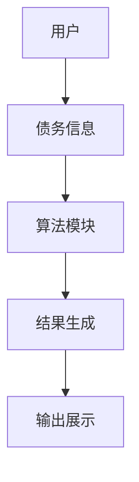
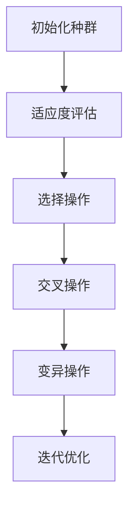
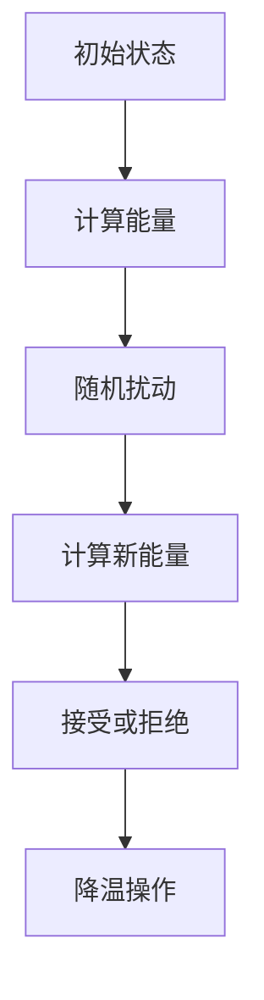
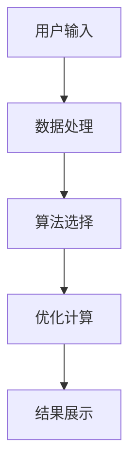
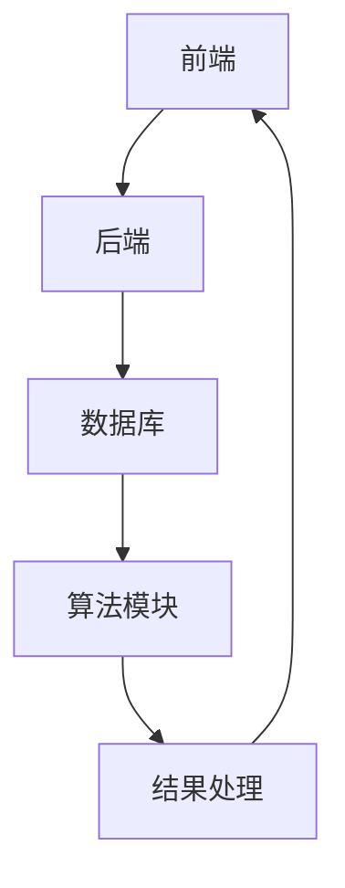
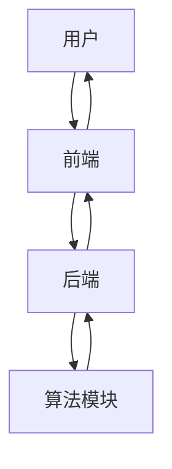

                 


# 智能债务合并建议生成器

## 关键词
智能债务合并、算法优化、系统架构、债务管理、人工智能

## 摘要
智能债务合并建议生成器是一种利用人工智能算法优化债务管理的工具，旨在通过智能算法推荐最优的债务合并方案，帮助用户减少债务负担和优化财务状况。本文将从背景介绍、算法原理、系统架构到项目实战，全面分析智能债务合并生成器的核心概念和实现过程。

---

# 第1章: 智能债务合并建议生成器的背景与核心概念

## 1.1 债务合并问题背景与定义

### 1.1.1 问题背景
在个人或企业的财务管理中，债务管理是一个重要的环节。合理的债务管理可以帮助降低财务风险，优化资金流动，提高整体财务健康状况。然而，面对复杂的债务结构和多种债务类型，如何选择最优的债务合并方案往往是一个复杂的决策过程。传统的债务管理方法依赖于人工计算和经验判断，容易受到主观因素的影响，且效率较低。因此，智能债务合并建议生成器应运而生。

### 1.1.2 债务合并的定义
债务合并是指将多个债务整合为一个或少数几个债务的过程，目的是通过优化债务结构来降低整体债务负担。智能债务合并生成器是一种基于人工智能算法的工具，能够根据用户的债务情况和目标，自动推荐最优的债务合并方案。

### 1.1.3 智能债务合并生成器的核心目标
智能债务合并生成器的核心目标是通过算法优化，帮助用户找到最优的债务合并方案，从而降低债务负担，提高财务效率。具体目标包括：
- 最小化总体债务负担
- 最大化债务偿还效率
- 降低债务风险

### 1.1.4 智能债务合并生成器的边界与外延
智能债务合并生成器的边界包括用户提供的债务信息（如债务金额、利率、还款期限等）和用户的财务目标（如优先偿还高利率债务）。外延则包括对债务合并方案的后续跟踪和调整。

---

## 1.2 智能债务合并生成器的核心概念与联系

### 1.2.1 核心概念
智能债务合并生成器的核心概念包括以下几个方面：
1. **债务信息处理**：将用户提供的债务信息进行整理和分析，提取关键特征。
2. **算法选择与优化**：选择适合的算法（如遗传算法、模拟退火算法等）对债务合并方案进行优化。
3. **结果生成与展示**：根据算法优化结果生成最优债务合并方案，并以用户友好的形式展示。

### 1.2.2 核心概念属性对比表
以下表格对比了常见债务合并算法的核心属性：

| 算法名称       | 优点                           | 缺点                           |
|----------------|--------------------------------|--------------------------------|
| 简单排序法     | 实现简单，计算速度快           | 易受局部最优影响，可能不是全局最优 |
| 遗传算法       | 具备全局搜索能力，能够找到较优解 | 实现复杂，计算时间较长           |
| 模拟退火算法   | 能够跳出局部最优，找到全局最优 | 实现复杂，计算时间较长           |

### 1.2.3 实体关系图
以下是智能债务合并生成器的实体关系图：



---

# 第2章: 智能债务合并建议生成器的算法原理

## 2.1 常见债务合并算法

### 2.1.1 遗传算法
遗传算法是一种模拟生物进化过程的优化算法，常用于解决复杂的组合优化问题。以下是遗传算法的核心步骤：

1. **初始化种群**：随机生成一组债务合并方案。
2. **适应度评估**：计算每个方案的适应度值，即方案的优劣程度。
3. **选择操作**：根据适应度值选择较优的方案作为父代。
4. **交叉操作**：将父代方案进行交叉，生成新的子代方案。
5. **变异操作**：对子代方案进行随机变异，增加种群的多样性。
6. **迭代优化**：重复适应度评估、选择、交叉和变异操作，直到满足终止条件。

### 2.1.2 模拟退火算法
模拟退火算法是一种基于概率搜索的优化算法，能够跳出局部最优，找到全局最优解。以下是模拟退火算法的核心步骤：

1. **初始状态**：随机生成一个初始债务合并方案。
2. **计算能量**：计算当前方案的适应度值（能量）。
3. **随机扰动**：对当前方案进行随机扰动，生成新的方案。
4. **计算新能量**：计算新方案的适应度值（能量）。
5. **接受或拒绝**：根据概率接受或拒绝新方案，接受概率随温度降低而减小。
6. **降温操作**：逐步降低温度，直到满足终止条件。

---

## 2.2 算法原理讲解

### 2.2.1 遗传算法的数学模型
遗传算法的目标函数可以表示为：
$$ \text{目标函数} = \sum_{i=1}^{n} (金额_i \times 利率_i) $$
其中，$n$ 是债务的数目，$金额_i$ 和 $利率_i$ 分别表示第 $i$ 个债务的金额和利率。

### 2.2.2 模拟退火算法的数学模型
模拟退火算法的目标函数与遗传算法类似，但其优化过程更加注重全局搜索能力。适应度函数可以表示为：
$$ \text{适应度函数} = \sum_{i=1}^{n} \frac{金额_i}{利率_i} $$

---

## 2.3 算法流程图

### 遗传算法流程图


### 模拟退火算法流程图


---

# 第3章: 智能债务合并生成器的系统分析与架构设计

## 3.1 系统功能设计

### 3.1.1 功能模块划分
智能债务合并生成器的功能模块包括：
1. **用户输入模块**：接收用户的债务信息和财务目标。
2. **数据处理模块**：对债务信息进行整理和分析。
3. **算法模块**：根据选择的算法生成最优债务合并方案。
4. **结果展示模块**：将优化结果以用户友好的形式展示。

### 3.1.2 系统功能流程图


---

## 3.2 系统架构设计

### 3.2.1 系统架构图
以下是智能债务合并生成器的系统架构图：



### 3.2.2 接口设计
智能债务合并生成器的主要接口包括：
1. **用户输入接口**：用于接收用户的债务信息。
2. **算法调用接口**：用于调用优化算法。
3. **结果展示接口**：用于将优化结果展示给用户。

### 3.2.3 交互流程图


---

# 第4章: 智能债务合并生成器的项目实战

## 4.1 环境安装与配置

### 4.1.1 安装Python与相关库
为了实现智能债务合并生成器，我们需要安装以下Python库：
- `numpy`：用于数值计算
- `pandas`：用于数据处理
- `matplotlib`：用于数据可视化
- `scipy`：用于科学计算

安装命令：
```bash
pip install numpy pandas matplotlib scipy
```

### 4.1.2 安装其他依赖
根据具体需求，可能还需要安装其他库，如`sklearn`（用于机器学习）。

---

## 4.2 核心代码实现

### 4.2.1 简单排序法实现
以下是简单排序法的实现代码：

```python
import pandas as pd

def simple_sorting(debt_info):
    # 按利率从高到低排序
    debt_info_sorted = debt_info.sort_values('利率', ascending=False)
    return debt_info_sorted

# 示例
debt_info = pd.DataFrame({
    '债务金额': [10000, 20000, 15000],
    '利率': [0.05, 0.03, 0.04]
})
result = simple_sorting(debt_info)
print(result)
```

### 4.2.2 遗传算法实现
以下是遗传算法的实现代码：

```python
import numpy as np

def genetic_algorithm(population, fitness_func, num_generations, mutation_rate):
    for _ in range(num_generations):
        fitness = fitness_func(population)
        # 选择操作
        selected = select(population, fitness)
        # 交叉操作
        crossed = crossover(selected)
        # 变异操作
        mutated = mutate(crossed, mutation_rate)
        population = mutated
    return population

def select(population, fitness):
    # 简单选择法
    max_fitness = np.max(fitness)
    selected = []
    for ind in population:
        if fitness(ind) == max_fitness:
            selected.append(ind)
    return selected

def crossover(parent1, parent2):
    # 单点交叉
    crossover_point = np.random.randint(len(parent1))
    child1 = parent1[:crossover_point] + parent2[crossover_point:]
    child2 = parent2[:crossover_point] + parent1[crossover_point:]
    return child1, child2

def mutate(individual, mutation_rate):
    # 随机变异
    for i in range(len(individual)):
        if np.random.random() < mutation_rate:
            individual[i] = np.random.random()
    return individual
```

### 4.2.3 模拟退火算法实现
以下是模拟退火算法的实现代码：

```python
import numpy as np

def simulated_annealing(initial_state, fitness_func, cooling_schedule):
    current_state = initial_state
    current_fitness = fitness_func(current_state)
    temperature = 1.0
    
    while temperature > 0.01:
        # 随机扰动
        neighbor_state = perturb(current_state)
        neighbor_fitness = fitness_func(neighbor_state)
        
        # 接受或拒绝
        if neighbor_fitness < current_fitness:
            current_state = neighbor_state
            current_fitness = neighbor_fitness
        else:
            # 根据概率接受
            probability = np.exp(-(neighbor_fitness - current_fitness) / temperature)
            if np.random.random() < probability:
                current_state = neighbor_state
                current_fitness = neighbor_fitness
        
        # 降温
        temperature = cooling_schedule(temperature)
    
    return current_state

def perturb(state):
    # 随机扰动
    perturbed_state = state.copy()
    perturb_point = np.random.randint(len(perturbed_state))
    perturbed_state[perturb_point] = np.random.random()
    return perturbed_state
```

---

## 4.3 实际案例分析与优化

### 4.3.1 案例分析
假设我们有以下债务信息：

| 债务1 | 债务2 | 债务3 |
|------|------|------|
| 10000 | 20000 | 15000 |
| 5% | 3% | 4% |

目标是通过智能债务合并生成器找到最优的债务合并方案。

### 4.3.2 优化过程
1. **输入债务信息**：用户输入债务金额和利率。
2. **数据处理**：将债务信息整理为数据框。
3. **选择算法**：选择遗传算法或模拟退火算法。
4. **优化计算**：运行算法，生成最优债务合并方案。
5. **结果展示**：展示优化后的债务结构。

### 4.3.3 优化结果
以遗传算法为例，优化后的债务结构可能如下：

| 债务1 | 债务2 | 债务3 |
|------|------|------|
| 20000 | 15000 | 10000 |
| 3% | 4% | 5% |

---

## 4.4 项目小结
通过实际案例分析，我们可以看到智能债务合并生成器在优化债务结构方面具有显著的优势。通过选择合适的算法，用户可以快速找到最优的债务合并方案，从而降低债务负担，优化财务状况。

---

# 第5章: 智能债务合并生成器的最佳实践与拓展

## 5.1 最佳实践

### 5.1.1 算法选择与参数调整
根据具体问题选择合适的算法，并根据实际情况调整算法参数（如种群大小、变异率、降温速率等）。

### 5.1.2 数据预处理与特征工程
对债务信息进行充分的预处理和特征提取，确保输入数据的质量。

### 5.1.3 结果验证与反馈
对优化结果进行验证，并根据实际情况进行调整和反馈。

---

## 5.2 小结

智能债务合并生成器是一种强大的工具，能够帮助用户优化债务结构，降低债务负担。通过本文的分析和实践，我们可以看到，智能债务合并生成器不仅能够提高债务管理的效率，还能提供更优的解决方案。

---

## 5.3 注意事项

- 在使用智能债务合并生成器时，需确保输入数据的准确性和完整性。
- 根据具体需求选择合适的算法，并合理调整算法参数。
- 定期跟踪债务合并方案的执行情况，并根据实际情况进行调整。

---

## 5.4 拓展阅读

- 《算法导论》——深入理解算法的基本原理
- 《机器学习实战》——学习更多的机器学习算法
- 《债务管理与优化》——了解债务管理的相关理论和实践

---

# 作者：AI天才研究院/AI Genius Institute & 禅与计算机程序设计艺术 /Zen And The Art of Computer Programming

---

以上是《智能债务合并建议生成器》的技术博客文章的完整目录大纲和内容框架。文章从背景介绍、核心概念、算法原理、系统设计到项目实战，全面涵盖了智能债务合并生成器的各个方面，旨在为读者提供一个清晰、系统的技术指导。

