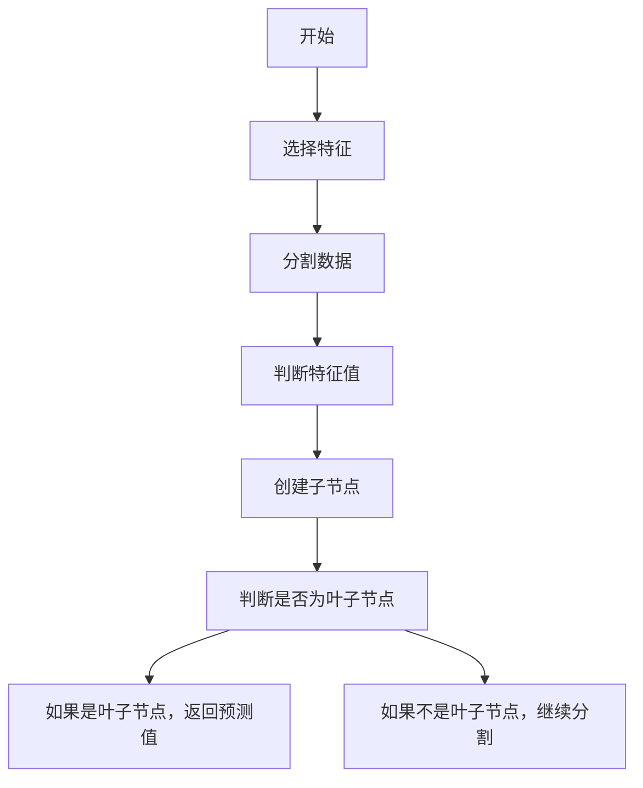
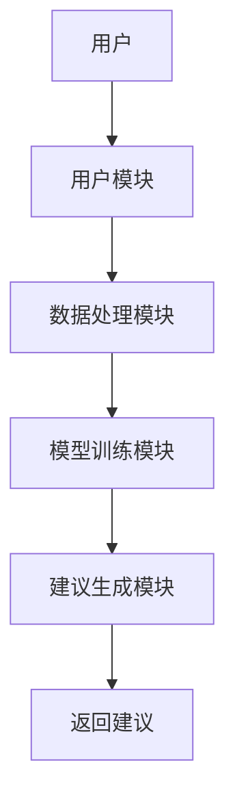
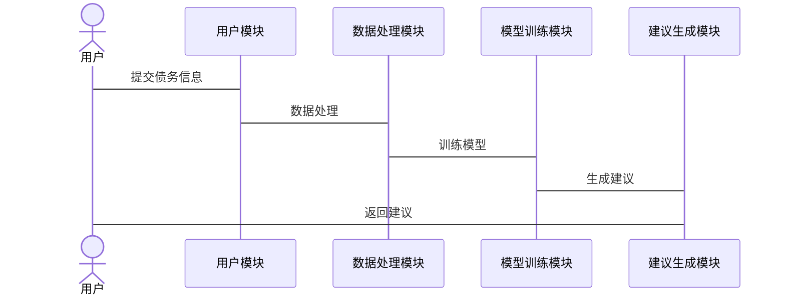

                 


# 智能债务管理建议系统

> 关键词：智能债务管理、人工智能、机器学习、系统架构、算法原理、债务优化

> 摘要：本文详细介绍了智能债务管理建议系统的构建与实现，从背景、核心概念、算法原理到系统架构，再到项目实战，全面解析了如何利用人工智能技术解决债务管理问题，提供高效的建议生成与优化方案。

---

# 第一部分: 智能债务管理建议系统的背景与概念

# 第1章: 智能债务管理建议系统概述

## 1.1 债务管理的基本概念

### 1.1.1 债务的定义与分类

债务是指一方欠另一方的金钱或资源，通常以贷款、信用卡欠款等形式存在。根据偿还期限和用途，债务可以分为短期债务和长期债务，也可以分为消费性债务和经营性债务。

### 1.1.2 传统债务管理的痛点

传统的债务管理方式依赖人工计算和经验判断，存在以下问题：
- 数据处理效率低，难以快速响应用户需求。
- 风险评估不够精准，容易导致错误的建议。
- 个性化还款计划难以制定，难以满足不同用户的需求。

### 1.1.3 智能债务管理的必要性

随着人工智能技术的发展，智能债务管理通过自动化数据处理和精准的算法模型，能够快速生成个性化的还款建议，提高债务管理的效率和准确性。

## 1.2 智能债务管理建议系统的定义

智能债务管理建议系统是一种基于人工智能技术的债务管理工具，通过数据采集、分析和建模，为用户提供个性化的债务优化建议。

### 1.2.1 系统的核心功能

- 数据采集与处理：从多种数据源获取债务相关信息。
- 风险评估与预测：利用机器学习模型预测债务风险。
- 建议生成：根据用户情况生成最优还款计划。

### 1.2.2 系统的目标与边界

系统目标：帮助用户快速了解债务状况，制定最优还款计划，降低债务风险。

系统边界：系统仅提供债务管理建议，不涉及实际的还款操作。

### 1.2.3 系统的用户群体与应用场景

用户群体：个人用户、小微企业、金融机构。

应用场景：个人债务优化、企业债务重组、金融机构风险控制。

## 1.3 本章小结

本章介绍了债务管理的基本概念、传统债务管理的痛点以及智能债务管理的必要性，明确了智能债务管理建议系统的核心功能和目标。

---

# 第二部分: 智能债务管理建议系统的原理与核心概念

# 第2章: 核心概念与系统架构

## 2.1 债务管理的关键要素

### 2.1.1 债务人信息分析

债务人信息分析是智能债务管理的基础，包括收入、资产、负债等关键指标。

### 2.1.2 债务类型与风险评估

不同类型的债务具有不同的风险特征，系统需要对债务类型进行分类，并评估其风险。

### 2.1.3 还款能力与信用评分

通过分析债务人的还款能力和信用评分，系统可以更精准地预测债务违约风险。

## 2.2 智能建议生成的原理

智能建议生成是系统的核心功能，主要包括数据采集与处理、模型训练与预测、建议生成与优化三个步骤。

## 2.3 系统核心概念对比表

| 概念 | 特性 | 说明 |
|------|------|------|
| 债务人信息 | 输入数据 | 包括收入、资产、负债等 |
| 风险评估 | 核心算法 | 使用机器学习模型进行预测 |
| 建议生成 | 输出结果 | 提供还款计划与优化方案 |

## 2.4 系统架构的ER图

```mermaid
erDiagram
    actor 用户
    actor 系统
    actor 数据源
    database 债务数据库
    database 模型数据库
    用户 --> 系统: 提交债务信息
    系统 --> 数据源: 获取外部数据
    系统 --> 债务数据库: 存储债务信息
    系统 --> 模型数据库: 训练与存储模型
    系统 --> 用户: 返回建议
```

---

# 第三部分: 系统算法原理与数学模型

# 第3章: 算法原理与实现

## 3.1 算法原理概述

智能债务管理建议系统主要使用机器学习算法，包括决策树、随机森林、支持向量机等。

## 3.2 决策树算法实现

### 3.2.1 决策树算法流程



### 3.2.2 决策树代码实现

```python
from sklearn.tree import DecisionTreeClassifier
from sklearn.model_selection import train_test_split

# 数据预处理
X = ...  # 特征矩阵
y = ...  # 标签向量

# 划分训练集和测试集
X_train, X_test, y_train, y_test = train_test_split(X, y, test_size=0.2)

# 模型训练
model = DecisionTreeClassifier()
model.fit(X_train, y_train)

# 预测
y_pred = model.predict(X_test)
```

### 3.2.3 决策树算法的数学模型

决策树的分割标准通常使用信息增益或基尼指数。信息增益的计算公式为：

$$ \text{信息增益}(A) = H(\text{原始数据}) - H(\text{子节点}) $$

其中，$$ H $$ 表示熵的计算公式：

$$ H(S) = -\sum_{i=1}^{n} p_i \log_2 p_i $$

---

# 第四部分: 系统分析与架构设计

# 第4章: 系统分析与架构设计

## 4.1 系统分析

智能债务管理建议系统的分析包括功能需求分析、性能需求分析、用户需求分析。

## 4.2 系统功能设计

### 4.2.1 功能模块划分

- 用户模块：用户信息管理、债务信息提交。
- 数据处理模块：数据清洗、特征提取。
- 模型训练模块：模型训练、模型评估。
- 建议生成模块：生成还款计划、优化方案。

### 4.2.2 功能模块的ER图

```mermaid
erDiagram
    module 用户模块
    module 数据处理模块
    module 模型训练模块
    module 建议生成模块
    用户 --> 用户模块: 提交信息
    用户模块 --> 数据处理模块: 数据处理
    数据处理模块 --> 模型训练模块: 训练模型
    模型训练模块 --> 建议生成模块: 生成建议
    建议生成模块 --> 用户: 返回建议
```

## 4.3 系统架构设计

### 4.3.1 系统架构图



## 4.4 系统接口设计

系统主要接口包括用户信息接口、数据处理接口、模型训练接口和建议生成接口。

## 4.5 系统交互设计

### 4.5.1 系统交互流程



---

# 第五部分: 项目实战

# 第5章: 项目实战

## 5.1 环境安装

### 5.1.1 安装Python

```bash
python --version
pip install --upgrade pip
```

### 5.1.2 安装依赖库

```bash
pip install scikit-learn pandas numpy
```

## 5.2 系统核心实现

### 5.2.1 数据预处理代码

```python
import pandas as pd
import numpy as np

# 读取数据
data = pd.read_csv('debt_data.csv')

# 数据清洗
data = data.dropna()
data = data.replace({np.nan: 0})

# 特征提取
X = data[['income', 'asset', '负债比']]
y = data['违约风险']
```

### 5.2.2 模型训练代码

```python
from sklearn.tree import DecisionTreeClassifier
from sklearn.model_selection import train_test_split

# 划分训练集和测试集
X_train, X_test, y_train, y_test = train_test_split(X, y, test_size=0.2)

# 模型训练
model = DecisionTreeClassifier()
model.fit(X_train, y_train)

# 模型评估
print("准确率：", model.score(X_test, y_test))
```

## 5.3 案例分析

以一个典型债务人为例，分析系统的建议生成过程。

---

# 第六部分: 最佳实践与总结

# 第6章: 最佳实践与总结

## 6.1 最佳实践

- 数据处理：确保数据的完整性和准确性。
- 模型选择：根据具体场景选择合适的算法。
- 系统优化：定期更新模型，优化系统性能。

## 6.2 小结

智能债务管理建议系统通过人工智能技术，为用户提供个性化的债务管理方案，显著提高了债务管理的效率和准确性。

## 6.3 注意事项

- 数据隐私：确保用户数据的安全性。
- 模型解释性：选择具有良好解释性的算法。
- 系统可扩展性：设计易于扩展的系统架构。

## 6.4 拓展阅读

推荐阅读《机器学习实战》、《深入浅出机器学习》等书籍，进一步了解机器学习算法的应用。

---

作者：AI天才研究院/AI Genius Institute & 禅与计算机程序设计艺术/Zen And The Art of Computer Programming

