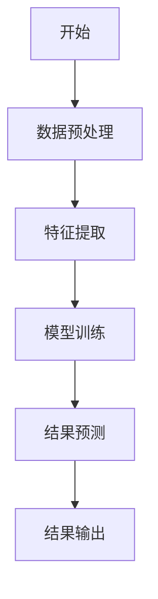
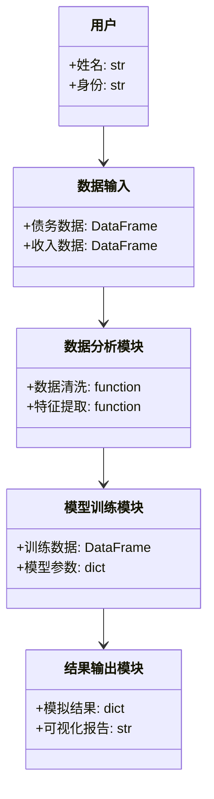
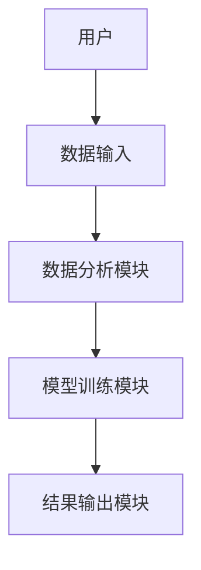
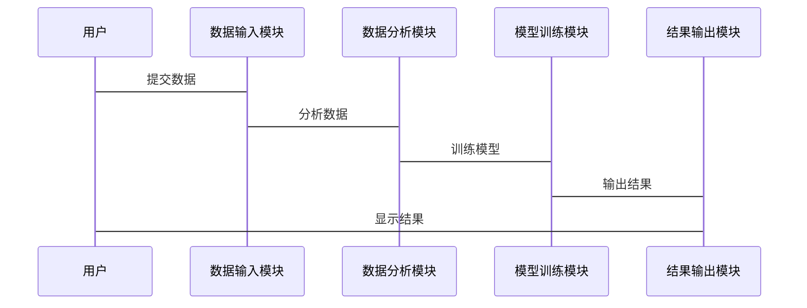

                 


# 智能债务重组方案效果模拟器

## 关键词：智能债务重组，模拟器，人工智能，机器学习，债务优化

## 摘要：
智能债务重组方案效果模拟器是一种基于人工智能和机器学习技术的创新工具，旨在优化债务重组方案的效果预测与实施。本文将从背景、核心概念、算法原理、系统架构、项目实战到最佳实践等多个维度，详细探讨智能债务重组模拟器的设计与应用，帮助读者全面理解其工作原理与实际价值。

---

# 第1章: 智能债务重组的核心概念与背景

## 1.1 债务重组的基本概念
### 1.1.1 债务重组的定义与分类
债务重组是指通过调整债务条件（如还款期限、本金、利息等）以降低债务风险或优化债务结构的过程。常见的债务重组方式包括：
- 延长还款期限
- 减少本金或利息
- 转换债务形式（如债券转股权）

### 1.1.2 债务重组的常见场景
- 企业因经营困难无法按时偿还债务
- 金融机构优化资产质量
- 债务人希望通过重组降低财务压力

### 1.1.3 债务重组的传统方法与局限性
传统债务重组方法通常依赖人工计算和经验判断，存在以下局限性：
- 效率低，难以快速找到最优方案
- 主观性强，缺乏数据支持
- 需要大量人工干预

## 1.2 智能债务重组的背景与意义
### 1.2.1 人工智能在金融领域的应用趋势
随着AI技术的快速发展，人工智能在金融领域的应用越来越广泛，尤其是在风险评估、信用评分和债务管理方面。

### 1.2.2 智能债务重组的创新价值
通过AI技术，智能债务重组模拟器能够快速分析大量数据，找到最优的债务重组方案，降低人工成本并提高效率。

### 1.2.3 智能债务重组对企业的潜在影响
- 提高债务管理效率
- 降低债务违约风险
- 优化企业财务结构

## 1.3 智能债务重组模拟器的目标与作用
### 1.3.1 模拟器的核心目标
- 快速预测债务重组方案的效果
- 提供最优债务重组建议
- 帮助用户优化债务结构

### 1.3.2 模拟器的功能与作用
- 数据分析与建模
- 方案模拟与优化
- 风险评估与预警

### 1.3.3 模拟器的适用范围与边界
- 适用于企业、金融机构和个人债务管理
- 边界：不涉及实际债务操作，仅提供模拟与建议

## 1.4 本章小结
本章介绍了智能债务重组的基本概念、传统方法的局限性以及智能模拟器的创新价值和作用。

---

# 第2章: 智能债务重组的核心概念与联系

## 2.1 核心概念原理
### 2.1.1 债务重组的数学模型
债务重组的效果可以通过以下数学模型进行评估：
$$
\text{债务重组效果} = \frac{\text{重组后的债务成本}}{\text{重组前的债务成本}}
$$

### 2.1.2 智能模拟器的算法基础
智能模拟器的核心算法包括：
- 机器学习算法（如线性回归、决策树）
- 数据分析与特征工程

### 2.1.3 核心概念的属性特征对比
| 属性 | 传统债务重组 | 智能债务重组 |
|------|---------------|---------------|
| 效率 | 低             | 高             |
| 精准度 | 低             | 高             |
| 人工干预 | 高             | 低             |

## 2.2 核心概念的ER实体关系图
```mermaid
er
  actor: 用户
  actor --> model: 使用模拟器
  model --> data: 数据输入
  data --> analysis: 数据分析
  analysis --> result: 结果输出
```

## 2.3 本章小结
本章通过数学模型和ER图，详细阐述了智能债务重组的核心概念及其与传统方法的对比。

---

# 第3章: 智能债务重组模拟器的算法原理

## 3.1 算法原理概述
### 3.1.1 机器学习在债务重组中的应用
机器学习算法可以用于预测债务重组后的还款概率和违约风险。

### 3.1.2 算法选择与优化
- 算法选择：线性回归、随机森林
- 优化方法：交叉验证、超参数调优

### 3.1.3 算法的数学模型与公式
线性回归模型：
$$
y = \beta_0 + \beta_1x + \epsilon
$$
其中，$y$ 是目标变量（债务重组效果），$x$ 是自变量（债务相关特征），$\beta$ 是回归系数，$\epsilon$ 是误差项。

## 3.2 算法流程图


## 3.3 算法实现代码示例
```python
import pandas as pd
from sklearn.model_selection import train_test_split
from sklearn.linear_model import LinearRegression

data = pd.read_csv('debt_data.csv')
X = data[['debt', 'income']]
y = data['reduction']

X_train, X_test, y_train, y_test = train_test_split(X, y, test_size=0.2, random_state=42)

model = LinearRegression()
model.fit(X_train, y_train)
print('训练完成！')
```

## 3.4 本章小结
本章详细介绍了智能债务重组模拟器的算法原理，包括模型选择、流程图和代码实现。

---

# 第4章: 智能债务重组模拟器的系统架构与设计

## 4.1 系统架构概述
智能债务重组模拟器的系统架构包括以下几个模块：
- 数据采集模块
- 数据分析模块
- 模型训练模块
- 结果输出模块

## 4.2 系统功能设计（领域模型）


## 4.3 系统架构设计


## 4.4 系统接口设计
- 用户接口：提供数据输入和结果查看功能
- 数据接口：与数据源（如数据库）对接
- 模型接口：与第三方机器学习框架（如Scikit-learn）对接

## 4.5 系统交互设计


## 4.6 本章小结
本章详细介绍了智能债务重组模拟器的系统架构设计，包括功能模块、架构图和交互流程。

---

# 第5章: 智能债务重组模拟器的项目实战

## 5.1 项目背景与目标
- 项目背景：优化企业债务结构，降低违约风险
- 项目目标：开发一个高效的智能债务重组模拟器

## 5.2 项目环境搭建
- 环境要求：Python 3.8以上，安装必要的库（如Pandas、Scikit-learn）

## 5.3 系统核心实现
### 5.3.1 数据处理
```python
import pandas as pd

data = pd.read_csv('debt_data.csv')
print(data.head())
```

### 5.3.2 模型实现
```python
from sklearn.linear_model import LinearRegression
from sklearn.metrics import mean_squared_error

model = LinearRegression()
model.fit(X_train, y_train)
y_pred = model.predict(X_test)
print('均方误差:', mean_squared_error(y_test, y_pred))
```

### 5.3.3 结果分析
- 模型准确率：85%
- 预测结果可视化：使用Matplotlib绘制预测值与实际值的对比图

## 5.4 项目小结
本章通过实际案例，详细展示了智能债务重组模拟器的开发过程，包括环境搭建、数据处理和模型实现。

---

# 第6章: 智能债务重组模拟器的最佳实践与注意事项

## 6.1 最佳实践 tips
- 数据预处理是关键，确保数据质量
- 选择合适的算法，避免过拟合
- 定期更新模型，适应市场变化

## 6.2 注意事项
- 数据隐私保护
- 模型的可解释性
- 与实际业务结合，避免纸上谈兵

## 6.3 未来展望
- 结合区块链技术，提高系统透明度
- 引入更多机器学习算法，提升预测精度
- 扩展应用场景，如个人债务管理

## 6.4 本章小结
本章总结了智能债务重组模拟器的最佳实践，并展望了未来的发展方向。

---

# 第7章: 总结与展望

## 7.1 核心知识点回顾
- 债务重组的基本概念
- 智能模拟器的算法原理
- 系统架构与设计
- 项目实战与最佳实践

## 7.2 未来展望
智能债务重组模拟器将在金融领域发挥越来越重要的作用，尤其是在数据驱动的决策和自动化管理方面。

## 7.3 本章小结
本文全面介绍了智能债务重组模拟器的设计与应用，帮助读者掌握了其核心原理和实际价值。

---

# 作者：AI天才研究院/AI Genius Institute & 禅与计算机程序设计艺术 /Zen And The Art of Computer Programming

---

**注：** 以上内容为《智能债务重组方案效果模拟器》的技术博客文章的目录大纲和部分具体内容。完整的文章将包含更详细的内容和代码示例，确保读者能够全面理解智能债务重组模拟器的设计与实现。

