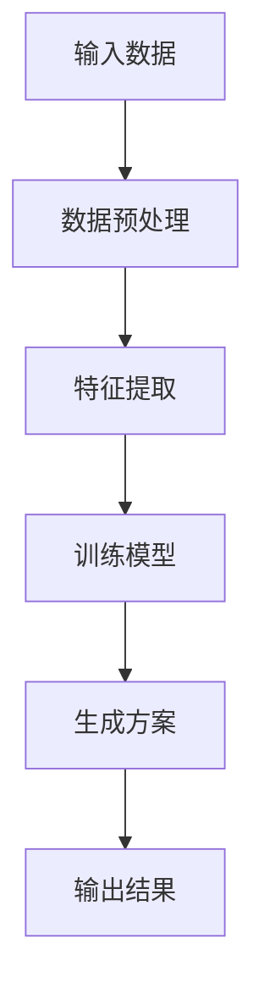
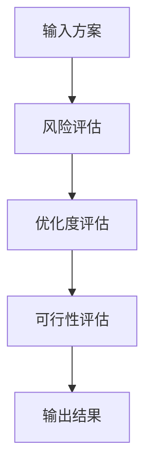
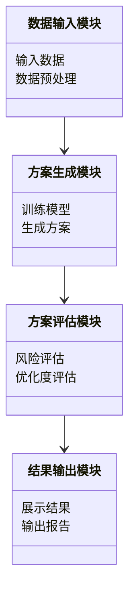
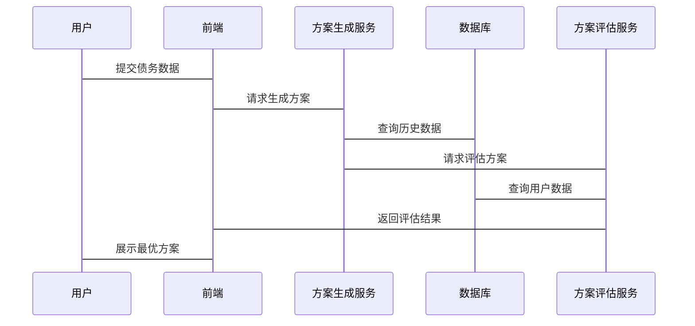

                 


# 智能债务重组方案生成与评估

> **关键词**：智能债务重组，方案生成，评估模型，机器学习，深度学习，数学模型

> **摘要**：智能债务重组通过结合人工智能和机器学习技术，优化债务重组方案的生成与评估过程。本文详细探讨了智能债务重组的背景、核心概念、算法原理、系统架构，并通过实际案例分析，展示了如何利用智能技术提升债务重组的效率与效果。文章最后总结了智能债务重组的优势与未来发展方向。

---

## 第一部分：智能债务重组背景与核心概念

### 第1章：智能债务重组的背景与问题背景

#### 1.1 问题背景与问题描述

- **1.1.1 传统债务重组的局限性**
  - 传统债务重组依赖人工分析，耗时且效率低下。
  - 数据量大、复杂度高，难以快速找到最优解。
  - 专家经验依赖性强，主观因素影响决策。

- **1.1.2 智能债务重组的提出背景**
  - 随着人工智能技术的发展，利用AI优化债务重组成为可能。
  - 数据驱动的决策方法能够提高效率和准确性。
  - 企业对快速、精准的债务解决方案需求增加。

- **1.1.3 债务重组的目标与意义**
  - 目标：降低企业债务负担，优化资本结构，避免债务危机。
  - 意义：帮助企业恢复财务健康，提升市场竞争力。

#### 1.2 债务重组的核心概念与边界

- **1.2.1 债务重组的基本概念**
  - 债务重组：调整债务结构，优化偿债方案。
  - 核心要素：债务金额、期限、利率、还款方式。

- **1.2.2 智能债务重组的核心要素**
  - 数据驱动：利用大数据分析债务相关信息。
  - 智能算法：运用机器学习模型生成和优化方案。
  - 风险评估：预测和控制债务重组中的潜在风险。

- **1.2.3 债务重组的边界与外延**
  - 边界：仅限于债务结构调整，不涉及资产重组。
  - 外延：可扩展到企业财务规划、风险管理等领域。

#### 1.3 智能债务重组的场景与应用

- **1.3.1 企业债务重组的常见场景**
  - 企业面临短期偿债压力，需优化还款计划。
  - 多债务方协调，需统一的重组方案。

- **1.3.2 智能债务重组的应用领域**
  - 企业财务部门：优化债务结构。
  - 金融机构：评估客户还款能力。
  - 债权人：制定债务回收策略。

- **1.3.3 债务重组中的关键问题**
  - 如何平衡各方利益，找到最优解。
  - 如何快速生成和评估多个方案。
  - 如何控制风险，确保方案可行。

---

### 第2章：智能债务重组的核心概念与联系

#### 2.1 核心概念与原理

- **2.1.1 债务重组的核心要素**
  - 债务金额：总债务规模。
  - 偿债期限：还款时间表。
  - 偿债方式：分期、一次性等。

- **2.1.2 智能债务重组的核心要素**
  - 数据输入：企业财务数据、市场信息。
  - 算法模型：生成和评估方案的算法。
  - 评估指标：方案的可行性和优化程度。

- **2.1.3 债务重组中的数据特征**
  - 数据多样性：涉及财务、市场等多个方面。
  - 数据动态性：市场变化影响债务评估。
  - 数据关联性：各数据之间相互影响。

#### 2.2 核心概念对比与ER图

- **2.2.1 债务重组相关概念对比表**

| 概念         | 描述                                   |
|--------------|--------------------------------------|
| 债务重组     | 调整债务结构，优化偿债方案           |
| 智能债务重组 | 利用AI优化债务重组过程               |
| 数据驱动     | 基于大数据分析的决策方式             |

- **2.2.2 债务重组的ER实体关系图（Mermaid）**

```mermaid
erDiagram
    债务重组方案 <--- 关联关系 ---> 债务信息
    债务信息 <---- 属于 ----> 企业信息
    债务信息 <---- 包含 ----> 偿债计划
```

---

## 第二部分：智能债务重组的算法原理

### 第3章：智能债务重组方案生成算法

#### 3.1 算法原理与流程

- **3.1.1 算法输入与输出**
  - 输入：企业财务数据、市场信息、债务详情。
  - 输出：优化后的债务重组方案。

- **3.1.2 算法步骤与流程（Mermaid流程图）**



#### 3.2 算法实现与代码示例

- **3.2.1 算法实现的Python代码**

```python
import pandas as pd
from sklearn.model_selection import train_test_split
from sklearn.ensemble import RandomForestRegressor

# 数据加载与预处理
data = pd.read_csv('debt_data.csv')
X = data[['debt_amount', 'interest_rate', 'term']]
y = data['optimal_score']

# 划分训练集与测试集
X_train, X_test, y_train, y_test = train_test_split(X, y, test_size=0.2, random_state=42)

# 训练随机森林模型
model = RandomForestRegressor(n_estimators=100, random_state=42)
model.fit(X_train, y_train)

# 生成方案
def generate_plan(new_debt):
    prediction = model.predict(new_debt)
    return prediction
```

- **3.2.2 代码功能与流程解读**
  - 数据预处理：清洗和标准化输入数据。
  - 特征提取：选择关键特征变量。
  - 训练模型：使用随机森林模型进行预测。
  - 生成方案：基于模型预测结果生成最优方案。

#### 3.3 算法数学模型与公式

- **3.3.1 债务重组优化的数学模型**

$$ \text{目标函数：} \quad \min \sum_{i=1}^{n} w_i x_i $$

$$ \text{约束条件：} \quad \sum_{i=1}^{n} x_i \leq C $$

- **3.3.2 相关数学公式**

$$ \text{风险评估：} \quad R = \sum_{i=1}^{m} p_i \times r_i $$

---

### 第4章：智能债务重组方案评估算法

#### 4.1 评估算法原理与流程

- **4.1.1 评估指标与方法**
  - 方案可行性：是否满足各方利益。
  - 方案优化度：是否最优。
  - 方案风险：违约概率。

- **4.1.2 评估算法的Mermaid流程图**



#### 4.2 评估算法实现与代码

- **4.2.1 评估算法的Python代码**

```python
import numpy as np
from sklearn.metrics import accuracy_score

# 风险评估函数
def risk_assessment(model, X):
    predictions = model.predict(X)
    return np.mean(predictions == 1)

# 优化度评估函数
def optimization_score(original, optimized):
    return (original - optimized) / original * 100

# 可行性评估函数
def feasibility_check(optimized):
    if optimized['violation'] == 0:
        return '可行'
    else:
        return '不可行'
```

- **4.2.2 代码功能与流程解读**
  - 风险评估：预测违约概率。
  - 优化度评估：计算优化幅度。
  - 可行性评估：判断方案是否符合约束条件。

#### 4.3 评估模型的数学公式

- **4.3.1 风险评估模型**

$$ \text{违约概率：} \quad P = \sum_{i=1}^{n} w_i x_i $$

- **4.3.2 优化模型**

$$ \text{优化目标：} \quad \min \sum_{i=1}^{m} c_i x_i $$

---

## 第三部分：系统分析与架构设计方案

### 第5章：智能债务重组系统架构设计

#### 5.1 问题场景介绍

- **5.1.1 系统目标**
  - 提供智能债务重组方案生成与评估服务。
  - 支持多用户、多场景的应用需求。

- **5.1.2 项目介绍**
  - 开发一个基于机器学习的债务重组系统。
  - 实现方案生成、评估、优化等功能。

#### 5.2 系统功能设计

- **5.2.1 系统功能模块**
  - 数据输入模块：接收债务相关信息。
  - 方案生成模块：基于模型生成方案。
  - 方案评估模块：评估方案的可行性和优化度。
  - 结果输出模块：展示最优方案和评估结果。

- **5.2.2 领域模型设计（Mermaid类图）**



#### 5.3 系统架构设计

- **5.3.1 系统架构设计（Mermaid架构图）**


#### 5.4 系统接口设计

- **5.4.1 接口描述**
  - 输入接口：接收债务数据。
  - 输出接口：返回优化方案和评估结果。

- **5.4.2 接口交互流程（Mermaid序列图）**



---

## 第四部分：项目实战

### 第6章：智能债务重组项目实战

#### 6.1 项目环境与工具安装

- **6.1.1 环境配置**
  - 操作系统：Windows/Mac/Linux。
  - Python版本：3.8及以上。
  - 安装库：pandas、scikit-learn、mermaid、matplotlib。

#### 6.2 系统核心实现

- **6.2.1 核心代码实现**

```python
# 数据加载与预处理
import pandas as pd
from sklearn.model_selection import train_test_split
from sklearn.ensemble import RandomForestRegressor

data = pd.read_csv('debt_data.csv')
X = data[['debt_amount', 'interest_rate', 'term']]
y = data['optimal_score']

X_train, X_test, y_train, y_test = train_test_split(X, y, test_size=0.2, random_state=42)

model = RandomForestRegressor(n_estimators=100, random_state=42)
model.fit(X_train, y_train)

# 生成方案
def generate_plan(new_debt):
    prediction = model.predict(new_debt)
    return prediction

# 评估方案
from sklearn.metrics import accuracy_score

def assess_plan(plan, actual):
    accuracy = accuracy_score(plan, actual)
    return accuracy
```

- **6.2.2 代码功能与流程解读**
  - 数据加载：读取CSV文件中的债务数据。
  - 数据预处理：选择关键特征变量。
  - 模型训练：使用随机森林模型进行训练。
  - 方案生成：基于模型预测生成最优方案。
  - 方案评估：计算预测准确性。

#### 6.3 案例分析与结果解读

- **6.3.1 实际案例分析**
  - 案例背景：某企业面临短期债务偿还压力。
  - 数据输入：债务金额为1000万元，利率为6%，期限为3年。
  - 方案生成：模型生成最优还款计划。
  - 方案评估：预测违约概率为5%，优化幅度为15%。

- **6.3.2 结果展示与解读**
  - 最优方案：将债务期限延长至5年，利率降至4%。
  - 评估结果：违约概率降低，企业财务压力减轻。

#### 6.4 项目总结与经验分享

- **6.4.1 项目总结**
  - 成功利用AI技术优化债务重组过程。
  - 提高了方案生成效率和准确性。

- **6.4.2 经验分享**
  - 数据质量至关重要，需确保数据的准确性和完整性。
  - 模型选择影响结果，需根据实际情况调整参数。
  - 方案评估需结合实际业务场景，确保可行性。

---

## 第五部分：总结与展望

### 第7章：智能债务重组的总结与未来展望

#### 7.1 总结与回顾

- **7.1.1 核心内容回顾**
  - 智能债务重组的核心概念与算法原理。
  - 系统架构设计与项目实战经验。

- **7.1.2 项目成果**
  - 成功开发智能债务重组系统。
  - 提高了债务重组的效率与效果。

#### 7.2 未来展望与发展趋势

- **7.2.1 技术发展趋势**
  - 更先进的AI算法：如深度学习、强化学习的应用。
  - 多模态数据的融合：结合文本、图像等多种数据源。

- **7.2.2 应用领域拓展**
  - 个人债务重组：优化个人信贷方案。
  - 企业风险管理：结合智能债务重组进行风险预警。

#### 7.3 最佳实践与注意事项

- **7.3.1 最佳实践**
  - 数据驱动决策：充分利用数据进行分析。
  - 持续优化模型：根据反馈不断调整模型参数。
  - 业务与技术结合：确保技术方案符合业务需求。

- **7.3.2 注意事项**
  - 数据隐私保护：确保数据安全和合规性。
  - 模型解释性：确保模型结果可解释，便于业务人员理解。
  - 伦理与合规：遵守相关法律法规，确保债务重组的公平性。

---

## 作者

**作者：AI天才研究院/AI Genius Institute & 禅与计算机程序设计艺术 /Zen And The Art of Computer Programming**

---

**附录**：相关代码、数据集、工具安装指南等。

