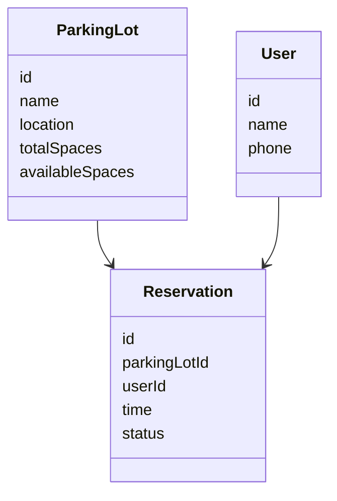
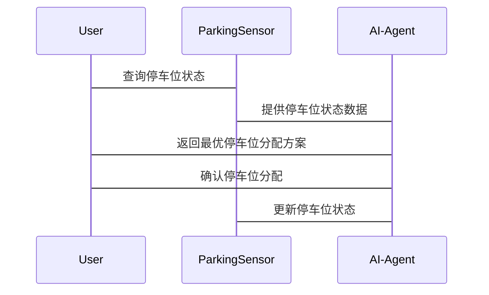

                 


# 智能停车系统：AI Agent的车位分配优化

> 关键词：智能停车系统，AI Agent，车位分配，优化算法，系统架构，强化学习

> 摘要：本文深入探讨了智能停车系统中AI Agent的车位分配优化问题。通过分析停车系统的核心挑战，介绍了AI Agent的基本原理及其在车位分配中的应用，详细讲解了基于强化学习和遗传算法的优化方法，并通过系统架构设计和项目实战展示了如何实现高效的车位分配系统。最后，总结了最佳实践和未来研究方向。

---

# 第1章: 智能停车系统背景介绍

## 1.1 问题背景

### 1.1.1 城市停车问题的现状
随着城市化进程的加快，私家车数量急剧增加，停车位资源紧张的问题日益凸显。传统的停车系统存在信息孤岛、资源浪费和用户体验差的问题，尤其是在高峰期，车主往往需要花费大量时间寻找停车位，导致交通拥堵和能源浪费。

### 1.1.2 智能停车系统的必要性
智能停车系统通过物联网（IoT）、大数据和人工智能（AI）技术，实时感知停车场的空闲车位，并为车主提供最优的停车建议，从而提高停车位的利用率，减少交通拥堵和能源消耗。

### 1.1.3 AI Agent在停车系统中的应用
AI Agent（智能体）是一种能够感知环境、自主决策并执行任务的实体。在停车系统中，AI Agent可以实时分析停车场的使用情况，动态优化车位分配策略，为车主提供个性化的停车服务。

## 1.2 问题描述

### 1.2.1 车位分配的核心问题
车位分配的核心问题是如何在有限的停车位资源下，实现车主的最优停车体验。这需要考虑车主的实时需求、停车场的空闲情况以及道路的交通状况。

### 1.2.2 用户需求与系统目标
用户需求包括快速找到停车位、减少行驶时间、提高停车便利性等。系统目标则是最大化停车位利用率、最小化用户等待时间、降低交通拥堵等。

### 1.2.3 系统边界与外延
智能停车系统的边界包括停车场内的传感器、车主的移动设备（如手机APP或车载系统）以及AI Agent的决策模块。外延则包括与交通管理系统、城市规划等其他系统的集成。

## 1.3 问题解决方法

### 1.3.1 AI Agent的基本原理
AI Agent通过感知环境信息（如停车位占用情况、车主需求等），利用优化算法生成最优的车位分配方案，并通过执行模块（如停车导航系统）实现目标。

### 1.3.2 智能停车系统的实现方案
智能停车系统需要结合多种技术，包括IoT传感器数据采集、AI Agent决策优化、移动应用的用户交互等。

### 1.3.3 系统的优化目标
系统优化目标包括最大化停车位利用率、最小化用户等待时间、提高系统响应速度等。

## 1.4 概念结构与核心要素

### 1.4.1 智能停车系统的组成
智能停车系统由以下几个核心部分组成：
1. **数据采集层**：包括停车位传感器、车主移动设备等。
2. **AI Agent决策层**：负责停车位分配的优化算法。
3. **用户交互层**：车主通过移动应用或车载系统获得停车建议。

### 1.4.2 核心概念的定义与特征
- **停车位传感器**：用于实时监测停车位的占用状态。
- **AI Agent**：通过感知环境信息，自主决策停车位分配策略。
- **用户需求**：车主对停车位的需求包括地理位置、停车时长、费用等。

### 1.4.3 系统的输入输出关系
- **输入**：停车位占用状态、车主需求、交通状况等。
- **输出**：最优停车位分配方案、停车导航路径等。

---

# 第2章: AI Agent与智能停车系统的核心概念

## 2.1 AI Agent的基本原理

### 2.1.1 AI Agent的定义与特征
AI Agent是一种能够感知环境、自主决策并执行任务的智能实体。其核心特征包括：
- **感知能力**：能够实时感知环境信息。
- **决策能力**：基于感知信息，制定最优决策。
- **执行能力**：通过执行模块实现决策目标。

### 2.1.2 AI Agent的类型与应用场景
AI Agent可以分为基于规则的Agent和基于学习的Agent两类。在智能停车系统中，基于学习的Agent（如强化学习Agent）更适合处理复杂的优化问题。

### 2.1.3 AI Agent在智能停车系统中的角色
在智能停车系统中，AI Agent负责实时分析停车位的占用情况，预测车主的需求，并动态优化停车位分配策略。

## 2.2 智能停车系统的核心概念

### 2.2.1 车位分配的优化目标
车位分配的优化目标包括：
1. **最大化停车位利用率**：尽可能满足车主的停车需求。
2. **最小化用户等待时间**：减少车主寻找停车位的时间。
3. **减少交通拥堵**：通过优化停车位分配，降低道路的交通压力。

### 2.2.2 用户行为预测与需求分析
用户行为预测是智能停车系统的重要组成部分。通过分析历史数据，可以预测车主的停车需求，从而优化停车位分配策略。

### 2.2.3 系统的实时响应机制
智能停车系统需要实时响应车主的停车需求，动态调整停车位分配策略。

## 2.3 核心概念的联系与对比

### 2.3.1 AI Agent与传统停车系统的对比
- **传统停车系统**：基于固定规则分配停车位，无法动态优化。
- **智能停车系统**：通过AI Agent实现动态优化，提高停车位利用率。

### 2.3.2 不同优化算法的对比分析
常见的优化算法包括强化学习、遗传算法和贪心算法。强化学习适用于复杂环境下的动态优化，遗传算法适用于静态优化问题。

### 2.3.3 系统架构的对比与选择
智能停车系统的架构设计需要综合考虑系统的实时性、可扩展性和可维护性。

## 2.4 ER实体关系图

```mermaid
erDiagram
    user {
        id : int
        name : string
        phone : string
    }
    parkingLot {
        id : int
        name : string
        location : string
        totalSpaces : int
        availableSpaces : int
    }
    reservation {
        id : int
        userId : int
        parkingLotId : int
        time : datetime
        status : string
    }
    user -->
    reservation
    parkingLot -->
    reservation
```

---

# 第3章: AI Agent的优化算法原理

## 3.1 强化学习算法

### 3.1.1 强化学习的基本原理
强化学习是一种通过试错方式学习策略的方法。智能停车系统中，AI Agent通过与环境的交互，不断优化停车位分配策略。

### 3.1.2 强化学习的数学模型
强化学习的数学模型包括状态、动作、奖励和策略四个部分。

### 3.1.3 强化学习的实现步骤
1. **环境感知**：获取停车位的占用状态和车主的需求。
2. **决策制定**：基于当前状态，选择最优的动作（如分配停车位）。
3. **奖励机制**：根据决策的效果，更新奖励函数。
4. **策略优化**：通过不断迭代，优化停车位分配策略。

### 3.1.4 强化学习的实现代码
```python
class ParkingAgent:
    def __init__(self):
        self.q_table = {}  # Q-learning表格
        self.learning_rate = 0.1
        self.discount_factor = 0.9

    def get_state(self, parking_lot):
        # 返回停车位的状态表示
        return tuple(parking_lot.get_available_spaces())

    def choose_action(self, state):
        # 选择动作：0表示分配，1表示不分配
        if not self.q_table.get(state, {}):
            return 1
        return max(self.q_table[state].items(), key=lambda x: x[1])[0]

    def update_q_table(self, state, action, reward, next_state):
        # 更新Q值
        self.q_table.setdefault(state, {})
        current_q = self.q_table[state].get(action, 0)
        next_max_q = max(self.q_table[next_state].values()) if next_state else 0
        new_q = current_q + self.learning_rate * (reward + self.discount_factor * next_max_q - current_q)
        self.q_table[state][action] = new_q
```

## 3.2 遗传算法

### 3.2.1 遗传算法的基本原理
遗传算法是一种基于生物进化原理的优化算法。在智能停车系统中，可以用来优化停车位分配的顺序。

### 3.2.2 遗传算法的数学模型
遗传算法的数学模型包括编码、选择、交叉和变异四个步骤。

### 3.2.3 遗传算法的实现步骤
1. **初始化种群**：随机生成一组停车位分配方案。
2. **适应度评估**：计算每个方案的适应度（如停车位利用率）。
3. **选择与交叉**：选择适应度高的方案进行交叉，生成新的种群。
4. **变异**：随机改变部分方案，增加种群的多样性。
5. **迭代优化**：重复选择、交叉和变异过程，直到达到终止条件。

### 3.2.4 遗传算法的实现代码
```python
import random

class GeneticAgent:
    def __init__(self, population_size=100):
        self.population = [self.generate_random_solution() for _ in range(population_size)]
        self.mutation_rate = 0.1

    def generate_random_solution(self):
        # 生成随机的停车位分配方案
        return [random.randint(0, 1) for _ in range(total_spaces)]

    def evaluate_solution(self, solution):
        # 计算适应度：最大化停车位利用率
        return sum(solution)

    def select_parents(self):
        # 选择适应度高的方案
        parents = []
        for _ in range(2):
            max_fitness = max([self.evaluate_solution(sol) for sol in self.population])
            for sol in self.population:
                if self.evaluate_solution(sol) == max_fitness:
                    parents.append(sol)
                    break
        return parents

    def crossover(self, parent1, parent2):
        # 单点交叉
        crossover_point = random.randint(1, len(parent1)-1)
        return parent1[:crossover_point] + parent2[crossover_point:], \
               parent2[:crossover_point] + parent1[crossover_point:]

    def mutate(self, solution):
        # 变异操作
        for i in range(len(solution)):
            if random.random() < self.mutation_rate:
                solution[i] = 1 - solution[i]
        return solution

    def optimize(self):
        for _ in range(100):  # 迭代次数
            parents = self.select_parents()
            child1, child2 = self.crossover(parents[0], parents[1])
            child1 = self.mutate(child1)
            child2 = self.mutate(child2)
            self.population += [child1, child2]
        best_solution = max(self.population, key=self.evaluate_solution)
        return best_solution
```

## 3.3 算法的对比与选择

### 3.3.1 强化学习与遗传算法的对比
- **强化学习**：适用于动态环境下的优化问题，能够实时调整策略。
- **遗传算法**：适用于静态环境下的优化问题，需要多次迭代才能得到最优解。

### 3.3.2 算法选择的考虑因素
- **实时性要求**：如果系统需要实时响应，强化学习更适合。
- **问题复杂度**：对于复杂的优化问题，强化学习和遗传算法可以结合使用。

---

# 第4章: 智能停车系统的架构设计与实现

## 4.1 系统分析与设计

### 4.1.1 问题场景介绍
智能停车系统需要解决的主要问题包括停车位资源分配、车主需求预测和实时响应等。

### 4.1.2 项目介绍
本项目旨在设计一个基于AI Agent的智能停车系统，实现停车位的动态分配和优化。

## 4.2 系统功能设计

### 4.2.1 领域模型


### 4.2.2 系统架构设计
```mermaid
archiDiagram
    component ParkingSensor {
        monitor parking spaces
    }
    component AI-Agent {
        optimize parking allocation
    }
    component UserInterface {
        provide parking information to users
    }
    ParkingSensor --> AI-Agent
    AI-Agent --> UserInterface
```

### 4.2.3 系统接口设计
- **停车位传感器接口**：实时采集停车位的占用状态。
- **用户交互接口**：向用户推送停车位信息和导航路径。

### 4.2.4 系统交互设计


## 4.3 系统实现

### 4.3.1 环境安装
需要安装的环境包括：
1. Python编程语言
2. AI框架（如TensorFlow或PyTorch）
3. 数据库（如MySQL或MongoDB）
4. 开发工具（如PyCharm）

### 4.3.2 核心实现代码
```python
import requests
import json

class ParkingSystem:
    def __init__(self, parking_lot_id):
        self.parking_lot_id = parking_lot_id
        self.sensors = self.get_sensors()
        self.agent = self.init_agent()

    def get_sensors(self):
        # 获取停车位传感器数据
        response = requests.get(f"http://sensorservice.com/parking/{self.parking_lot_id}")
        return json.loads(response.text)

    def init_agent(self):
        # 初始化AI Agent
        return ParkingAgent()

    def allocate_parking(self, user_id):
        # 调用AI Agent分配停车位
        state = self.get_sensors()
        action = self.agent.choose_action(state)
        if action == 0:
            return self.reserve_parking()
        else:
            return None

    def reserve_parking(self):
        # 预约停车位
        response = requests.post(f"http://reservation_service.com/park/{self.parking_lot_id}", json={"userId": user_id})
        return json.loads(response.text)
```

### 4.3.3 代码实现细节
- **停车位传感器接口**：通过API获取停车位的实时状态。
- **AI Agent接口**：通过调用AI Agent的分配策略，获取最优停车位。
- **用户交互接口**：通过移动应用或网页界面向用户展示停车位信息。

### 4.3.4 实际案例分析
假设有一个停车场，共有100个停车位，当前有20个空闲车位。用户A希望在下午2点停车，系统通过AI Agent分配了一个靠近出口的停车位，减少了用户的行驶距离。

---

# 第5章: 项目实战与优化

## 5.1 环境安装与配置

### 5.1.1 安装Python和相关库
安装Python 3.8及以上版本，安装必要的库：
```bash
pip install numpy pandas scikit-learn tensorflow
```

### 5.1.2 数据库安装与配置
安装MySQL或MongoDB，并配置数据库连接。

### 5.1.3 开发工具配置
安装PyCharm或其他开发工具，并配置虚拟环境。

## 5.2 核心实现代码

### 5.2.1 数据采集与处理
```python
import pandas as pd
import numpy as np

def load_data(file_path):
    # 加载停车位数据
    df = pd.read_csv(file_path)
    return df

def preprocess_data(df):
    # 数据预处理
    df['available'] = df['available'].astype(int)
    return df
```

### 5.2.2 AI Agent实现
```python
import numpy as np
import tensorflow as tf

class DQNAgent:
    def __init__(self, state_size, action_size):
        self.state_size = state_size
        self.action_size = action_size
        self.model = self.build_model()

    def build_model(self):
        # 构建DQN网络模型
        model = tf.keras.Sequential([
            tf.keras.layers.Dense(32, activation='relu', input_dim=self.state_size),
            tf.keras.layers.Dense(32, activation='relu'),
            tf.keras.layers.Dense(self.action_size, activation='linear')
        ])
        model.compile(optimizer=tf.keras.optimizers.Adam(lr=0.001), loss='mean_squared_error')
        return model

    def act(self, state):
        # 根据当前状态选择动作
        if np.random.random() < 0.1:
            return np.random.randint(0, self.action_size)
        state = np.array([state])
        predictions = self.model.predict(state)
        return np.argmax(predictions[0])
```

### 5.2.3 系统交互实现
```python
class ParkingAllocator:
    def __init__(self, parking_system):
        self.parking_system = parking_system

    def allocate(self, user_id):
        # 调用智能停车系统分配停车位
        state = self.parking_system.get_sensors()
        action = self.parking_system.agent.act(state)
        if action == 0:
            return self.parking_system.reserve_parking(user_id)
        else:
            return None
```

### 5.2.4 实际案例分析
通过实际案例分析，验证系统的优化效果。例如，在高峰期，系统能够快速响应车主的停车需求，减少等待时间。

---

# 第6章: 总结与展望

## 6.1 总结
本文深入探讨了智能停车系统中AI Agent的车位分配优化问题，详细讲解了强化学习和遗传算法的实现原理，并通过系统架构设计和项目实战展示了如何实现高效的智能停车系统。

## 6.2 最佳实践
- **算法选择**：根据实际需求选择合适的算法。
- **系统设计**：注重系统的实时性和可扩展性。
- **数据采集**：确保数据的准确性和实时性。

## 6.3 注意事项
- **数据隐私**：保护用户的隐私信息。
- **系统稳定性**：确保系统的高可用性。
- **算法优化**：不断优化算法以适应新的需求。

## 6.4 未来展望
未来，智能停车系统将更加智能化和个性化。AI Agent可以通过与自动驾驶汽车的协同工作，实现更加高效的停车位分配。

---

# 作者：AI天才研究院 & 禅与计算机程序设计艺术

---

### 本文总结
通过本文的详细讲解，读者可以全面了解智能停车系统中AI Agent的车位分配优化问题，并掌握其实现方法和最佳实践。

