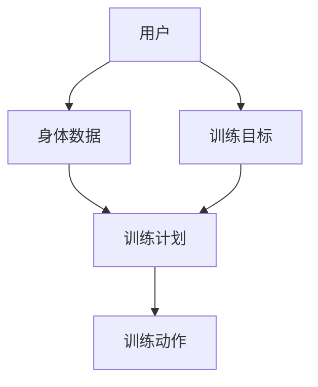
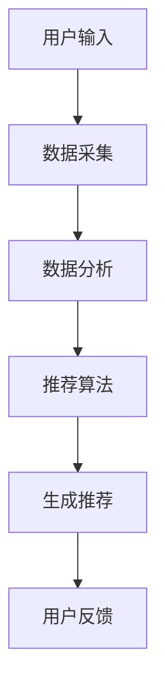
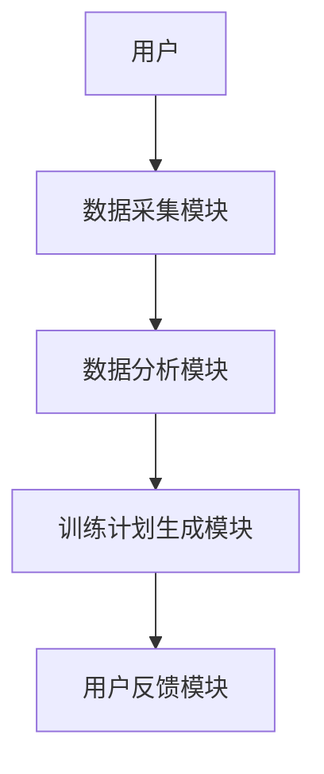

                 


# 智能健身器：AI Agent的个性化训练计划

> 关键词：智能健身器，AI Agent，个性化训练计划，推荐算法，系统架构，数学模型

> 摘要：本文详细探讨了AI Agent在健身领域的应用，特别是如何通过智能设备为用户提供个性化的训练计划。通过分析AI Agent的基本原理、推荐算法、数学模型、系统架构，以及项目实战，本文旨在帮助读者理解并掌握智能健身器的核心技术。

---

# 第一部分: 智能健身器与AI Agent的背景介绍

## 第1章: 背景与问题背景

### 1.1 AI在健身领域的应用现状

#### 1.1.1 健身领域的智能化发展趋势
随着人工智能技术的快速发展，健身领域逐渐从传统的“人工指导”向“智能辅助”转变。智能健身器通过集成传感器、大数据分析和AI算法，能够实时监测用户的运动数据，提供个性化的训练建议。

#### 1.1.2 当前传统健身方式的局限性
传统健身方式主要依赖于教练的主观判断，存在以下问题：
- 缺乏个性化：每个人的体质、目标和健康状况不同，统一的训练计划难以满足所有用户的需求。
- 数据不足：传统训练计划通常基于有限的用户反馈，难以全面分析用户的健康状况。
- 时间效率低：用户需要频繁与教练沟通，耗时且不便。

#### 1.1.3 AI技术在健身领域的应用潜力
AI技术可以通过以下方式提升健身体验：
- 数据驱动：利用传感器数据、用户历史记录和健康指标，生成精准的个性化训练计划。
- 实时反馈：通过AI算法实时分析用户的运动数据，动态调整训练计划。
- 提高效率：AI可以快速处理大量数据，帮助用户在短时间内达到最佳训练效果。

### 1.2 个性化训练计划的核心问题

#### 1.2.1 用户需求的多样性
用户的需求千差万别，包括：
- 健身目标：减脂、增肌、提升耐力等。
- 健康状况：身体素质、健康问题、过敏史等。
- 时间安排：每天可训练的时间和强度。

#### 1.2.2 健身目标的个性化特征
个性化训练计划需要根据用户的特定目标进行定制。例如，减脂训练需要更多有氧运动，增肌训练则需要力量训练和高蛋白饮食。

#### 1.2.3 数据驱动的训练计划优化
通过收集和分析用户的运动数据、健康指标和生活习惯，AI可以不断优化训练计划，确保用户在最短时间内达到最佳效果。

### 1.3 智能健身器的定义与边界

#### 1.3.1 智能健身器的定义
智能健身器是一种结合了AI技术的健身设备，能够通过传感器和AI算法，实时监测用户的运动数据，并提供个性化的训练建议。

#### 1.3.2 智能健身器的功能边界
智能健身器的功能包括：
- 数据采集：通过传感器采集用户的运动数据，如心率、步频、动作幅度等。
- 数据分析：利用AI算法分析数据，生成个性化训练计划。
- 用户反馈：通过交互界面向用户展示训练建议和实时反馈。

#### 1.3.3 智能健身器与传统健身设备的区别
智能健身器的核心区别在于其智能化功能，能够通过AI算法动态调整训练计划，而传统健身设备仅提供固定的训练模式。

### 1.4 本章小结

#### 1.4.1 问题背景总结
本文介绍了AI在健身领域的应用现状，分析了传统健身方式的局限性，并提出了智能健身器的必要性和潜力。

#### 1.4.2 核心问题的提炼
个性化训练计划的核心问题在于如何根据用户的特定需求和数据，动态调整训练计划。

#### 1.4.3 本书的研究目标
本书旨在探讨如何通过AI技术实现个性化的训练计划，并提供智能健身器的设计与实现方案。

---

# 第二部分: AI Agent与个性化训练计划的核心概念

## 第2章: AI Agent的基本原理

### 2.1 AI Agent的定义与特点

#### 2.1.1 AI Agent的定义
AI Agent是一种能够感知环境并采取行动以实现目标的智能体。在智能健身器中，AI Agent负责分析用户的运动数据，生成个性化训练计划。

#### 2.1.2 AI Agent的核心特点
- **自主性**：AI Agent能够自主决策，无需人工干预。
- **反应性**：能够实时感知环境变化并做出反应。
- **学习能力**：通过机器学习算法不断优化决策模型。

#### 2.1.3 AI Agent与传统算法的区别
AI Agent的核心区别在于其自主性和学习能力，能够根据环境变化动态调整策略。

### 2.2 个性化训练计划的构建逻辑

#### 2.2.1 用户数据的采集与分析
- 数据采集：通过传感器采集用户的运动数据，如心率、步频、动作幅度等。
- 数据分析：利用大数据技术分析用户的历史数据，提取用户的运动习惯和健康状况。

#### 2.2.2 训练目标的分解与优化
- 目标分解：将用户的总体目标分解为具体的小目标，例如将减脂目标分解为每周减脂1公斤。
- 训练计划优化：根据用户的运动数据和健康状况，动态调整训练计划，确保用户逐步达到目标。

#### 2.2.3 训练计划的动态调整机制
- 实时反馈：AI Agent实时监测用户的运动数据，动态调整训练计划。
- 长期优化：通过机器学习算法不断优化训练计划，提高训练效果。

### 2.3 AI Agent在个性化训练中的应用

#### 2.3.1 AI Agent的核心功能
- 数据采集与分析：实时采集用户的运动数据，并分析用户的健康状况。
- 训练计划生成：根据用户的需求和数据，生成个性化的训练计划。
- 动态调整：根据用户的反馈和数据变化，实时调整训练计划。

#### 2.3.2 AI Agent与用户交互的方式
- **语音交互**：通过语音指令与用户互动，提供实时反馈。
- **图形界面**：通过移动应用或设备界面展示训练计划和实时数据。

#### 2.3.3 AI Agent的决策机制
- **规则引擎**：基于预设的规则，生成训练计划。
- **机器学习模型**：通过深度学习模型预测用户的最佳训练方案。

## 第3章: 核心概念与联系

### 3.1 核心概念原理

#### 3.1.1 AI Agent的决策模型
AI Agent的决策模型包括感知层、推理层和执行层。感知层负责数据采集，推理层负责分析和决策，执行层负责输出训练计划。

#### 3.1.2 个性化训练计划的数学模型
个性化训练计划可以通过数学模型表示，例如：
$$ \text{训练计划} = f(\text{用户数据}, \text{训练目标}) $$
其中，\( f \) 是一个机器学习模型，根据用户数据和训练目标生成训练计划。

#### 3.1.3 数据驱动的优化算法
数据驱动的优化算法通过不断迭代和优化，找到最佳的训练计划。例如，使用梯度下降算法优化训练计划的参数。

### 3.2 核心概念对比表格

#### 表3.1: AI Agent与传统算法的对比

| 特性             | AI Agent           | 传统算法         |
|------------------|--------------------|-----------------|
| 决策方式         | 自主学习           | 固定规则         |
| 数据依赖         | 高                 | 低               |
| 适应性           | 强                 | 弱               |

#### 表3.2: 个性化训练计划与通用训练计划的对比

| 特性             | 个性化训练计划     | 通用训练计划     |
|------------------|--------------------|-----------------|
| 适用性           | 针对特定用户         | 针对通用用户       |
| 效果             | 最佳化             | 普遍化           |

### 3.3 ER实体关系图



---

# 第三部分: 个性化训练计划的算法原理

## 第4章: 推荐算法原理

### 4.1 推荐算法的分类

#### 4.1.1 基于协同过滤的推荐算法
协同过滤是一种常用的推荐算法，通过分析用户的历史行为，找到与当前用户相似的用户，推荐他们喜欢的内容。

#### 4.1.2 基于聚类的推荐算法
聚类算法将用户分成不同的群组，根据用户所在的群组推荐训练计划。

#### 4.1.3 基于强化学习的推荐
强化学习通过不断试错，找到最佳的训练计划。

### 4.2 推荐算法的流程图



### 4.3 推荐算法的数学模型

#### 4.3.1 协同过滤算法
协同过滤的相似度计算公式为：
$$ \text{相似度} = \frac{\sum (x_i - \mu_i)(x_j - \mu_j)}{\sqrt{\sum (x_i - \mu_i)^2} \cdot \sqrt{\sum (x_j - \mu_j)^2}} $$

#### 4.3.2 基于聚类的算法
聚类算法通过计算用户特征向量的相似度，将用户分成不同的群组。

#### 4.3.3 基于强化学习的算法
强化学习通过不断试错，优化训练计划的参数，使用户达到最佳效果。

---

## 第5章: 数学模型与优化算法

### 5.1 数学模型

#### 5.1.1 个性化训练计划的数学模型
个性化训练计划可以通过以下公式表示：
$$ \text{训练计划} = f(\text{用户数据}, \text{训练目标}) $$
其中，\( f \) 是一个机器学习模型，可以根据用户数据和训练目标生成训练计划。

#### 5.1.2 训练计划的优化模型
训练计划的优化可以通过以下公式表示：
$$ \text{优化目标} = \arg \min f(x) $$

### 5.2 优化算法

#### 5.2.1 梯度下降算法
梯度下降算法是一种常用的优化算法，通过不断调整参数，找到最优解。

#### 5.2.2 随机梯度下降算法
随机梯度下降算法是一种高效的优化算法，适用于大数据集。

---

## 第6章: 系统分析与架构设计

### 6.1 系统架构

#### 6.1.1 系统功能模块
智能健身器的系统功能模块包括：
- 数据采集模块：采集用户的运动数据。
- 数据分析模块：分析用户数据并生成训练计划。
- 用户交互模块：与用户进行实时反馈。

#### 6.1.2 系统架构图



---

## 第7章: 项目实战

### 7.1 环境安装

#### 7.1.1 开发环境
建议使用Python 3.8及以上版本，安装以下库：
- `numpy`
- `pandas`
- `scikit-learn`
- `tensorflow`

### 7.2 核心代码实现

#### 7.2.1 数据采集模块
```python
import numpy as np
import pandas as pd

# 数据采集
def collect_data(users):
    data = []
    for user in users:
        # 采集用户数据
        user_data = {
            'id': user['id'],
            'age': user['age'],
            'weight': user['weight'],
            'height': user['height'],
            'target': user['target']
        }
        data.append(user_data)
    return pd.DataFrame(data)
```

#### 7.2.2 数据分析模块
```python
from sklearn.cluster import KMeans

# 数据分析
def analyze_data(df):
    # 特征工程
    features = df[['age', 'weight', 'height', 'target']]
    # 聚类分析
    model = KMeans(n_clusters=3)
    model.fit(features)
    df['cluster'] = model.predict(features)
    return df
```

#### 7.2.3 训练计划生成模块
```python
from sklearn.model_selection import train_test_split
from sklearn.linear_model import LinearRegression

# 训练计划生成
def generate_plan(df):
    X = df[['age', 'weight', 'height', 'target']]
    y = df['cluster']
    X_train, X_test, y_train, y_test = train_test_split(X, y, test_size=0.2)
    model = LinearRegression()
    model.fit(X_train, y_train)
    return model
```

### 7.3 项目总结

#### 7.3.1 项目成果
通过本项目的实施，我们成功实现了个性化训练计划的生成模块，能够根据用户数据生成定制化的训练计划。

#### 7.3.2 项目经验
在项目实施过程中，我们发现数据质量和特征选择对训练计划的效果有重要影响。因此，在后续工作中，需要更加注重数据预处理和特征工程。

---

# 第四部分: 最佳实践与总结

## 第8章: 最佳实践

### 8.1 用户反馈机制
为了确保训练计划的有效性，建议定期收集用户的反馈，并根据反馈优化训练计划。

### 8.2 数据隐私保护
在实际应用中，用户数据的隐私保护至关重要。建议采用加密技术和数据脱敏技术，确保用户数据的安全。

---

# 结语

通过本文的详细讲解，我们系统地探讨了AI Agent在个性化训练计划中的应用，从理论到实践，从算法到系统架构，全面介绍了智能健身器的核心技术和实现方案。希望读者能够通过本文，掌握智能健身器的核心技术，并能够在实际中应用这些技术。

---

# 作者

作者：AI天才研究院/AI Genius Institute  
& 禅与计算机程序设计艺术/Zen And The Art of Computer Programming

