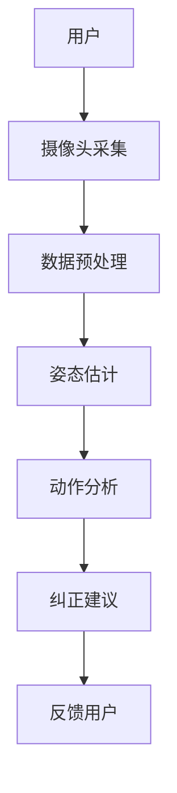
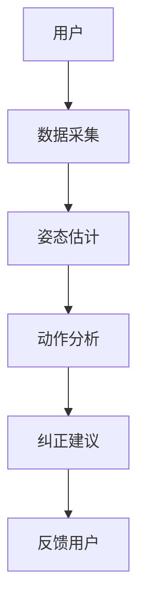
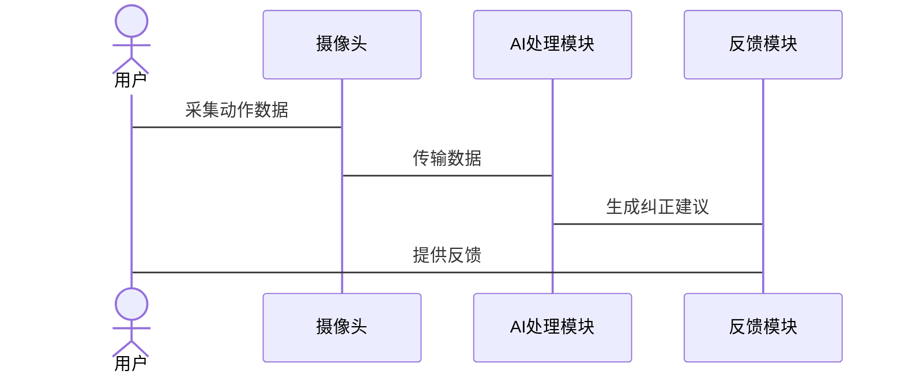

                 


# 智能健身镜：AI Agent的动作纠正

> **关键词**：智能健身镜, AI Agent, 动作纠正, 姿态估计, 人工智能, 机器学习

> **摘要**：  
> 智能健身镜是一种结合了人工智能技术的健身工具，通过AI Agent实现对用户动作的实时纠正。本文从技术原理、系统架构到项目实现，全面解析智能健身镜的动作纠正功能。文章首先介绍智能健身镜的背景与需求，随后深入分析AI Agent的动作纠正原理，结合姿态估计算法和数学模型，详细阐述其实现过程。最后，通过系统架构设计和项目实战，展示如何将AI技术应用于智能健身镜的实际开发中，为读者提供一份完整的技术实现指南。

---

# 第一部分: 背景介绍

## 第1章: 智能健身镜与AI Agent概述

### 1.1 问题背景与描述

#### 1.1.1 传统健身方式的局限性
传统健身方式依赖于人工指导，用户在独自练习时容易因缺乏反馈而产生动作偏差。例如，哑铃训练中，用户可能因姿势不正确而导致受伤或训练效果不佳。

#### 1.1.2 智能健身镜的出现与需求
智能健身镜通过将镜子与AI技术结合，提供实时的动作指导和纠正。这种设备能够帮助用户在家完成高效的健身训练，同时避免了传统健身方式的局限性。

#### 1.1.3 AI Agent在健身领域的应用前景
AI Agent（智能代理）通过感知用户动作、分析数据并提供反馈，能够显著提升健身训练的效果和安全性。AI Agent的应用不仅提高了用户体验，还降低了健身指导的成本。

### 1.2 问题解决与边界

#### 1.2.1 智能健身镜的功能边界
智能健身镜的核心功能包括：
- **动作识别**：通过摄像头采集用户动作数据。
- **动作纠正**：基于AI算法分析数据，识别动作偏差并提供纠正建议。
- **实时反馈**：通过语音或视觉方式实时指导用户调整动作。

#### 1.2.2 AI Agent在动作纠正中的作用
AI Agent负责处理以下关键任务：
- 数据采集与预处理
- 姿态估计与动作分析
- 动作纠正与反馈生成

#### 1.2.3 问题解决的可行性分析
- **技术可行性**：AI技术在姿态估计领域的快速发展为智能健身镜提供了技术支持。
- **用户需求**：现代用户对便捷、高效的健身方式需求日益增长。
- **市场潜力**：智能健身镜作为一种新兴的健身工具，市场前景广阔。

### 1.3 概念结构与核心要素

#### 1.3.1 智能健身镜的核心要素
智能健身镜的核心要素包括：
- **硬件设备**：摄像头、显示屏、扬声器等。
- **AI算法**：姿态估计、动作纠正算法。
- **用户交互**：语音反馈、视觉提示。

#### 1.3.2 AI Agent的属性特征对比
| 属性       | 传统健身镜             | 智能健身镜（AI Agent） |
|------------|-----------------------|-----------------------|
| 数据采集   | 无                     | 基于摄像头采集用户动作数据 |
| 数据处理   | 无                     | 使用AI算法进行数据处理和分析 |
| 用户反馈   | 无                     | 提供实时语音或视觉反馈 |

#### 1.3.3 概念结构的ER实体关系图
```mermaid
er
actor: 用户
mirror: 智能健身镜
camera: 摄像头
algorithm: AI算法
feedback: 反馈信息
```

---

# 第二部分: 核心概念与联系

## 第2章: AI Agent的动作纠正原理

### 2.1 AI Agent的定义与原理

#### 2.1.1 AI Agent的基本概念
AI Agent是一种能够感知环境、执行任务的智能实体。在智能健身镜中，AI Agent负责采集用户动作数据、分析数据并提供反馈。

#### 2.1.2 动作纠正的核心原理
动作纠正的核心原理包括：
1. **数据采集**：通过摄像头采集用户的动作数据。
2. **数据处理**：将采集的数据转化为可分析的格式。
3. **姿态估计**：利用AI算法（如深度学习）估计用户的姿态。
4. **动作分析**：识别动作偏差并生成纠正建议。

#### 2.1.3 AI Agent与智能健身镜的结合
AI Agent与智能健身镜的结合使得健身镜能够实时感知用户动作，并通过反馈优化用户的训练效果。

### 2.2 动作纠正的流程图



---

# 第三部分: 算法原理讲解

## 第3章: 动作纠正算法的数学模型

### 3.1 数据采集与预处理

#### 3.1.1 姿态估计的数学模型
姿态估计通常基于深度学习模型（如姿态检测网络）。以下是姿态检测的简化流程：

1. **数据输入**：输入RGB图像。
2. **特征提取**：通过卷积神经网络提取图像特征。
3. **姿态预测**：基于特征预测人体关键点坐标。

#### 3.1.2 数据预处理的数学公式
常见的数据预处理方法包括归一化和标准化。归一化公式为：
$$x' = \frac{x - x_{\text{min}}}{x_{\text{max}} - x_{\text{min}}}$$

#### 3.1.3 数据标准化的流程
数据标准化流程包括：
1. **归一化处理**：将数据缩放到0-1范围。
2. **坐标转换**：将图像坐标转换为世界坐标。

### 3.2 AI算法的核心模型

#### 3.2.1 基于深度学习的模型
常用的深度学习模型包括：
- **YOLO**：用于目标检测。
- **Hourglass Network**：专门用于姿态估计。

#### 3.2.2 姿态估计的数学公式
姿态估计模型的损失函数通常包括：
$$L = L_{\text{reg}} + \lambda L_{\text{cls}}$$
其中，$L_{\text{reg}}$是回归损失，$L_{\text{cls}}$是分类损失，$\lambda$是超参数。

#### 3.2.3 模型训练的数学推导
模型训练过程包括：
1. **前向传播**：计算预测值。
2. **计算损失**：计算真实值与预测值的差异。
3. **反向传播**：更新模型参数。

---

# 第四部分: 系统分析与架构设计

## 第4章: 智能健身镜系统的架构

### 4.1 系统功能设计

#### 4.1.1 用户需求分析
用户需求包括：
- 实时动作纠正
- 多种训练模式
- 个性化反馈

#### 4.1.2 功能模块划分
智能健身镜系统包括以下功能模块：
- **数据采集模块**：负责采集用户动作数据。
- **AI处理模块**：负责姿态估计和动作分析。
- **反馈模块**：负责将纠正建议反馈给用户。

#### 4.1.3 功能流程图


### 4.2 系统架构设计

#### 4.2.1 系统架构图
```mermaid
container 客户端 {
  component 摄像头
  component 显示屏
  component AI处理模块
}
container 服务器端 {
  component 姿态估计模型
  component 动作纠正算法
}
```

#### 4.2.2 系统接口设计
系统接口包括：
- **摄像头接口**：用于数据采集。
- **反馈接口**：用于将纠正建议反馈给用户。

#### 4.2.3 系统交互流程图


---

# 第五部分: 项目实战

## 第5章: 智能健身镜的开发与实现

### 5.1 环境搭建与配置

#### 5.1.1 环境需求
- **硬件**：摄像头、显示屏、计算设备。
- **软件**：Python、深度学习框架（如TensorFlow）。

#### 5.1.2 开发工具安装
- **安装Python**：`python --version`
- **安装TensorFlow**：`pip install tensorflow`

### 5.2 系统核心实现

#### 5.2.1 数据采集与预处理
```python
import cv2

def capture_image():
    cap = cv2.VideoCapture(0)
    ret, frame = cap.read()
    cap.release()
    return frame
```

#### 5.2.2 姿态估计与动作分析
```python
import tensorflow as tf

model = tf.keras.load_model('pose_estimation_model.h5')
def estimate_pose(image):
    prediction = model.predict(tf.expand_dims(image, axis=0))
    return prediction[0]
```

#### 5.2.3 反馈生成与展示
```python
def generate_feedback(prediction):
    if prediction['shoulders'] < threshold:
        return "肩膀要保持水平！"
    else:
        return "动作正确，继续保持！"
```

### 5.3 实际案例分析

#### 5.3.1 案例描述
用户在进行深蹲训练时，AI Agent实时监测其动作，并提供纠正建议。

#### 5.3.2 系统运行结果
- **正常动作**：AI Agent反馈“动作正确，继续保持！”。
- **动作偏差**：AI Agent反馈“背部要保持挺直！”。

---

# 第六部分: 总结与展望

## 第6章: 总结与未来展望

### 6.1 系统总结
智能健身镜通过AI Agent实现了动作纠正功能，显著提升了用户的健身体验。

### 6.2 优化建议
- **算法优化**：进一步提高姿态估计的精度。
- **用户体验**：增加更多的反馈方式（如手势反馈）。

### 6.3 未来展望
随着AI技术的不断进步，智能健身镜将更加智能化，能够提供更加个性化的健身指导。

---

# 作者：AI天才研究院 & 禅与计算机程序设计艺术

---

这篇文章从背景、技术原理到项目实现，全面解析了智能健身镜的动作纠正功能。通过详细的算法讲解和系统设计，为读者提供了一份完整的开发指南。

