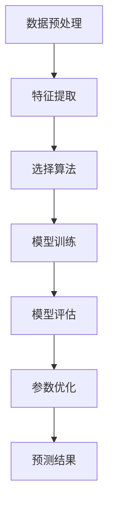
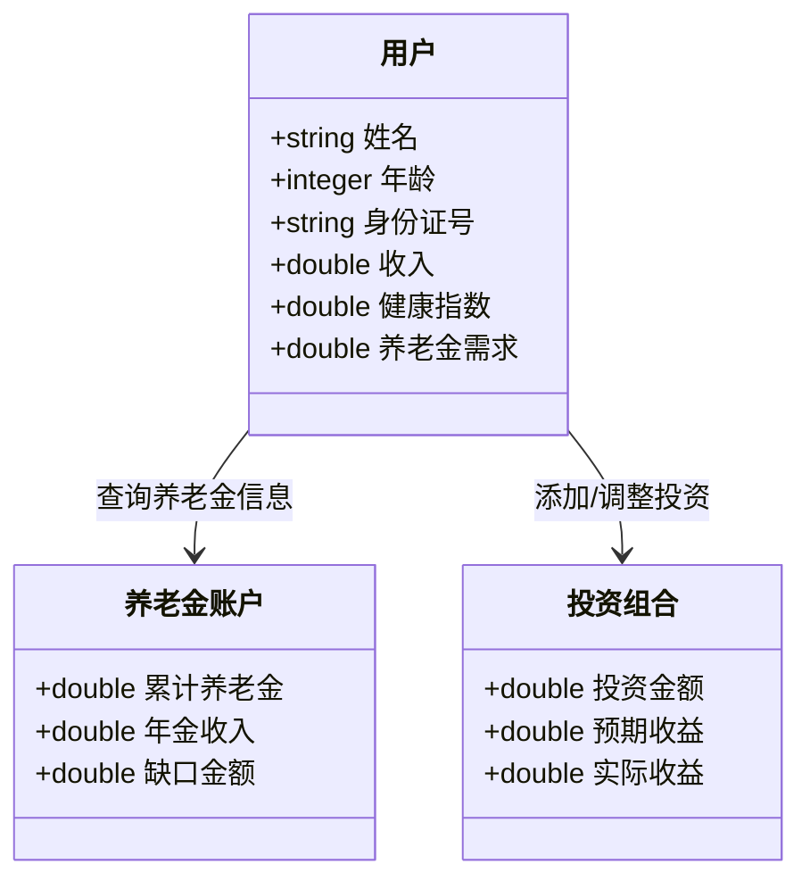
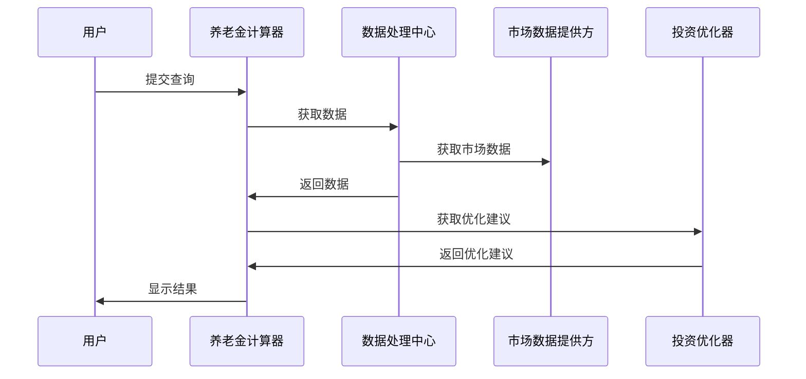

                 


# 智能养老金缺口分析与规划工具

> 关键词：智能养老金缺口分析、规划工具、机器学习、数据建模、算法优化、系统架构设计

> 摘要：随着全球人口老龄化的加剧，养老金缺口问题日益成为个人、企业和社会面临的重要挑战。本文旨在探讨如何利用智能技术，通过数据分析与算法优化，构建一个高效、精准的养老金缺口分析与规划工具。我们将从问题背景、核心概念、算法原理、系统架构设计、项目实现等多个维度展开，深入分析智能养老金缺口分析工具的构建过程，并结合实际案例，展示其在现实中的应用价值。

---

## 第一部分: 智能养老金缺口分析与规划工具的背景与核心概念

### 第1章: 养老金缺口分析的背景与问题描述

#### 1.1 养老金缺口问题的背景

##### 1.1.1 人口老龄化与养老金压力
全球范围内，人口老龄化问题日益严峻，特别是在发达国家和发展中国家，老年人口比例持续上升。这一趋势导致养老金支出压力增大，而养老金收入来源（如政府养老金、企业年金等）的增长速度却难以匹配支出需求。这使得养老金缺口问题成为社会关注的焦点。

##### 1.1.2 养老金缺口问题的现状与趋势
根据国际货币基金组织（IMF）的报告，许多国家的养老金体系面临资金不足的问题。例如，在日本，养老金支出预计在未来几十年内将显著超过收入。类似的问题在欧洲和北美洲的部分国家也普遍存在。此外，随着医疗技术的进步和平均寿命的延长，养老金支付的时间跨度也在增加，进一步加剧了养老金缺口问题。

##### 1.1.3 养老金缺口问题对企业与个人的影响
对企业而言，养老金缺口可能导致企业年金计划的负担加重，影响企业的财务健康。对个人而言，养老金缺口意味着退休后生活质量可能下降，甚至面临贫困风险。

#### 1.2 智能养老金缺口分析的必要性

##### 1.2.1 传统养老金分析的局限性
传统的养老金缺口分析方法通常基于简单的线性模型，难以捕捉复杂的经济变量和个体差异。例如，传统方法可能无法准确预测通货膨胀率、利率变化以及个人健康状况对养老金需求的影响。

##### 1.2.2 智能分析技术的优势
人工智能（AI）和大数据技术的快速发展为养老金缺口分析提供了新的工具。通过机器学习算法，可以更精准地预测养老金需求和供给，同时考虑多种复杂因素，如个人消费习惯、投资收益波动等。

##### 1.2.3 智能养老金缺口分析的市场价值
智能养老金缺口分析工具可以帮助企业和个人制定更科学的养老金计划，降低财务风险，提升生活质量。这不仅有助于个人实现退休目标，还能为企业和社会减轻养老金压力。

#### 1.3 智能养老金缺口分析的核心目标

##### 1.3.1 精准预测养老金缺口
通过智能算法，准确预测个人或家庭在退休时的养老金缺口，确保预测结果的精确性和可靠性。

##### 1.3.2 提供个性化规划建议
基于预测结果，为用户提供个性化的养老金投资和储蓄建议，帮助用户优化资产配置，最大化养老金收益。

##### 1.3.3 实现动态调整与优化
随着经济环境和个人情况的变化，养老金缺口分析工具需要能够实时更新数据，动态调整预测结果和规划建议，确保方案的灵活性和适应性。

#### 1.4 本章小结
本章从背景、问题描述和必要性三个方面，阐述了智能养老金缺口分析的重要性和现实意义。接下来，我们将深入探讨该领域的核心概念和相关技术。

---

### 第2章: 智能养老金缺口分析的核心概念与联系

#### 2.1 核心概念的定义与属性特征

##### 2.1.1 养老金缺口的定义与计算公式
养老金缺口是指个人或家庭在退休期间所需支出与可用养老金之间的差额。计算公式为：

$$ \text{养老金缺口} = \text{退休期间总支出} - \text{可用养老金总额} $$

##### 2.1.2 智能分析工具的核心功能
智能养老金缺口分析工具的核心功能包括：
1. 数据采集与预处理
2. 养老金需求预测
3. 缺口分析与优化建议
4. 动态调整与实时更新

##### 2.1.3 相关概念的对比分析（表格）

| 概念       | 描述                                                                 |
|------------|----------------------------------------------------------------------|
| 养老金缺口 | 退休期间支出与可用养老金的差额                                       |
| 数据建模   | 通过数据挖掘技术构建数学模型                                       |
| 机器学习   | 基于数据训练模型，实现智能预测                                       |

#### 2.2 实体关系图（ER图）的构建

##### 2.2.1 实体识别与关系建模
在智能养老金缺口分析系统中，主要实体包括：
- 用户：个人或家庭
- 养老金账户：包括政府养老金、企业年金等
- 投资组合：用户用于养老金储蓄的投资产品
- 市场数据：包括利率、通货膨胀率等

##### 2.2.2 ER图的Mermaid流程图展示
```mermaid
erDiagram
    actor 用户 {
        string 姓名
        integer 年龄
        string 身份证号
    }
    actor 市场数据 {
        decimal 利率
        decimal 通货膨胀率
        decimal 投资回报率
    }
    class 养老金账户 {
        decimal 累积养老金
        decimal 年金收入
    }
    class 投资组合 {
        decimal 投资金额
        decimal 预期收益
    }
    用户 --> 养老金账户 : 查询养老金信息
    用户 --> 投资组合 : 添加/调整投资
    用户 --> 市场数据 : 获取市场数据
    养老金账户 --> 市场数据 : 更新养老金计算
    投资组合 --> 市场数据 : 更新投资收益
```

---

## 第二部分: 智能养老金缺口分析的算法原理

### 第3章: 智能养老金缺口分析的算法原理

#### 3.1 算法原理概述

##### 3.1.1 数据预处理与特征提取
数据预处理是智能分析的第一步，包括数据清洗、特征提取和标准化处理。例如，从用户的收入、年龄、健康状况等数据中提取关键特征。

##### 3.1.2 算法选择与模型构建
基于机器学习的算法，如线性回归、随机森林和神经网络，用于构建养老金需求预测模型。

##### 3.1.3 模型评估与优化
通过交叉验证和网格搜索等方法，优化模型参数，提高预测精度。

#### 3.2 算法流程图（Mermaid）



#### 3.3 算法实现与代码解读

##### 3.3.1 Python代码实现
```python
import pandas as pd
from sklearn.linear_model import LinearRegression
from sklearn.metrics import mean_squared_error

# 数据加载
data = pd.read_csv('pension_data.csv')

# 特征与目标变量分离
X = data[['年龄', '收入', '健康指数']]
y = data['养老金需求']

# 模型训练
model = LinearRegression()
model.fit(X, y)

# 预测结果
y_pred = model.predict(X)
print(f"预测误差: {mean_squared_error(y, y_pred)}")
```

##### 3.3.2 代码功能分析
上述代码展示了如何使用线性回归算法训练养老金需求预测模型，并输出预测误差。实际应用中，可以结合随机森林或神经网络等更复杂的算法，进一步提高预测精度。

##### 3.3.3 算法优化建议
建议在实际应用中结合多种算法，并通过超参数调优和特征工程优化模型性能。

#### 3.4 数学模型与公式

##### 3.4.1 基础数学模型
养老金需求预测模型可以表示为：

$$ y = \beta_0 + \beta_1 x_1 + \beta_2 x_2 + \epsilon $$

其中：
- \( y \) 是养老金需求
- \( x_1 \) 和 \( x_2 \) 是特征变量
- \( \beta_0, \beta_1, \beta_2 \) 是模型参数
- \( \epsilon \) 是误差项

##### 3.4.2 公式推导与解释
通过最小二乘法，我们可以求解模型参数：

$$ \hat{\beta} = (X^T X)^{-1} X^T y $$

其中，\( X \) 是特征矩阵，\( y \) 是目标变量向量。

---

### 第4章: 智能养老金缺口分析的数学模型与公式

#### 4.1 基础数学模型

##### 4.1.1 养老金缺口计算公式
养老金缺口计算公式为：

$$ \text{养老金缺口} = \text{退休期间总支出} - \text{可用养老金总额} $$

##### 4.1.2 现金流贴现模型
现金流贴现模型用于评估养老金投资的现值：

$$ PV = \sum_{t=1}^{n} \frac{CF_t}{(1 + r)^t} $$

其中，\( CF_t \) 是第 \( t \) 年的现金流，\( r \) 是贴现率。

##### 4.1.3 风险评估模型
风险评估模型可以基于标准差或方差进行衡量：

$$ \text{风险} = \sqrt{\frac{1}{N} \sum_{i=1}^{N} (x_i - \bar{x})^2} $$

其中，\( x_i \) 是观测值，\( \bar{x} \) 是均值，\( N \) 是观测数量。

#### 4.2 公式推导与解释

##### 4.2.1 养老金缺口的数学表达式
通过将退休期间的年支出总和减去可用养老金总和，可以得到养老金缺口。

##### 4.2.2 现金流贴现的计算公式
现金流贴现模型通过将未来现金流折现到现值，帮助评估养老金投资的可行性。

##### 4.2.3 风险评估的数学模型
风险评估模型通过计算数据的离散程度，衡量养老金缺口分析中可能面临的不确定性。

#### 4.3 举例说明与实际应用

##### 4.3.1 示例计算
假设某用户的退休期间年支出为100万元，可用养老金总额为80万元，则养老金缺口为：

$$ 100 - 80 = 20 \text{万元} $$

##### 4.3.2 实际

---

## 第三部分: 智能养老金缺口分析与规划工具的系统架构设计

### 第5章: 智能养老金缺口分析系统的架构设计

#### 5.1 问题场景介绍

##### 5.1.1 用户需求分析
用户包括个人和企业，需要准确预测养老金缺口，并获得个性化的规划建议。

##### 5.1.2 功能需求
- 数据采集与处理
- 缺口分析与预测
- 规划建议生成
- 动态调整与优化

#### 5.2 系统功能设计

##### 5.2.1 领域模型（Mermaid类图）


#### 5.3 系统架构设计（Mermaid架构图）

```mermaid
container 养老金缺口分析系统 {
    service 养老金计算器
    service 投资优化器
    service 数据处理中心
}

actor 用户
actor 市场数据提供方

用户 --> 养老金计算器 : 提交查询
养老金计算器 --> 数据处理中心 : 获取数据
数据处理中心 --> 市场数据提供方 : 获取市场数据
养老金计算器 --> 投资优化器 : 获取优化建议
```

#### 5.4 系统接口设计

##### 5.4.1 API接口
- `GET /pension/deficit?userId={id}`：获取养老金缺口
- `POST /pension/planner`：提交养老金规划请求
- `PUT /pension/investment`：调整投资组合

#### 5.5 系统交互（Mermaid序列图）



---

## 第四部分: 智能养老金缺口分析与规划工具的项目实战

### 第6章: 智能养老金缺口分析工具的实现与应用

#### 6.1 项目环境安装

##### 6.1.1 安装Python环境
安装Python 3.8以上版本，并安装必要的库，如Pandas、Scikit-learn、Plotly等。

##### 6.1.2 安装Jupyter Notebook
用于数据处理和建模。

#### 6.2 系统核心实现

##### 6.2.1 数据预处理
```python
import pandas as pd

# 加载数据
data = pd.read_csv('pension_data.csv')

# 删除缺失值
data.dropna(inplace=True)

# 标准化处理
from sklearn.preprocessing import StandardScaler
scaler = StandardScaler()
data[['收入', '健康指数']] = scaler.fit_transform(data[['收入', '健康指数']])
```

##### 6.2.2 模型训练与预测
```python
from sklearn.ensemble import RandomForestRegressor
model = RandomForestRegressor(n_estimators=100, random_state=42)
model.fit(X_train, y_train)
y_pred = model.predict(X_test)
```

##### 6.2.3 视图设计与实现
使用Plotly绘制交互式图表，展示养老金缺口分析结果。

#### 6.3 代码功能解读与分析

##### 6.3.1 数据预处理代码解读
上述代码展示了如何使用Pandas加载数据，并通过标准化处理改善模型性能。

##### 6.3.2 模型训练与预测代码解读
随机森林回归模型用于预测养老金缺口，通过调整参数可以优化模型性能。

##### 6.3.3 视图设计与实现
交互式图表帮助用户更直观地理解分析结果，支持缩放、交互等操作。

#### 6.4 实际案例分析与应用

##### 6.4.1 案例背景
以一位45岁、年收入50万元的用户为例，分析其养老金缺口。

##### 6.4.2 数据处理与分析
通过数据预处理和模型训练，预测用户的养老金缺口，并生成优化建议。

##### 6.4.3 优化建议展示
基于预测结果，提供个性化的投资组合建议，帮助用户缩小养老金缺口。

#### 6.5 项目小结

##### 6.5.1 项目总结
本项目通过机器学习算法实现了智能养老金缺口分析工具，能够准确预测缺口并提供优化建议。

##### 6.5.2 经验与教训
数据质量对模型性能影响较大，需加强数据清洗和特征工程。同时，模型解释性需要进一步优化，以便更好地向用户传达分析结果。

---

## 第五部分: 智能养老金缺口分析与规划工具的最佳实践

### 第7章: 最佳实践与经验分享

#### 7.1 小结

##### 7.1.1 核心知识点回顾
回顾本文的核心内容，包括背景、算法、系统架构和项目实现。

##### 7.1.2 关键成功因素总结
数据质量、算法选择和系统架构设计是影响工具性能的关键因素。

#### 7.2 注意事项与风险提示

##### 7.2.1 数据隐私保护
在处理用户数据时，需严格遵守数据隐私法规，确保用户信息安全。

##### 7.2.2 模型解释性
复杂的模型可能导致解释性较差，建议在实际应用中选择合适的模型，并提供直观的用户界面。

#### 7.3 拓展阅读与学习资源

##### 7.3.1 推荐书籍
- 《机器学习实战》
- 《Python数据分析 cookbook》

##### 7.3.2 在线资源
- scikit-learn官方文档
- TensorFlow教程

---

## 作者：AI天才研究院/AI Genius Institute & 禅与计算机程序设计艺术 /Zen And The Art of Computer Programming

---

以上是《智能养老金缺口分析与规划工具》的技术博客文章的完整目录大纲和部分章节内容。如需进一步扩展具体章节的内容，请随时告知！

