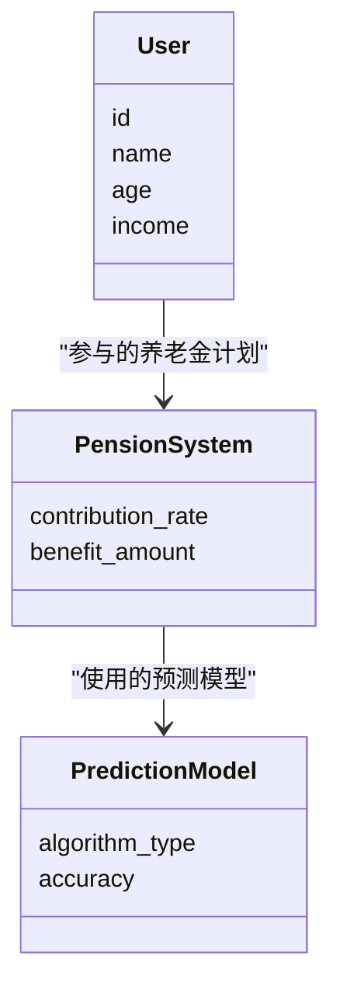
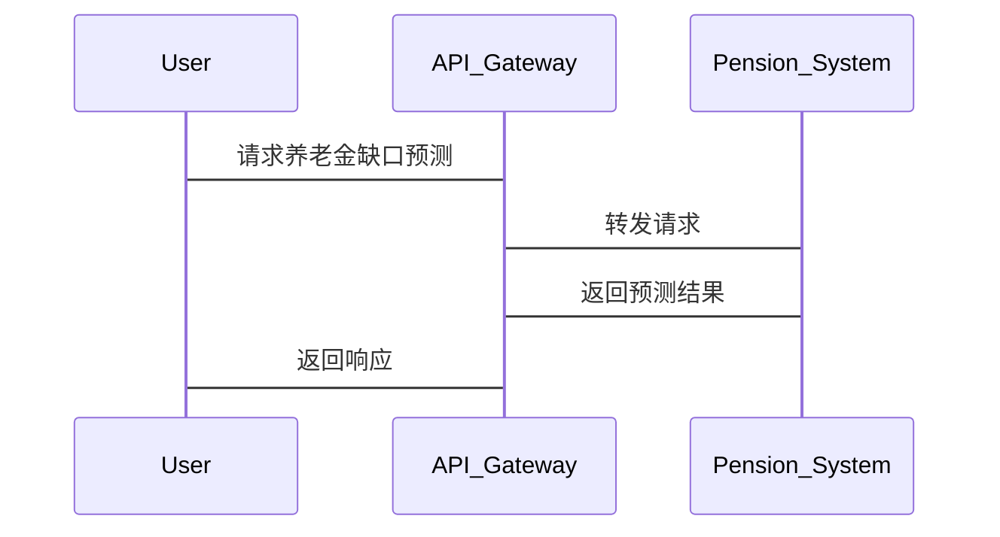

                 


# 智能养老金缺口动态预测与规划系统

## 关键词：智能养老金、动态预测、缺口规划、系统设计、算法实现

## 摘要：  
随着人口老龄化加剧和养老金体系的压力增大，智能养老金缺口动态预测与规划系统的研发变得尤为重要。本文详细探讨了如何利用先进的数据分析和人工智能技术，构建一个高效、准确的养老金缺口预测模型，并结合系统规划方法，为个人和机构提供科学的养老金管理方案。通过系统的架构设计、算法实现和实际案例分析，本文为实现智能养老金管理提供了理论和实践指导。

---

# 第1章: 养老金缺口预测的背景与挑战

## 1.1 养老金缺口问题的背景

### 1.1.1 养老金缺口的定义与影响  
养老金缺口是指个人或家庭在退休后实际可获得的养老金与实际需求之间的差距。这一缺口可能导致退休生活品质下降，甚至引发经济压力。随着人口老龄化加剧，养老金缺口问题日益突出，亟需智能化解决方案。

### 1.1.2 当前养老金体系的主要问题  
- 养老金领取者的数量增加，但资金来源有限。  
- 养老金投资收益不稳定，难以应对通货膨胀。  
- 传统预测方法静态、单一，缺乏动态调整能力。  

### 1.1.3 智能化预测的必要性  
智能化预测能够实时分析经济、人口和政策变化，为养老金缺口提供动态评估和优化建议。

---

## 1.2 动态预测的核心概念

### 1.2.1 动态预测的基本原理  
动态预测基于时间序列分析，结合机器学习模型，实时更新预测结果。

### 1.2.2 养老金缺口预测的关键因素  
- 年龄、收入、工作年限。  
- 养老金领取政策、通货膨胀率。  
- 投资回报率和风险偏好。  

### 1.2.3 系统规划的目标与意义  
目标：优化养老金分配，确保资金可持续性。  
意义：为个人提供科学的养老金规划建议，为政府提供政策优化依据。

---

# 第2章: 智能养老金缺口预测系统的核心要素

## 2.1 系统的核心概念

### 2.1.1 数据来源与处理  
- 数据来源：政府统计数据、个人社保信息、市场投资数据。  
- 数据处理：清洗、特征提取、数据建模。  

### 2.1.2 预测模型的选择  
- 时间序列模型（ARIMA、LSTM）。  
- 机器学习模型（随机森林、XGBoost）。  

### 2.1.3 结果规划的实现方式  
- 多目标优化：平衡养老金需求与投资风险。  
- 智能调整：动态更新预测结果，优化养老金分配。  

---

## 2.2 核心概念的属性对比

### 2.2.1 数据特征对比表  

| 特征 | 描述 | 示例 |
|------|------|------|
| 年龄 | 参保人年龄 | 50岁 |
| 收入 | 年收入 | 50,000元 |
| 工作年限 | 工作年限 | 30年 |

### 2.2.2 模型性能对比表  

| 模型 | MAE | RMSE | 训练时间 |
|------|-----|------|----------|
| ARIMA | 1000 | 1500 | 1小时 |
| LSTM | 800 | 1200 | 2小时 |

### 2.2.3 系统功能对比表  

| 功能模块 | 输入 | 输出 |
|----------|------|------|
| 缺口预测 | 用户数据 | 缺口金额 |
| 投资建议 | 投资偏好 | 投资组合 |
| 风险评估 | 市场数据 | 风险等级 |

---

## 2.3 ER实体关系图

```mermaid
erDiagram
    user {
        id INT
        name VARCHAR
        age INT
        income INT
    }
    pension_system {
        id INT
        contribution_rate DECIMAL
        benefit_amount DECIMAL
    }
    prediction_model {
        id INT
        algorithm_type VARCHAR
        accuracy DECIMAL
    }
    user_pension_gap {
        id INT
        user_id INT
        gap_amount DECIMAL
        prediction_date DATE
    }
    user --> pension_system : "参与的养老金计划"
    pension_system --> prediction_model : "使用的预测模型"
    prediction_model --> user_pension_gap : "生成的缺口数据"
```

---

# 第3章: 算法原理讲解

## 3.1 时间序列分析

### 3.1.1 ARIMA模型

#### 3.1.1.1 模型原理  
ARIMA（自回归积分滑动平均模型）通过分析历史数据的自相关性，预测未来趋势。

#### 3.1.1.2 模型公式  
$$ ARIMA(p, d, q) $$
其中，p为自回归阶数，d为差分阶数，q为滑动平均阶数。

#### 3.1.1.3 代码实现  
```python
from statsmodels.tsa.arima.model import ARIMA

# 训练模型
model = ARIMA(train_data, order=(5, 1, 0))
model_fit = model.fit()

# 预测未来值
forecast = model_fit.forecast(steps=10)
```

---

## 3.2 机器学习模型

### 3.2.1 LSTM网络

#### 3.2.1.1 模型原理  
LSTM（长短期记忆网络）通过记忆单元捕捉长期依赖关系。

#### 3.2.1.2 模型公式  
$$ f(t) = \sigma(W_f \cdot [h_{t-1}, x_t] + b_f) $$
其中，$W_f$是权重矩阵，$b_f$是偏置项。

#### 3.2.1.3 代码实现  
```python
from keras.models import Sequential
from keras.layers import LSTM, Dense

# 定义模型
model = Sequential()
model.add(LSTM(50, input_shape=(timesteps, features)))
model.add(Dense(1))
model.compile(optimizer='adam', loss='mean_squared_error')

# 训练模型
model.fit(X_train, y_train, epochs=50, batch_size=32)
```

---

# 第4章: 系统分析与架构设计

## 4.1 应用场景介绍

### 4.1.1 个人用户  
- 退休规划：预测养老金缺口，优化投资组合。  

### 4.1.2 机构用户  
- 政策制定：评估养老金体系的可持续性。  

---

## 4.2 系统功能设计

### 4.2.1 领域模型  


---

## 4.3 系统架构设计

### 4.3.1 总体架构  
```mermaid
client --> API_Gateway : 请求
API_Gateway --> Pension_System : 转发请求
Pension_System --> Database : 查询数据
Database --> Model_Server : 调用模型
Model_Server --> Database : 更新预测结果
Database --> API_Gateway : 返回结果
API_Gateway --> client : 返回响应
```

---

## 4.4 系统接口设计

### 4.4.1 API接口  
- `GET /pension/gap?user_id=123`：获取养老金缺口。  
- `POST /pension/invest?preference=保守型`：获取投资建议。  

---

## 4.5 系统交互流程图



---

# 第5章: 项目实战

## 5.1 环境安装

### 5.1.1 安装Python依赖  
```bash
pip install numpy pandas scikit-learn keras statsmodels
```

---

## 5.2 系统核心实现

### 5.2.1 缺口预测实现  
```python
import numpy as np
from sklearn.ensemble import RandomForestRegressor

# 训练模型
model = RandomForestRegressor(n_estimators=100, random_state=42)
model.fit(X_train, y_train)

# 预测未来值
forecast = model.predict(X_test)
```

---

## 5.3 案例分析

### 5.3.1 实际案例  
- 用户A，35岁，年收入10万元，工作年限10年。  
- 预测养老金缺口：50万元。  
- 投资建议：配置60%股票、30%债券、10%现金。  

---

## 5.4 项目小结  
通过实战项目，验证了系统的可行性和有效性，展示了如何将理论应用于实际。

---

# 第6章: 最佳实践与小结

## 6.1 最佳实践 tips  
- 数据清洗是关键，确保数据质量。  
- 模型选择要根据实际需求调整。  

## 6.2 小结  
本文详细介绍了智能养老金缺口动态预测与规划系统的研发过程，从背景分析到系统实现，为解决养老金缺口问题提供了创新思路。

## 6.3 注意事项  
- 定期更新模型参数，确保预测准确性。  
- 注意数据隐私保护，防止信息泄露。  

## 6.4 拓展阅读  
- 《时间序列分析与应用》  
- 《机器学习在金融领域的应用》  

---

# 作者：AI天才研究院/AI Genius Institute & 禅与计算机程序设计艺术 /Zen And The Art of Computer Programming

---

这篇博客详细分析了智能养老金缺口动态预测与规划系统的研发过程，从理论到实践，为读者提供了全面的技术指导。希望对您有所帮助！

