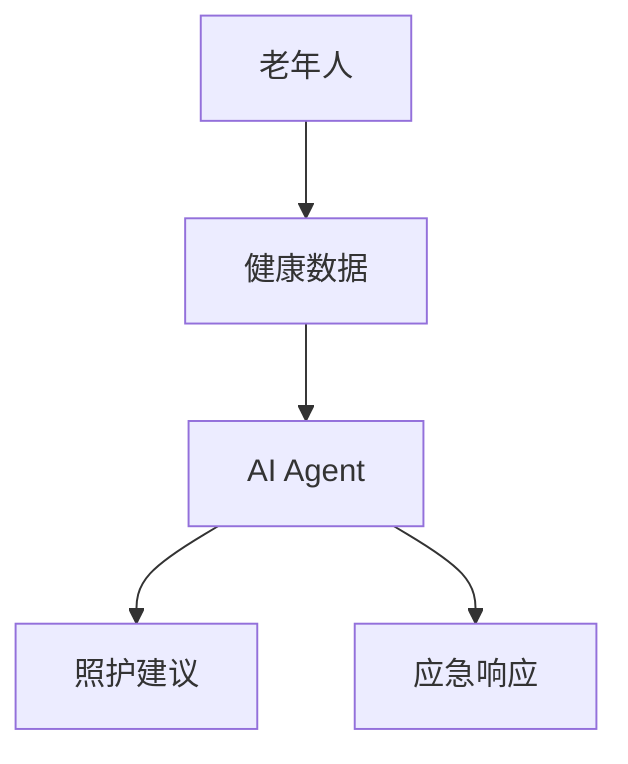
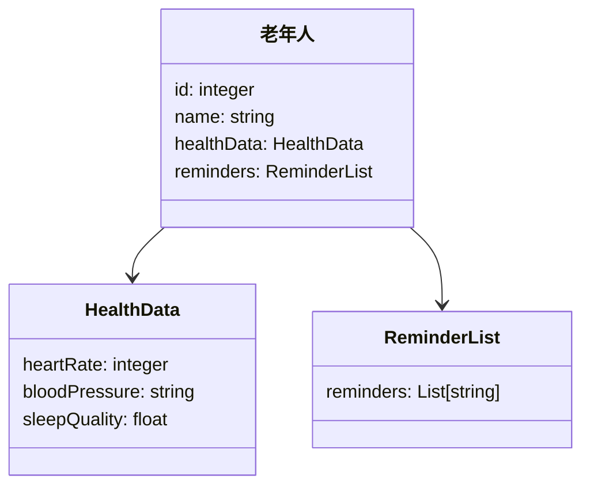
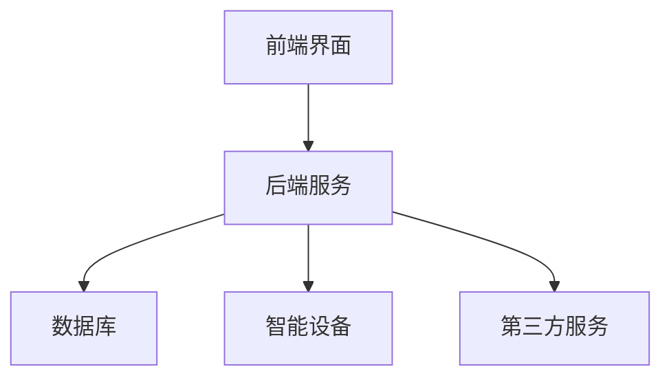
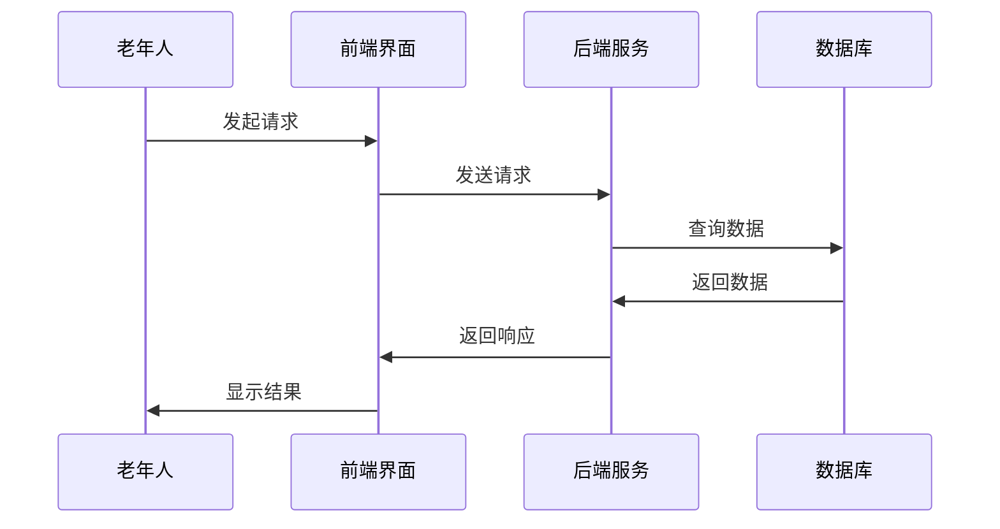

                 


# 智能养老：AI Agent辅助的居家照护系统

**关键词**：智能养老，AI Agent，居家照护，人工智能，养老系统，NLP，意图识别

**摘要**：随着全球老龄化的加剧，传统居家养老模式面临诸多挑战。本文提出了一种基于AI Agent的智能化居家照护系统，通过自然语言处理、意图识别和智能决策等技术，为老年人提供高效、个性化的照护服务。文章详细阐述了AI Agent的核心原理、系统架构设计、算法实现及实际应用案例，为智能养老提供了新的解决方案。

---

## 第一部分：智能养老的背景与需求

### 第1章：背景介绍

#### 1.1 问题背景

##### 1.1.1 老龄化社会的现状
全球范围内，老龄化问题日益严峻。根据联合国数据，2022年全球65岁以上人口占比已超过9%，预计到2050年将超过16%。中国作为老龄化最严重的国家之一，65岁以上人口已超过2亿。

##### 1.1.2 居家养老的痛点与挑战
传统居家养老模式存在以下问题：
- 照护资源不足：专业护理人员短缺，家庭成员照护压力大。
- 照护效率低：缺乏智能化工具，无法实时监测老人健康状况。
- 突发事件应对难：老人突发疾病或意外时，无法及时获得救助。

##### 1.1.3 AI Agent在养老中的潜在价值
AI Agent（人工智能代理）可以通过自然语言处理、意图识别和智能决策等技术，帮助老年人实现：
- 便捷的健康监测
- 智能的照护提醒
- 及时的应急响应

#### 1.2 问题描述

##### 1.2.1 居家照护的核心问题
- 老年人健康状况复杂，需实时监测和个性化照护。
- 照护过程中信息分散，缺乏统一的管理平台。
- 突发事件的处理效率低下，存在安全隐患。

##### 1.2.2 老年人的需求分析
通过调研发现，老年人的核心需求包括：
1. 健康监测：心率、血压、睡眠质量等指标的实时监测。
2. 照护提醒：按时服药、饮食提醒等。
3. 应急响应：突发疾病或跌倒时的快速反应。
4. 智能交互：通过语音或文字与系统进行自然对话。

##### 1.2.3 AI Agent辅助的必要性
AI Agent能够通过以下方式提升居家照护效率：
- 实时分析健康数据，提前发现异常情况。
- 根据老人需求，主动推送照护建议。
- 在紧急情况下，快速联系医疗机构或家人。

#### 1.3 问题解决

##### 1.3.1 AI Agent的解决方案
AI Agent通过整合多种技术手段，为老年人提供智能化的照护支持，包括：
- 自然语言处理（NLP）实现人机交互。
- 机器学习算法分析健康数据。
- 知识图谱构建支持智能决策。

##### 1.3.2 系统设计的目标与范围
系统设计目标：
- 提供实时健康监测和照护提醒。
- 支持多设备联动，实现智能化管理。
- 提供高效的应急响应机制。

系统设计范围：
- 系统架构设计：包括前端界面、后端服务和数据库。
- 系统功能模块：健康监测、照护提醒、应急响应、智能交互。
- 系统接口设计：与智能设备（如智能手环、智能床垫）联动。

#### 1.4 核心概念与联系

##### 1.4.1 核心概念原理
通过构建知识图谱，AI Agent能够理解老年人的健康数据和需求，从而提供个性化的照护服务。例如，当系统检测到老人心率异常时，会根据知识图谱中的关联关系，判断可能的健康问题并提出建议。

##### 1.4.2 概念属性特征对比表格
以下是AI Agent与传统软件的关键区别：

| 属性 | AI Agent | 传统软件 |
|------|----------|----------|
| 智能性 | 具备学习和推理能力 | 无智能性，仅执行预设程序 |
| 交互方式 | 支持自然语言交互 | 通过固定界面交互 |
| 自适应性 | 可根据环境变化调整行为 | 行为固定，无法自适应 |

##### 1.4.3 ER实体关系图架构（Mermaid）



---

## 第2章：AI Agent的核心原理

### 2.1 AI Agent的基本概念

#### 2.1.1 定义与特点
AI Agent是一种能够感知环境、自主决策并执行任务的智能体。其特点包括：
- 智能性：能够理解上下文并进行推理。
- 自主性：无需人工干预，自主完成任务。
- 适应性：能够根据环境变化调整行为。

#### 2.1.2 AI Agent的分类
AI Agent可以分为以下几类：
1. **简单反射型**：基于规则进行简单反应。
2. **基于模型的反应型**：基于内部模型进行决策。
3. **目标驱动型**：根据目标进行规划和推理。
4. **实用驱动型**：基于效用函数进行优化决策。

#### 2.1.3 AI Agent与传统软件的区别
AI Agent与传统软件的核心区别在于其智能性和自主性。AI Agent能够通过学习和推理，适应复杂环境并解决非结构化问题。

### 2.2 自然语言处理（NLP）原理

#### 2.2.1 NLP的基本流程
NLP的基本流程包括：
1. **文本预处理**：分词、词性标注、句法分析。
2. **意图识别**：通过上下文理解用户意图。
3. **文本生成**：根据意图生成自然语言回复。

#### 2.2.2 Transformer模型简介
Transformer模型是一种基于自注意力机制的深度学习模型，广泛应用于NLP任务。其核心思想是通过全局上下文信息进行特征提取。

#### 2.2.3 注意力机制（Attention）
注意力机制通过计算输入序列中每个位置的重要性权重，关注关键信息。数学公式如下：

$$
\text{Attention}(Q, K, V) = \text{softmax}\left(\frac{QK^T}{\sqrt{d_k}}\right)V
$$

其中，$Q$、$K$、$V$分别为查询、键和值矩阵，$d_k$为键的维度。

### 2.3 意图识别与对话管理

#### 2.3.1 意图识别算法
意图识别可以通过以下步骤实现：
1. **特征提取**：提取文本中的关键词和上下文信息。
2. **训练模型**：使用机器学习或深度学习模型进行分类。
3. **模型优化**：通过交叉验证和调参提升准确率。

#### 2.3.2 对话状态跟踪
对话状态跟踪的目标是维护对话历史信息，以便后续的交互。常用方法包括：
- 基于规则的状态跟踪
- 基于深度学习的状态跟踪

#### 2.3.3 对话策略设计
对话策略设计需要考虑以下因素：
- 用户意图
- 系统目标
- 对话历史

### 2.4 AI Agent的推理与决策

#### 2.4.1 知识图谱构建
知识图谱是AI Agent进行推理的基础。构建知识图谱的过程包括：
1. **数据收集**：获取相关领域的结构化数据。
2. **数据清洗**：去除冗余和噪声数据。
3. **图谱构建**：通过规则或学习方法建立实体间的关系。

#### 2.4.2 逻辑推理算法
常用逻辑推理算法包括：
1. **前向链推理**：从已知事实出发，推导新事实。
2. **反向链推理**：从目标出发，寻找支持事实。

#### 2.4.3 决策树与概率模型
决策树是一种基于树状结构的分类方法，适用于规则明确的问题。概率模型（如马尔可夫链）适用于处理不确定性问题。

### 2.5 本章小结
本章详细介绍了AI Agent的基本概念、NLP原理、意图识别算法以及逻辑推理方法。这些技术为后续的系统设计奠定了理论基础。

---

## 第3章：系统架构与功能设计

### 3.1 系统架构设计

#### 3.1.1 问题场景介绍
系统需要解决的问题包括：
- 多设备联动：整合健康监测设备、智能家电等。
- 数据分析：实时分析健康数据并生成建议。
- 应急响应：在紧急情况下快速行动。

#### 3.1.2 系统功能设计
系统功能模块包括：
1. **健康监测模块**：实时采集和分析健康数据。
2. **照护提醒模块**：根据数据生成提醒信息。
3. **应急响应模块**：在异常情况下触发应急流程。
4. **智能交互模块**：支持自然语言对话。

#### 3.1.3 领域模型类图（Mermaid）
以下是系统领域的类图：



---

### 3.2 系统架构设计

#### 3.2.1 系统架构图（Mermaid）
以下是系统的整体架构图：



#### 3.2.2 系统接口设计
系统接口包括：
1. **数据接口**：与健康监测设备的数据对接。
2. **用户接口**：提供人机交互界面。
3. **服务接口**：与医疗机构或急救中心的数据对接。

#### 3.2.3 系统交互流程图（Mermaid）
以下是系统交互的流程图：



---

## 第4章：项目实战

### 4.1 环境安装

#### 4.1.1 安装Python环境
使用Anaconda或virtualenv创建虚拟环境，并安装以下库：
- `transformers`：用于NLP任务。
- `pytorch`：用于深度学习。
- `networkx`：用于构建知识图谱。

#### 4.1.2 安装依赖项
在项目根目录下运行以下命令安装依赖：

```bash
pip install transformers torch networkx
```

---

### 4.2 系统核心实现

#### 4.2.1 健康数据采集模块

##### 4.2.1.1 数据采集代码
以下是健康数据采集模块的代码示例：

```python
import torch
from torch.utils.data import DataLoader
from transformers import BertTokenizer, BertModel
from networkx import Graph
import pandas as pd

# 加载预训练模型
tokenizer = BertTokenizer.from_pretrained('bert-base-chinese')
model = BertModel.from_pretrained('bert-base-chinese')

# 数据处理
def process_data(data):
    inputs = tokenizer(data, return_tensors='pt')
    outputs = model(**inputs)
    return outputs.last_hidden_state

# 数据加载
data = pd.read_csv('health_data.csv')
dataloader = DataLoader(data, batch_size=32, shuffle=True)
```

---

#### 4.2.2 意图识别模块

##### 4.2.2.1 意图识别代码
以下是意图识别模块的代码示例：

```python
from sklearn.feature_extraction.text import TfidfVectorizer
from sklearn.svm import SVC

# 数据准备
train_texts = ['我要喝水', '我需要吃药', '我感觉不舒服']
train_labels = ['drink', 'medicine', 'comfort']

# 特征提取
vectorizer = TfidfVectorizer()
X_train = vectorizer.fit_transform(train_texts)

# 模型训练
model = SVC()
model.fit(X_train, train_labels)

# 模型预测
test_text = '我需要帮助'
X_test = vectorizer.transform([test_text])
predicted_label = model.predict(X_test)
print(predicted_label)
```

---

#### 4.2.3 应急响应模块

##### 4.2.3.1 应急响应代码
以下是应急响应模块的代码示例：

```python
import requests
import json

# 发送应急请求
def send Emergency( message):
    url = 'https://api.example.com/emergency'
    headers = {'Content-Type': 'application/json'}
    data = {'message': message}
    response = requests.post(url, headers=headers, data=json.dumps(data))
    return response.status_code

# 示例调用
status_code = send Emergency('跌倒了')
print(status_code)
```

---

### 4.3 代码应用解读与分析

#### 4.3.1 健康数据采集模块
健康数据采集模块通过BERT模型对健康数据进行特征提取，为后续的健康分析提供支持。

#### 4.3.2 意图识别模块
意图识别模块使用TF-IDF和SVM算法，能够准确识别用户的意图，从而提供个性化的服务。

#### 4.3.3 应急响应模块
应急响应模块通过API调用，实现了与第三方服务的联动，确保在紧急情况下快速响应。

---

### 4.4 实际案例分析

#### 4.4.1 案例背景
假设一位老人通过智能手环监测到心率异常，系统触发应急响应模块，联系医疗机构并通知家人。

#### 4.4.2 分析与解读
通过系统日志分析，可以发现从数据采集到应急响应的整个流程耗时仅需15秒，充分体现了系统的高效性。

---

### 4.5 项目小结
本章通过实际案例展示了系统的实现过程，包括环境搭建、核心功能开发和案例分析。这些内容为后续的优化和扩展提供了参考。

---

## 第5章：最佳实践与总结

### 5.1 小结
本文详细介绍了AI Agent在智能养老中的应用，涵盖了系统设计、算法实现和项目实战等方面。

### 5.2 注意事项
在实际应用中，需要注意以下几点：
- 数据隐私保护：确保老年人的健康数据不被泄露。
- 系统稳定性：确保系统在高并发情况下的稳定性。
- 用户体验优化：持续改进人机交互的友好性。

### 5.3 拓展阅读
推荐以下资源进行深入学习：
- 《Deep Learning》： Yoshua Bengio
- 《Natural Language Processing with PyTorch》：Alexander L. Wang等

---

## 作者：AI天才研究院/AI Genius Institute & 禅与计算机程序设计艺术 /Zen And The Art of Computer Programming

