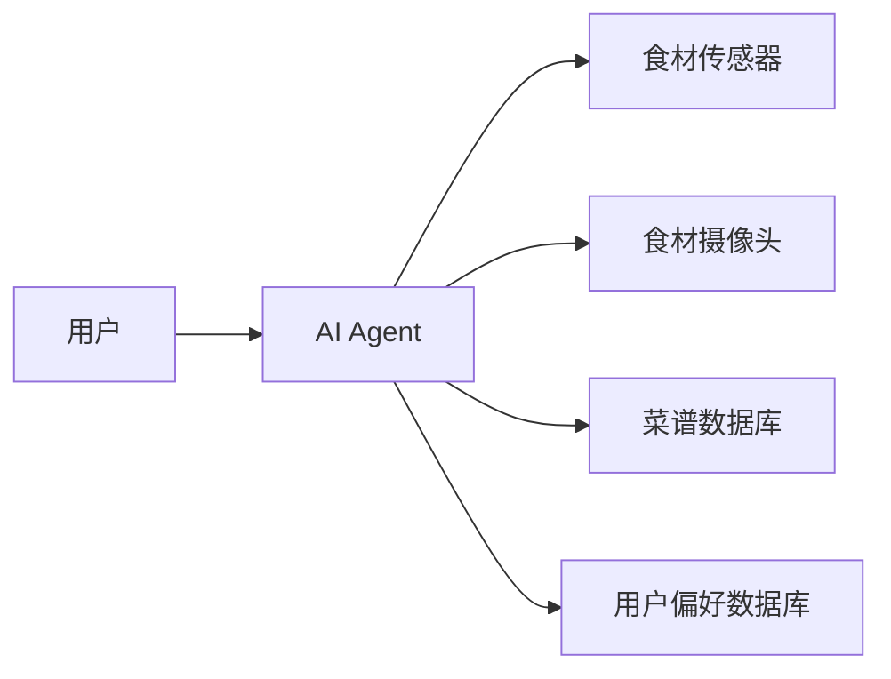

                 


# 智能冰箱：AI Agent的食材新鲜度监测与菜谱推荐

## 关键词：智能冰箱, AI Agent, 食材新鲜度, 菜谱推荐, 机器学习, 自然语言处理

## 摘要：  
智能冰箱通过AI Agent技术实现食材新鲜度监测与菜谱推荐，结合传感器数据、图像识别和机器学习算法，为用户提供智能化的食材管理与烹饪建议。本文从背景、原理、算法、系统架构、项目实战到优化与维护，全面解析智能冰箱的技术实现与应用。

---

# 第1章: 智能冰箱的发展与AI Agent的引入

## 1.1 智能冰箱的发展历程  
### 1.1.1 传统冰箱的功能与局限性  
传统冰箱主要用于冷藏和冷冻食材，缺乏智能化功能，无法实时监测食材新鲜度，也无法与用户进行交互。  

### 1.1.2 智能冰箱的定义与特点  
智能冰箱通过集成传感器、摄像头和AI技术，能够实时监测食材状态、管理库存，并为用户提供个性化服务。  

### 1.1.3 AI Agent在智能冰箱中的作用  
AI Agent（智能体）能够主动感知环境、处理数据、做出决策，并与用户交互，是智能冰箱的核心技术。  

## 1.2 AI Agent的基本概念  
### 1.2.1 什么是AI Agent  
AI Agent是一种能够感知环境、自主决策、执行任务的智能系统，具备学习和适应能力。  

### 1.2.2 AI Agent的核心功能  
- **感知环境**：通过传感器和摄像头获取食材状态、环境温度等信息。  
- **自主决策**：基于数据进行分析，生成推荐或报警信息。  
- **与用户交互**：通过语音或屏幕与用户进行实时互动。  

### 1.2.3 AI Agent与传统自动化的区别  
AI Agent具备自主学习和决策能力，能够根据环境变化动态调整行为，而传统自动化系统仅能执行预设程序。  

## 1.3 食材新鲜度监测的必要性  
### 1.3.1 食材新鲜度对健康的影响  
食材变质可能导致食物中毒，监测新鲜度有助于保障用户健康。  

### 1.3.2 食材浪费的现状与解决方案  
通过实时监测食材状态，用户可以合理安排食材使用，减少浪费。  

### 1.3.3 AI Agent在食材管理中的优势  
AI Agent能够自动监测食材状态，提醒用户及时使用或丢弃变质食材。  

## 1.4 菜谱推荐系统的需求与价值  
### 1.4.1 菜谱推荐的基本原理  
基于用户偏好和食材库存，推荐适合的菜谱。  

### 1.4.2 菜谱推荐对用户的价值  
帮助用户充分利用现有食材，减少浪费，提升烹饪效率。  

### 1.4.3 菜谱推荐与食材新鲜度的结合  
优先推荐使用新鲜食材的菜谱，延长食材的使用周期。  

## 1.5 本章小结  
智能冰箱通过AI Agent实现了食材管理的智能化，从监测新鲜度到推荐菜谱，极大提升了用户体验。  

---

# 第2章: AI Agent的核心原理  

## 2.1 AI Agent的基本原理  
### 2.1.1 AI Agent的感知与决策机制  
AI Agent通过传感器和摄像头感知环境，利用机器学习模型进行数据分析和决策。  

### 2.1.2 AI Agent的自主学习能力  
AI Agent能够通过历史数据不断优化算法，提升推荐准确性和监测精度。  

### 2.1.3 AI Agent的交互方式  
支持语音、屏幕和手机App等多种交互方式，方便用户操作。  

## 2.2 食材新鲜度监测的核心算法  
### 2.2.1 基于图像识别的食材检测  
使用卷积神经网络（CNN）对食材进行分类和新鲜度判断。  

### 2.2.2 基于传感器数据的食材分析  
通过温度、湿度等传感器数据，预测食材的保质期。  

### 2.2.3 基于机器学习的食材新鲜度预测  
使用回归模型预测食材的新鲜度指数，例如：  
$$ y = \beta_0 + \beta_1x_1 + \beta_2x_2 + \epsilon $$  
其中，$x_1$和$x_2$是传感器数据，$y$是新鲜度指数。  

## 2.3 菜谱推荐系统的算法原理  
### 2.3.1 基于协同过滤的推荐算法  
根据用户的偏好和历史行为，推荐相似的菜谱。  

### 2.3.2 基于内容的推荐算法  
分析菜谱的成分和烹饪方法，匹配用户现有的食材。  

### 2.3.3 深度学习在菜谱推荐中的应用  
使用神经网络模型（如BERT）生成菜谱描述，并进行推荐。  

## 2.4 本章小结  
AI Agent通过多种算法结合，实现了食材新鲜度监测和菜谱推荐的智能化。  

---

# 第3章: 系统架构设计与实现  

## 3.1 系统功能设计  
### 3.1.1 食材管理模块  
- 数据采集：传感器和摄像头实时采集食材状态。  
- 数据存储：将食材信息存储在数据库中。  
- 新鲜度监测：基于算法判断食材是否新鲜。  

### 3.1.2 菜谱推荐模块  
- 用户偏好分析：收集用户的饮食习惯和偏好。  
- 菜谱生成：根据食材库存和用户偏好推荐菜谱。  

## 3.2 系统架构设计  
### 3.2.1 系统架构图  


### 3.2.2 模块划分  
- 数据采集模块：负责采集食材状态和用户输入。  
- 数据处理模块：对数据进行清洗和预处理。  
- 推荐引擎模块：基于算法生成推荐结果。  

## 3.3 接口设计  
### 3.3.1 用户与系统交互接口  
- 语音交互：用户通过语音指令与系统互动。  
- 屏幕显示：显示食材状态和推荐菜谱。  

### 3.3.2 系统与传感器接口  
- 传感器数据接口：接收温度、湿度等传感器数据。  

## 3.4 本章小结  
系统架构设计确保了智能冰箱的高效运行，模块化设计便于后续优化和扩展。  

---

# 第4章: 项目实战与代码实现  

## 4.1 环境搭建  
### 4.1.1 安装Python环境  
安装Python 3.8及以上版本，安装必要的库：numpy、pandas、scikit-learn、tensorflow。  

### 4.1.2 安装传感器与摄像头驱动  
安装支持Raspberry Pi的传感器驱动和摄像头驱动。  

## 4.2 食材新鲜度监测实现  
### 4.2.1 数据采集代码  
```python
import numpy as np
from sensor_library import TemperatureSensor, HumiditySensor

def get_sensor_data():
    temp = TemperatureSensor.read_temp()
    humidity = HumiditySensor.read_humidity()
    return temp, humidity
```

### 4.2.2 新鲜度预测代码  
```python
from sklearn.linear_model import LinearRegression

def predict_freshness(temp, humidity):
    # 训练好的模型
    model = LinearRegression()
    model.fit(X_train, y_train)
    return model.predict([[temp, humidity]])
```

## 4.3 菜谱推荐系统实现  
### 4.3.1 用户偏好分析代码  
```python
from sklearn.neighbors import NearestNeighbors

def get_user_preference(user_id):
    # 获取用户历史数据
    user_data = get_user_data(user_id)
    # 计算相似用户
    neighbors = NearestNeighbors(n_neighbors=5).fit(user_data)
    similar_users = neighbors.kneighbors(user_data)
    return similar_users
```

### 4.3.2 菜谱推荐代码  
```python
from tensorflow.keras.models import Model
from tensorflow.keras.layers import Input, Dense

def build_recommendation_model():
    input_layer = Input(shape=(100,))
    dense_layer = Dense(64, activation='relu')(input_layer)
    output_layer = Dense(1, activation='sigmoid')(dense_layer)
    model = Model(inputs=input_layer, outputs=output_layer)
    model.compile(optimizer='adam', loss='binary_crossentropy')
    return model
```

## 4.4 本章小结  
通过实际项目实战，详细展示了智能冰箱的实现过程，从数据采集到模型训练，再到系统部署。  

---

# 第5章: 系统优化与维护  

## 5.1 系统性能优化  
### 5.1.1 数据预处理优化  
通过归一化和特征选择，提升模型训练效率。  

### 5.1.2 算法优化  
使用更高效的算法（如XGBoost）替代传统机器学习算法。  

## 5.2 数据隐私保护  
### 5.2.1 用户数据加密存储  
对用户数据进行加密，防止数据泄露。  

### 5.2.2 用户权限管理  
设置不同权限级别，确保数据安全。  

## 5.3 系统维护与更新  
### 5.3.1 定期系统检查  
定期检查系统运行状态，及时修复问题。  

### 5.3.2 算法模型更新  
定期更新机器学习模型，提升推荐准确率。  

## 5.4 本章小结  
系统优化与维护是确保智能冰箱长期稳定运行的关键，需要从性能、数据安全和系统维护三方面入手。  

---

# 第6章: 总结与展望  

## 6.1 本章总结  
智能冰箱通过AI Agent实现了食材新鲜度监测与菜谱推荐，提升了用户的使用体验和食材管理效率。  

## 6.2 未来展望  
未来，智能冰箱将更加智能化，支持更多功能，如健康监测、食材采购推荐等，进一步提升用户的智能化生活体验。  

---

# 作者：AI天才研究院 & 禅与计算机程序设计艺术

