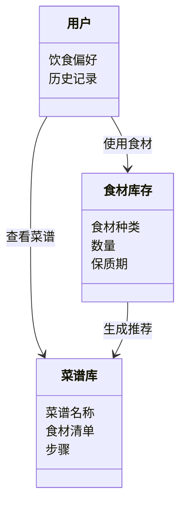
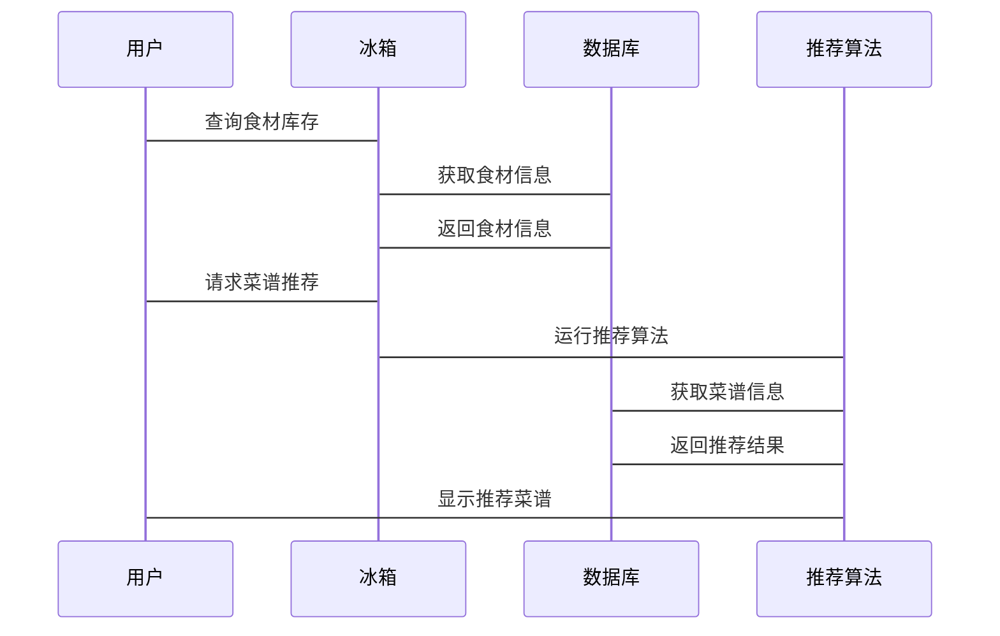

                 


# 智能冰箱：AI Agent的食材管理与菜谱推荐

> 关键词：智能冰箱，AI Agent，食材管理，菜谱推荐，推荐算法，系统架构，项目实战

> 摘要：本文详细探讨了智能冰箱中AI Agent的核心作用，从食材管理到菜谱推荐的实现原理，再到系统架构设计与项目实战，深入分析了如何通过AI技术优化用户的食材管理和烹饪体验。

---

# 第一部分: 智能冰箱与AI Agent概述

# 第1章: 智能冰箱的背景与现状

## 1.1 智能冰箱的概念与定义

### 1.1.1 智能冰箱的基本概念

智能冰箱是一种结合了物联网技术和人工智能的家用电器，它能够通过传感器和摄像头识别食材的种类、数量和保质期，并通过AI算法为用户提供菜谱推荐和食材管理服务。智能冰箱的核心在于其内置的AI Agent（智能代理），它能够主动学习用户的饮食习惯，并提供个性化的服务。

### 1.1.2 智能冰箱的发展历程

智能冰箱的概念最早可以追溯到20世纪末，但真正的发展始于物联网和人工智能技术的成熟。近年来，随着AI技术的快速发展，智能冰箱的功能越来越多样化，逐渐从简单的食材存储工具转变为用户的智能助手。

### 1.1.3 当前智能冰箱的市场现状

目前，市场上已经出现了多种品牌的智能冰箱，例如三星、LG、海尔等。这些智能冰箱不仅能够识别食材，还能通过手机APP与用户互动，提供菜谱推荐、食材购买建议等服务。然而，现有的智能冰箱在AI Agent的智能化程度和推荐算法的精准度上仍有提升空间。

---

## 1.2 AI Agent的基本概念与特点

### 1.2.1 AI Agent的定义

AI Agent（智能代理）是指一种能够感知环境、理解用户需求并主动提供服务的智能系统。在智能冰箱中，AI Agent主要负责食材管理和菜谱推荐两大功能。

### 1.2.2 AI Agent的核心特点

- **主动性**：AI Agent能够主动学习用户的饮食习惯，无需用户手动操作。
- **智能性**：通过机器学习算法，AI Agent能够不断优化推荐结果，提高准确性。
- **实时性**：AI Agent能够实时感知冰箱内的食材变化，并及时提供反馈。

### 1.2.3 AI Agent与传统软件的区别

AI Agent与传统软件的最大区别在于其智能化和自主性。传统软件通常需要用户输入指令，而AI Agent能够主动理解和执行任务，具有更强的适应性和学习能力。

---

## 1.3 智能冰箱中的AI Agent应用

### 1.3.1 AI Agent在智能冰箱中的角色

在智能冰箱中，AI Agent主要负责食材管理、菜谱推荐和用户交互三项任务。

### 1.3.2 AI Agent的功能与优势

- **食材管理**：AI Agent能够自动识别食材种类、记录保质期，并提醒用户及时处理即将过期的食材。
- **菜谱推荐**：通过分析用户的饮食习惯和冰箱内的食材，AI Agent能够推荐适合的菜谱，帮助用户充分利用食材。
- **用户交互**：AI Agent能够通过语音或图形界面与用户互动，提供个性化的服务。

### 1.3.3 智能冰箱中的AI Agent与用户交互

AI Agent通过传感器和摄像头获取食材信息，同时通过用户输入的数据（如饮食偏好）构建用户的个性化模型。基于这些数据，AI Agent能够提供精准的食材管理和菜谱推荐服务。

---

## 1.4 本章小结

本章主要介绍了智能冰箱的概念、发展现状以及AI Agent的基本特点和功能。智能冰箱作为AI技术的重要应用之一，其核心在于AI Agent的智能化管理和推荐能力。接下来，我们将深入探讨AI Agent在食材管理和菜谱推荐中的具体实现。

---

# 第二部分: 智能冰箱的核心概念与系统架构

# 第2章: AI Agent的核心概念与原理

## 2.1 AI Agent的核心概念

### 2.1.1 知识表示

知识表示是AI Agent理解和处理信息的基础。在智能冰箱中，知识表示主要涉及食材的分类、菜谱的结构以及用户的饮食偏好。

### 2.1.2 行为推理

行为推理是指AI Agent根据获取的信息进行逻辑推理，以确定最佳的行动方案。例如，AI Agent可以根据用户的饮食偏好和冰箱内的食材推荐合适的菜谱。

### 2.1.3 目标驱动

目标驱动是AI Agent的核心机制，它通过设定目标并不断优化行动策略来实现这些目标。例如，AI Agent的目标可能是“为用户提供最健康的菜谱推荐”。

---

## 2.2 食材管理的核心要素

### 2.2.1 食材的分类与属性

食材的分类和属性是食材管理的基础。例如，食材可以分为蔬菜、肉类、乳制品等类别，每个类别都有其独特的属性，如保质期、营养成分等。

### 2.2.2 食材的库存管理

库存管理是智能冰箱的核心功能之一。AI Agent需要实时监控冰箱内的食材数量和保质期，并提醒用户及时补充或清理食材。

### 2.2.3 食材的保质期管理

保质期管理是食材管理的重要部分。AI Agent需要根据食材的保质期提醒用户及时使用或丢弃食材，以避免浪费和健康风险。

---

## 2.3 菜谱推荐的核心要素

### 2.3.1 菜谱的基本结构

菜谱的基本结构包括食材清单、步骤说明和营养信息等。AI Agent需要根据这些信息生成推荐菜谱。

### 2.3.2 用户的饮食偏好

用户的饮食偏好是菜谱推荐的重要依据。例如，用户可能偏好低脂、低盐或素食菜谱。

### 2.3.3 菜谱的多样性与个性化

菜谱的多样性是指AI Agent能够推荐多种不同类型的菜谱，而个性化则是指推荐的菜谱能够符合用户的特定需求。

---

## 2.4 核心概念的联系与对比

### 2.4.1 核心概念属性对比表

| 概念       | 属性                     |
|------------|--------------------------|
| 食材管理   | 分类、库存、保质期       |
| 菜谱推荐   | 结构、偏好、多样性       |

### 2.4.2 ER实体关系图

```mermaid
er
  actor: 用户
  agent: AI Agent
  inventory: 食材库存
  recipe: 菜谱库
  relation: 用户-菜谱偏好
  relation2: 食材-菜谱需求
```

---

# 第3章: AI Agent的算法原理与实现

## 3.1 推荐算法的基本原理

### 3.1.1 协同过滤算法

协同过滤是一种基于用户相似性推荐算法。通过分析用户的饮食偏好，AI Agent可以找到与用户饮食习惯相似的其他用户，并推荐他们喜欢的菜谱。

### 3.1.2 基于内容的推荐算法

基于内容的推荐算法通过分析菜谱的属性（如食材种类、营养成分等）来生成推荐结果。例如，如果用户喜欢蔬菜沙拉，AI Agent可以推荐其他类似的蔬菜沙拉菜谱。

### 3.1.3 混合推荐算法

混合推荐算法结合了协同过滤和基于内容的推荐算法的优势，能够在保证推荐结果多样性的同时提高推荐的准确性。

---

## 3.2 推荐算法的实现流程

### 3.2.1 数据采集与预处理

数据采集包括从冰箱传感器获取食材信息和从用户输入获取饮食偏好。预处理步骤包括数据清洗和特征提取。

### 3.2.2 特征提取与模型训练

特征提取是指从食材信息和用户偏好中提取有用的特征，例如食材种类、用户的饮食习惯等。模型训练则是通过机器学习算法训练推荐模型。

### 3.2.3 推荐结果生成

基于训练好的模型，AI Agent可以根据当前的食材信息和用户的偏好生成推荐结果。

---

## 3.3 推荐算法的数学模型

### 3.3.1 协同过滤的数学公式

$$相似度 = \frac{\sum_{i=1}^{n}(r_{u_i} - \bar{r_u})(r_{u_j} - \bar{r_u})}{\sqrt{\sum_{i=1}^{n}(r_{u_i} - \bar{r_u})^2} \sqrt{\sum_{i=1}^{n}(r_{u_j} - \bar{r_u})^2}}$$

其中，$r_{u_i}$表示用户u对物品i的评分，$\bar{r_u}$表示用户u的平均评分。

### 3.3.2 基于内容的推荐公式

$$p(\text{推荐菜谱} | \text{食材}) = \sum_{i=1}^{m} w_i \cdot f_i$$

其中，$w_i$是食材i的权重，$f_i$是食材i的特征值。

---

# 第三部分: 系统分析与架构设计方案

# 第4章: 智能冰箱系统的架构设计

## 4.1 问题场景介绍

智能冰箱系统需要解决的问题包括食材管理、菜谱推荐和用户交互。系统需要能够实时感知食材变化，并根据用户的偏好推荐菜谱。

## 4.2 项目介绍

本项目旨在开发一个基于AI Agent的智能冰箱系统，实现食材管理和菜谱推荐功能。

## 4.3 系统功能设计

### 4.3.1 领域模型



### 4.3.2 系统架构设计


### 4.3.3 系统接口设计

系统接口主要包括用户与冰箱的交互界面、冰箱与云服务的数据接口。

### 4.3.4 系统交互设计



---

# 第5章: 项目实战

## 5.1 环境安装

开发环境包括Python、TensorFlow、Keras等工具。

## 5.2 核心代码实现

### 5.2.1 图像识别代码

```python
import tensorflow as tf
from tensorflow.keras import layers

model = tf.keras.Sequential([
    layers.Conv2D(32, (3,3), activation='relu', input_shape=(100, 100, 3)),
    layers.MaxPooling2D((2,2)),
    layers.Conv2D(64, (3,3), activation='relu'),
    layers.MaxPooling2D((2,2)),
    layers.Flatten(),
    layers.Dense(128, activation='relu'),
    layers.Dense(1, activation='sigmoid')
])

model.compile(optimizer='adam', loss='binary_crossentropy', metrics=['accuracy'])
```

### 5.2.2 推荐算法代码

```python
def recommend_recipe(user_preference, inventory):
    # 用户偏好和库存匹配
    matched_recipes = []
    for recipe in recipe_db:
        if all(ingredient in inventory for ingredient in recipe['ingredients']):
            matched_recipes.append(recipe)
    return matched_recipes
```

## 5.3 实际案例分析

通过实际案例分析，验证系统的推荐效果和食材管理能力。

---

# 第四部分: 总结与展望

## 6.1 本章总结

本文详细探讨了智能冰箱中AI Agent的核心作用，从食材管理到菜谱推荐，系统地介绍了AI Agent的实现原理和系统架构设计。

## 6.2 最佳实践 tips

- 定期更新推荐算法，以提高推荐的准确性。
- 注意数据隐私和安全问题。

## 6.3 未来展望

未来，智能冰箱的AI Agent将更加智能化，能够通过边缘计算和云计算结合的方式提供更精准的服务。

---

# 作者：AI天才研究院/AI Genius Institute & 禅与计算机程序设计艺术 /Zen And The Art of Computer Programming

---

这篇文章通过系统的分析和详细的代码示例，全面介绍了智能冰箱中AI Agent的实现原理和应用。希望对读者理解AI技术在家电中的应用有所帮助。

