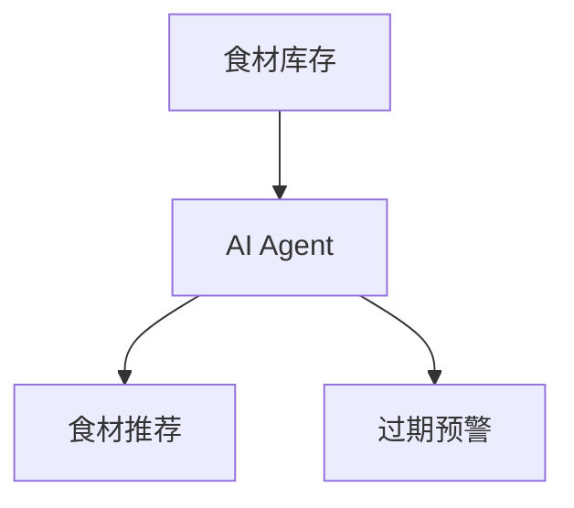
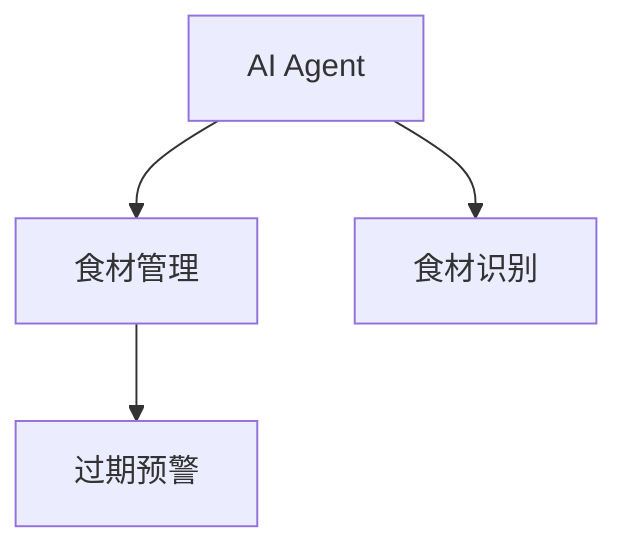
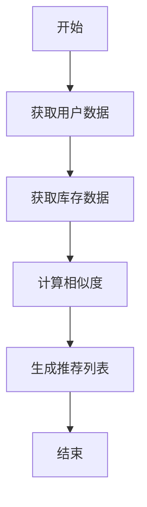
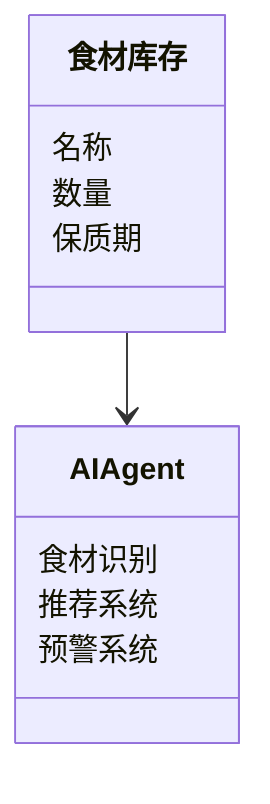
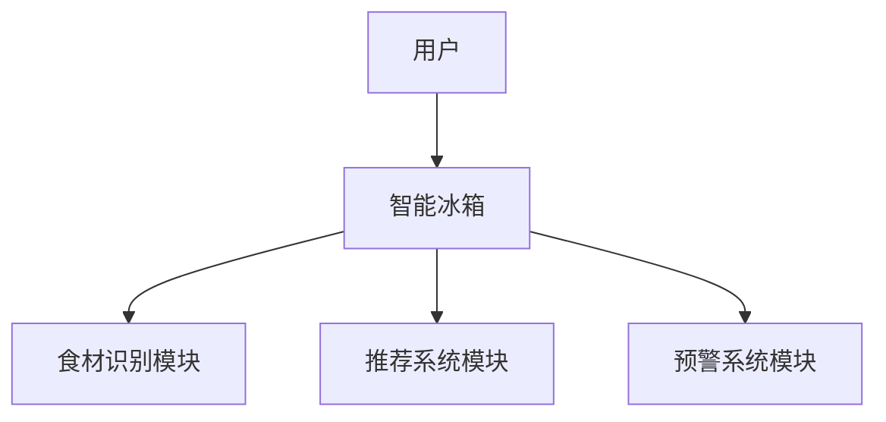
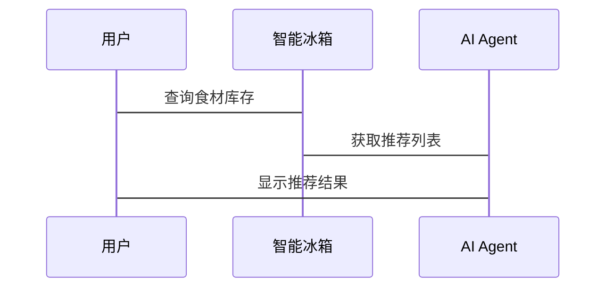

                 


# 智能冰箱：AI Agent的食材管理与过期预警系统

> 关键词：智能冰箱，AI Agent，食材管理，过期预警，智能家居

> 摘要：本文将详细介绍智能冰箱中的AI Agent在食材管理与过期预警系统中的应用。通过分析问题背景、核心概念、算法原理、系统架构以及项目实战，本文旨在为读者提供一个全面的技术视角，展示如何利用AI技术优化食材管理，减少浪费，提升用户体验。

---

## 第一章: 智能冰箱的背景与问题描述

### 1.1 智能冰箱的背景

#### 1.1.1 传统冰箱的局限性
传统冰箱的主要功能是冷藏和冷冻食材，但缺乏智能化的管理能力。用户常常会因为忘记食材的存在而导致食材过期浪费，或者因为食材不足而需要频繁购买。

#### 1.1.2 智能家居的发展趋势
随着物联网和人工智能技术的快速发展，智能家居设备逐渐普及。智能冰箱作为智能家居的重要组成部分，可以通过与家中其他设备的联动，提供更便捷的生活体验。

#### 1.1.3 AI技术在家电领域的应用
AI技术的应用让家电设备能够实现智能化的决策和管理。例如，通过图像识别、自然语言处理和推荐系统等技术，智能冰箱可以更好地帮助用户管理食材。

### 1.2 问题背景与描述

#### 1.2.1 食材管理的痛点
- 食材库存难以实时掌握。
- 食材过期提醒不及时，导致浪费。
- 用户难以快速找到所需食材。

#### 1.2.2 食材过期浪费的问题
食材过期不仅造成经济浪费，还可能对用户健康造成潜在威胁。据统计，全球每年因食材浪费造成的损失高达数百亿美元。

#### 1.2.3 用户需求与痛点分析
用户希望智能冰箱能够：
- 实时监控食材库存。
- 提供食材过期预警。
- 自动推荐食谱或购物清单。

### 1.3 问题解决与解决方案

#### 1.3.1 AI Agent的核心作用
AI Agent（智能代理）可以通过传感器、图像识别和自然语言处理技术，实时监控食材状态，并根据用户习惯推荐食材使用方案。

#### 1.3.2 智能冰箱的解决方案
- 配备食材识别技术，实时更新库存。
- 基于AI算法推荐食材使用和采购计划。
- 提供过期预警功能，减少浪费。

#### 1.3.3 技术实现的可行性分析
- 现有技术（如图像识别、传感器技术）已经可以支持智能冰箱的功能实现。
- 通过与智能家居平台的联动，进一步提升用户体验。

### 1.4 边界与外延

#### 1.4.1 系统的边界
智能冰箱的功能主要集中在食材管理与过期预警，不涉及其他智能家居设备的功能。

#### 1.4.2 相关领域的外延
智能冰箱可以与智能音箱、智能灶具等设备联动，提供更全面的智能家居体验。

#### 1.4.3 功能的限制与扩展性
当前系统主要关注食材管理，未来可以扩展到健康监测、营养推荐等领域。

### 1.5 核心要素与概念结构

#### 1.5.1 核心要素分析
- 食材库存管理
- 过期预警系统
- AI推荐算法

#### 1.5.2 概念结构图


---

## 第二章: AI Agent的核心原理

### 2.1 AI Agent的基本概念

#### 2.1.1 AI Agent的定义
AI Agent是一种能够感知环境并采取行动以实现目标的智能实体。在智能冰箱中，AI Agent通过传感器和摄像头感知食材状态，并根据用户需求做出决策。

#### 2.1.2 AI Agent的核心特征
- 感知能力：通过传感器和摄像头获取食材信息。
- 决策能力：基于历史数据和用户习惯推荐食材使用方案。
- 执行能力：通过与智能家居设备联动，执行采购或提醒操作。

#### 2.1.3 AI Agent的分类
- 基于规则的AI Agent
- 基于知识的AI Agent
- 基于学习的AI Agent

### 2.2 AI Agent在智能冰箱中的应用

#### 2.2.1 AI Agent的功能定位
AI Agent在智能冰箱中主要负责食材识别、库存管理、过期预警和食谱推荐。

#### 2.2.2 AI Agent与食材管理的结合
- 通过图像识别技术识别食材种类和数量。
- 基于AI算法推荐食材使用顺序，避免过期浪费。

#### 2.2.3 AI Agent的决策机制
AI Agent通过分析食材库存和用户习惯，动态调整食材推荐策略。

### 2.3 核心概念与联系

#### 2.3.1 AI Agent、食材管理与过期预警的核心概念
| 概念 | 定义 | 功能 |
|------|------|------|
| AI Agent | 智能代理 | 实现食材识别、推荐和预警 |
| 食材管理 | 管理食材库存 | 实时更新库存信息 |
| 过期预警 | 提醒过期食材 | 减少浪费 |

#### 2.3.2 实体关系图


---

## 第三章: 食材管理系统的算法原理

### 3.1 食材推荐算法

#### 3.1.1 算法概述
食材推荐算法基于用户历史数据和当前库存，推荐最优的食材使用顺序。

#### 3.1.2 算法流程


#### 3.1.3 算法实现
```python
def calculate_similarity(user_data, inventory_data):
    # 计算食材相似度
    pass

def generate_recommendation(user_data, inventory_data):
    similarity_scores = calculate_similarity(user_data, inventory_data)
    # 根据相似度排序
    return sorted(similarity_scores, reverse=True)
```

#### 3.1.4 数学模型
$$ \text{相似度} = \frac{\sum_{i=1}^{n} (x_i - \mu_x)(y_i - \mu_y)}{\sqrt{\sum_{i=1}^{n} (x_i - \mu_x)^2} \cdot \sqrt{\sum_{i=1}^{n} (y_i - \mu_y)^2}} $$

### 3.2 过期预警模型

#### 3.2.1 模型概述
过期预警模型通过分析食材保质期和存储条件，预测食材的最佳使用时间。

#### 3.2.2 模型实现
```python
def predict_expiry_date(expiry_date, storage_condition):
    # 根据存储条件调整过期时间
    pass
```

#### 3.2.3 数学公式
$$ \text{预警时间} = \text{当前时间} + \frac{\text{保质期}}{2} $$

---

## 第四章: 系统分析与架构设计方案

### 4.1 问题场景介绍

#### 4.1.1 系统需求
- 实时监控食材库存。
- 提供食材推荐和过期预警。

#### 4.1.2 项目介绍
本项目旨在通过AI技术优化食材管理，减少浪费，提升用户体验。

### 4.2 系统功能设计

#### 4.2.1 领域模型


#### 4.2.2 系统架构设计


#### 4.2.3 接口设计
- 用户与智能冰箱的交互接口。
- 智能冰箱与智能家居平台的联动接口。

#### 4.2.4 交互流程图


---

## 第五章: 项目实战

### 5.1 环境搭建

#### 5.1.1 系统要求
- Python 3.8+
- OpenCV库
- TensorFlow库

#### 5.1.2 安装依赖
```bash
pip install opencv-python tensorflow
```

### 5.2 系统核心实现

#### 5.2.1 食材录入
```python
def record_inventory():
    # 通过摄像头识别食材并记录库存
    pass
```

#### 5.2.2 推荐系统实现
```python
def generate_recommendation(user_data, inventory_data):
    # 根据用户数据和库存数据生成推荐列表
    pass
```

#### 5.2.3 过期预警实现
```python
def predict_expiry_date(expiry_date, storage_condition):
    # 根据存储条件调整过期时间
    pass
```

### 5.3 代码应用解读与分析

#### 5.3.1 食材识别代码
```python
import cv2

def identify_food(image_path):
    # 使用OpenCV进行图像识别
    image = cv2.imread(image_path)
    # 处理图像...
    return result
```

#### 5.3.2 推荐系统代码
```python
import numpy as np

def calculate_similarity(user_data, inventory_data):
    # 计算相似度
    return np.dot(user_data, inventory_data)
```

### 5.4 实际案例分析

#### 5.4.1 食材识别案例
用户上传一张鸡蛋照片，系统识别并记录库存。

#### 5.4.2 推荐系统案例
根据用户习惯，推荐使用鸡蛋制作煎饼。

### 5.5 项目小结

#### 5.5.1 核心实现
- 食材识别与库存管理
- 食材推荐与过期预警

#### 5.5.2 项目总结
通过AI技术实现智能冰箱的食材管理与过期预警系统，能够显著提升用户体验，减少食材浪费。

---

## 第六章: 总结与展望

### 6.1 最佳实践

#### 6.1.1 开发建议
- 使用成熟的技术栈。
- 确保数据安全和隐私保护。

#### 6.1.2 使用建议
- 定期更新系统。
- 提供多语言支持。

### 6.2 小结

#### 6.2.1 核心内容回顾
本文详细介绍了AI Agent在智能冰箱中的应用，包括食材管理、过期预警等核心功能。

#### 6.2.2 系统优势
- 提高食材管理效率。
- 减少食材浪费。
- 提升用户体验。

### 6.3 注意事项

#### 6.3.1 数据隐私
确保用户数据的安全性和隐私性。

#### 6.3.2 系统稳定性
确保系统在复杂环境下的稳定运行。

### 6.4 拓展阅读

#### 6.4.1 推荐系统优化
探索更高效的推荐算法。

#### 6.4.2 多模态数据融合
结合图像、语音等多种数据源，提升系统智能性。

---

## 作者：AI天才研究院/AI Genius Institute & 禅与计算机程序设计艺术 /Zen And The Art of Computer Programming

