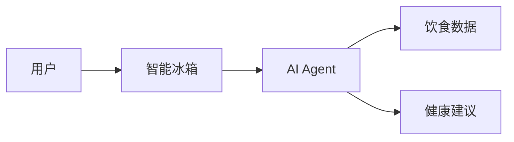

                 


# 智能冰箱：AI Agent的饮食习惯分析与健康建议

> 关键词：智能冰箱，AI Agent，饮食习惯分析，健康建议，数据挖掘，机器学习，物联网

> 摘要：本文探讨了智能冰箱结合AI Agent技术，如何分析用户的饮食习惯并提供个性化健康建议。通过详细分析数据采集、模型构建、系统架构及实际案例，展示了智能冰箱在健康管理中的潜力和应用。

---

# 第一部分: 智能冰箱与AI Agent概述

## 第1章: 智能冰箱的背景与概念

### 1.1 智能冰箱的定义与现状
- **智能冰箱的定义**：智能冰箱是结合物联网技术，能够联网、远程控制和数据分析的冰箱。
- **现状**：普及率逐步提高，功能趋于多样化。
- **特点**：数据采集、智能控制、用户交互。

### 1.2 AI Agent的基本概念与应用
- **AI Agent**：智能主体，用于处理数据、做出决策。
- **应用场景**：数据采集、分析、健康建议生成。

### 1.3 饮食习惯分析与健康建议的重要性
- **饮食习惯分析**：了解用户的营养摄入情况。
- **健康建议**：提供个性化饮食指导。
- **智能冰箱的健康管理潜力**：整合健康数据，提供全面的健康管理服务。

---

# 第二部分: AI Agent的饮食习惯分析与健康建议的核心概念

## 第2章: AI Agent的饮食习惯分析原理

### 2.1 数据采集与处理
- **数据采集方式**：记录用户饮食数据，通过传感器获取食材信息。
- **数据预处理方法**：清洗数据，去除异常值。
- **数据特征提取**：提取关键特征，如摄入量、偏好。

### 2.2 饮食习惯分析模型
- **数据分析方法**：使用统计学和机器学习方法。
- **模型构建与训练**：训练分类和回归模型。
- **模型评估与优化**：使用准确率、F1分数评估模型性能。

### 2.3 健康建议生成机制
- **规则制定**：基于营养学标准制定规则。
- **个性化建议**：结合用户数据提供个性化建议。
- **动态调整**：根据反馈优化建议。

## 第3章: AI Agent与智能冰箱的实体关系分析

### 3.1 实体关系图


---

# 第三部分: 系统分析与架构设计

## 第4章: 系统架构设计

### 4.1 系统功能设计
- **模块划分**：数据采集模块、分析模块、建议生成模块。
- **领域模型**：
  ```mermaid
  classDiagram
    class 用户 {
        用户ID
        历史数据
        饮食偏好
    }
    class 智能冰箱 {
        食材清单
        剩余保质期
        食物摄入记录
    }
    class AI Agent {
        数据分析模块
        建议生成模块
    }
    用户 --> AI Agent
    智能冰箱 --> AI Agent
  ```

### 4.2 系统架构设计
- **分层架构**：数据采集层、业务逻辑层、用户交互层。
- **架构图**：
  ```mermaid
  rectangle 数据采集层 {
      智能冰箱
      物联网模块
  }
  rectangle 业务逻辑层 {
      AI Agent
      数据分析模块
  }
  rectangle 用户交互层 {
      用户界面
      健康建议展示
  }
  数据采集层 --> 业务逻辑层
  业务逻辑层 --> 用户交互层
  ```

### 4.3 系统接口设计
- **API接口**：RESTful API，用于数据传输和功能调用。

---

# 第四部分: 项目实战

## 第5章: 项目实现

### 5.1 环境搭建
- **技术选型**：Python、TensorFlow、Flask。
- **工具安装**：安装Python、TensorFlow、Flask框架。

### 5.2 核心功能实现
- **数据采集模块**：读取食材清单和摄入记录。
- **数据分析模块**：训练模型进行饮食习惯分析。
- **健康建议生成模块**：基于分析结果生成建议。

### 5.3 代码实现
- **数据清洗代码**：
  ```python
  import pandas as pd

  # 读取数据
  data = pd.read_csv('diet.csv')

  # 删除缺失值
  data.dropna(inplace=True)

  # 去除异常值
  data = data[(data['calories'] >= 100) & (data['calories'] <= 3000)]
  ```

- **模型训练代码**：
  ```python
  import tensorflow as tf
  from tensorflow.keras import layers

  model = tf.keras.Sequential([
      layers.Dense(64, activation='relu'),
      layers.Dense(1, activation='sigmoid')
  ])

  model.compile(optimizer='adam', loss='binary_crossentropy', metrics=['accuracy'])
  model.fit(X_train, y_train, epochs=10, batch_size=32)
  ```

### 5.4 实际案例分析
- **案例描述**：分析某用户的饮食数据，生成健康建议。

---

# 第五部分: 总结与展望

## 第6章: 总结与展望

### 6.1 本章小结
- **总结**：智能冰箱结合AI Agent，能够有效分析饮食习惯并提供健康建议。
- **展望**：未来将优化模型，拓展更多健康应用场景。

---

# 作者

作者：AI天才研究院 & 禅与计算机程序设计艺术

---

以上目录大纲详细规划了文章的结构，从背景介绍到系统实现，层层深入，确保内容全面且有条理。

