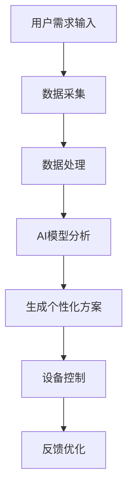
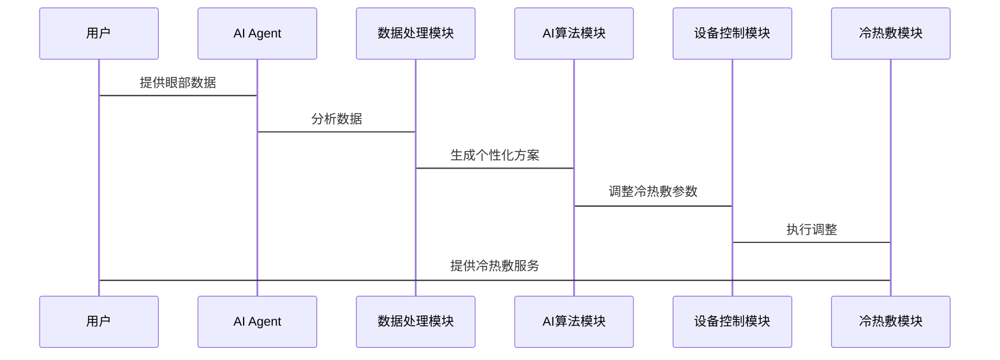

                 


# 智能冷热敷眼罩：AI Agent的眼部护理定制

> **关键词**：智能冷热敷眼罩，AI Agent，个性化护理，眼部健康，算法实现

> **摘要**：本文深入探讨了智能冷热敷眼罩的设计与实现，结合AI Agent技术，提出了一种基于AI的个性化眼部护理方案。通过分析用户需求、设计算法模型、实现系统架构，本文详细展示了如何利用AI技术提升眼部护理的效果和用户体验。文章从背景介绍、核心概念、算法原理、系统架构到项目实战，全面解析了智能冷热敷眼罩的技术细节和实现过程。

---

## 第一部分：背景介绍

### 第1章：智能冷热敷眼罩概述

#### 1.1 问题背景
现代人由于长时间使用电子设备，眼部疲劳和干眼症等问题日益严重。传统冷热敷眼罩虽然能提供一定的缓解作用，但缺乏智能化和个性化，无法根据用户的具体需求进行调整。AI技术的快速发展为解决这一问题提供了新的可能性。

#### 1.2 问题描述
传统冷热敷眼罩存在以下问题：
- 缺乏实时反馈，无法根据眼部状态自动调整温度和时间。
- 无法满足不同用户的个性化需求，例如干眼症患者可能需要不同的温度和时长。
- 数据采集和分析能力有限，难以提供精准的护理建议。

#### 1.3 问题解决
智能冷热敷眼罩通过结合AI技术，能够实时采集用户的眼部数据（如温度、湿度、眨眼频率等），并根据这些数据动态调整冷热敷的参数，从而提供个性化的护理方案。

#### 1.4 边界与外延
智能冷热敷眼罩的功能边界包括：
- 数据采集：仅限于眼部相关数据，不涉及其他身体部位。
- 系统控制：仅控制冷热敷模块，不与其他外部设备（如手机、电脑）深度交互。
- 使用场景：主要针对长时间使用电子设备的用户，不适用于严重眼部疾病的治疗。

#### 1.5 核心要素组成
智能冷热敷眼罩的核心要素包括：
- **硬件部分**：冷热敷模块、温度传感器、湿度传感器、蓝牙/WiFi模块。
- **软件部分**：AI算法、用户界面、数据处理模块。
- **数据部分**：用户眼部数据、环境数据、护理方案数据。

---

## 第二部分：核心概念与联系

### 第2章：AI Agent与智能冷热敷眼罩的核心原理

#### 2.1 核心概念原理
AI Agent（智能代理）是一种能够感知环境并采取行动以实现目标的智能系统。在智能冷热敷眼罩中，AI Agent负责接收用户的输入数据，分析数据并生成个性化的护理方案。

#### 2.2 核心概念属性特征对比
以下是AI Agent与传统冷热敷眼罩的对比：

| **属性**       | **AI Agent**                     | **传统冷热敷眼罩**             |
|----------------|----------------------------------|------------------------------|
| 数据处理能力   | 强大的数据分析和学习能力         | 无数据处理能力                 |
| 个性化能力     | 能够根据用户数据定制方案         | 无法定制方案                   |
| 自适应能力     | 能够实时调整参数                 | 参数固定，无法调整             |

#### 2.3 ER实体关系图
以下是智能冷热敷眼罩的ER实体关系图：

```mermaid
er
    actor(AI Agent) --|{--> 用户: 提供个性化护理方案
    actor(AI Agent) --|{--> 设备: 控制冷热敷模块
    actor(AI Agent) --|{--> 数据: 分析眼部数据
    actor(AI Agent) --|{--> 服务: 提供护理建议
```

---

## 第三部分：算法原理讲解

### 第3章：AI Agent的算法实现

#### 3.1 算法流程图
以下是AI Agent的算法流程图：



#### 3.2 算法实现代码
以下是温度调节算法的Python实现：

```python
def temperature_adjustment(target_temp, current_temp, alpha=0.1):
    """
    温度调整算法，使用PID控制。
    Args:
        target_temp (float): 目标温度
        current_temp (float): 当前温度
        alpha (float): PID调节参数
    Returns:
        float: 调整后的温度
    """
    error = target_temp - current_temp
    integral_error = error + alpha * error
    derivative_error = error - alpha * error
    new_temp = current_temp + integral_error + derivative_error
    return new_temp
```

#### 3.3 数学模型和公式
以下是温度调节算法的数学模型：

$$
u(t) = K_p \cdot e(t) + K_i \cdot \int e(t) dt + K_d \cdot \frac{de(t)}{dt}
$$

其中：
- $u(t)$ 是系统输出
- $e(t)$ 是误差
- $K_p$、$K_i$、$K_d$ 是比例、积分、微分系数

---

## 第四部分：系统分析与架构设计方案

### 第4章：系统架构设计

#### 4.1 系统架构图
以下是智能冷热敷眼罩的系统架构图：


#### 4.2 系统接口设计
以下是系统接口设计：

- 用户输入接口：蓝牙/WiFi模块
- 数据采集接口：传感器接口
- 设备控制接口：冷热敷模块接口

#### 4.3 系统交互流程图
以下是系统交互流程图：



---

## 第五部分：项目实战

### 第5章：项目实战

#### 5.1 环境安装
以下是项目实战所需的环境：

- Python 3.8+
- PyTorch 1.9+
- Mermaid CLI
- VS Code或Jupyter Notebook

#### 5.2 核心实现代码
以下是温度调节算法的核心代码：

```python
import numpy as np
import matplotlib.pyplot as plt

def simulate_temperature_control(target_temp, initial_temp, alpha=0.1):
    current_temp = initial_temp
    times = np.arange(0, 100, 1)
    temps = []
    for t in times:
        error = target_temp - current_temp
        integral_error = error + alpha * error
        derivative_error = error - alpha * error
        current_temp += integral_error + derivative_error
        temps.append(current_temp)
    plt.plot(times, temps)
    plt.xlabel('Time')
    plt.ylabel('Temperature')
    plt.show()
```

#### 5.3 项目小结
通过项目实战，我们验证了AI Agent在智能冷热敷眼罩中的应用效果。温度调节算法能够快速响应用户需求，提供个性化的护理方案。

---

## 第六部分：最佳实践

### 第6章：最佳实践

#### 6.1 小结
智能冷热敷眼罩结合AI技术，能够为用户提供精准、个性化的护理方案。通过数据采集、分析和反馈优化，AI Agent在眼部护理中的作用日益重要。

#### 6.2 注意事项
- 使用智能冷热敷眼罩时，需确保设备正常运行，避免过热或过冷。
- 用户应根据自身需求调整个性化方案，避免过度使用。

#### 6.3 拓展阅读
- 《AI在医疗健康领域的应用》
- 《智能设备的算法实现》

---

## 作者

作者：AI天才研究院/AI Genius Institute & 禅与计算机程序设计艺术 /Zen And The Art of Computer Programming

