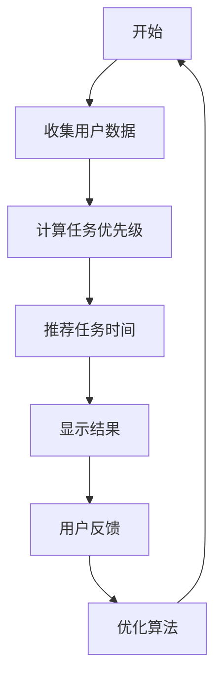
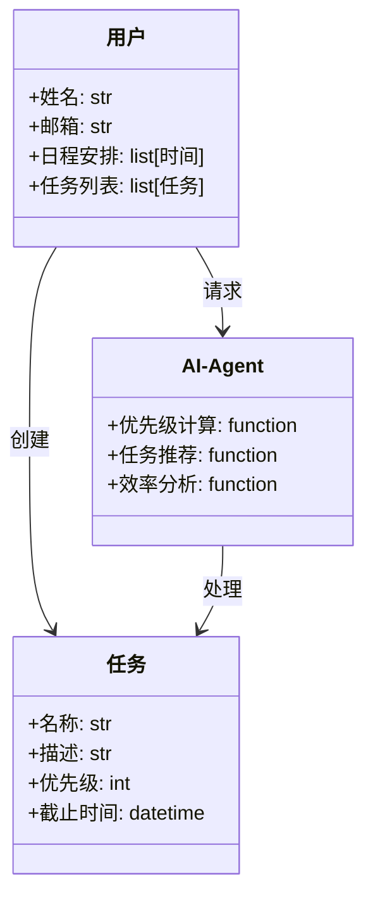

                 


# 《智能办公文具：AI Agent的工作效率追踪》

---

## 关键词：智能办公文具、AI Agent、效率追踪、算法原理、系统架构设计、项目实战、最佳实践

---

## 摘要：本文深入探讨了AI Agent在智能办公文具中的应用，分析了AI Agent如何通过任务追踪和效率分析提升办公效率。文章从背景介绍、核心概念、算法原理、系统架构设计、项目实战到最佳实践，全面解析了AI Agent在办公场景中的作用及其实现方式，为读者提供了从理论到实践的完整指南。

---

## 第一部分: 背景介绍与核心概念

---

### 第1章: 智能办公文具与AI Agent的背景介绍

#### 1.1 问题背景与问题描述

##### 1.1.1 办公效率低下现状
在现代办公环境中，员工每天需要处理大量的任务，包括会议安排、文档整理、任务跟踪等。然而，由于信息分散、任务优先级不明确以及缺乏有效的工具支持，办公效率往往低下。据统计，员工每天平均浪费超过2.5小时的时间在寻找信息和处理重复性任务上。

##### 1.1.2 AI技术在办公场景中的应用潜力
人工智能技术的快速发展为办公场景带来了新的可能性。AI Agent（智能代理）作为一种能够理解上下文、执行任务并提供反馈的智能工具，可以在办公环境中发挥重要作用。通过自然语言处理、机器学习和自动化技术，AI Agent可以帮助员工更高效地管理时间和任务。

##### 1.1.3 AI Agent在智能办公文具中的角色定位
AI Agent作为智能办公文具的核心组件，负责接收用户的指令、分析任务需求、执行任务并提供反馈。它能够与办公软件、日历、文档管理系统等工具无缝集成，帮助用户实现任务的自动化管理和效率追踪。

---

#### 1.2 问题解决与边界外延

##### 1.2.1 AI Agent如何提升办公效率
AI Agent可以通过自动化处理任务、智能优先级排序、实时反馈等功能，显著提升办公效率。例如，AI Agent可以自动将收到的邮件分类，优先处理重要任务，并在截止日期临近时提醒用户。

##### 1.2.2 智能办公文具的功能边界
智能办公文具的功能边界包括任务管理、时间安排、文档整理、数据可视化等。虽然AI Agent可以处理多种任务，但其核心功能是通过数据分析和自动化流程提升效率，而非替代用户的决策。

##### 1.2.3 AI Agent与传统办公工具的对比分析
与传统办公工具相比，AI Agent的优势在于其智能化和自动化能力。例如，传统日历只能提醒用户会议时间，而AI Agent可以根据用户的日程安排、任务优先级和工作习惯，智能推荐最佳的会议时间和工作安排。

---

#### 1.3 核心概念与结构组成

##### 1.3.1 AI Agent的基本定义
AI Agent是一种能够感知环境、理解用户需求并执行任务的智能系统。它通过自然语言处理、机器学习和规则引擎等技术，能够与用户进行交互并完成复杂任务。

##### 1.3.2 智能办公文具的系统架构
智能办公文具的系统架构包括用户界面、AI Agent引擎、数据存储和外部服务接口。用户通过界面与AI Agent交互，AI Agent通过数据存储和外部服务接口获取所需信息并执行任务。

##### 1.3.3 核心要素与功能模块
智能办公文具的核心要素包括：
- **任务管理模块**：负责任务的创建、分配和优先级排序。
- **时间管理模块**：根据任务优先级和用户日程安排，推荐最佳工作时间。
- **数据整理模块**：自动整理文档、邮件和其他相关信息。
- **反馈模块**：提供任务完成情况的实时反馈和效率分析报告。

---

### 第2章: AI Agent的核心概念与联系

#### 2.1 AI Agent的定义与原理

##### 2.1.1 AI Agent的基本概念
AI Agent是一种能够理解用户需求、执行任务并提供反馈的智能系统。它可以基于规则、机器学习或混合方法进行任务处理。

##### 2.1.2 AI Agent的工作原理
AI Agent通过以下步骤实现任务处理：
1. **感知环境**：通过API或用户输入获取数据。
2. **理解需求**：解析用户指令并生成任务描述。
3. **执行任务**：根据任务需求调用外部服务或执行自动化操作。
4. **反馈结果**：将任务完成情况反馈给用户。

##### 2.1.3 AI Agent与智能办公文具的结合
AI Agent通过与智能办公文具的集成，能够实现任务管理、时间安排和效率追踪等核心功能。例如，AI Agent可以与日历应用集成，自动调整会议安排以避免冲突。

#### 2.2 核心概念对比分析

##### 2.2.1 AI Agent与传统办公工具的对比
| 特性            | AI Agent                | 传统办公工具          |
|-----------------|--------------------------|-----------------------|
| 自动化能力      | 高                       | 低                   |
| 任务处理能力    | 智能，支持复杂任务       | 单一，支持简单任务     |
| 学习能力        | 支持机器学习             | 无                   |
| 交互方式        | 自然语言处理             | 基于菜单和按钮         |

##### 2.2.2 不同AI Agent的属性特征对比
| 类型            | 基于规则的AI Agent | 基于机器学习的AI Agent | 混合型AI Agent |
|-----------------|---------------------|------------------------|----------------|
| 工作原理        | 预定义规则           | 数据驱动的模型          | 结合规则和模型   |
| 适应性          | 低                   | 高                     | 较高            |
| 适用场景        | 简单任务             | 复杂任务               | 综合任务         |

##### 2.2.3 智能办公文具的功能对比
通过对比不同智能办公文具的功能，我们可以更好地理解AI Agent的应用场景。例如，一些高端智能文具支持任务优先级排序和实时反馈，而一些基础产品仅提供任务记录功能。

#### 2.3 ER实体关系图
以下是AI Agent在智能办公文具系统中的ER实体关系图：

```mermaid
er
  actor: 用户
  tool: 智能办公文具
  agent: AI Agent
  document: 文档
  task: 任务
  relation: 关联
  actor --> tool: 使用
  tool --> agent: 集成
  agent --> document: 处理
  task --> agent: 执行
  document --> task: 包含
```

---

## 第二部分: 算法原理与数学模型

---

### 第3章: 算法原理与数学模型

#### 3.1 算法原理

##### 3.1.1 AI Agent的任务追踪算法
任务追踪算法负责根据用户的日程安排和任务优先级，推荐最佳的任务执行时间。以下是任务推荐算法的步骤：

1. **数据收集**：获取用户的日程安排、任务清单和优先级。
2. **优先级计算**：基于任务的重要性和紧急性，计算每个任务的优先级。
3. **时间推荐**：根据优先级和用户的空闲时间，推荐任务的执行时间。
4. **反馈优化**：根据用户的反馈调整推荐算法。

##### 3.1.2 效率分析的数学模型
效率分析的数学模型基于任务完成时间和优先级进行计算。公式如下：

$$
效率 = \frac{\sum (任务优先级 \times 任务完成时间)}{\sum 任务优先级}
$$

其中，任务优先级由任务的重要性和紧急性决定，范围为1到5。

##### 3.1.3 算法流程图
以下是任务推荐算法的流程图：



---

#### 3.2 算法实现

##### 3.2.1 Python代码实现
以下是基于优先级的任务推荐算法的Python代码示例：

```python
import heapq

def calculate_priority(tasks):
    # 任务优先级计算
    priorities = []
    for task in tasks:
        priority = task['重要性'] * task['紧急性']
        priorities.append(priority)
    heapq.heapify(priorities)
    return priorities

def recommend_time(tasks, priorities):
    # 根据优先级推荐任务时间
    sorted_tasks = heapq.nlargest(len(tasks), zip(priorities, tasks))
    recommended_time = []
    for priority, task in sorted_tasks:
        recommended_time.append((task['名称'], priority))
    return recommended_time

# 示例数据
tasks = [
    {'名称': '报告撰写', '重要性': 5, '紧急性': 4},
    {'名称': '会议准备', '重要性': 3, '紧急性': 5},
    {'名称': '邮件回复', '重要性': 2, '紧急性': 3}
]

priorities = calculate_priority(tasks)
recommended_time = recommend_time(tasks, priorities)
print(recommended_time)
```

---

#### 3.3 数学模型的详细解读

##### 3.3.1 优先级计算公式
$$
优先级 = 重要性 \times 紧急性
$$

其中，重要性和紧急性均为1到5的整数。

##### 3.3.2 效率计算公式
$$
效率 = \frac{\sum (优先级 \times 完成时间)}{\sum 优先级}
$$

效率值越接近1，说明任务完成越高效。

##### 3.3.3 示例分析
假设我们有三个任务：
1. 报告撰写：重要性=5，紧急性=4，完成时间=2小时
2. 会议准备：重要性=3，紧急性=5，完成时间=1小时
3. 邮件回复：重要性=2，紧急性=3，完成时间=0.5小时

优先级计算：
1. 报告撰写：5×4=20
2. 会议准备：3×5=15
3. 邮件回复：2×3=6

效率计算：
$$
效率 = \frac{(20 \times 2) + (15 \times 1) + (6 \times 0.5)}{20 + 15 + 6} = \frac{40 + 15 + 3}{41} = \frac{58}{41} \approx 1.41
$$

---

## 第三部分: 系统分析与架构设计

---

### 第4章: 系统分析与架构设计

#### 4.1 系统分析

##### 4.1.1 应用场景介绍
智能办公文具的应用场景包括任务管理、时间安排、文档整理、数据可视化等。用户通过智能文具可以实现任务的自动化管理和效率追踪。

##### 4.1.2 项目介绍
本项目旨在开发一款基于AI Agent的智能办公文具，通过任务推荐和效率分析提升用户的办公效率。

---

#### 4.2 系统功能设计

##### 4.2.1 领域模型设计
以下是智能办公文具的领域模型类图：



##### 4.2.2 系统架构设计
以下是智能办公文具的系统架构图：

```mermaid
graph TD
    User --> AI-Agent: 请求
    AI-Agent --> Task-Manager: 获取任务
    AI-Agent --> Calendar: 获取日程
    AI-Agent --> Analytics: 计算效率
    Task-Manager --> Display: 显示结果
    Calendar --> Display: 显示日程
    Analytics --> Display: 显示效率
```

##### 4.2.3 系统接口设计
系统接口设计包括：
- 用户与AI-Agent的交互接口
- AI-Agent与任务管理模块的接口
- AI-Agent与数据存储模块的接口

##### 4.2.4 系统交互流程
以下是系统交互的流程图：

```mermaid
graph TD
    User --> AI-Agent: 提交任务
    AI-Agent --> Task-Manager: 获取任务详情
    Task-Manager --> AI-Agent: 返回任务数据
    AI-Agent --> Display: 显示推荐时间
    Display --> User: 显示结果
```

---

## 第四部分: 项目实战

---

### 第5章: 项目实战

#### 5.1 环境安装

##### 5.1.1 安装Python和必要的库
需要安装以下Python库：
- `heapq`：用于优先级计算
- `datetime`：用于时间处理
- `mermaid`：用于生成图表

安装命令：
```bash
pip install heapq datetime mermaid
```

#### 5.2 系统核心实现

##### 5.2.1 核心代码实现
以下是AI-Agent的核心代码：

```python
import heapq
from datetime import datetime

class AI-Agent:
    def __init__(self):
        self.tasks = []
        self.priorities = []
    
    def add_task(self, task):
        self.tasks.append(task)
    
    def calculate_priority(self):
        self.priorities = []
        for task in self.tasks:
            priority = task['重要性'] * task['紧急性']
            self.priorities.append(priority)
        heapq.heapify(self.priorities)
    
    def recommend_time(self, user_schedule):
        # 获取用户空闲时间
        free_time = []
        for i in range(24):
            if i not in user_schedule:
                free_time.append(i)
        # 推荐任务时间
        recommended_time = []
        for i in range(len(self.priorities)):
            task = self.tasks[i]
            time = free_time[i % len(free_time)]
            recommended_time.append((task['名称'], time))
        return recommended_time
```

##### 5.2.2 代码功能解读
- `add_task`：添加新任务
- `calculate_priority`：计算任务优先级
- `recommend_time`：推荐任务时间

#### 5.3 实际案例分析

##### 5.3.1 案例分析
假设用户日程安排如下：
- 9:00 - 12:00：会议
- 14:00 - 17:00：空闲

任务列表：
1. 报告撰写：重要性=5，紧急性=4
2. 会议准备：重要性=3，紧急性=5
3. 邮件回复：重要性=2，紧急性=3

优先级计算结果：
1. 报告撰写：20
2. 会议准备：15
3. 邮件回复：6

推荐时间：
- 报告撰写：14:00
- 会议准备：15:00
- 邮件回复：16:00

##### 5.3.2 分析总结
通过优先级计算和推荐算法，AI-Agent能够帮助用户更高效地安排任务时间，避免任务冲突，提升整体效率。

---

## 第五部分: 最佳实践

---

### 第6章: 最佳实践

#### 6.1 小结与注意事项

##### 6.1.1 小结
本文详细介绍了AI-Agent在智能办公文具中的应用，从背景介绍、核心概念、算法原理到系统架构设计和项目实战，为读者提供了从理论到实践的完整指南。

##### 6.1.2 注意事项
在实际应用中，需要注意以下几点：
- 数据安全：确保用户数据的隐私和安全。
- 算法优化：根据用户反馈不断优化推荐算法。
- 系统集成：确保AI-Agent与其他办公工具的无缝集成。

#### 6.2 未来趋势与拓展阅读

##### 6.2.1 未来趋势
随着AI技术的不断发展，AI-Agent在办公场景中的应用将更加智能化和个性化。未来，AI-Agent可能会具备更强的自然语言处理能力，能够更准确地理解用户需求并提供更精准的推荐。

##### 6.2.2 拓展阅读
- 《人工智能：一种现代的方法》
- 《机器学习实战》
- 《Python机器学习》

---

## 作者：AI天才研究院/AI Genius Institute & 禅与计算机程序设计艺术 /Zen And The Art of Computer Programming

