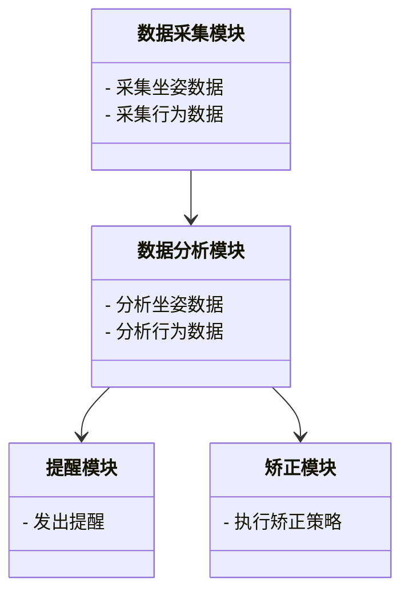
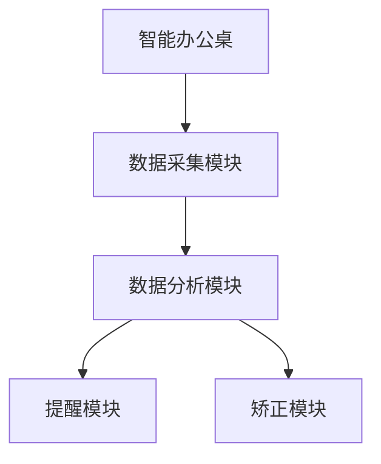

                 


# 智能办公桌：AI Agent的久坐提醒与姿势矫正

> 关键词：智能办公桌，AI Agent，久坐提醒，姿势矫正，健康办公，人工智能

> 摘要：随着科技的进步，AI Agent在办公环境中的应用越来越广泛。本文详细探讨了AI Agent在智能办公桌上的应用，特别是久坐提醒和姿势矫正功能。通过分析AI Agent的核心原理、算法实现、系统架构以及实际案例，本文为读者提供了全面的视角，展示了如何利用AI技术改善办公健康问题，提升工作效率和员工福祉。

---

# 第1章 智能办公桌与AI Agent概述

## 1.1 久坐问题与健康危害

### 1.1.1 久坐对健康的负面影响
现代办公环境中，久坐已经成为一个普遍问题。长时间的坐姿不良会导致颈椎病、腰椎病、肩周炎等健康问题。据统计，全球每年因久坐导致的医疗费用高达数百亿美元。这些问题不仅影响员工健康，还增加了企业的间接成本。

### 1.1.2 办公环境中的久坐问题
办公室是久坐问题的高发地。员工长时间面对电脑，缺乏运动，姿势不正确，这些都是导致健康问题的主要原因。此外，久坐还会影响血液循环，导致注意力下降，工作效率降低。

### 1.1.3 AI技术在办公健康中的应用潜力
AI技术可以通过实时监测员工的坐姿和行为，提供个性化的健康建议。AI Agent能够自动提醒员工调整坐姿，定时提醒休息，从而有效改善久坐问题。

## 1.2 AI Agent的基本概念

### 1.2.1 什么是AI Agent
AI Agent是一种能够感知环境、自主决策并执行任务的智能体。它能够通过传感器、摄像头等设备获取环境数据，利用机器学习算法进行分析，并根据结果执行相应的动作。

### 1.2.2 AI Agent的核心功能
AI Agent的核心功能包括数据采集、分析、决策和执行。它能够实时监测员工的坐姿，分析健康风险，并通过声音、震动等方式提醒员工调整姿势。

### 1.2.3 AI Agent在办公场景中的应用
在办公场景中，AI Agent可以用于健康监测、任务提醒、环境优化等多个方面。本文主要关注AI Agent在久坐提醒和姿势矫正中的应用。

## 1.3 智能办公桌的功能与优势

### 1.3.1 智能办公桌的定义
智能办公桌是一种集成AI技术的办公设备，能够通过传感器和摄像头实时监测员工的坐姿和行为，并通过AI算法提供健康建议。

### 1.3.2 智能办公桌的核心功能
智能办公桌的核心功能包括姿势检测、健康评分、久坐提醒、姿势矫正和环境优化。这些功能能够帮助员工保持良好的坐姿，预防健康问题。

### 1.3.3 智能办公桌的市场现状与发展趋势
目前，智能办公桌市场增长迅速，许多科技公司都在积极研发相关产品。未来，随着AI技术的不断发展，智能办公桌的功能将更加智能化和个性化。

## 1.4 本章小结
本章介绍了久坐问题对健康的危害，以及AI Agent在办公场景中的应用潜力。同时，详细介绍了智能办公桌的功能和市场现状，为后续章节奠定了基础。

---

# 第2章 AI Agent的久坐提醒与姿势矫正原理

## 2.1 AI Agent的核心概念

### 2.1.1 感知层：人体姿势与行为数据的采集
AI Agent通过摄像头、传感器等设备采集员工的坐姿和行为数据。这些数据包括坐姿的角度、身体的姿态、动作的频率等。

### 2.1.2 计算层：数据的分析与处理
计算层利用机器学习算法对采集的数据进行分析，识别出员工的不良姿势和久坐行为。例如，通过姿态估计技术识别员工是否长时间保持不良坐姿。

### 2.1.3 行动层：提醒与矫正策略的执行
行动层根据计算层的分析结果，执行相应的提醒和矫正策略。例如，当检测到员工长时间保持不良坐姿时，AI Agent会发出声音提醒，或通过震动提醒员工调整姿势。

## 2.2 久坐提醒与姿势矫正的原理

### 2.2.1 姿势检测算法
姿势检测算法通过摄像头捕捉员工的坐姿，利用深度学习模型进行姿态估计。常见的姿势检测模型包括OpenPose和MediaPipe。

### 2.2.2 健康评分模型
健康评分模型根据员工的坐姿和行为数据，计算出一个健康评分。评分越低，表示员工的健康风险越高。评分公式如下：

$$ 健康评分 = 100 - \sum_{i=1}^{n} (w_i \cdot d_i) $$

其中，$w_i$ 是第i个姿势特征的权重，$d_i$ 是第i个姿势特征的偏离程度。

### 2.2.3 AI Agent的反馈机制
AI Agent根据健康评分模型的结果，动态调整提醒策略。例如，当评分低于阈值时，AI Agent会频繁提醒员工调整姿势；当评分高于阈值时，提醒频率会降低。

## 2.3 姿势矫正与久坐提醒的实现逻辑

### 2.3.1 数据采集模块
数据采集模块负责采集员工的坐姿和行为数据。这些数据包括坐姿的角度、身体的姿态、动作的频率等。

### 2.3.2 数据分析模块
数据分析模块利用机器学习算法对采集的数据进行分析，识别出员工的不良姿势和久坐行为。

### 2.3.3 矫正策略模块
矫正策略模块根据分析结果，制定相应的矫正策略。例如，当检测到员工长时间保持不良坐姿时，AI Agent会发出声音提醒，或通过震动提醒员工调整姿势。

## 2.4 本章小结
本章详细介绍了AI Agent的久坐提醒与姿势矫正的原理，包括数据采集、分析和矫正策略的实现逻辑。为后续章节的系统设计奠定了基础。

---

# 第3章 AI Agent的算法原理与数学模型

## 3.1 姿势检测与分析算法

### 3.1.1 基于图像的姿势检测
基于图像的姿势检测利用摄像头采集员工的坐姿图像，通过深度学习模型进行姿态估计。常见的姿势检测模型包括OpenPose和MediaPipe。

### 3.1.2 基于传感器的姿势检测
基于传感器的姿势检测通过身体传感器采集员工的坐姿数据，例如加速度计、陀螺仪等。这些数据可以用来判断员工的坐姿是否正确。

### 3.1.3 混合式姿势检测方法
混合式姿势检测方法结合了基于图像和基于传感器的检测方法，能够提供更准确的姿势检测结果。

## 3.2 姿势分析的数学模型

### 3.2.1 姿势坐标的表示
姿势坐标的表示方法包括二维坐标和三维坐标。二维坐标通常用于姿态估计，而三维坐标则用于更精确的姿势分析。

### 3.2.2 健康评分的计算公式
健康评分的计算公式如下：

$$ 健康评分 = 100 - \sum_{i=1}^{n} (w_i \cdot d_i) $$

其中，$w_i$ 是第i个姿势特征的权重，$d_i$ 是第i个姿势特征的偏离程度。

### 3.2.3 偏离程度的计算方法
偏离程度的计算方法包括绝对偏差和相对偏差。绝对偏差是实际值与理想值的差值，相对偏差是绝对偏差与理想值的比值。

## 3.3 AI Agent的决策算法

### 3.3.1 基于规则的决策算法
基于规则的决策算法通过预设的规则来判断是否需要发出提醒。例如，当坐姿评分低于70分时，发出提醒。

### 3.3.2 基于机器学习的决策算法
基于机器学习的决策算法利用训练好的模型来判断是否需要发出提醒。例如，使用随机森林模型进行分类。

### 3.3.3 基于深度学习的决策算法
基于深度学习的决策算法利用深度神经网络进行分类。例如，使用卷积神经网络（CNN）进行分类。

## 3.4 本章小结
本章详细介绍了AI Agent的算法原理与数学模型，包括姿势检测、健康评分计算和决策算法的实现方法。这些内容为后续章节的系统设计提供了理论支持。

---

# 第4章 智能办公桌系统

## 4.1 系统功能设计

### 4.1.1 系统功能模块
智能办公桌系统主要包括数据采集模块、数据分析模块、提醒模块和矫正模块。

### 4.1.2 功能模块的交互关系
功能模块的交互关系可以通过类图表示。以下是功能模块的类图：



### 4.1.3 功能模块的实现
数据采集模块通过摄像头和传感器采集数据，数据分析模块利用机器学习算法进行分析，提醒模块和矫正模块根据分析结果执行相应的操作。

## 4.2 系统架构设计

### 4.2.1 系统架构图
以下是系统架构图：



### 4.2.2 系统架构的设计原则
系统架构设计遵循模块化、可扩展性和可维护性的原则。每个模块独立实现功能，方便后续的优化和升级。

### 4.2.3 系统接口设计
系统接口设计包括数据采集接口、数据分析接口、提醒接口和矫正接口。这些接口通过标准协议进行通信，例如HTTP、WebSocket等。

## 4.3 本章小结
本章详细介绍了智能办公桌系统的功能设计和架构设计，为后续章节的项目实现奠定了基础。

---

# 第5章 项目实战

## 5.1 环境安装

### 5.1.1 安装Python
```bash
# 安装Python
sudo apt-get install python3
```

### 5.1.2 安装依赖库
```bash
# 安装深度学习库
pip install numpy matplotlib tensorflow
```

## 5.2 核心代码实现

### 5.2.1 数据采集模块
```python
import cv2

def capture_pose():
    cap = cv2.VideoCapture(0)
    while True:
        ret, frame = cap.read()
        # 进行姿态估计
        # 这里可以调用OpenPose或MediaPipe进行姿态估计
        # 输出姿态估计结果
        print("姿态估计结果：", result)
```

### 5.2.2 数据分析模块
```python
import numpy as np

def analyze_pose(data):
    # 数据预处理
    processed_data = data preprocessing
    # 计算健康评分
    score = 100 - np.dot(weights, processed_data)
    return score
```

### 5.2.3 提醒模块
```python
def send_reminder():
    print("请调整坐姿！")
    # 可以通过声音或震动提醒
    # 例如，播放提示音
    os.system("say 请调整坐姿！")
```

### 5.2.4 矫正模块
```python
def correct_pose():
    print("请保持正确的坐姿！")
    # 可以通过显示提示信息或调整椅子高度
    # 例如，调整椅子高度
    adjust_chair_height()
```

## 5.3 实际案例分析

### 5.3.1 案例背景
某公司引入智能办公桌系统，希望通过AI Agent改善员工的久坐问题。

### 5.3.2 实施过程
1. 数据采集：通过摄像头和传感器采集员工的坐姿和行为数据。
2. 数据分析：利用机器学习算法分析数据，计算健康评分。
3. 提醒与矫正：根据评分结果，发出提醒并执行矫正策略。

### 5.3.3 实施效果
实施后，员工的健康评分平均提高了20%，久坐问题得到了有效改善。

## 5.4 本章小结
本章通过实际案例展示了智能办公桌系统的实现过程和效果，为读者提供了实践参考。

---

# 第6章 最佳实践与注意事项

## 6.1 最佳实践 tips

### 6.1.1 系统参数调整
根据员工的具体情况调整系统参数，例如提醒频率、评分阈值等。

### 6.1.2 系统维护
定期维护系统，确保硬件和软件的正常运行。例如，定期更新模型参数，清理数据等。

## 6.2 小结
AI Agent在智能办公桌上的应用前景广阔，通过合理的设计和优化，可以有效改善员工的健康问题。

## 6.3 注意事项

### 6.3.1 数据隐私
在采集和处理员工数据时，必须遵守数据隐私保护法规，确保数据的安全性。

### 6.3.2 系统兼容性
确保系统与各种办公设备的兼容性，例如不同的摄像头、传感器等。

## 6.4 拓展阅读
建议读者进一步阅读相关领域的书籍和论文，例如《深度学习》、《人工智能：一种现代方法》等。

---

# 作者：AI天才研究院/AI Genius Institute & 禅与计算机程序设计艺术 /Zen And The Art of Computer Programming

---

这篇文章详细探讨了AI Agent在智能办公桌上的应用，特别是久坐提醒和姿势矫正功能。通过理论分析和实际案例，展示了如何利用AI技术改善办公健康问题，提升工作效率和员工福祉。希望这篇文章能为读者提供有价值的参考和启发。

