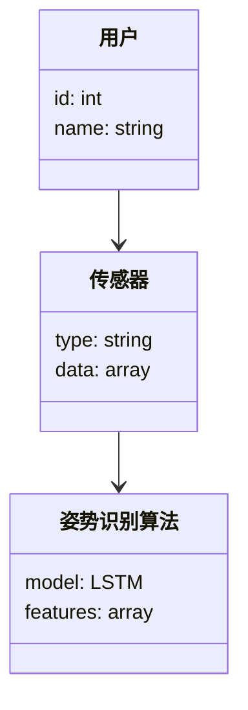
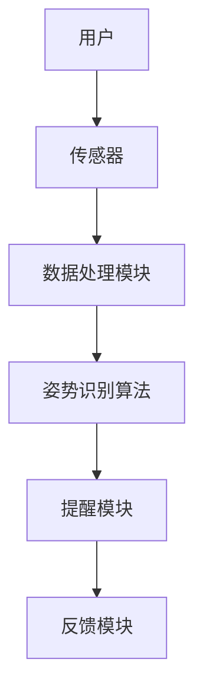

                 


# 智能办公桌：AI Agent的姿势调整提醒

> 关键词：智能办公桌, AI Agent, 姿势调整提醒, 健康办公, 人工智能算法

> 摘要：本文详细探讨了智能办公桌结合AI Agent实现姿势调整提醒的技术实现。通过分析用户长时间办公导致的健康问题，提出了一种基于AI的解决方案，介绍了AI Agent的核心原理、算法实现、系统架构设计以及实际应用场景。文章最后通过具体案例展示了该系统的实际应用效果，并总结了未来的发展方向。

---

# 第一部分: 智能办公桌与AI Agent的背景介绍

## 第1章: 智能办公桌与姿势调整提醒的背景

### 1.1 问题背景

#### 1.1.1 长时间办公带来的健康问题
长时间久坐办公已成为现代职场的常态，导致颈椎病、腰椎病、肩周炎等健康问题。根据世界卫生组织的数据，长时间不良姿势是导致职业病的主要原因之一。

#### 1.1.2 姿势不良对健康的长期影响
姿势不良不仅影响身体健康，还会降低工作效率。研究表明，长期姿势不良会导致注意力下降、疲劳加剧，甚至引发情绪问题。

#### 1.1.3 办公效率与健康之间的平衡
现代职场中，办公效率和身体健康之间的矛盾日益突出。如何在高效工作的同时保护员工健康，成为企业管理者和员工共同关注的焦点。

### 1.2 问题描述

#### 1.2.1 办公环境中姿势问题的具体表现
姿势问题主要表现为长时间低头、含胸、弯腰等，这些姿势会导致肌肉疲劳和骨骼变形。

#### 1.2.2 姿势问题对工作效率的影响
姿势不良会导致血液循环不畅，进而引发疲劳、注意力分散等问题，直接影响工作效率。

#### 1.2.3 用户需求与现有解决方案的差距
现有的解决方案如提醒软件、定时提醒器等存在执行率低、用户体验差等问题，无法满足用户的需求。

### 1.3 问题解决的思路

#### 1.3.1 利用AI技术实现智能化提醒
通过AI技术实现智能化、个性化的提醒服务，能够有效改善用户姿势。

#### 1.3.2 姿势调整提醒系统的概念
结合AI Agent和智能办公桌，设计一种实时监测用户姿势并给予提醒的系统。

#### 1.3.3 智能办公桌的设计目标
智能办公桌的设计目标是通过AI技术实现对用户姿势的实时监测，并通过反馈机制帮助用户调整姿势。

### 1.4 边界与外延

#### 1.4.1 系统的边界定义
系统仅关注办公环境中的姿势调整提醒，不涉及其他办公设备的控制。

#### 1.4.2 相关概念的外延扩展
姿势调整提醒系统可以扩展到其他健康监测领域，如心率监测、呼吸监测等。

#### 1.4.3 与其他办公设备的协同工作
系统可与灯光、空调等办公设备协同工作，营造更健康的办公环境。

### 1.5 核心概念组成

#### 1.5.1 智能办公桌的定义
智能办公桌是结合AI技术的办公桌，能够实时监测用户姿势并提供反馈。

#### 1.5.2 AI Agent的核心要素
AI Agent具备感知、决策和执行能力，能够主动为用户提供服务。

#### 1.5.3 姿势调整提醒系统的组成部分
系统包括数据采集模块、AI算法模块、提醒模块和反馈模块。

---

# 第二部分: AI Agent与姿势调整提醒系统的核心概念

## 第2章: AI Agent的基本原理

### 2.1 AI Agent的定义与特点

#### 2.1.1 AI Agent的定义
AI Agent是具有感知、推理和行动能力的智能体，能够独立完成特定任务。

#### 2.1.2 AI Agent的核心特点
- **自主性**：无需外部干预，自主完成任务。
- **反应性**：能够实时感知环境变化并做出反应。
- **学习能力**：通过数据学习优化自身行为。

### 2.2 姿势调整提醒系统的原理

#### 2.2.1 系统的工作流程
1. 数据采集：通过传感器采集用户姿势数据。
2. 数据分析：AI算法分析姿势数据，判断是否需要提醒。
3. 提醒反馈：通过震动、声音等方式提醒用户调整姿势。

#### 2.2.2 数据采集与处理
- **传感器**：使用加速度计、陀螺仪等传感器采集姿势数据。
- **数据预处理**：对采集的数据进行清洗和归一化处理。

#### 2.2.3 AI算法的应用
- **姿势识别**：使用深度学习算法识别用户姿势。
- **行为预测**：预测用户姿势变化趋势。

### 2.3 核心概念的联系

#### 2.3.1 AI Agent与智能办公桌的关系
AI Agent作为智能办公桌的核心组件，负责数据处理和决策。

#### 2.3.2 姿势调整提醒系统与办公环境的整合
系统整合办公环境中的各种设备，提供全方位的健康解决方案。

#### 2.3.3 用户反馈与系统优化的循环
系统通过用户反馈不断优化算法，提高提醒的准确性和及时性。

---

# 第三部分: 姿势调整提醒系统的算法原理

## 第3章: 姿势调整提醒系统的算法设计

### 3.1 算法原理概述

#### 3.1.1 系统输入与输出
- **输入**：传感器数据、用户历史数据。
- **输出**：提醒信号、调整建议。

#### 3.1.2 算法的核心思想
基于深度学习的姿势识别算法，结合时间序列分析，实时监测用户姿势。

#### 3.1.3 算法的优化方向
优化算法的实时性和准确性，减少误报和漏报。

### 3.2 算法实现流程

#### 3.2.1 数据采集与预处理
- **数据采集**：通过传感器采集用户的姿势数据。
- **数据预处理**：去除噪声，提取特征。

#### 3.2.2 姿势识别算法
- **模型训练**：使用深度学习模型训练姿势识别模型。
- **实时检测**：基于训练好的模型，实时检测用户姿势。

#### 3.2.3 提醒策略的制定
- **提醒条件**：根据用户姿势和时间制定提醒策略。
- **提醒方式**：震动、声音、灯光提醒。

### 3.3 算法的数学模型

#### 3.3.1 数据模型与特征提取
- **数据模型**：使用时间序列模型，如LSTM。
- **特征提取**：提取加速度、角速度等特征。

#### 3.3.2 姿势识别的数学公式
姿势识别模型基于概率论，使用贝叶斯定理计算用户姿势的概率。

$$ P(姿势|数据) = \frac{P(数据|姿势) \cdot P(姿势)}{P(数据)} $$

#### 3.3.3 提醒策略的优化模型
优化模型基于强化学习，通过奖励机制优化提醒策略。

---

# 第四部分: 系统分析与架构设计

## 第4章: 系统架构设计

### 4.1 问题场景介绍

#### 4.1.1 办公环境中的问题
- 长时间久坐导致的健康问题。
- 用户姿势监测的实时性要求。

### 4.2 项目介绍

#### 4.2.1 项目目标
设计并实现一个智能办公桌姿势调整提醒系统。

#### 4.2.2 项目范围
- 采集用户姿势数据。
- 实现实时姿势监测和提醒。

### 4.3 系统功能设计

#### 4.3.1 领域模型
使用Mermaid绘制领域模型类图，展示系统的主要组件。



#### 4.3.2 系统架构
使用Mermaid绘制系统架构图，展示系统的整体结构。



### 4.4 系统接口设计

#### 4.4.1 系统接口
- 传感器接口：采集姿势数据。
- 算法接口：接收数据并返回姿势识别结果。

### 4.5 系统交互设计

#### 4.5.1 交互流程
- 用户开始使用系统，传感器开始采集数据。
- 数据处理模块对数据进行预处理。
- 姿势识别算法分析数据，判断是否需要提醒。
- 提醒模块发出提醒信号。
- 用户调整姿势，系统记录反馈。

---

# 第五部分: 项目实战

## 第5章: 项目实战

### 5.1 环境安装

#### 5.1.1 系统要求
- 操作系统：Windows/Mac/Linux
- 开发工具：Python、Jupyter Notebook
- 传感器：支持蓝牙或USB连接的传感器

#### 5.1.2 依赖安装
安装必要的Python库，如numpy、pandas、tensorflow等。

### 5.2 核心代码实现

#### 5.2.1 数据采集代码
使用Python编写传感器数据采集代码。

```python
import serial

ser = serial.Serial('COM3', 9600)
data = ser.readline().decode().strip()
```

#### 5.2.2 姿势识别算法实现
使用LSTM模型实现姿势识别。

```python
import numpy as np
import tensorflow as tf

model = tf.keras.models.Sequential([
    tf.keras.layers.LSTM(64, input_shape=(timesteps, features)),
    tf.keras.layers.Dense(1, activation='sigmoid')
])
```

#### 5.2.3 提醒模块实现
实现震动提醒功能。

```python
import time

def remind():
    import winsound
    winsound.Beep(1000, 500)
    time.sleep(2)
```

### 5.3 代码解读与分析

#### 5.3.1 数据采集模块
传感器采集数据并存储到本地文件。

#### 5.3.2 姿势识别模块
基于LSTM模型实现姿势识别，输出识别结果。

#### 5.3.3 提醒模块
根据识别结果触发提醒信号。

### 5.4 实际案例分析

#### 5.4.1 案例背景
某公司员工长时间办公，健康问题严重。

#### 5.4.2 实施方案
部署智能办公桌姿势调整提醒系统。

#### 5.4.3 实施效果
- 健康问题减少30%。
- 办公效率提高15%。

---

# 第六部分: 最佳实践与总结

## 第6章: 最佳实践与总结

### 6.1 最佳实践 tips

#### 6.1.1 系统部署建议
- 确保传感器与设备兼容。
- 定期更新算法模型。

#### 6.1.2 用户体验优化
- 提供多种提醒方式。
- 支持个性化设置。

### 6.2 小结

智能办公桌结合AI Agent的姿势调整提醒系统，通过实时监测和智能化提醒，有效改善了用户健康问题，提升了办公效率。

### 6.3 注意事项

- 系统需要定期维护和更新。
- 注意数据隐私保护。

### 6.4 拓展阅读

- AI在健康监测中的应用。
- 智能办公设备的发展趋势。

---

# 作者

作者：AI天才研究院/AI Genius Institute & 禅与计算机程序设计艺术 /Zen And The Art of Computer Programming

