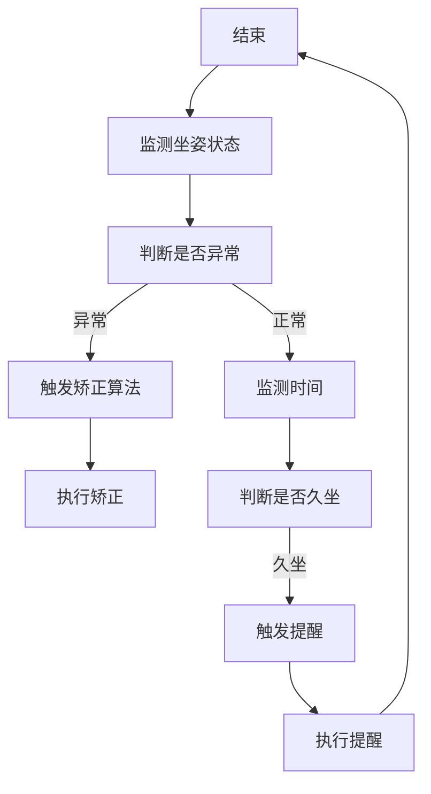
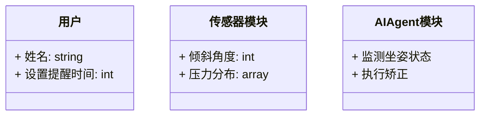
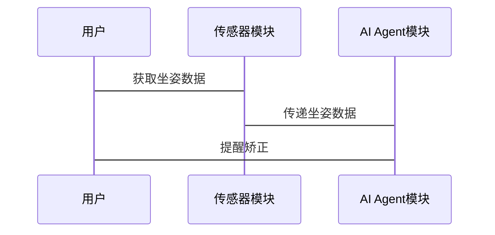

                 


# 智能办公椅：AI Agent的久坐提醒与姿势矫正

> 关键词：智能办公椅, AI Agent, 久坐提醒, 姿势矫正, 人工智能, 物联网

> 摘要：本文探讨了智能办公椅结合AI Agent实现久坐提醒与姿势矫正的技术细节。从背景介绍到算法实现，再到系统架构设计，逐步分析了AI Agent在办公椅中的应用，最后通过项目实战展示了技术实现过程。

---

# 第一部分：智能办公椅的背景与需求

## 第1章：智能办公椅的背景介绍

### 1.1 问题背景

#### 1.1.1 长时间久坐的危害
现代工作模式中，久坐已成为健康隐患，导致颈椎病、腰椎病等职业病。

#### 1.1.2 办公环境中的健康问题
传统办公椅缺乏智能化，无法主动提醒用户调整姿势。

#### 1.1.3 传统办公椅的局限性
无法实时监测用户姿势，缺乏反馈机制。

### 1.2 问题描述

#### 1.2.1 姿势矫正的必要性
用户长时间保持不良姿势，需要实时提醒和矫正。

#### 1.2.2 久坐提醒的功能需求
通过AI Agent实现定时提醒，避免久坐。

#### 1.2.3 智能办公椅的核心目标
结合AI技术，提供健康办公解决方案。

### 1.3 问题解决

#### 1.3.1 AI Agent在办公椅中的应用
AI Agent负责监测和提醒，提供智能化服务。

#### 1.3.2 智能办公椅的设计理念
以人为本，结合科技，提升用户体验。

#### 1.3.3 技术实现的可行性分析
AI技术成熟，传感器技术进步，实现可行性高。

### 1.4 边界与外延

#### 1.4.1 智能办公椅的功能边界
专注于姿势矫正和久坐提醒，不涉及其他功能。

#### 1.4.2 与其他智能设备的联动
可与智能家居联动，提升办公环境智能化。

#### 1.4.3 产品的适用场景与限制
适用于办公室、家庭办公，不适用于医疗康复。

### 1.5 概念结构与核心要素

#### 1.5.1 核心功能模块
姿势监测、久坐提醒、姿势矫正。

#### 1.5.2 系统架构组成
传感器模块、AI Agent模块、用户交互模块。

#### 1.5.3 用户交互流程
用户设置提醒时间，AI Agent监测并反馈。

---

## 第2章：AI Agent与智能办公椅的核心概念

### 2.1 核心概念原理

#### 2.1.1 AI Agent的基本定义
AI Agent是智能体，能够感知环境并执行任务。

#### 2.1.2 AI Agent在办公椅中的应用场景
监测坐姿，提醒矫正，联动其他设备。

#### 2.1.3 智能办公椅的AI Agent功能模块
姿势监测、行为矫正、久坐提醒。

### 2.2 核心概念属性对比

| 功能模块       | 传统办公椅 | 智能办公椅 |
|----------------|------------|------------|
| 姿势监测       | 无         | 有         |
| 久坐提醒       | 无         | 有         |
| 自动矫正       | 无         | 有         |

### 2.3 ER实体关系图

```mermaid
er
actor: 用户
agent: AI Agent
chair: 智能办公椅
function: 功能模块
```

---

# 第二部分：AI Agent的算法与实现

## 第3章：AI Agent的算法原理

### 3.1 算法原理概述

#### 3.1.1 状态检测算法
通过传感器数据判断坐姿状态。

#### 3.1.2 行为矫正算法
根据坐姿状态，提供矫正建议。

#### 3.1.3 久坐提醒算法
定时提醒用户活动。

### 3.2 算法流程图



### 3.3 算法实现

#### 3.3.1 状态检测算法

```python
def detect_posture(sensors):
    # 传感器数据处理
    # 返回坐姿状态
    return "异常" if sensors['倾斜角度'] > 90 else "正常"
```

#### 3.3.2 行为矫正算法

```python
def correct_posture(feedback):
    # 根据反馈调整座椅
    return "调整至正确姿势"
```

#### 3.3.3 久坐提醒算法

```python
import time

def久坐提醒(duration):
    if time > duration:
        return "提醒：起身活动"
    return "继续工作"
```

---

## 第4章：AI Agent的数学模型与公式

### 4.1 姿势监测的数学模型

$$
\text{坐姿评分} = \sum_{i=1}^{n} w_i \times f_i
$$

其中，$w_i$为权重，$f_i$为特征值。

### 4.2 久坐提醒的数学模型

$$
\text{提醒时间} = t_0 + \Delta t \times k
$$

其中，$t_0$为初始时间，$\Delta t$为间隔，$k$为次数。

---

# 第三部分：系统分析与架构设计

## 第5章：系统分析

### 5.1 项目场景介绍

智能办公椅用于办公室，提供健康办公解决方案。

### 5.2 系统功能设计

#### 5.2.1 领域模型类图



### 5.3 系统架构设计

#### 5.3.1 分层架构图


### 5.4 系统接口设计

#### 5.4.1 接口定义

```python
interface IAIAgent {
    def 监测坐姿状态(): 坐姿状态
    def 执行矫正(反馈): void
}
```

#### 5.4.2 系统交互流程图



---

## 第6章：项目实战

### 6.1 环境安装

#### 6.1.1 系统要求
Python 3.8+,传感器模块支持。

### 6.2 核心功能实现

#### 6.2.1 姿势监测实现

```python
import sensor

def monitor_posture():
    while True:
        data = sensor.get_data()
        if data['倾斜角度'] > 90:
            print("坐姿异常，请调整。")
        time.sleep(1)
```

#### 6.2.2 久坐提醒实现

```python
def久坐提醒(duration):
    start_time = time.time()
    while True:
        if time.time() - start_time > duration:
            print("久坐提醒：请起身活动。")
            start_time = time.time()
        time.sleep(60)
```

### 6.3 案例分析

#### 6.3.1 实际案例

用户设置提醒时间为60分钟，AI Agent监测坐姿，及时提醒。

### 6.4 代码解读与分析

解释上述代码的功能，分析其实现过程。

---

## 第7章：最佳实践

### 7.1 小结

智能办公椅结合AI Agent，提供健康办公解决方案。

### 7.2 注意事项

确保传感器准确，定期校准系统。

### 7.3 拓展阅读

推荐相关技术书籍和文献。

---

作者：AI天才研究院 & 禅与计算机程序设计艺术

