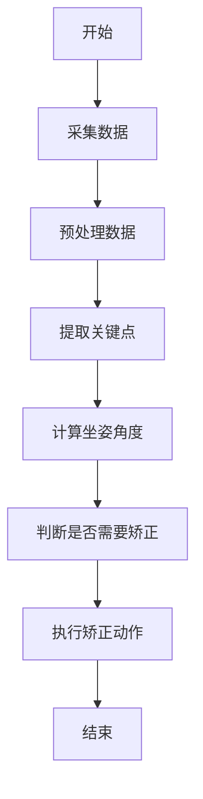
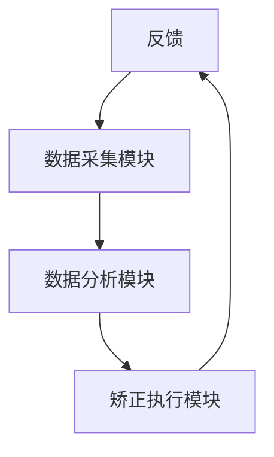
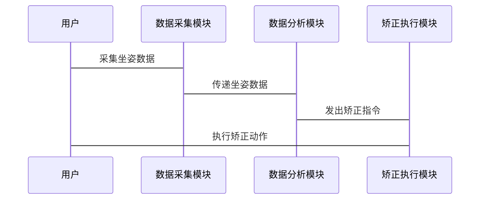

                 


# 智能办公椅：AI Agent的坐姿矫正系统

> 关键词：智能办公椅，AI Agent，坐姿矫正，算法原理，系统架构

> 摘要：随着现代办公环境的恶化，长时间不良坐姿导致的健康问题日益严重。本文提出了一种基于AI Agent的智能办公椅坐姿矫正系统，通过实时监测用户的坐姿，并结合深度学习算法进行智能矫正，从而有效预防和改善用户的坐姿问题。本文详细介绍了系统的背景、核心概念、算法原理、系统架构、项目实战等内容，为读者提供了一套完整的解决方案。

---

## 第1章: 智能办公椅的背景与问题背景

### 1.1 问题背景

#### 1.1.1 现代办公环境中的坐姿问题
现代办公环境中，人们长时间久坐已经成为一种常态。由于工作压力大、办公设备不合理以及缺乏运动，许多人在不知不觉中养成了不良的坐姿习惯。这些问题不仅影响了工作效率，还对身体健康造成了严重威胁。

#### 1.1.2 长时间不良坐姿的危害
长时间的不良坐姿会导致多种健康问题，例如：
- 脊柱侧弯：长时间的弯腰或歪坐会导致脊柱变形，甚至引发脊柱侧弯。
- 颈椎病：长时间低头或前倾会导致颈椎压力过大，引发颈椎病。
- 肩周炎：不良坐姿会导致肩部肌肉长期处于紧张状态，容易引发肩周炎。
- 慢性腰痛：长时间的不良坐姿会导致腰椎压力过大，引发慢性腰痛。

#### 1.1.3 坐姿矫正的必要性
坐姿矫正的目的是通过科学的方法，帮助用户纠正不良坐姿，预防和改善健康问题。传统的坐姿矫正方法依赖于用户的自我意识和意志力，但效果有限。因此，引入智能化的技术手段，如AI Agent，是解决这一问题的有效途径。

### 1.2 问题描述

#### 1.2.1 不良坐姿的具体表现
不良坐姿的具体表现包括：
- 坐姿前倾：身体向前倾斜，头部靠近屏幕。
- 坐姿后仰：身体过于靠后，背部拱起。
- 双肩不平：两侧肩膀高度不一致，导致身体倾斜。
- 膝盖弯曲：膝盖过度弯曲或伸直。

#### 1.2.2 不良坐姿对健康的长期影响
长期的不良坐姿会导致身体结构变形，影响血液循环，甚至引发严重的健康问题，如心脏病和呼吸系统疾病。

#### 1.2.3 坐姿矫正的目标与边界
坐姿矫正的目标是通过智能化的技术手段，帮助用户保持正确的坐姿，预防和改善健康问题。系统的边界包括：
- 系统仅针对坐姿矫正，不涉及其他健康问题。
- 系统适用于办公室、家庭办公环境。

### 1.3 问题解决的思路

#### 1.3.1 坐姿矫正的传统方法
传统坐姿矫正方法主要包括：
- 自我提醒：用户通过自我提醒保持正确的坐姿。
- 坐姿矫正器：通过物理结构限制用户的坐姿。
- 专业指导：通过医生或物理治疗师的指导进行矫正。

#### 1.3.2 AI技术在坐姿矫正中的应用潜力
AI技术在坐姿矫正中的应用潜力主要体现在：
- 实时监测：通过摄像头和传感器实时监测用户的坐姿。
- 智能反馈：通过AI算法分析坐姿，并实时反馈给用户。
- 个性化矫正：根据用户的习惯和身体状况，提供个性化的矫正方案。

#### 1.3.3 智能办公椅的创新解决方案
智能办公椅的创新解决方案包括：
- 结合AI技术，实现坐姿的实时监测和矫正。
- 通过反馈机制，帮助用户养成良好的坐姿习惯。
- 提供个性化的矫正方案，满足不同用户的需求。

---

## 第2章: AI Agent在坐姿矫正系统中的核心概念

### 2.1 AI Agent的基本原理

#### 2.1.1 AI Agent的定义与特点
AI Agent（智能体）是指能够感知环境、自主决策并采取行动的智能实体。其特点包括：
- 智能性：能够通过感知和学习，做出合理决策。
- 自主性：能够在没有外部干预的情况下独立运行。
- 反应性：能够实时感知环境变化并做出反应。

#### 2.1.2 AI Agent的核心功能模块
AI Agent的核心功能模块包括：
- 感知模块：通过摄像头、传感器等设备感知用户的坐姿。
- 决策模块：通过算法分析坐姿数据，做出矫正决策。
- 行为模块：通过反馈机制，执行矫正动作。

#### 2.1.3 AI Agent与传统软件的区别
AI Agent与传统软件的区别在于：
- AI Agent具有自主决策能力，而传统软件需要人工干预。
- AI Agent能够通过学习不断优化性能，而传统软件功能固定。

### 2.2 坐姿矫正系统的概念结构

#### 2.2.1 坐姿矫正系统的组成要素
坐姿矫正系统的组成要素包括：
- 传感器：用于采集用户的坐姿数据。
- AI算法：用于分析坐姿数据并做出矫正决策。
- 反馈装置：用于执行矫正动作，如震动提醒、调整椅子角度。

#### 2.2.2 系统的输入与输出
系统的输入包括：
- 用户的坐姿数据：如身体姿态、位置等。
系统的输出包括：
- 矫正决策：如震动提醒、椅子角度调整。
- 用户反馈：如用户对矫正动作的反馈。

#### 2.2.3 系统的核心算法与逻辑
系统的核心算法包括：
- 坐姿检测算法：用于检测用户的坐姿是否正确。
- 矫正算法：用于根据坐姿检测结果，做出矫正决策。

### 2.3 AI Agent与坐姿矫正系统的联系

#### 2.3.1 AI Agent在坐姿矫正中的角色
AI Agent在坐姿矫正中的角色包括：
- 数据采集：通过传感器采集用户的坐姿数据。
- 数据分析：通过算法分析坐姿数据，判断是否需要矫正。
- 决策反馈：根据分析结果，做出矫正决策并执行反馈。

#### 2.3.2 系统的实时反馈机制
系统的实时反馈机制包括：
- 数据采集：通过传感器实时采集用户的坐姿数据。
- 数据分析：通过AI算法实时分析坐姿数据。
- 矫正反馈：根据分析结果，实时执行矫正动作。

#### 2.3.3 用户交互界面的设计
用户交互界面的设计包括：
- 提醒界面：当检测到不良坐姿时，系统通过震动或声音提醒用户。
- 设置界面：用户可以设置矫正模式、灵敏度等参数。

---

## 第3章: 坐姿矫正系统的数学模型与算法原理

### 3.1 坐姿检测的数学模型

#### 3.1.1 坐姿检测的坐标系建立
坐姿检测的坐标系建立包括：
- 建立三维坐标系：用于表示用户的身体姿态。
- 校准坐标系：通过传感器校准，确保坐标系的准确性。

#### 3.1.2 关键点检测的数学公式
关键点检测的数学公式包括：
- 坐标系转换公式：用于将传感器数据转换为坐姿检测结果。
- 坐姿角度计算公式：用于计算身体各部位的倾斜角度。

#### 3.1.3 坐姿矫正的几何模型
坐姿矫正的几何模型包括：
- 坐姿矫正的几何变换：用于计算椅子的角度调整量。
- 矫正效果的几何验证：用于验证矫正效果是否符合预期。

### 3.2 AI Agent的算法实现

#### 3.2.1 基于深度学习的坐姿检测算法
基于深度学习的坐姿检测算法包括：
- 模型选择：选择适合的深度学习模型，如YOLO、Faster R-CNN等。
- 数据预处理：对图像数据进行预处理，提取关键点。
- 模型训练：通过大量数据训练模型，优化检测精度。

#### 3.2.2 算法的优化与改进
算法的优化与改进包括：
- 算法的加速：通过优化算法结构，提高检测速度。
- 算法的鲁棒性：通过增加数据多样性，提高算法的抗干扰能力。

#### 3.2.3 算法的数学推导与公式
算法的数学推导与公式包括：
- 检测概率计算公式：用于计算每个关键点的检测概率。
- 矫正角度计算公式：用于计算椅子的矫正角度。

### 3.3 系统的算法流程图

#### 3.3.1 算法流程图的Mermaid表示
以下是坐姿检测算法的Mermaid流程图：



#### 3.3.2 算法实现的Python代码示例
以下是坐姿检测算法的Python代码示例：

```python
import cv2
import numpy as np

# 采集数据
def capture_data():
    cap = cv2.VideoCapture(0)
    ret, frame = cap.read()
    cap.release()
    return frame

# 数据预处理
def preprocess_data(frame):
    # 转换为灰度图
    gray = cv2.cvtColor(frame, cv2.COLOR_BGR2GRAY)
    return gray

# 提取关键点
def detect_keypoints(gray):
    # 使用OpenCV检测人体关键点
    keypoints = cv2.CascadeClassifier().detectMultiScale(gray)
    return keypoints

# 计算坐姿角度
def calculate_angle(keypoints):
    # 计算坐姿角度
    angle = np.mean(keypoints[:, 2])  # 假设keypoints为二维数组，最后一列为高度
    return angle

# 判断是否需要矫正
def need_correction(angle):
    if angle > 90:
        return True
    else:
        return False

# 执行矫正动作
def correct_posture():
    # 模拟椅子调整角度
    print("椅子调整为正确角度")

# 主函数
def main():
    frame = capture_data()
    gray = preprocess_data(frame)
    keypoints = detect_keypoints(gray)
    angle = calculate_angle(keypoints)
    if need_correction(angle):
        correct_posture()

if __name__ == "__main__":
    main()
```

#### 3.3.3 代码的功能解读与优化建议
代码的功能解读与优化建议包括：
- 代码实现了坐姿检测的基本功能，但检测精度有待提高。
- 可以通过增加更多的数据训练，优化模型的检测精度。
- 可以通过引入更复杂的算法，如YOLO，提高检测速度。

---

## 第4章: 系统分析与架构设计方案

### 4.1 系统功能设计

#### 4.1.1 用户需求分析
用户需求分析包括：
- 用户希望通过系统实现坐姿矫正。
- 用户希望系统能够实时反馈矫正结果。
- 用户希望系统能够提供个性化的矫正方案。

#### 4.1.2 系统功能模块
系统功能模块包括：
- 数据采集模块：负责采集用户的坐姿数据。
- 数据分析模块：负责分析坐姿数据，判断是否需要矫正。
- 矫正执行模块：负责执行矫正动作，如震动提醒、椅子调整。

#### 4.1.3 系统功能描述
系统功能描述包括：
- 数据采集模块：通过摄像头和传感器采集用户的坐姿数据。
- 数据分析模块：通过AI算法分析坐姿数据，判断是否需要矫正。
- 矫正执行模块：根据分析结果，执行矫正动作，如震动提醒、椅子调整。

### 4.2 系统架构设计

#### 4.2.1 系统架构图的Mermaid表示
以下是系统的架构图：



#### 4.2.2 系统模块设计
系统模块设计包括：
- 数据采集模块：负责采集用户的坐姿数据。
- 数据分析模块：负责分析坐姿数据，判断是否需要矫正。
- 矫正执行模块：负责执行矫正动作，如震动提醒、椅子调整。

#### 4.2.3 系统接口设计
系统接口设计包括：
- 数据采集模块与数据分析模块的接口：数据采集模块将坐姿数据传递给数据分析模块。
- 数据分析模块与矫正执行模块的接口：数据分析模块将矫正决策传递给矫正执行模块。

### 4.3 系统交互设计

#### 4.3.1 系统交互的Mermaid序列图
以下是系统的交互序列图：



#### 4.3.2 系统交互流程
系统交互流程包括：
- 用户开始使用系统，系统采集用户的坐姿数据。
- 数据采集模块将坐姿数据传递给数据分析模块。
- 数据分析模块分析坐姿数据，判断是否需要矫正。
- 如果需要矫正，数据分析模块向矫正执行模块发出矫正指令。
- 矫正执行模块执行矫正动作，如震动提醒、椅子调整。

---

## 第5章: 项目实战

### 5.1 环境安装

#### 5.1.1 开发环境要求
开发环境要求包括：
- 操作系统：Windows 10或更高版本，或Linux系统。
- 开发工具：Python 3.8或更高版本，Jupyter Notebook。
- 依赖库：OpenCV、TensorFlow、numpy。

#### 5.1.2 安装依赖库
安装依赖库的命令包括：
```bash
pip install opencv-python
pip install tensorflow
pip install numpy
```

### 5.2 系统核心实现

#### 5.2.1 数据采集模块实现
数据采集模块实现包括：
- 使用OpenCV库采集视频流数据。
- 通过摄像头采集用户的坐姿数据。

#### 5.2.2 数据分析模块实现
数据分析模块实现包括：
- 使用深度学习模型检测用户的坐姿。
- 通过算法判断坐姿是否正确。

#### 5.2.3 矫正执行模块实现
矫正执行模块实现包括：
- 通过震动提醒用户矫正坐姿。
- 通过调整椅子角度实现矫正。

### 5.3 代码实现与解读

#### 5.3.1 数据采集模块的代码实现
以下是数据采集模块的代码实现：

```python
import cv2

def capture_data():
    cap = cv2.VideoCapture(0)
    ret, frame = cap.read()
    cap.release()
    return frame

# 测试代码
frame = capture_data()
cv2.imwrite("capture.jpg", frame)
```

#### 5.3.2 数据分析模块的代码实现
以下是数据分析模块的代码实现：

```python
import cv2
import numpy as np

def detect_keypoints(gray):
    # 使用OpenCV检测人体关键点
    keypoints = cv2.CascadeClassifier().detectMultiScale(gray)
    return keypoints

# 测试代码
gray = preprocess_data(frame)
keypoints = detect_keypoints(gray)
print("检测到关键点数量：", len(keypoints))
```

#### 5.3.3 矫正执行模块的代码实现
以下是矫正执行模块的代码实现：

```python
def correct_posture():
    # 模拟椅子调整角度
    print("椅子调整为正确角度")

correct_posture()
```

### 5.4 实际案例分析

#### 5.4.1 案例分析
案例分析包括：
- 案例一：用户坐姿前倾，系统检测到坐姿不正确，发出震动提醒，并调整椅子角度。
- 案例二：用户坐姿正确，系统不发出提醒，保持椅子角度不变。

#### 5.4.2 矫正效果验证
矫正效果验证包括：
- 通过实验验证系统的矫正效果。
- 通过用户反馈评估系统的有效性和舒适度。

### 5.5 项目小结

#### 5.5.1 系统实现的成果
系统实现的成果包括：
- 成功实现了坐姿的实时检测和矫正。
- 系统能够通过反馈机制帮助用户养成良好的坐姿习惯。

#### 5.5.2 系统实现的经验与教训
系统实现的经验与教训包括：
- 算法的检测精度需要进一步优化。
- 系统的反馈机制需要更加智能化，能够根据用户的习惯提供个性化的矫正方案。

---

## 第6章: 最佳实践与小结

### 6.1 最佳实践

#### 6.1.1 系统维护与优化
系统维护与优化包括：
- 定期更新算法模型，提高检测精度。
- 优化系统反馈机制，提高用户体验。

#### 6.1.2 系统使用的注意事项
系统使用的注意事项包括：
- 系统需要在良好的光照环境下使用，以保证检测精度。
- 用户需要遵守系统的使用规范，确保系统的正常运行。

### 6.2 小结

#### 6.2.1 系统的核心优势
系统的核心优势包括：
- 实时监测用户的坐姿，提供及时的反馈。
- 通过AI技术实现智能化的坐姿矫正。

#### 6.2.2 系统的未来扩展方向
系统的未来扩展方向包括：
- 引入更多的传感器，提高系统的检测精度。
- 通过云服务实现数据的远程存储和分析。

---

## 作者信息

作者：AI天才研究院/AI Genius Institute & 禅与计算机程序设计艺术 /Zen And The Art of Computer Programming

---

本文详细介绍了智能办公椅AI Agent坐姿矫正系统的背景、核心概念、算法原理、系统架构、项目实战等内容，为读者提供了一套完整的解决方案。通过本文的讲解，读者可以深入了解智能办公椅在坐姿矫正中的应用，掌握系统的实现方法，并为未来的优化和扩展提供参考。

