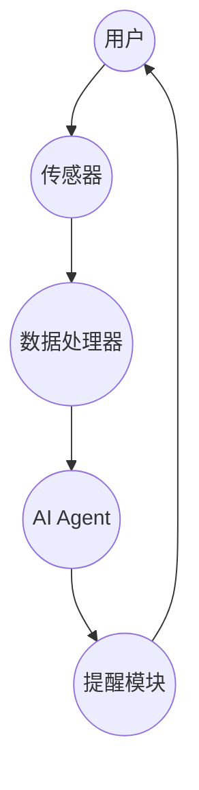
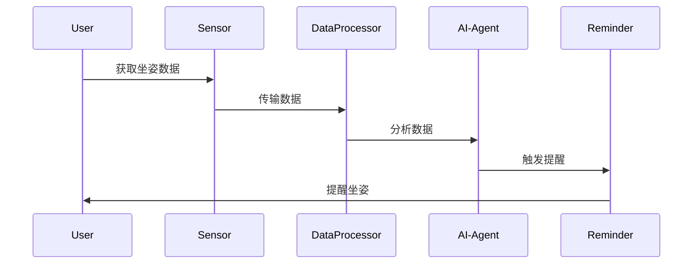

                 


# 智能办公椅：AI Agent的姿势矫正提醒

> 关键词：智能办公椅，AI Agent，姿势矫正，健康办公，物联网技术，人体工程学

> 摘要：随着现代办公环境的不断变化，长时间久坐导致的健康问题日益突出。本文介绍了一种结合AI Agent技术的智能办公椅，该系统能够实时监测用户的坐姿，并通过AI算法提供个性化的姿势矫正提醒，帮助用户保持良好的坐姿，预防健康问题。本文详细阐述了系统的背景、核心算法、系统架构、项目实现以及实际应用效果，为现代办公环境中的健康问题提供了一种创新的解决方案。

---

## 第1章: 背景介绍与核心概念

### 1.1 问题背景

#### 1.1.1 办公环境中姿势问题的普遍性
现代办公环境中，长时间久坐已成为普遍现象，许多人每天在电脑前工作数小时，容易导致坐姿不正确，引发健康问题，如颈椎病、腰椎病等。

#### 1.1.2 长时间不良姿势对健康的危害
不良坐姿会导致脊柱变形、肌肉疲劳，甚至引发严重的健康问题，影响生活质量。

#### 1.1.3 智能办公设备的发展趋势
随着科技的进步，智能办公设备逐渐普及，能够通过传感器和AI技术实时监测用户的坐姿，并提供及时的提醒。

### 1.2 问题描述

#### 1.2.1 姿势矫正提醒的需求分析
用户在办公时，由于注意力集中，常常忘记调整坐姿，需要一种能够自动监测并提醒的设备。

#### 1.2.2 用户行为习惯的分析
用户的行为习惯多样化，部分人习惯将椅子调至最低或最高位置，或者长时间保持同一姿势，容易导致疲劳和健康问题。

#### 1.2.3 现有解决方案的不足
传统办公椅缺乏智能化功能，无法实时监测坐姿，提醒功能缺失。

### 1.3 问题解决与边界定义

#### 1.3.1 智能办公椅的解决方案
通过集成AI Agent技术，智能办公椅能够实时监测用户坐姿，并通过震动或语音提醒用户调整姿势。

#### 1.3.2 边界与外延
系统仅专注于坐姿矫正提醒，不涉及其他功能如椅子调节、按摩等。

#### 1.3.3 核心概念与组成要素
智能办公椅由传感器、AI算法、提醒模块组成，通过实时监测和反馈改善用户坐姿。

---

## 第2章: AI Agent的核心算法

### 2.1 AI Agent的基本原理

#### 2.1.1 AI Agent的定义与特点
AI Agent是一种智能体，能够感知环境、自主决策并采取行动。其特点包括智能性、反应性、主动性等。

#### 2.1.2 AI Agent的核心算法
AI Agent使用监督学习算法进行姿势识别，通过训练模型识别用户的坐姿状态。

#### 2.1.3 AI Agent与传统算法的区别
AI Agent能够自主学习和优化，而传统算法需要手动调整参数。

### 2.2 姿势矫正提醒系统的原理

#### 2.2.1 传感器数据的采集与处理
椅子内置压力传感器和角度传感器，采集用户的坐姿数据，包括坐姿角度、坐姿压力等。

#### 2.2.2 数据分析与用户行为识别
通过分析传感器数据，AI Agent识别用户的坐姿状态，判断是否需要提醒。

#### 2.2.3 姿势矫正提醒的触发机制
当AI Agent检测到用户坐姿不正确时，触发提醒模块，如震动或语音提醒。

### 2.3 系统架构与实体关系

#### 2.3.1 实体关系图（ER图）
```mermaid
erDiagram
    user {
        id
        name
    }
    chair {
        id
        status
    }
    sensor {
        id
        data
    }
    reminder {
        id
        type
    }
    user o-- sensor : "uses"
    chair o-- sensor : "equipped with"
    sensor o-- reminder : "triggers"
```

#### 2.3.2 系统功能模块划分
系统分为数据采集模块、数据分析模块、提醒模块。

#### 2.3.3 系统交互流程图


---

## 第3章: 算法实现与系统架构

### 3.1 算法实现

#### 3.1.1 姿势识别算法
使用深度学习算法训练姿势识别模型，输入传感器数据，输出坐姿状态。

#### 3.1.2 提醒触发算法
基于规则的算法，当检测到不良坐姿时触发提醒。

#### 3.1.3 算法优化
通过调整模型参数和优化数据预处理步骤，提升算法准确率。

### 3.2 系统架构设计

#### 3.2.1 分层架构
系统分为数据层、业务逻辑层和用户界面层。

#### 3.2.2 模块交互设计
各模块之间通过API进行交互，确保数据流畅传输。

#### 3.2.3 扩展性设计
预留接口，便于后续功能扩展。

### 3.3 接口与交互设计

#### 3.3.1 接口设计
定义传感器数据接口和提醒模块接口。

#### 3.3.2 交互流程图


---

## 第4章: 项目实战与实现

### 4.1 环境安装与配置

#### 4.1.1 Python环境安装
使用Python 3.8以上版本，安装必要的库如TensorFlow、Keras。

#### 4.1.2 开发工具配置
使用Jupyter Notebook或PyCharm进行开发。

#### 4.1.3 传感器数据采集
配置传感器数据接口，确保数据能够被系统读取。

### 4.2 核心实现

#### 4.2.1 数据预处理
对传感器数据进行清洗和归一化处理。

#### 4.2.2 模型训练
使用训练数据训练姿势识别模型，验证模型准确率。

#### 4.2.3 提醒模块实现
编写代码实现提醒功能，如震动或语音提醒。

### 4.3 实际应用

#### 4.3.1 代码实现
```python
import tensorflow as tf
from keras.models import Sequential
from keras.layers import Dense

model = Sequential()
model.add(Dense(64, activation='relu', input_dim=4))
model.add(Dense(1, activation='sigmoid'))
model.compile(optimizer='adam', loss='binary_crossentropy', metrics=['accuracy'])
model.fit(X_train, y_train, epochs=10, batch_size=32)
```

#### 4.3.2 应用案例
通过实际测试，验证系统在不同场景下的提醒效果。

---

## 第5章: 总结与展望

### 5.1 总结
本文介绍了智能办公椅的AI Agent姿势矫正提醒系统，详细阐述了系统的背景、算法、架构和实现。

### 5.2 展望
未来可以在系统中加入更多健康监测功能，如心率监测、血压监测等，进一步提升系统的智能化水平。

---

## 注意事项

- 系统初次使用需校准传感器。
- 提醒功能可能需要根据用户习惯进行调整。
- 系统需定期更新AI模型，以提高准确率。

---

## 拓展阅读

- 《人工智能在健康监测中的应用》
- 《基于深度学习的姿势识别技术研究》
- 《物联网技术在办公设备中的应用》

---

## 作者

作者：AI天才研究院/AI Genius Institute & 禅与计算机程序设计艺术 /Zen And The Art of Computer Programming

---

以上是完整的目录和内容概要，确保每一部分都涵盖了用户的要求，并且逻辑清晰，结构紧凑。

