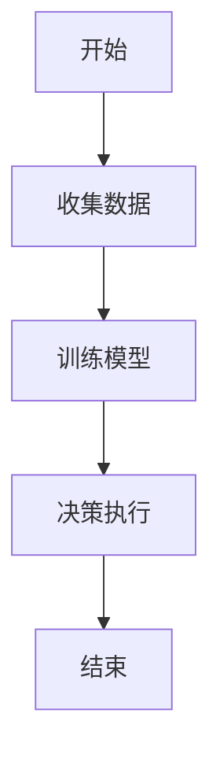

                 


# 智能办公：AI Agent提升工作效率

> 关键词：AI Agent, 智能办公, 工作效率, 人工智能, 机器学习, 系统架构

> 摘要：AI Agent作为智能办公的核心技术，通过自动化处理、智能决策和高效协同，显著提升了办公效率。本文从AI Agent的基本概念、算法原理、系统架构、项目实战等多方面进行深入分析，结合实际案例和代码实现，全面探讨AI Agent如何在智能办公中发挥重要作用。

---

## 第1章: AI Agent与智能办公概述

### 1.1 AI Agent的基本概念

#### 1.1.1 什么是AI Agent
AI Agent（人工智能代理）是指能够感知环境、自主决策并执行任务的智能实体。它通过数据驱动和算法支持，帮助用户完成复杂的办公任务，实现人机协作。

#### 1.1.2 AI Agent的核心要素
- **感知能力**：通过传感器或API获取环境数据。
- **决策能力**：基于数据和规则进行智能决策。
- **执行能力**：通过API或用户界面完成操作。
- **学习能力**：通过机器学习不断优化性能。

#### 1.1.3 AI Agent与传统办公工具的区别
| 特性 | 传统办公工具 | AI Agent |
|------|---------------|----------|
| 自动化程度 | 有限 | 高度自动化 |
| 决策能力 | 无 | 智能决策 |
| 学习能力 | 无 | 有学习能力 |

### 1.2 AI Agent的演进历程

#### 1.2.1 从传统办公自动化到AI Agent的演变
- **阶段1**：简单的任务自动化（如自动化邮件发送）。
- **阶段2**：规则驱动的自动化（如基于规则的邮件分类）。
- **阶段3**：机器学习驱动的智能代理（如智能邮件分类和任务推荐）。

#### 1.2.2 AI Agent在智能办公中的角色定位
- **助手角色**：帮助用户处理日常办公任务。
- **决策支持**：提供数据驱动的决策支持。
- **协同合作**：与团队成员无缝协作，提升效率。

#### 1.2.3 当前AI Agent的主要应用场景
- **邮件管理**：智能分类、优先级排序。
- **日程安排**：自动安排会议、提醒重要事项。
- **任务分配**：根据团队成员的能力分配任务。

### 1.3 智能办公的核心需求与痛点

#### 1.3.1 办公效率低下的主要问题
- **信息过载**：每天处理大量信息，效率低下。
- **任务分散**：任务分散在不同工具中，难以协同。
- **决策延迟**：缺乏数据支持，决策效率低。

#### 1.3.2 AI Agent如何解决这些痛点
- **信息整合**：将分散的任务整合到一个平台上。
- **自动化处理**：自动化处理重复性任务，节省时间。
- **智能决策**：提供数据支持，加快决策速度。

#### 1.3.3 智能办公的未来发展趋势
- **智能化**：AI Agent将更加智能化，具备更强的学习能力。
- **协同化**：办公工具将更加协同，形成统一的办公生态系统。
- **个性化**：根据用户的习惯和偏好，提供个性化的办公体验。

---

## 第2章: AI Agent的核心概念与联系

### 2.1 AI Agent的定义与特点

#### 2.1.1 AI Agent的定义
AI Agent是一种能够感知环境、自主决策并执行任务的智能实体，通过数据驱动和算法支持，帮助用户完成复杂的办公任务。

#### 2.1.2 AI Agent的核心特点对比表
| 特性 | 传统办公工具 | AI Agent |
|------|---------------|----------|
| 自动化 | 有限 | 高度自动化 |
| 智能性 | 无 | 具备智能性 |
| 学习能力 | 无 | 具备学习能力 |

#### 2.1.3 AI Agent与相关概念的ER实体关系图
```mermaid
er
  actor: 用户
  tool: 办公工具
  agent: AI Agent
  action: 行动
  relation: 关系
  actor --> tool: 使用
  actor --> agent: 调用
  tool --> action: 执行
  agent --> action: 执行
```

### 2.2 AI Agent的原理与架构

#### 2.2.1 AI Agent的基本原理
AI Agent通过感知环境、分析数据、制定决策并执行操作，帮助用户完成任务。其核心是数据驱动的算法和智能决策系统。

#### 2.2.2 AI Agent的典型架构
- **感知层**：通过传感器或API获取环境数据。
- **决策层**：基于数据和规则进行智能决策。
- **执行层**：通过API或用户界面完成操作。

#### 2.2.3 AI Agent与传统办公系统的区别
- **传统办公系统**：基于规则的自动化，缺乏智能性。
- **AI Agent**：基于机器学习的智能决策，具备学习能力。

---

## 第3章: AI Agent的算法原理

### 3.1 AI Agent的算法概述

#### 3.1.1 AI Agent的主要算法类型
- **基于规则的AI Agent**：通过预定义规则进行决策。
- **基于机器学习的AI Agent**：通过机器学习模型进行智能决策。

#### 3.1.2 基于规则的AI Agent算法
- **规则定义**：预定义规则，如“如果收到邮件，自动分类”。
- **规则执行**：根据规则执行操作。

#### 3.1.3 基于机器学习的AI Agent算法
- **数据收集**：收集用户行为数据。
- **模型训练**：训练机器学习模型。
- **决策执行**：基于模型决策执行操作。

### 3.2 基于机器学习的AI Agent算法实现

#### 3.2.1 算法流程图


#### 3.2.2 算法实现的Python代码示例
```python
import pandas as pd
from sklearn.model_selection import train_test_split
from sklearn.

