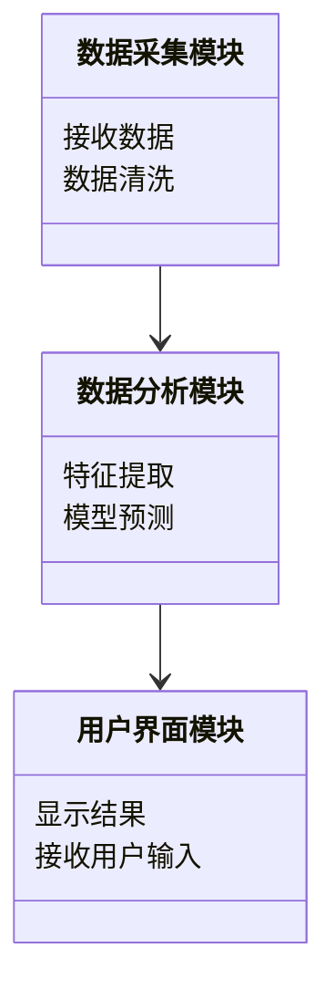
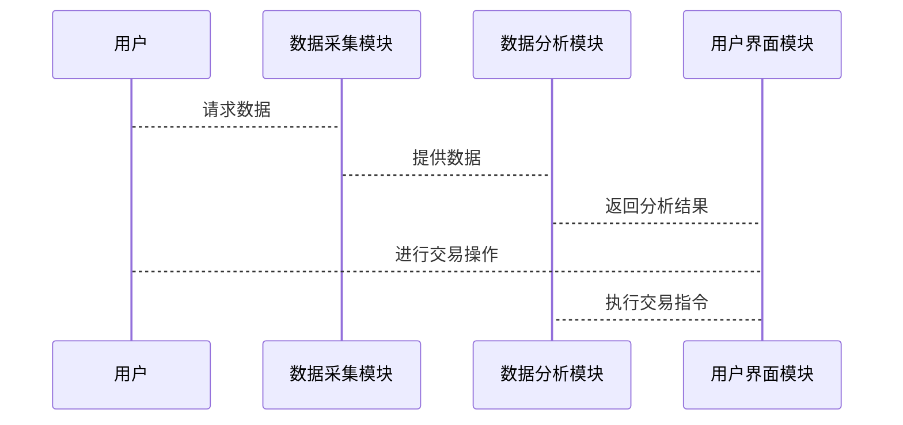

                 


# 智能加密货币市场分析平台

> 关键词：智能加密货币，市场分析，人工智能，算法交易，数据挖掘

> 摘要：本文详细介绍了智能加密货币市场分析平台的构建与实现，涵盖加密货币市场背景、智能分析的核心算法、系统架构设计以及项目实战等内容，旨在为读者提供全面的技术指导。

---

## 第1章：背景介绍

### 1.1 加密货币的基本概念

#### 1.1.1 加密货币的定义与特点
- **定义**：加密货币是一种基于密码学的虚拟货币，具有去中心化、匿名性和不可篡改等特点。
- **特点**：去中心化、匿名性、安全性、可追溯性、高波动性。

#### 1.1.2 加密货币的核心技术原理
- **区块链技术**：通过分布式账本实现去中心化交易记录。
- **共识机制**：如PoW（工作量证明）、PoS（权益证明）等。
- **智能合约**：自动执行交易的脚本，确保交易的自动性和可靠性。

#### 1.1.3 加密货币的分类与应用场景
- **分类**：比特币、以太坊、稳定币等。
- **应用场景**：支付、投资、跨境转账、智能合约等。

### 1.2 智能市场分析的定义与特点

#### 1.2.1 智能市场分析的定义
- **定义**：利用人工智能技术对市场数据进行实时分析和预测，提供智能化的决策支持。

#### 1.2.2 智能市场分析的核心技术
- **数据挖掘**：从海量数据中提取有价值的信息。
- **机器学习**：构建预测模型，实现市场趋势的自动化预测。
- **自然语言处理**：分析市场新闻和社交媒体情绪，辅助决策。

#### 1.2.3 智能市场分析与传统市场分析的区别
- **数据来源**：传统市场依赖历史数据和市场情绪，智能分析结合实时数据和算法。
- **效率**：传统分析耗时较长，智能分析实时性强。
- **准确性**：传统依赖人工判断，智能分析利用算法提高准确性。

### 1.3 智能加密货币市场分析平台的背景与意义

#### 1.3.1 加密货币市场的复杂性与挑战
- **高波动性**：市场波动剧烈，难以预测。
- **信息不对称**：市场参与者信息不透明，影响决策。
- **技术复杂性**：区块链技术门槛高，普通投资者难以掌握。

#### 1.3.2 智能分析在加密货币市场中的重要性
- **实时监控**：快速捕捉市场动态，及时调整投资策略。
- **风险控制**：通过算法识别市场风险，降低投资损失。
- **高效决策**：利用智能分析提高决策效率和准确性。

#### 1.3.3 智能加密货币市场分析平台的目标与价值
- **目标**：构建一个智能化的市场分析工具，帮助投资者进行实时监控、风险控制和决策支持。
- **价值**：提高投资效率，降低风险，实现智能化投资。

---

## 第2章：智能加密货币市场分析的核心概念

### 2.1 数据采集与处理

#### 2.1.1 数据源的多样性
- **交易所数据**：如CoinMarketCap、CoinGecko等平台提供的实时交易数据。
- **社交媒体数据**：Twitter、Reddit等平台上的市场情绪数据。
- **新闻数据**：财经新闻网站的市场相关信息。

#### 2.1.2 数据清洗与预处理
- **数据清洗**：去除噪声数据，处理缺失值和异常值。
- **数据转换**：将数据转换为适合算法分析的形式，如标准化、归一化。
- **数据存储**：使用数据库或大数据平台存储清洗后的数据。

#### 2.1.3 数据存储与管理
- **数据库选择**：根据数据量选择关系型数据库或NoSQL数据库。
- **数据分区**：按时间、交易对等进行数据分区，提高查询效率。
- **数据备份**：定期备份数据，确保数据安全。

### 2.2 市场特征提取

#### 2.2.1 技术指标与市场情绪分析
- **技术指标**：如MA（移动平均线）、MACD（移动平均收敛散度）、RSI（相对强弱指数）等。
- **市场情绪分析**：通过自然语言处理技术分析社交媒体和新闻的情绪，判断市场情绪。

#### 2.2.2 时间序列分析与模式识别
- **时间序列分析**：对历史价格数据进行分析，识别价格波动的规律和趋势。
- **模式识别**：通过机器学习算法识别价格图表中的模式，如头肩顶、双底等。

#### 2.2.3 高频交易与实时数据分析
- **高频交易**：在极短时间内完成大量交易，需要高效的实时数据分析能力。
- **实时数据分析**：对实时市场数据进行处理和分析，提供实时市场洞察。

### 2.3 市场预测与决策支持

#### 2.3.1 预测模型的构建与优化
- **模型选择**：根据数据特点选择合适的预测模型，如ARIMA、LSTM等。
- **模型优化**：通过参数调整和模型调优提高预测准确率。
- **模型评估**：使用均方误差（MSE）、平均绝对误差（MAE）等指标评估模型性能。

#### 2.3.2 预测结果的可视化与解读
- **可视化工具**：使用Matplotlib、Plotly等工具进行数据可视化。
- **结果解读**：通过可视化结果帮助投资者理解市场趋势和预测结果。

#### 2.3.3 决策支持系统的实现
- **决策规则**：根据预测结果制定相应的交易策略，如买入、卖出、持仓等。
- **风险控制**：根据市场波动性和预测结果设定止损和止盈点。
- **自动化交易**：实现交易策略的自动化执行，减少人为干预。

---

## 第3章：智能加密货币市场分析的核心算法原理

### 3.1 时间序列分析算法

#### 3.1.1 ARIMA模型的原理与实现
- **ARIMA模型**：自回归积分滑动平均模型，适用于非平稳时间序列数据。
- **实现步骤**：数据预处理、模型参数估计、模型验证与优化。

#### 3.1.2 LSTM网络的原理与实现
- **LSTM（长短期记忆网络）**：适用于长序列数据的预测，能够捕捉时间序列中的长期依赖关系。
- **实现步骤**：数据预处理、模型构建、训练与优化、结果评估。

#### 3.1.3 GARCH模型的应用与优势
- **GARCH（广义自回归条件异方差）**：用于估计金融时间序列中的波动性，适用于预测市场波动。
- **优势**：能够捕捉市场波动的非线性特征，适用于高频交易中的波动性预测。

### 3.2 机器学习算法

#### 3.2.1 支持向量机（SVM）的原理与应用
- **SVM**：一种监督学习算法，适用于分类和回归问题。
- **应用**：用于加密货币价格的分类预测，如涨跌预测。

#### 3.2.2 随机森林（Random Forest）的原理与应用
- **随机森林**：一种基于决策树的集成学习算法，适用于分类和回归问题。
- **应用**：用于加密货币市场的特征选择和价格预测。

#### 3.2.3 K-近邻算法（KNN）的原理与应用
- **KNN**：一种非参数分类和回归算法，适用于小规模数据集。
- **应用**：用于加密货币市场的相似样本分析和预测。

### 3.3 深度学习算法

#### 3.3.1 卷积神经网络（CNN）的原理与应用
- **CNN**：适用于图像识别和时间序列数据的分析，用于加密货币价格波动的模式识别。
- **应用**：用于价格图表的模式识别和预测。

#### 3.3.2 循环神经网络（RNN）的原理与应用
- **RNN**：适用于序列数据的分析，能够捕捉时间序列中的依赖关系。
- **应用**：用于加密货币价格的序列预测和市场情绪分析。

#### 3.3.3 图神经网络（GNN）的原理与应用
- **GNN**：适用于图结构数据的分析，用于加密货币市场网络中的关系分析和预测。
- **应用**：用于市场参与者之间的关系分析和预测。

---

## 第4章：智能加密货币市场分析平台的系统架构设计

### 4.1 问题场景介绍
- **目标**：构建一个智能化的加密货币市场分析平台，提供实时数据监控、市场预测和决策支持。
- **需求**：支持多数据源接入、实时数据分析、多种算法模型集成和用户友好的交互界面。

### 4.2 系统功能设计

#### 4.2.1 领域模型设计


#### 4.2.2 系统架构设计
```mermaid
rectangle 系统边界 {
    class 数据采集模块 {
        接收数据
        数据清洗
    }
    class 数据分析模块 {
        特征提取
        模型预测
    }
    class 用户界面模块 {
        显示结果
        接收用户输入
    }
}
```

#### 4.2.3 系统接口设计
- **数据接口**：与加密货币交易所和新闻网站等数据源对接，获取实时数据。
- **用户接口**：提供用户友好的交互界面，支持用户进行数据查询和交易操作。
- **算法接口**：与各种机器学习和深度学习算法模型对接，支持多种预测方法。

#### 4.2.4 系统交互设计


---

## 第5章：项目实战

### 5.1 环境安装

#### 5.1.1 安装Python环境
- 使用Anaconda或虚拟环境管理Python版本。
- 安装必要的库：numpy、pandas、scikit-learn、keras、tensorflow、matplotlib。

#### 5.1.2 安装数据采集工具
- 使用API接口采集加密货币市场数据，如CoinMarketCap的API。
- 安装必要的库：requests、json、datetime。

#### 5.1.3 安装可视化工具
- 使用Matplotlib或Plotly进行数据可视化。

### 5.2 系统核心实现源代码

#### 5.2.1 数据采集模块
```python
import requests
import json
import datetime

def get_price_data(coin_symbol, start_date, end_date):
    api_key = "your_api_key"
    start = start_date.isoformat()
    end = end_date.isoformat()
    url = f"https://api.coinmarketcap.com/v2/historical/{coin_symbol}/?start_date={start}&end_date={end}&api_key={api_key}"
    response = requests.get(url)
    data = json.loads(response.text)
    return data['data']
```

#### 5.2.2 数据分析模块
```python
from sklearn.ensemble import RandomForestRegressor
import numpy as np
import pandas as pd

def predict_price(X_train, y_train, X_test):
    model = RandomForestRegressor(n_estimators=100, random_state=42)
    model.fit(X_train, y_train)
    y_pred = model.predict(X_test)
    return y_pred
```

#### 5.2.3 用户界面模块
```python
import matplotlib.pyplot as plt

def plot_price_data(data):
    plt.figure(figsize=(10, 6))
    plt.plot(data['date'], data['price'], label='Price')
    plt.xlabel('Date')
    plt.ylabel('Price')
    plt.title('Price Analysis')
    plt.legend()
    plt.show()
```

### 5.3 代码应用解读与分析
- **数据采集模块**：通过API接口获取加密货币的历史价格数据。
- **数据分析模块**：使用随机森林回归模型进行价格预测。
- **用户界面模块**：将预测结果可视化，帮助用户理解市场趋势。

### 5.4 实际案例分析
- **案例背景**：假设我们要预测比特币在接下来一周的价格走势。
- **数据准备**：收集过去一年的比特币价格数据。
- **模型训练**：使用随机森林回归模型进行训练。
- **预测与可视化**：预测未来一周的价格，并将结果可视化。

### 5.5 项目小结
- **项目总结**：通过本项目，我们实现了加密货币市场的实时数据采集、特征提取和价格预测。
- **经验分享**：数据预处理的重要性、模型调优的技巧、可视化结果的解读。

---

## 第6章：最佳实践与注意事项

### 6.1 最佳实践 tips
- **数据预处理**：确保数据的准确性和完整性，避免噪声数据的影响。
- **模型选择**：根据数据特点选择合适的算法模型，避免盲目使用复杂模型。
- **风险管理**：设置合理的止损和止盈点，控制交易风险。

### 6.2 小结
- **总结**：智能加密货币市场分析平台通过结合区块链技术和人工智能算法，为投资者提供了高效、准确的市场分析工具。
- **展望**：未来随着技术的发展，智能加密货币市场分析平台将更加智能化和自动化，为投资者提供更全面的市场洞察和决策支持。

---

## 作者：AI天才研究院/AI Genius Institute & 禅与计算机程序设计艺术 /Zen And The Art of Computer Programming

---

**感谢您的阅读！希望这篇文章能为您提供有价值的信息和启发，帮助您更好地理解和应用智能加密货币市场分析技术。**

