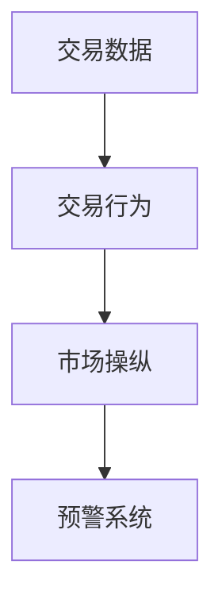
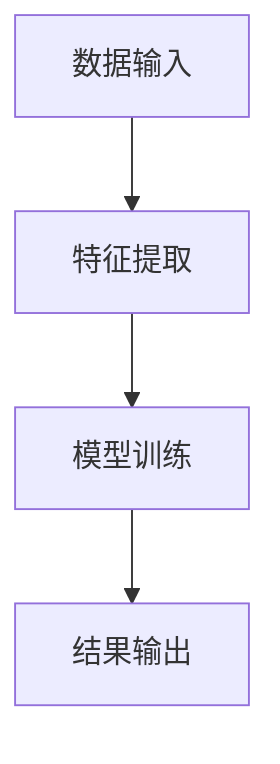
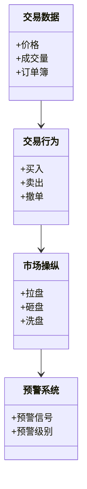
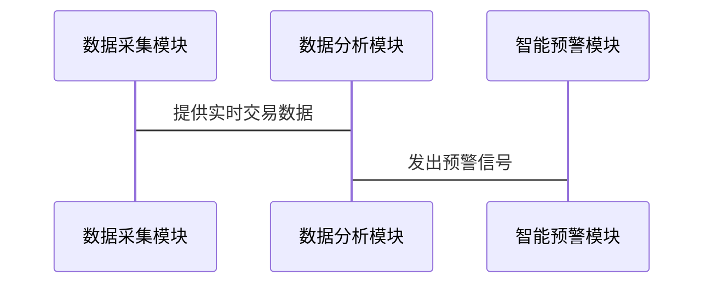

                 


# 智能加密货币市场操纵检测系统

> 关键词：加密货币，市场操纵，智能检测，区块链，深度学习，NLP

> 摘要：本文详细介绍了智能加密货币市场操纵检测系统的设计与实现。通过结合区块链技术、自然语言处理（NLP）和深度学习算法，该系统能够实时监测加密货币市场中的异常交易行为，识别潜在的市场操纵活动，并发出预警信号。文章从背景介绍、核心概念、算法原理、系统架构设计、项目实战和总结等方面进行了全面分析，为读者提供了一套完整的解决方案。

---

# 第一部分：背景介绍

## 第1章：加密货币市场与市场操纵概述

### 1.1 加密货币市场的基本概念

#### 1.1.1 加密货币的定义与特点
加密货币是一种基于区块链技术的数字资产，具有去中心化、匿名性和不可篡改等特点。常见的加密货币包括比特币（Bitcoin）、以太坊（Ethereum）等。

#### 1.1.2 加密货币市场的基本结构
加密货币市场由交易者、交易所、交易对（如BTC/USDT）和市场数据（如价格、成交量）组成。市场数据是分析市场行为的基础。

#### 1.1.3 加密货币交易的基本流程
1. 交易者在交易所下单（买入或卖出）。
2. 交易所撮合交易，记录交易数据到区块链。
3. 交易数据通过API接口传输到市场数据平台。

### 1.2 市场操纵的定义与表现形式

#### 1.2.1 市场操纵的定义
市场操纵是指通过虚假交易、散布谣言、大量买入或卖出某一种货币， manipulate市场走势，获取不正当收益的行为。

#### 1.2.2 市场操纵的主要手段
1. **拉盘**：通过大量买入某一种货币，人为抬高价格。
2. **砸盘**：通过大量卖出某一种货币，人为压低价格。
3. **洗盘**：通过频繁买卖，制造价格波动，吸引散户跟风。

#### 1.2.3 市场操纵的常见模式
1. **巨鲸交易**：大资金通过大量买入或卖出，影响市场走势。
2. **虚假订单**：通过挂单后取消，误导市场参与者。
3. **信息操纵**：通过发布虚假消息影响市场情绪。

### 1.3 市场操纵检测的重要性

#### 1.3.1 市场操纵对市场的危害
1. 破坏市场公平性。
2. 影响投资者信心。
3. 增加市场波动性。

#### 1.3.2 检测市场操纵的必要性
1. 维护市场秩序。
2. 保护投资者利益。
3. 提高市场透明度。

#### 1.3.3 智能检测系统的优势
1. **实时性**：系统能够实时监测市场数据。
2. **准确性**：通过算法分析，减少人为误判。
3. **高效性**：系统能够快速识别异常交易行为。

### 1.4 本章小结
本章介绍了加密货币市场的基本结构和市场操纵的定义、手段及常见模式，并强调了智能检测系统在维护市场秩序中的重要性。

---

## 第2章：智能加密货币市场操纵检测系统的核心概念

### 2.1 系统的核心功能

#### 2.1.1 实时数据采集与处理
系统通过API接口实时采集加密货币市场的交易数据，包括价格、成交量、订单簿等。

#### 2.1.2 异常交易模式识别
系统利用算法分析交易数据，识别异常交易模式，如巨鲸交易、虚假订单等。

#### 2.1.3 市场操纵行为预警
系统根据分析结果，对潜在的市场操纵行为发出预警信号。

### 2.2 系统的关键技术

#### 2.2.1 区块链技术在加密货币中的应用
区块链技术确保了交易数据的不可篡改性和透明性，为市场操纵检测提供了可靠的数据来源。

#### 2.2.2 自然语言处理（NLP）技术
NLP技术用于分析市场新闻、社交媒体信息，识别潜在的市场操纵信息。

#### 2.2.3 时间序列分析技术
时间序列分析技术用于识别交易数据中的异常波动，帮助发现市场操纵行为。

### 2.3 系统的组成部分

#### 2.3.1 数据采集模块
数据采集模块负责实时采集加密货币市场的交易数据，包括价格、成交量、订单簿等。

#### 2.3.2 数据分析模块
数据分析模块利用区块链技术、NLP技术和时间序列分析技术，对交易数据进行分析，识别异常交易模式。

#### 2.3.3 智能预警模块
智能预警模块根据分析结果，对潜在的市场操纵行为发出预警信号。

### 2.4 核心概念的ER实体关系图


### 2.5 本章小结
本章详细介绍了智能加密货币市场操纵检测系统的核心功能、关键技术及其组成部分，并通过ER实体关系图展示了系统的核心概念。

---

## 第3章：智能检测系统的算法原理

### 3.1 算法原理概述

#### 3.1.1 基于时间序列的异常检测
时间序列分析技术用于识别交易数据中的异常波动，帮助发现市场操纵行为。

#### 3.1.2 基于深度学习的模式识别
深度学习算法（如LSTM）用于识别异常交易模式，提高检测的准确性和效率。

#### 3.1.3 基于NLP的情感分析
NLP技术用于分析市场新闻、社交媒体信息，识别潜在的市场操纵信息。

### 3.2 算法实现流程


### 3.3 算法的数学模型与公式

#### 3.3.1 时间序列模型
$$ARIMA模型：ARIMA(p, d, q)$$

#### 3.3.2 深度学习模型
$$LSTM结构：h_t = \sigma(W_{hh}h_{t-1} + W_{xh}x_t)$$

### 3.4 算法实现的代码示例
```python
import numpy as np
from tensorflow.keras import layers
```

---

## 第4章：系统分析与架构设计方案

### 4.1 问题场景介绍
系统需要实时监测加密货币市场的交易数据，识别异常交易行为，并发出预警信号。

### 4.2 项目介绍
本项目旨在开发一个智能加密货币市场操纵检测系统，通过结合区块链技术、NLP技术和深度学习算法，实现对市场操纵行为的实时检测和预警。

### 4.3 系统功能设计

#### 4.3.1 领域模型（mermaid类图）


### 4.4 系统架构设计

#### 4.4.1 系统架构图（mermaid架构图）
```mermaid
graph TD
    A[数据采集模块] --> B[数据分析模块]
    B --> C[智能预警模块]
    A --> C
```

#### 4.4.2 系统接口设计
系统接口包括：
1. 数据采集接口：从交易所获取实时交易数据。
2. 数据分析接口：对交易数据进行分析，识别异常交易模式。
3. 预警接口：根据分析结果，发出预警信号。

#### 4.4.3 系统交互（mermaid序列图）


### 4.5 本章小结
本章详细介绍了系统分析与架构设计方案，包括问题场景、项目介绍、系统功能设计、系统架构设计和系统交互设计。

---

## 第5章：项目实战

### 5.1 环境安装
1. 安装Python环境：推荐使用Anaconda。
2. 安装依赖库：numpy、pandas、tensorflow、requests等。

### 5.2 系统核心实现源代码
```python
import numpy as np
import pandas as pd
import requests
from tensorflow.keras import layers
```

### 5.3 代码应用解读与分析
1. 数据采集模块：通过API接口获取实时交易数据。
2. 数据分析模块：利用深度学习算法识别异常交易模式。
3. 智能预警模块：根据分析结果，发出预警信号。

### 5.4 实际案例分析
以比特币市场为例，分析系统如何识别巨鲸交易行为。

### 5.5 本章小结
本章通过实际案例分析，展示了系统的核心实现过程和应用场景。

---

## 第6章：总结与展望

### 6.1 总结
本文详细介绍了智能加密货币市场操纵检测系统的设计与实现，结合区块链技术、NLP技术和深度学习算法，实现对市场操纵行为的实时检测和预警。

### 6.2 本系统的优点
1. 实时性：系统能够实时监测市场数据。
2. 准确性：通过算法分析，减少人为误判。
3. 高效性：系统能够快速识别异常交易行为。

### 6.3 展望
未来，随着技术的进步，智能加密货币市场操纵检测系统将更加智能化、高效化，为市场参与者提供更加可靠的服务。

---

## 作者：AI天才研究院/AI Genius Institute & 禅与计算机程序设计艺术 /Zen And The Art of Computer Programming

---

**说明**：以上为《智能加密货币市场操纵检测系统》的技术博客文章的完整目录和内容概要。如需进一步扩展每个章节的具体内容，可以按照上述结构继续深入撰写。

