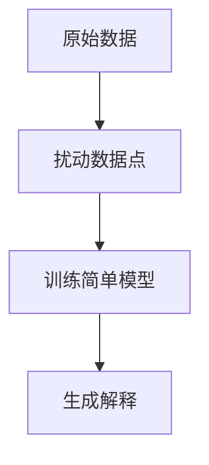
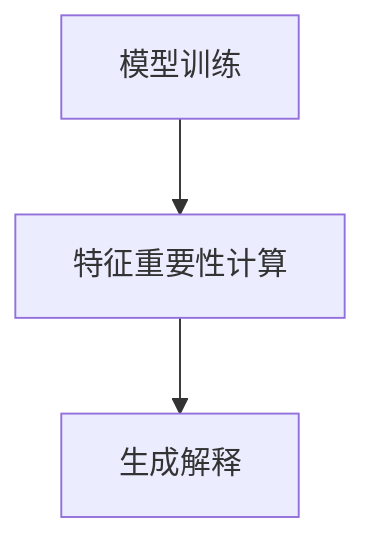
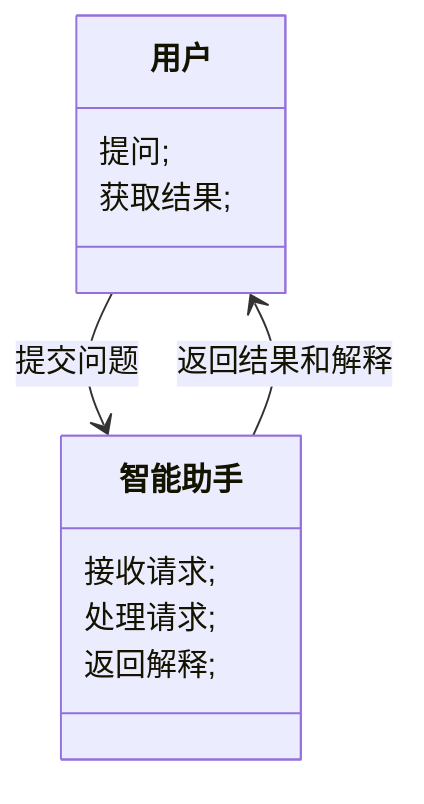
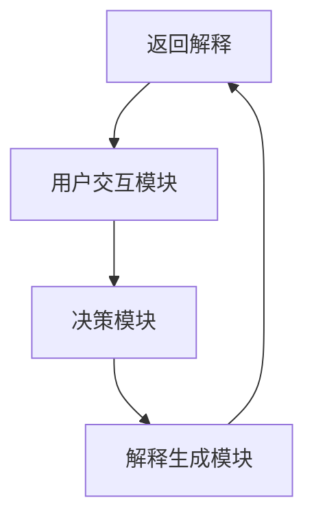

                 


# 智能助手的可解释性设计

## 关键词：
智能助手, 可解释性设计, 机器学习, 解释性算法, 系统架构, 用户信任

## 摘要：
智能助手的可解释性设计是确保用户信任和系统透明度的关键。本文详细探讨了可解释性在智能助手设计中的重要性，分析了核心概念、算法原理、系统架构及项目实战，最后总结了最佳实践和未来展望。通过系统化的分析和案例研究，本文为智能助手的可解释性设计提供了全面的指导。

---

# 第一部分: 智能助手的可解释性设计背景

## 第1章: 可解释性与智能助手概述

### 1.1 可解释性的重要性

#### 1.1.1 什么是可解释性
可解释性是指智能系统的行为和决策能够被人类理解和解释的程度。在智能助手中，可解释性确保用户能够理解系统如何得出结果，从而建立信任。

#### 1.1.2 可解释性在智能助手中的作用
- 提供透明度，增强用户信任。
- 帮助诊断系统错误，优化性能。
- 符合法律法规要求，尤其是在医疗和金融领域。

#### 1.1.3 可解释性与用户信任的关系
用户信任是智能助手被广泛采用的关键因素。高可解释性的系统更易获得用户的信任，从而提高用户满意度和使用频率。

### 1.2 智能助手的定义与特点

#### 1.2.1 智能助手的基本定义
智能助手是基于人工智能技术，能够理解用户需求并提供相应服务的工具，如 Siri、Alexa 和 Google Assistant。

#### 1.2.2 智能助手的核心功能
- 自然语言处理（NLP）：理解用户的输入。
- 任务执行：根据需求执行操作。
- 学习能力：通过反馈优化性能。

#### 1.2.3 智能助手与传统助手的区别
智能助手利用AI技术实现自动化和智能化，能够处理复杂任务，而传统助手依赖人工操作。

### 1.3 可解释性设计的背景与现状

#### 1.3.1 当前智能助手的广泛应用
智能助手已渗透到各个领域，如智能家居、医疗、金融等，为用户提供便捷服务。

#### 1.3.2 可解释性设计的必要性
随着智能助手在关键领域的应用，确保其决策过程透明和可解释变得至关重要。

#### 1.3.3 当前可解释性设计的挑战
- 复杂模型的可解释性问题。
- 用户对可解释性需求的多样性。
- 技术实现与用户体验的平衡。

---

## 第2章: 可解释性设计的核心概念

### 2.1 可解释性设计的原理

#### 2.1.1 可解释性的定义与分类
可解释性可以分为模型可解释性和过程可解释性。模型可解释性关注算法的透明度，而过程可解释性关注决策过程的透明度。

#### 2.1.2 可解释性设计的基本原则
- 简洁性：避免过度复杂的模型。
- 一致性：确保解释与实际决策一致。
- 及时性：在用户需要时提供解释。

#### 2.1.3 可解释性与用户需求的关系
用户需求是设计可解释性系统的起点，不同用户群体对可解释性的需求可能不同。

### 2.2 可解释性设计的维度

#### 2.2.1 透明度的层次划分
透明度分为数据透明度、算法透明度和决策透明度三个层次。

#### 2.2.2 可解释性模型的分类
- 局部可解释性：解释单个预测的结果。
- 全局可解释性：解释整个模型的行为。

#### 2.2.3 可解释性与系统复杂性的关系
系统复杂性越高，可解释性设计的难度越大，需要权衡性能和可解释性。

### 2.3 可解释性设计的核心要素

#### 2.3.1 信息的

---

# 第二部分: 可解释性设计的算法原理

## 第3章: 可解释性算法的原理与实现

### 3.1 基于模型的可解释性算法

#### 3.1.1 LIME算法
LIME（局部可解释性模型-agnostic解释器）是一种通过扰动数据点，训练简单的模型来解释复杂模型的算法。

**LIME算法流程图：**



LIME的数学模型可以表示为：

$$ f(x) = \sum_{i=1}^{n} \beta_i x_i $$

其中，$\beta_i$是简单模型的系数，$x_i$是特征向量。

#### 3.1.2 SHAP值
SHAP（Shapley Additive exPlanations）是一种基于博弈论的解释方法，用于衡量每个特征对模型预测的贡献。

**SHAP值计算公式：**

$$ \phi_i = \sum_{S \subseteq \{1,...,n\}\{i}} \frac{1}{n} [f(S \cup \{i\}) - f(S)] $$

### 3.2 基于特征重要性的可解释性算法

#### 3.2.1 特征重要性分析
特征重要性分析通过评估每个特征对模型预测的贡献程度，确定哪些特征对结果影响最大。

**特征重要性分析流程图：**



---

# 第三部分: 系统分析与架构设计

## 第4章: 智能助手系统的可解释性设计

### 4.1 系统分析

#### 4.1.1 问题场景描述
以医疗诊断智能助手为例，系统需要解释诊断结果的依据。

#### 4.1.2 领域模型设计


### 4.2 系统架构设计

#### 4.2.1 模块划分
- 用户交互模块：接收输入并返回结果。
- 决策模块：基于模型做出决策。
- 解释生成模块：生成可解释的输出。

#### 4.2.2 系统架构图


---

# 第四部分: 项目实战

## 第5章: 智能助手可解释性设计的实现

### 5.1 项目环境配置

```bash
pip install numpy
pip install scikit-learn
pip install lime
pip install shap
```

### 5.2 核心代码实现

#### 5.2.1 LIME解释器实现
```python
import lime
from lime import lime_explainer

# 训练复杂模型
model = ComplexModel()

# 初始化LIME解释器
explainer = lime_explainer.LimeExplainer()

# 生成解释
explanation = explainer.explain_model(model, test_data_point)
```

#### 5.2.2 SHAP值计算
```python
import shap

# 加载模型和测试数据点
explainer = shap.Explainer(model)
shap_values = explainer(test_data_point)
```

### 5.3 代码功能解读与分析

- LIME解释器用于解释单个预测结果，适合局部解释。
- SHAP值用于全局解释，提供特征重要性的整体视图。

### 5.4 实际案例分析

#### 5.4.1 医疗诊断智能助手
- 系统根据患者的症状和病史，结合机器学习模型进行诊断。
- 使用SHAP值解释诊断结果，显示关键症状的影响。

---

# 第五部分: 最佳实践

## 第6章: 可解释性设计的实践经验

### 6.1 设计原则

#### 6.1.1 简洁性原则
避免过度复杂的模型，选择易于解释的算法。

#### 6.1.2 用户中心原则
根据用户需求设计可解释性功能，确保解释方式符合用户的理解习惯。

### 6.2 工具推荐

#### 6.2.1 可解释性工具
- LIME
- SHAP
- ELI5

#### 6.2.2 可视化工具
- Matplotlib
- Seaborn
- Plotly

### 6.3 未来趋势

#### 6.3.1 多模态解释
结合文本和图像等多种形式提供解释。

#### 6.3.2 自适应解释
根据用户背景和需求动态调整解释方式。

### 6.4 注意事项

#### 6.4.1 平衡性能与可解释性
在保证系统性能的同时，确保可解释性。

#### 6.4.2 遵守伦理规范
确保可解释性设计不侵犯用户隐私，符合伦理要求。

---

# 第六部分: 总结与展望

## 第7章: 总结与未来展望

### 7.1 总结

智能助手的可解释性设计是提升用户体验和系统信任的关键。通过选择合适的算法和优化系统架构，可以在保证性能的同时，提供透明和可解释的服务。

### 7.2 未来展望

随着技术的发展，可解释性设计将更加重要。未来的研究方向包括多模态解释、自适应解释和实时解释，以满足更复杂的用户需求。

---

# 作者：AI天才研究院/AI Genius Institute & 禅与计算机程序设计艺术 /Zen And The Art of Computer Programming

---

这篇文章系统地探讨了智能助手的可解释性设计，从背景、核心概念、算法原理到系统架构和项目实战，提供了全面的分析和指导。通过详细的代码示例和实际案例分析，帮助读者理解如何在实际项目中实现可解释性设计。最后，总结了最佳实践和未来趋势，为智能助手的设计提供了宝贵的参考。

