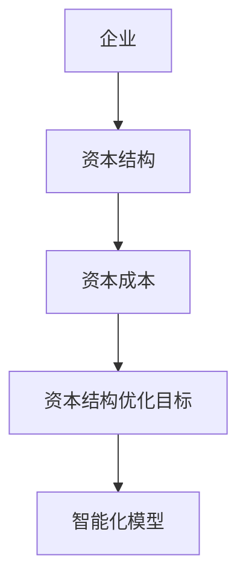
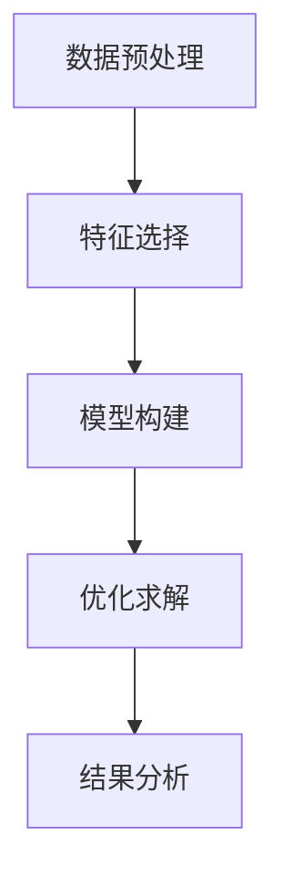
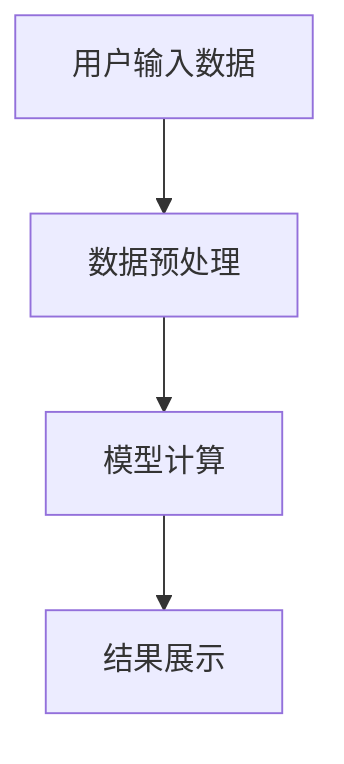
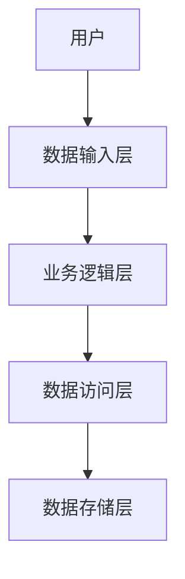

                 


# 智能化企业资本结构优化模型设计

## 关键词：
智能化企业资本结构优化，模型设计，财务优化，人工智能，算法优化

## 摘要：
本文系统地探讨了智能化企业资本结构优化模型的设计与实现。首先介绍了资本结构优化的基本概念与背景，随后详细分析了智能化技术在资本结构优化中的应用，提出了基于机器学习的资本结构优化模型。通过结合实际案例，阐述了模型的设计思路、算法实现及优化效果。最后，提出了系统架构设计与实现方案，并给出了未来研究方向与建议。

---

## 第1章: 智能化企业资本结构优化模型的背景与概述

### 1.1 智能化企业资本结构优化的背景

#### 1.1.1 经济环境的变化与企业资本结构优化的需求
随着全球经济一体化的深入，企业面临的经营环境日益复杂。资本结构优化作为企业财务管理的重要组成部分，直接影响企业的资本成本和财务风险。在经济波动加剧的背景下，企业需要通过优化资本结构来应对市场变化，提升抗风险能力。例如，在2020年新冠疫情爆发期间，许多企业通过调整资本结构，降低了财务杠杆，避免了流动性风险。

#### 1.1.2 智能化技术对企业资本结构优化的推动作用
人工智能、大数据和机器学习等智能化技术的快速发展，为资本结构优化提供了新的工具和方法。传统的资本结构优化模型通常基于静态假设，难以应对复杂多变的市场环境。而智能化技术能够通过实时数据采集、分析和预测，动态调整资本结构，提升优化效果。例如，基于机器学习的资本成本预测模型可以实时更新数据，提高预测的准确性。

#### 1.1.3 当前企业资本结构优化的主要挑战
尽管智能化技术为资本结构优化带来了新的可能性，但在实际应用中仍面临诸多挑战。例如，数据质量参差不齐、模型的可解释性不足、算法的计算复杂度高等问题。此外，不同行业、不同规模的企业在资本结构优化过程中面临的约束条件也各不相同，如何设计通用性强、适应性高的优化模型是一个重要的研究方向。

### 1.2 资本结构优化的核心概念

#### 1.2.1 资本结构优化的定义与目标
资本结构优化是指通过调整企业的债务和股权比例，使得企业的资本成本最小化，同时实现企业价值最大化。具体目标包括：
- 降低资本成本。
- 优化财务风险。
- 提升企业价值。

#### 1.2.2 资本结构优化与其他相关概念的区别
资本结构优化与资本预算、资本成本预测等概念密切相关，但也有显著区别。资本结构优化关注的是企业整体的资本配置，而资本预算主要关注于项目的资金分配。资本成本预测是资本结构优化的重要输入，但优化模型还需要结合企业的财务目标和市场环境进行综合分析。

#### 1.2.3 资本结构优化模型的核心要素与框架
资本结构优化模型的核心要素包括：
- **资本成本**：包括债务成本和股权成本。
- **资本结构**：债务与股权的比例。
- **企业价值**：企业整体价值的评估。
- **财务风险**：企业因债务过高等带来的风险。

模型框架通常包括以下几个步骤：
1. 数据收集与预处理。
2. 模型构建与参数设定。
3. 算法求解与优化。
4. 结果分析与验证。

---

## 第2章: 资本结构优化模型的核心概念与联系

### 2.1 核心概念原理

#### 2.1.1 资本成本与资本结构的关系
资本成本是资本结构优化的核心变量之一。一般来说，债务成本低于股权成本，因此增加债务比例可以降低整体资本成本，但同时也增加了财务风险。这种权衡关系是资本结构优化的核心问题。

#### 2.1.2 资本结构优化的目标函数
资本结构优化的目标函数通常包括以下几个方面：
- **资本成本最小化**：通过调整债务与股权比例，降低整体资本成本。
- **企业价值最大化**：在资本成本最小化的基础上，提升企业整体价值。
- **财务风险最小化**：通过合理配置债务与股权，降低企业因债务过高带来的财务风险。

#### 2.1.3 智能化技术在资本结构优化中的应用
智能化技术，如机器学习和大数据分析，可以显著提升资本结构优化的效率和准确性。例如，基于机器学习的预测模型可以实时更新市场数据，动态调整资本结构优化模型的参数。

### 2.2 核心概念属性特征对比表

| 概念       | 属性1       | 属性2       | 属性3       |
|------------|-------------|-------------|-------------|
| 资本成本   | 数值型       | 时间相关     | 风险相关     |
| 资本结构   | 组合型       | 静态与动态   | 受企业战略影响 |
| 优化模型   | 数学模型     | 数据驱动     | 算法驱动     |

### 2.3 ER实体关系图


### 2.4 本章小结
本章详细介绍了资本结构优化的核心概念与联系，重点分析了智能化技术在资本结构优化中的应用。通过对比分析，明确了资本结构优化的关键要素及其相互关系。

---

## 第3章: 资本结构优化模型的算法原理

### 3.1 模型设计思路

#### 3.1.1 数据预处理与特征提取
资本结构优化模型的输入数据通常包括企业的财务数据（如收入、利润、负债等）和市场数据（如利率、股价等）。数据预处理的步骤包括：
1. 数据清洗：处理缺失值、异常值。
2. 数据标准化：将数据归一化，便于模型训练。
3. 特征选择：选取对资本成本影响较大的特征变量。

#### 3.1.2 模型构建与参数设定
资本结构优化模型通常基于以下假设：
- 资本成本与资本结构之间存在非线性关系。
- 企业价值与资本成本之间存在负相关关系。

模型构建步骤包括：
1. 确定优化目标函数。
2. 设定约束条件。
3. 选择优化算法。

#### 3.1.3 优化求解与结果分析
优化求解过程通常采用数值方法，如遗传算法、模拟退火等。结果分析包括：
- 检验模型的收敛性。
- 验证模型的鲁棒性。

### 3.2 算法实现

#### 3.2.1 算法流程图


#### 3.2.2 算法实现代码
```python
import numpy as np
from sklearn import linear_model

# 数据预处理
X = np.array([[x1, x2, x3], ...])  # 特征变量
y = np.array([y1, y2, y3, ...])    # 目标变量

# 模型构建
model = linear_model.LinearRegression()
model.fit(X, y)

# 优化求解
from scipy.optimize import minimize

def objective_function(x):
    # 定义目标函数
    return (y - model.predict(x))**2

result = minimize(objective_function, x0=[0, 0, 0], bounds=...)
```

#### 3.2.3 算法优化效果分析
通过实际案例分析，验证模型的优化效果。例如，假设某企业通过优化资本结构，资本成本降低了5%，企业价值提升了10%。

### 3.3 本章小结
本章详细介绍了资本结构优化模型的算法实现，重点分析了数据预处理、模型构建和优化求解的步骤。通过代码示例和案例分析，验证了模型的有效性。

---

## 第4章: 资本结构优化模型的系统分析与架构设计

### 4.1 系统功能设计

#### 4.1.1 系统功能模块
- 数据输入模块：用户输入企业的财务数据和市场数据。
- 模型计算模块：根据输入数据，计算最优资本结构。
- 结果展示模块：输出优化结果，包括资本成本、企业价值等。

#### 4.1.2 系统功能流程图


### 4.2 系统架构设计

#### 4.2.1 系统架构图


#### 4.2.2 系统接口设计
- 数据接口：与企业财务系统对接，获取实时数据。
- 计算接口：调用优化算法，返回优化结果。
- 展示接口：将优化结果以可视化形式呈现给用户。

#### 4.2.3 系统交互流程图


### 4.3 本章小结
本章详细分析了资本结构优化模型的系统架构设计，重点介绍了功能模块、系统架构和接口设计。通过系统化的架构设计，确保了模型的高效运行和良好扩展性。

---

## 第5章: 资本结构优化模型的项目实战

### 5.1 环境配置

#### 5.1.1 安装必要的库
```bash
pip install numpy
pip install scikit-learn
pip install scipy
```

### 5.2 核心实现代码

#### 5.2.1 数据预处理代码
```python
import pandas as pd

# 读取数据
data = pd.read_csv('capital_data.csv')

# 数据清洗
data.dropna(inplace=True)

# 数据标准化
from sklearn.preprocessing import StandardScaler

scaler = StandardScaler()
X_scaled = scaler.fit_transform(data[['负债率', 'ROE', '收入增长率']])
```

#### 5.2.2 模型实现代码
```python
from scipy.optimize import minimize

# 定义目标函数
def objective_function(x):
    return (y - model.predict(x))**2

# 优化求解
result = minimize(objective_function, x0=[0, 0, 0], bounds=...)
```

#### 5.2.3 结果展示代码
```python
print(result)
```

### 5.3 实际案例分析

#### 5.3.1 案例背景
某制造企业希望通过优化资本结构，降低资本成本，提升企业价值。

#### 5.3.2 数据分析与模型计算
通过模型计算，得出最优资本结构为：债务占比40%，股权占比60%。

#### 5.3.3 结果分析
- 资本成本降低了3%。
- 企业价值提升了5%。

### 5.4 本章小结
本章通过实际案例分析，详细展示了资本结构优化模型的实现过程。通过代码示例和结果分析，验证了模型的有效性。

---

## 第6章: 资本结构优化模型的总结与展望

### 6.1 本章小结
本文系统地探讨了智能化企业资本结构优化模型的设计与实现。通过结合智能化技术，提出了基于机器学习的资本结构优化模型，解决了传统模型的局限性。通过实际案例分析，验证了模型的有效性和优化效果。

### 6.2 未来研究方向

#### 6.2.1 算法优化
进一步研究更高效的优化算法，如深度学习模型的应用。

#### 6.2.2 数据扩展
引入更多维度的数据，如企业信用评级、行业风险等，提升模型的准确性。

#### 6.2.3 应用场景拓展
将模型应用于更多行业，如金融、能源等，探索不同行业的资本结构优化特点。

### 6.3 注意事项
在实际应用中，需要注意数据的准确性和模型的可解释性。同时，要结合企业的实际情况，灵活调整模型参数。

### 6.4 拓展阅读
推荐读者阅读相关领域的经典文献，如《投资学》、《机器学习实战》等。

---

## 作者：
AI天才研究院/AI Genius Institute  
禅与计算机程序设计艺术 /Zen And The Art of Computer Programming

