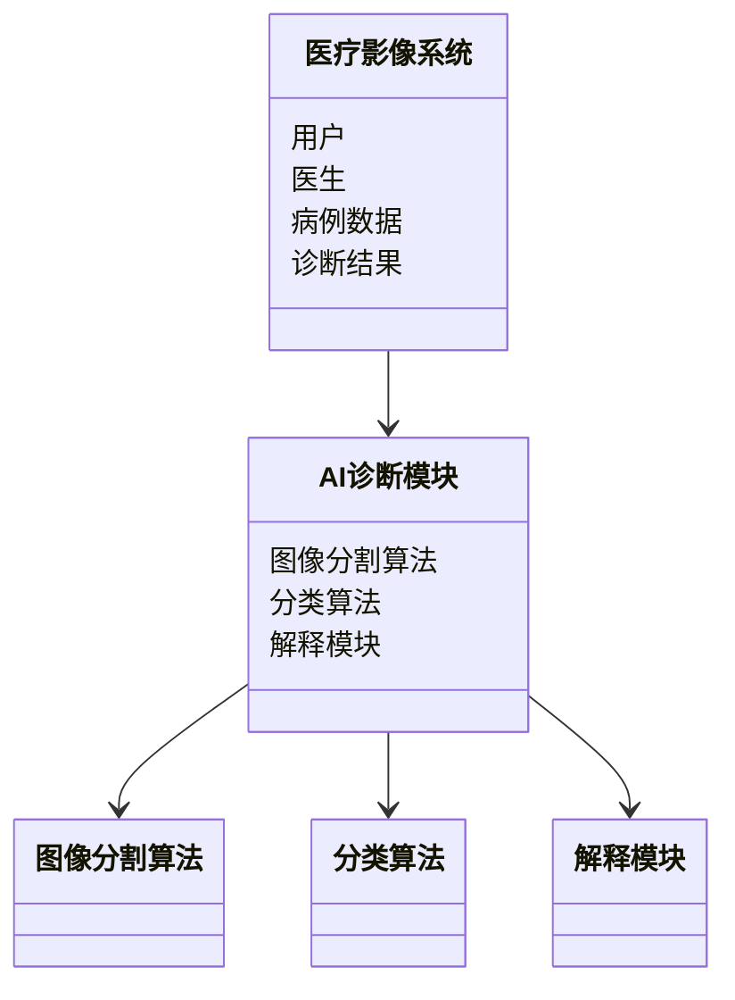
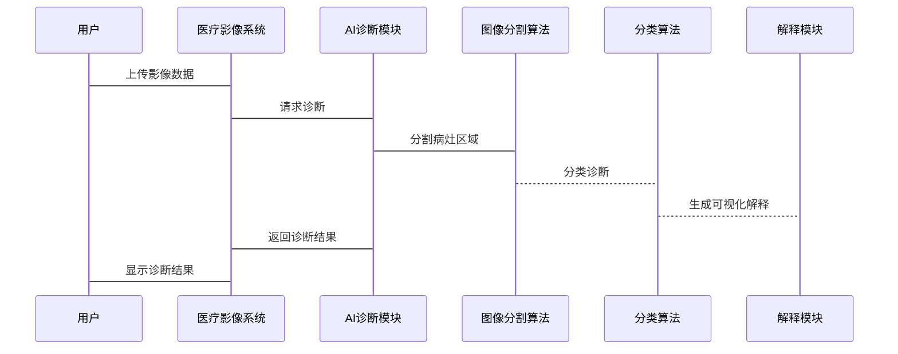

                 


# 智能医疗影像：AI Agent的辅助诊断

## 关键词：医疗影像，AI Agent，深度学习，图像分割，目标检测，卷积神经网络

## 摘要

本文深入探讨了AI Agent在医疗影像辅助诊断中的应用，详细介绍了医疗影像数据的特点、AI Agent的核心原理、基于深度学习的算法实现，以及在实际项目中的系统架构设计和最佳实践。通过案例分析和代码实现，展示了AI技术如何显著提升医疗影像诊断的效率和准确性，同时讨论了当前技术面临的挑战与未来发展方向。

---

# 第一部分: 智能医疗影像与AI Agent概述

## 第1章: 医疗影像的背景与挑战

### 1.1 医疗影像的发展历程

#### 1.1.1 传统医疗影像的局限性

传统医疗影像技术，如X光、CT、MRI等，虽然在医学诊断中发挥了重要作用，但存在以下局限性：

1. **人工解读耗时且易出错**：放射科医生需要花费大量时间分析影像数据，且容易受到主观因素的影响。
2. **诊断一致性问题**：不同医生对同一影像的解读可能因经验差异而产生不一致的结果。
3. **数据量爆炸式增长**：随着医学影像设备的普及，产生的数据量呈指数级增长，人工处理难度加大。

#### 1.1.2 AI技术在医疗影像中的应用前景

AI技术的引入为医疗影像诊断带来了新的可能性：

1. **快速且准确的辅助诊断**：AI可以通过深度学习算法快速分析大量影像数据，辅助医生做出更准确的诊断。
2. **提高诊断一致性**：AI系统可以在不同医疗机构之间保持诊断标准的一致性，减少人为误差。
3. **应对数据量增长的挑战**：AI能够高效处理海量数据，缓解医生的工作压力。

#### 1.1.3 AI Agent在医疗影像中的角色与意义

AI Agent在医疗影像中的角色可以概括为：

1. **智能助手**：AI Agent作为医生的辅助工具，帮助医生快速分析影像数据，提供诊断建议。
2. **实时反馈**：AI Agent可以在医生进行影像分析时实时提供反馈，帮助医生及时修正错误。
3. **持续学习**：通过不断学习新的医疗数据，AI Agent可以不断优化自身的诊断能力，提升准确性。

### 1.2 AI Agent的基本概念与特点

#### 1.2.1 AI Agent的定义与分类

AI Agent（智能体）是指在特定环境中能够感知并自主行动以实现目标的实体。在医疗影像领域，AI Agent主要分为以下几类：

1. **基于规则的AI Agent**：通过预定义的规则和逻辑进行决策。
2. **基于机器学习的AI Agent**：通过训练数据学习模式和特征，实现对影像的智能分析。
3. **基于深度学习的AI Agent**：利用深度神经网络进行复杂模式识别，适用于复杂的医疗影像分析任务。

#### 1.2.2 AI Agent的核心能力与优势

AI Agent的核心能力包括：

1. **模式识别**：能够从大量数据中识别出关键特征和模式。
2. **自主学习**：通过机器学习和深度学习技术，实现自主学习和优化。
3. **实时交互**：能够与医生进行实时交互，提供即时反馈和建议。

#### 1.2.3 AI Agent在医疗影像中的应用边界与外延

AI Agent的应用边界主要体现在以下几个方面：

1. **数据依赖性**：AI Agent的性能高度依赖于训练数据的质量和多样性。
2. **解释性要求**：医生需要AI系统提供可解释的诊断结果，以确保诊断的可靠性和可追溯性。
3. **法律与伦理问题**：AI在医疗领域的应用涉及患者隐私和法律责任，需要制定相应的法律法规和伦理规范。

### 1.3 医疗影像AI诊断的核心要素

#### 1.3.1 医疗影像数据的特征与挑战

医疗影像数据具有以下特征：

1. **多样性**：包括X光、CT、MRI等多种类型。
2. **高维度性**：单张影像通常包含数百万像素，数据维度高。
3. **标注复杂性**：需要专业医生进行标注，耗时且成本高。

#### 1.3.2 AI算法在医疗影像中的关键作用

AI算法在医疗影像中的作用主要体现在以下几个方面：

1. **自动分割**：通过图像分割算法，自动识别病灶区域。
2. **分类与诊断**：基于深度学习的分类算法，对影像进行疾病分类。
3. **辅助诊断**：为医生提供诊断建议，减少误诊和漏诊。

#### 1.3.3 AI Agent在辅助诊断中的系统架构

AI Agent的系统架构通常包括以下几个部分：

1. **数据采集与预处理**：采集医疗影像数据并进行预处理。
2. **模型训练与优化**：基于标注数据训练AI模型，并不断优化模型性能。
3. **实时分析与反馈**：对新的影像数据进行实时分析，并向医生提供反馈。

---

## 第2章: AI Agent在医疗影像中的技术基础

### 2.1 AI Agent的基本原理

#### 2.1.1 AI Agent的定义与工作流程

AI Agent的工作流程通常包括以下几个步骤：

1. **感知环境**：通过传感器或数据接口获取环境信息。
2. **分析与决策**：基于获取的信息进行分析，生成决策。
3. **执行动作**：根据决策执行相应的动作，并将结果反馈给环境。

在医疗影像领域，AI Agent的工作流程可以简化为：

1. **数据输入**：接收患者的医疗影像数据。
2. **特征提取**：通过深度学习模型提取影像中的特征。
3. **诊断推理**：基于提取的特征进行疾病诊断。
4. **结果输出**：将诊断结果反馈给医生或患者。

#### 2.1.2 AI Agent的核心技术与实现方法

AI Agent的核心技术包括：

1. **深度学习**：通过卷积神经网络（CNN）进行图像识别和分类。
2. **自然语言处理**：用于处理和分析医生的自然语言输入。
3. **强化学习**：通过与环境的交互不断优化AI Agent的行为策略。

#### 2.1.3 AI Agent在医疗影像中的应用场景

AI Agent在医疗影像中的应用场景主要包括：

1. **辅助诊断**：帮助医生快速识别病灶，提高诊断准确率。
2. **疾病预测**：基于历史数据预测患者可能患上的疾病。
3. **治疗方案推荐**：根据诊断结果推荐个性化的治疗方案。

---

### 2.2 医疗影像数据的处理与分析

#### 2.2.1 医疗影像数据的特征提取

特征提取是医疗影像分析的关键步骤。常用的特征提取方法包括：

1. **手工设计特征**：如HOG、纹理分析等。
2. **深度学习特征**：通过卷积神经网络提取高层次特征。

#### 2.2.2 医疗影像数据的分类与分割

分类与分割是医疗影像分析的两大主要任务：

1. **分类**：将整个影像分为正常或异常两类。
2. **分割**：将影像中的病灶区域精确定位。

#### 2.2.3 医疗影像数据的可视化与解释

可视化与解释是确保AI诊断结果可信赖的重要环节：

1. **可视化**：通过热图等方式展示AI的判断依据。
2. **可解释性**：通过模型解释技术，如LIME，帮助医生理解AI的决策过程。

---

### 2.3 AI算法在医疗影像中的应用

#### 2.3.1 基于深度学习的医疗影像分析

深度学习在医疗影像中的应用主要体现在以下几个方面：

1. **图像分类**：通过CNN对影像进行疾病分类。
2. **图像分割**：通过U-Net等网络实现病灶区域的精确定位。
3. **目标检测**：通过Faster R-CNN等网络实现病灶的定位与识别。

#### 2.3.2 医疗影像AI诊断的数学模型

常用的数学模型包括：

1. **卷积神经网络（CNN）**：用于图像特征提取和分类。
2. **生成对抗网络（GAN）**：用于生成合成的医疗影像数据，用于模型训练。
3. **循环神经网络（RNN）**：用于处理序列化的医疗数据，如病历记录。

---

## 第3章: 医疗影像AI诊断的核心算法

### 3.1 深度学习在医疗影像中的应用

#### 3.1.1 卷积神经网络（CNN）在医疗影像中的应用

CNN在医疗影像中的应用主要体现在以下几个方面：

1. **图像分类**：通过训练CNN模型，实现对疾病类型的分类。
2. **图像分割**：通过U-Net等网络实现对病灶区域的精确定位。
3. **目标检测**：通过Faster R-CNN等网络实现对病灶的检测与识别。

#### 3.1.2 图像分割算法（如U-Net）的实现与优化

U-Net是一种经典的图像分割算法，其架构如下：


U-Net通过跳跃连接将编码器与解码器部分连接起来，实现高效的图像分割。

#### 3.1.3 目标检测算法（如Faster R-CNN）在医疗影像中的应用

Faster R-CNN是一种高效的物体检测算法，其核心步骤包括：

1. **区域建议生成**：通过RPN生成候选框。
2. **特征提取**：通过RoI Pooling提取候选框的特征。
3. **分类与回归**：通过全连接层实现候选框的分类与位置回归。

---

## 第4章: 医疗影像AI诊断的系统架构设计

### 4.1 问题场景介绍

医疗影像AI诊断系统通常需要处理以下场景：

1. **影像数据上传**：患者或医生上传影像数据。
2. **实时诊断**：系统对上传的影像进行实时分析，并返回诊断结果。
3. **结果反馈**：将诊断结果以可视化形式反馈给医生或患者。

### 4.2 系统功能设计

#### 4.2.1 领域模型（Mermaid类图）



#### 4.2.2 系统架构设计（Mermaid架构图）


#### 4.2.3 系统接口设计

系统主要接口包括：

1. **影像数据接口**：用于上传和下载影像数据。
2. **诊断接口**：用于触发AI诊断过程。
3. **结果接口**：用于获取诊断结果和可视化解释。

#### 4.2.4 系统交互（Mermaid序列图）



---

## 第5章: 项目实战

### 5.1 环境安装

#### 5.1.1 安装Python和相关库

```bash
# 安装Python和pip
sudo apt-get install python3 python3-pip
# 安装Keras和TensorFlow
pip install keras tensorflow
# 安装OpenCV
pip install opencv-python
```

#### 5.1.2 安装深度学习框架

```bash
pip install numpy matplotlib scikit-learn
```

### 5.2 系统核心实现源代码

#### 5.2.1 图像分类实现（Keras）

```python
import numpy as np
from tensorflow.keras.models import Model
from tensorflow.keras.layers import Input, Conv2D, MaxPooling2D, UpSampling2D, concatenate

def unet_model(input_size=(256, 256, 3)):
    inputs = Input(input_size)
    
    conv1 = Conv2D(64, (3,3), activation='relu', padding='same')(inputs)
    pool1 = MaxPooling2D((2,2))(conv1)
    
    conv2 = Conv2D(128, (3,3), activation='relu', padding='same')(pool1)
    pool2 = MaxPooling2D((2,2))(conv2)
    
    conv3 = Conv2D(256, (3,3), activation='relu', padding='same')(pool2)
    pool3 = MaxPooling2D((2,2))(conv3)
    
    conv4 = Conv2D(512, (3,3), activation='relu', padding='same')(pool3)
    pool4 = MaxPooling2D((2,2))(conv4)
    
    conv5 = Conv2D(1024, (3,3), activation='relu', padding='same')(pool4)
    
    up6 = UpSampling2D((2,2))(conv5)
    conv6 = Conv2D(512, (3,3), activation='relu', padding='same')(up6)
    
    up7 = UpSampling2D((2,2))(conv6)
    conv7 = Conv2D(256, (3,3), activation='relu', padding='same')(up7)
    
    up8 = UpSampling2D((2,2))(conv7)
    conv8 = Conv2D(128, (3,3), activation='relu', padding='same')(up8)
    
    up9 = UpSampling2D((2,2))(conv8)
    conv9 = Conv2D(64, (3,3), activation='relu', padding='same')(up9)
    
    outputs = Conv2D(1, (1,1), activation='sigmoid')(conv9)
    
    model = Model(inputs=inputs, outputs=outputs)
    return model
```

#### 5.2.2 分割算法实现（OpenCV）

```python
import cv2
import numpy as np

def segment_image(image_path):
    img = cv2.imread(image_path)
    gray = cv2.cvtColor(img, cv2.COLOR_BGR2GRAY)
    ret, thresh = cv2.threshold(gray, 0, 255, cv2.THRESH_BINARY + cv2.THRESH_OTSU)
    contours, _ = cv2.findContours(thresh, cv2.RETR_EXTERNAL, cv2.CHAIN_APPROX_SIMPLE)
    
    segmented_image = np.zeros_like(gray)
    cv2.drawContours(segmented_image, contours, -1, 255, thickness=cv2.FILLED)
    
    return segmented_image
```

### 5.3 代码应用解读与分析

#### 5.3.1 图像分类代码解读

1. **模型定义**：定义了一个U-Net模型，用于图像分割任务。
2. **卷积层**：通过多个卷积层和下采样层提取图像特征。
3. **上采样层**：通过上采样层和跳跃连接实现像素级别的分割。

#### 5.3.2 分割算法解读

1. **图像读取**：使用OpenCV读取图像并转换为灰度图。
2. **阈值分割**：通过Otsu算法自动确定阈值，实现图像分割。
3. **轮廓检测**：检测图像中的轮廓，并绘制分割结果。

### 5.4 实际案例分析

#### 5.4.1 分割案例

输入一张肺部CT图像，分割出病灶区域：

```python
image_path = "lung_ct.jpg"
segmented_image = segment_image(image_path)
cv2.imwrite("segmented_lung.jpg", segmented_image)
```

#### 5.4.2 分类案例

训练一个图像分类模型，分类正常和异常的乳腺X光片：

```python
model = unet_model()
model.compile(optimizer='adam', loss='binary_crossentropy', metrics=['accuracy'])
model.fit(x_train, y_train, epochs=10, batch_size=32)
```

### 5.5 项目小结

通过上述代码实现，我们可以看到AI Agent在医疗影像中的强大能力。图像分割和分类算法能够有效识别病灶区域，辅助医生进行诊断。然而，实际应用中仍需注意数据质量和模型解释性的问题。

---

## 第6章: 最佳实践与总结

### 6.1 最佳实践 tips

1. **数据预处理**：确保数据质量，进行标准化和增强处理。
2. **模型优化**：通过数据增强、模型调参等方式提升模型性能。
3. **模型解释性**：使用可视化工具（如LIME、SHAP）解释模型决策过程。
4. **隐私保护**：确保医疗数据的隐私和安全，遵守相关法律法规。

### 6.2 小结

AI Agent在医疗影像中的应用前景广阔，通过深度学习算法，AI能够显著提升诊断的效率和准确性。然而，实际应用中仍需解决数据隐私、模型解释性等挑战。

### 6.3 注意事项

1. **数据隐私**：医疗数据涉及患者隐私，需严格遵守相关法律法规。
2. **模型泛化能力**：确保模型在不同数据集上的泛化能力。
3. **医生的参与**：AI诊断结果需经过医生的最终确认，确保诊断的准确性。

### 6.4 拓展阅读

1. **深度学习经典论文**：如ResNet、Transformer等。
2. **医学影像处理工具**：如SimpleITK、Dipy等。
3. **AI在医疗领域的最新研究**：如医学影像生成、多模态数据融合等。

---

# 作者：AI天才研究院/AI Genius Institute & 禅与计算机程序设计艺术 /Zen And The Art of Computer Programming

