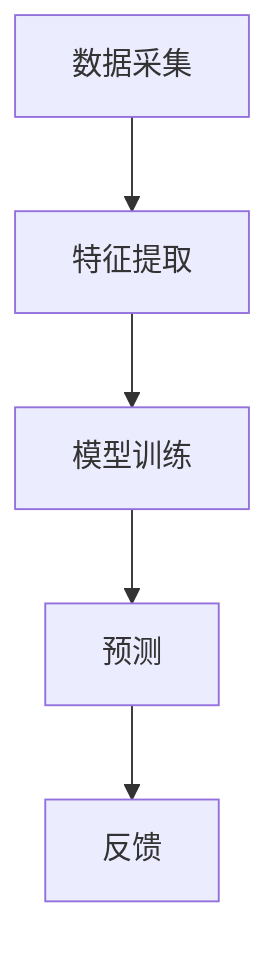
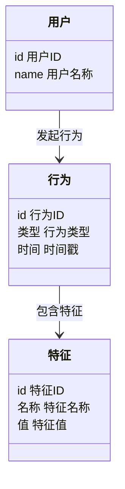
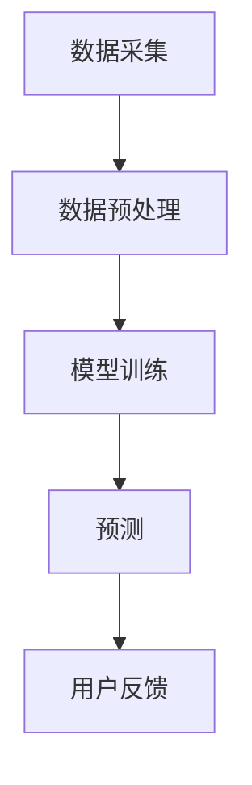
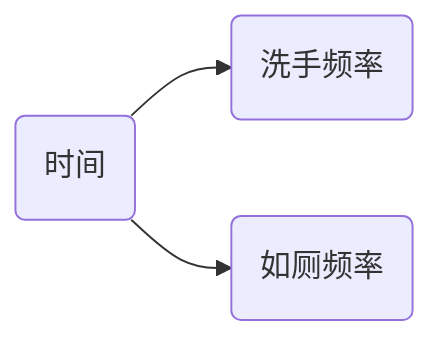

                 


# 智能卫生间：AI Agent的个人卫生习惯分析

> 关键词：智能卫生间, AI Agent, 个人卫生习惯, 数据分析, 人工智能, 系统架构

> 摘要：本文详细探讨了智能卫生间系统中AI Agent在个人卫生习惯分析中的应用。从背景介绍、核心概念、算法原理到系统架构设计和项目实战，文章全面分析了如何利用AI技术优化个人卫生管理。通过传感器数据采集、特征提取、模型训练与预测等步骤，展示了AI在智能卫生系统中的潜力和实现方案。

---

## 第1章：智能卫生间与AI Agent概述

### 1.1 问题背景与意义

#### 1.1.1 个人卫生习惯的重要性
个人卫生习惯是健康生活的基石，直接关系到个人的健康状况和生活质量。良好的卫生习惯可以预防疾病传播，提高生活品质。然而，现代生活节奏快，人们往往忽视了卫生习惯的细节，导致健康隐患。

#### 1.1.2 AI技术在卫生管理中的应用潜力
AI技术的快速发展为卫生管理带来了新的可能性。通过传感器、物联网和机器学习等技术，AI Agent能够实时采集和分析数据，帮助人们更好地管理个人卫生习惯。

#### 1.1.3 智能卫生间系统的社会价值
智能卫生间系统不仅提升了个人卫生管理的效率，还能通过数据共享优化公共卫生资源的分配，为公共卫生管理提供支持。

### 1.2 核心概念与问题描述

#### 1.2.1 AI Agent的定义与特征
AI Agent是一种能够感知环境并采取行动以实现目标的智能体。在智能卫生间系统中，AI Agent负责数据采集、分析和反馈。

#### 1.2.2 智能卫生间系统的组成要素
智能卫生间系统包括传感器、数据采集模块、AI分析模块、用户界面和反馈模块。这些模块协同工作，实现卫生习惯的实时监测和优化。

#### 1.2.3 个人卫生习惯分析的目标与范围
目标是通过AI技术帮助用户改善卫生习惯，范围涵盖数据采集、行为分析、预测和反馈。

### 1.3 当前技术现状与挑战

#### 1.3.1 传统卫生管理方式的局限性
传统管理方式依赖人工记录和反馈，效率低且难以实时监测。

#### 1.3.2 AI技术在卫生领域的应用现状
AI技术已在医疗、健康监测等领域得到应用，但在个人卫生管理领域还处于起步阶段。

#### 1.3.3 智能卫生间系统面临的技术挑战
数据采集精度、模型准确性、用户隐私保护等问题亟待解决。

---

## 第2章：AI Agent与个人卫生习惯的核心概念

### 2.1 AI Agent的基本原理

#### 2.1.1 AI Agent的定义与分类
AI Agent根据智能水平分为反应式和认知式。在智能卫生间中，反应式AI Agent更适合实时数据处理。

#### 2.1.2 AI Agent在智能卫生间中的应用场景
AI Agent可以实时监测用户的卫生行为，如厕频率、洗手时长等，并提供反馈。

#### 2.1.3 AI Agent与传统自动化系统的对比
AI Agent具备学习和适应能力，能够根据数据动态调整策略，而传统系统则依赖固定规则。

### 2.2 个人卫生习惯的分析模型

#### 2.2.1 卫生习惯的定义与分类
卫生习惯包括如厕频率、洗手时长、清洁习惯等。不同习惯对健康的影响不同。

#### 2.2.2 数据采集与特征提取
传感器数据包括时间戳、行为类型、持续时长等。特征提取关注行为的频率、持续时间和一致性。

#### 2.2.3 数据分析与行为预测
通过机器学习模型预测用户的卫生行为，帮助制定优化策略。

### 2.3 AI Agent与个人卫生习惯的关系

#### 2.3.1 数据流与交互机制
AI Agent通过传感器采集数据，分析后反馈给用户，形成闭环。

#### 2.3.2 AI Agent如何优化卫生习惯
通过实时反馈和建议，AI Agent帮助用户形成良好的卫生习惯。

#### 2.3.3 系统边界与外延
系统边界包括传感器、数据处理模块和用户界面。外延涉及数据存储和隐私保护。

### 2.4 核心概念对比分析

#### 2.4.1 AI Agent与传统自动化系统的对比
| 特性       | AI Agent                     | 传统自动化系统               |
|------------|-------------------------------|-----------------------------|
| 智能性     | 高，具备学习和自适应能力     | 低，依赖固定规则             |
| 数据处理   | 强大数据处理能力             | 数据处理能力有限             |
| 灵活性     | 高，可根据数据动态调整策略   | 低，策略固定                 |

#### 2.4.2 ER实体关系图
```mermaid
er
  entity 用户 {
    id 用户ID
    name 用户名称
  }
  entity 行为 {
    id 行为ID
    类型 行为类型
    时间 时间戳
  }
  entity 特征 {
    id 特征ID
    名称 特征名称
    值 特征值
  }
  用户 --> 行为: 发起行为
  行为 --> 特征: 包含特征
```

---

## 第3章：AI Agent的算法原理与数学模型

### 3.1 数据采集与特征提取

#### 3.1.1 传感器数据采集
通过红外传感器、压力传感器等采集用户的卫生行为数据。

#### 3.1.2 数据预处理与清洗
去除噪声数据，填补缺失值，标准化数据。

### 3.2 基于AI Agent的卫生习惯预测模型

#### 3.2.1 算法原理与流程


#### 3.2.2 数学模型与公式
使用ARIMA模型预测行为频率：
$$ ARIMA(p, d, q) $$

---

## 第4章：系统分析与架构设计

### 4.1 项目场景介绍

#### 4.1.1 系统功能需求
- 数据采集模块：采集用户的卫生行为数据。
- 数据分析模块：分析数据，预测行为。
- 用户界面：展示数据和反馈建议。

### 4.2 系统架构设计

#### 4.2.1 领域模型类图


#### 4.2.2 系统架构图


---

## 第5章：项目实战

### 5.1 环境安装与配置

#### 5.1.1 安装Python与机器学习库
```bash
pip install numpy scikit-learn
```

### 5.2 核心代码实现

#### 5.2.1 数据采集代码
```python
import numpy as np
from sklearn import preprocessing

# 示例数据
data = np.array([[1, 2, 3], [4, 5, 6], [7, 8, 9]])
# 标准化处理
normalized_data = preprocessing.normalize(data)
print(normalized_data)
```

#### 5.2.2 模型训练代码
```python
from sklearn.linear_model import LinearRegression

# 训练模型
model = LinearRegression()
model.fit(X_train, y_train)
```

### 5.3 实际案例分析

#### 5.3.1 数据分析与可视化
使用折线图展示用户的洗手频率变化：


---

## 第6章：总结与展望

### 6.1 最佳实践与经验总结
- 数据隐私保护至关重要。
- 系统设计需注重用户体验。

### 6.2 未来研究方向
- 更精准的预测模型。
- 多人共享的卫生管理系统。

### 6.3 小结
本文详细探讨了AI Agent在智能卫生间中的应用，展示了其在个人卫生习惯分析中的潜力和实现方案。

---

## 作者：AI天才研究院 & 禅与计算机程序设计艺术

本文作者是AI天才研究院，专注于人工智能与计算机程序设计的研究与实践。更多内容请访问 [AI天才研究院](https://www.example.com)。

