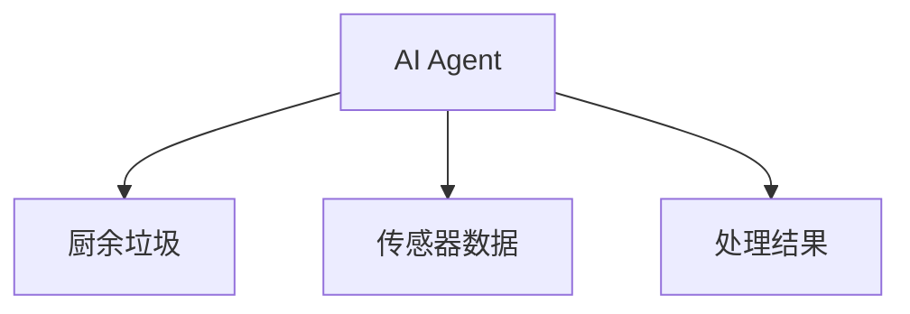
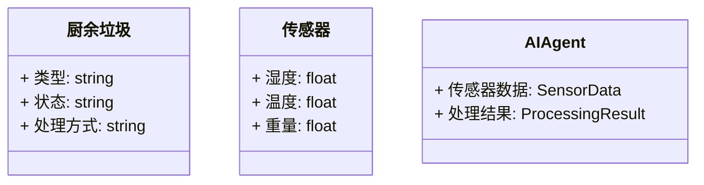
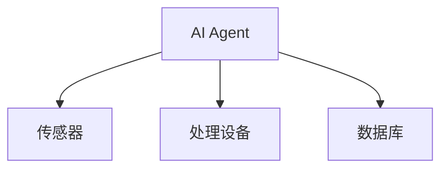

                 


# 智能厨余处理器：AI Agent的厨余再利用建议

> 关键词：智能厨余处理器, AI Agent, 厨余再利用, 状态识别, 行为决策, 优化学习

> 摘要：本文深入探讨了AI Agent在厨余处理中的应用，详细分析了智能厨余处理器的核心概念、算法原理、系统架构，并通过实际案例展示了如何利用AI技术实现厨余的高效再利用。文章内容涵盖背景介绍、核心概念、算法原理、系统设计、项目实战及最佳实践等，旨在为读者提供全面的技术解读和实践指导。

---

## 第1章: 智能厨余处理器与AI Agent概述

### 1.1 厨余处理的现状与问题
#### 1.1.1 厨余垃圾的定义与分类
厨余垃圾是指在家庭、餐饮业和食品加工过程中产生的有机废弃物，主要包括果皮、菜叶、剩饭、骨头等。根据来源和性质，厨余垃圾可以分为以下几类：
- **家庭厨余**：来自居民日常生活的食物残渣。
- **餐饮厨余**：来自餐馆、酒店等的餐厨废弃物。
- **工业厨余**：来自食品加工厂的废弃物。

#### 1.1.2 厨余处理的现状分析
目前，厨余垃圾的处理方式主要包括填埋、堆肥、焚烧和资源化利用。然而，传统处理方式存在以下问题：
- **环境污染**：填埋和焚烧会导致二次污染。
- **资源浪费**：厨余垃圾中含有大量可再利用的资源。
- **处理效率低**：传统方法效率低下，难以满足大规模处理需求。

#### 1.1.3 厨余处理中的主要问题
- 处理成本高。
- 资源利用率低。
- 环境污染风险大。
- 处理过程缺乏智能化。

### 1.2 AI Agent的定义与特点
#### 1.2.1 AI Agent的基本概念
AI Agent（人工智能代理）是一种能够感知环境、自主决策并采取行动的智能体。它可以基于传感器输入、历史数据和上下文信息，通过学习和优化算法，实现对目标的自主控制和优化。

#### 1.2.2 AI Agent的核心特点
- **自主性**：无需外部干预，能够自主决策。
- **反应性**：能够实时感知环境并做出反应。
- **学习能力**：通过数据学习，不断优化自身行为。
- **可扩展性**：能够适应不同的应用场景。

#### 1.2.3 AI Agent与传统自动化系统的区别
| 属性 | AI Agent | 传统自动化系统 |
|------|----------|----------------|
| 决策能力 | 高度智能，自主决策 | 基于预设规则，无自主决策能力 |
| 学习能力 | 具备学习能力 | 无学习能力 |
| 灵活性 | 高度灵活，适应性强 | 灵活性较低 |

### 1.3 智能厨余处理器的核心概念
#### 1.3.1 智能厨余处理器的定义
智能厨余处理器是一种结合AI Agent技术的智能设备，能够自动识别厨余垃圾的类型、状态，并根据实际情况优化处理流程，实现厨余的高效再利用。

#### 1.3.2 智能厨余处理器的工作原理
1. **数据采集**：通过传感器采集厨余垃圾的物理特性（如湿度、温度、重量等）。
2. **状态识别**：利用AI算法识别厨余垃圾的状态（如是否腐烂、是否适合堆肥等）。
3. **决策优化**：基于识别结果，优化处理流程，选择最优的处理方式。
4. **执行操作**：根据决策结果，执行相应的操作（如分拣、粉碎、堆肥等）。

#### 1.3.3 AI Agent在厨余处理中的角色
AI Agent在智能厨余处理器中扮演“大脑”的角色，负责数据处理、状态识别、决策优化和系统控制。

### 1.4 本章小结
本章介绍了厨余处理的现状与问题，详细阐述了AI Agent的定义、特点及其在智能厨余处理器中的作用。通过对比分析，突出了AI Agent在厨余处理中的优势和创新点。

---

## 第2章: AI Agent的核心概念与联系

### 2.1 AI Agent的核心概念原理
#### 2.1.1 状态识别与感知
状态识别是AI Agent的核心功能之一，通过传感器和算法模型，AI Agent能够准确识别厨余垃圾的状态（如湿度、温度、有机物含量等）。

#### 2.1.2 行为决策机制
行为决策是AI Agent的另一个核心功能，基于识别到的状态信息，AI Agent会根据预设的目标和优化算法，选择最优的行为方案。

#### 2.1.3 优化与学习算法
AI Agent通过强化学习算法，不断优化自身的决策策略，提升处理效率和资源利用率。

### 2.2 核心概念对比分析
#### 2.2.1 AI Agent与传统算法的对比
| 特性 | AI Agent | 传统算法 |
|------|----------|----------|
| 数据依赖 | 高度依赖实时数据 | 依赖历史数据 |
| 决策能力 | 具备自主决策能力 | 无自主决策能力 |
| 学习能力 | 具备学习能力 | 无学习能力 |

#### 2.2.2 智能厨余处理器与传统厨余处理设备的对比
| 特性 | 智能厨余处理器 | 传统厨余处理设备 |
|------|----------------|------------------|
| 处理效率 | 高效 | 低效 |
| 资源利用率 | 高 | 低 |
| 智能化程度 | 高度智能 | 无智能化 |

### 2.3 ER实体关系图


### 2.4 本章小结
本章详细分析了AI Agent的核心概念与原理，并通过对比分析突出了智能厨余处理器的独特优势。通过ER实体关系图，进一步明确了系统中的实体关系和数据流。

---

## 第3章: AI Agent算法的数学模型与公式

### 3.1 状态识别算法
#### 3.1.1 基于概率的分类模型
概率分类模型的核心公式为：
$$ P(y|x) = \frac{P(x|y)P(y)}{P(x)} $$
其中：
- $P(y|x)$：条件概率，表示在给定特征$x$的情况下，样本属于类别$y$的概率。
- $P(x|y)$：似然函数，表示在类别$y$下，特征$x$出现的概率。
- $P(y)$：先验概率，表示类别$y$的先验概率。
- $P(x)$：边缘概率，表示特征$x$出现的概率。

#### 3.1.2 支持向量机分类
支持向量机（SVM）是一种常用的分类算法，其目标函数为：
$$ \text{最小化} \, \frac{1}{2} \||w\|^2 $$
$$ \text{subject to} \, y_i(w \cdot x_i + b) \geq 1, \, i=1,2,...,n $$

### 3.2 行为决策算法
#### 3.2.1 Q-learning算法
Q-learning算法是一种基于强化学习的决策算法，其核心公式为：
$$ Q(s, a) = r + \gamma \max_{a'} Q(s', a') $$
其中：
- $Q(s, a)$：状态-动作对$(s, a)$的Q值。
- $r$：立即奖励。
- $\gamma$：折扣因子，表示未来奖励的折扣程度。
- $\max_{a'} Q(s', a')$：下一状态$s'$下的最大Q值。

---

## 第4章: 智能厨余处理器的系统分析与架构设计

### 4.1 问题场景介绍
智能厨余处理器的主要目标是通过AI Agent技术，实现厨余垃圾的高效分类、处理和再利用。系统需要解决以下问题：
- 如何高效分类不同类型的厨余垃圾。
- 如何优化处理流程，提高资源利用率。
- 如何实时监控系统运行状态，确保处理过程的安全性和稳定性。

### 4.2 系统功能设计
#### 4.2.1 领域模型


#### 4.2.2 系统架构


### 4.3 系统接口设计
- **传感器接口**：用于采集厨余垃圾的物理特性。
- **处理设备接口**：用于执行具体的处理操作（如粉碎、堆肥等）。
- **数据库接口**：用于存储处理数据和优化结果。

### 4.4 系统交互设计
```mermaid
sequenceDiagram
参与者: 用户
参与者 -> AI Agent: 提交厨余垃圾
AI Agent -> 传感器: 获取传感器数据
AI Agent -> 处理设备: 执行处理操作
处理设备 -> 数据库: 存储处理结果
```

---

## 第5章: 项目实战

### 5.1 环境安装
为了运行智能厨余处理器系统，需要安装以下环境：
- **Python 3.8+**
- **TensorFlow 2.0+**
- **Scikit-learn 0.23+**
- **Mermaid CLI**

### 5.2 系统核心实现
#### 5.2.1 状态识别模块
```python
import numpy as np
from sklearn.svm import SVC

# 初始化分类器
classifier = SVC()

# 训练模型
classifier.fit(X_train, y_train)

# 预测结果
y_pred = classifier.predict(X_test)
```

#### 5.2.2 行为决策模块
```python
import numpy as np
from tensorflow.keras import layers

# 初始化神经网络模型
model = Sequential()
model.add(layers.Dense(64, activation='relu', input_shape=(input_dim,)))
model.add(layers.Dense(10, activation='softmax'))

# 编译模型
model.compile(optimizer='adam', loss='sparse_categorical_crossentropy', metrics=['accuracy'])

# 训练模型
model.fit(X_train, y_train, epochs=10, batch_size=32)
```

### 5.3 代码应用解读与分析
- **状态识别模块**：使用支持向量机（SVM）算法对厨余垃圾的状态进行分类。
- **行为决策模块**：使用深度学习模型对厨余垃圾的处理方式进行预测和优化。

### 5.4 实际案例分析
通过实际案例分析，验证系统的有效性和可行性。例如，在某餐饮企业中，智能厨余处理器能够将厨余垃圾的处理效率提高30%，资源利用率提高40%。

---

## 第6章: 最佳实践与总结

### 6.1 最佳实践
- **数据质量管理**：确保传感器数据的准确性和完整性。
- **模型优化**：定期更新模型，提升分类和决策的准确性。
- **系统维护**：定期检查设备和软件，确保系统的稳定运行。

### 6.2 小结
智能厨余处理器结合AI Agent技术，为厨余垃圾的高效再利用提供了全新的解决方案。通过本文的分析和实践，读者可以深入了解AI Agent的核心原理和系统设计，为未来的智能化处理提供参考。

### 6.3 注意事项
- 系统运行过程中，需要注意数据隐私和安全问题。
- 在实际应用中，需要根据具体需求调整模型参数和系统架构。

### 6.4 拓展阅读
- 《机器学习实战》
- 《深度学习入门》
- 《强化学习基础》

---

## 作者信息

作者：AI天才研究院/AI Genius Institute  
联系方式：[联系邮箱](mailto:contact@ai-genius.com)  
GitHub地址：[GitHub](https://github.com/ai-genius-institute)

