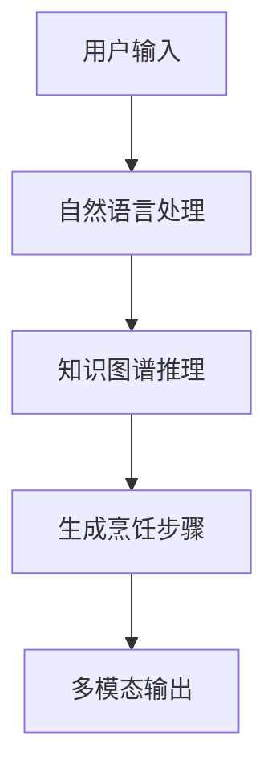

                 


# 智能厨具：AI Agent的烹饪指导系统

> 关键词：智能厨具，AI Agent，烹饪指导，多模态交互，知识图谱，自然语言处理

> 摘要：本文探讨了AI Agent在智能厨具中的应用，特别是其在烹饪指导系统中的核心功能与实现。通过分析AI Agent的感知、推理和执行模块，结合自然语言处理、知识图谱和多模态交互技术，详细阐述了智能厨具烹饪指导系统的算法原理、系统架构设计和项目实现，最后给出了实际案例分析和最佳实践建议。

---

# 第一部分: 智能厨具与AI Agent的背景与概念

# 第1章: 背景介绍

## 1.1 问题背景
### 1.1.1 现代烹饪中的技术需求
现代烹饪不仅仅是食材的处理，更是一种复杂的流程化任务。用户需要精准的指导，尤其是在烹饪技巧、食材搭配和时间控制等方面。传统烹饪指导系统依赖于固定的菜谱，难以适应用户的个性化需求和实时反馈。

### 1.1.2 智能厨具的发展趋势
随着物联网和人工智能技术的快速发展，智能厨具逐渐成为厨房中的重要设备。这些设备通过传感器和网络连接，能够实时感知烹饪过程中的各种参数，并通过AI技术提供智能化的指导。

### 1.1.3 AI Agent在烹饪中的潜在价值
AI Agent（智能体）能够在烹饪过程中实时感知用户的需求，通过自然语言处理、知识图谱和多模态交互技术，为用户提供个性化的烹饪指导。这种智能化的烹饪指导系统能够显著提升用户体验，降低烹饪失败的风险。

## 1.2 问题描述
### 1.2.1 烹饪指导系统的核心问题
烹饪指导系统需要解决的问题包括：如何理解用户的意图，如何实时感知烹饪过程中的状态，如何动态调整烹饪步骤，以及如何通过多模态交互为用户提供有效的指导。

### 1.2.2 用户需求与痛点分析
用户在烹饪过程中可能遇到的问题包括：食材用量不确定、烹饪步骤不清晰、火候掌握不准确等。此外，用户可能对某些食材的特性或烹饪技巧缺乏了解，导致烹饪过程受阻。

### 1.2.3 AI Agent在烹饪指导中的具体应用场景
AI Agent在烹饪指导中的应用场景包括：实时语音交互、动态调整菜谱、食材识别与推荐、烹饪过程监控等。

## 1.3 问题解决
### 1.3.1 AI Agent的核心功能
AI Agent在烹饪指导系统中的核心功能包括：感知用户需求、实时感知烹饪状态、推理最优烹饪方案、动态调整菜谱、以及通过多模态交互为用户提供指导。

### 1.3.2 智能厨具的技术实现路径
智能厨具的技术实现路径包括：传感器数据采集、AI算法处理、多模态交互输出。通过这些技术，AI Agent能够实现对烹饪过程的全面感知和精准指导。

### 1.3.3 系统设计的边界与外延
系统设计的边界包括：仅针对家庭烹饪场景，不涉及工业烹饪；仅支持有限的食材类型和烹饪方法。系统的外延包括：支持更多种类的食材和烹饪方法，扩展到其他家庭场景。

## 1.4 概念结构与核心要素
### 1.4.1 系统整体架构
系统整体架构包括：用户交互层、AI Agent层、烹饪设备层。用户通过交互层与系统进行互动，AI Agent层负责处理用户需求和烹饪状态，烹饪设备层负责执行具体的烹饪操作。

### 1.4.2 核心要素的组成与关系
核心要素包括：用户需求、烹饪状态、AI推理、烹饪步骤、多模态输出。这些要素之间通过数据流和控制流相互关联，共同实现烹饪指导功能。

### 1.4.3 系统的核心功能模块
系统的核心功能模块包括：用户意图识别模块、烹饪状态感知模块、知识图谱推理模块、动态菜谱生成模块、多模态输出模块。

## 1.5 本章小结
本章通过分析烹饪指导系统的核心问题，介绍了AI Agent在烹饪指导中的应用背景和具体场景。通过对系统整体架构和核心要素的分析，明确了AI Agent在烹饪指导系统中的功能定位和技术实现路径。

---

# 第二部分: AI Agent的核心概念与联系

# 第2章: AI Agent的核心概念与联系

## 2.1 核心概念原理
### 2.1.1 AI Agent的基本定义
AI Agent是一种能够感知环境并采取行动以实现目标的智能体。在烹饪指导系统中，AI Agent通过感知用户的意图和烹饪状态，提供个性化的烹饪指导。

### 2.1.2 智能厨具中的AI Agent功能模块
智能厨具中的AI Agent功能模块包括：自然语言处理模块、知识图谱推理模块、多模态输出模块。这些模块协同工作，实现智能化的烹饪指导。

### 2.1.3 多模态交互的核心原理
多模态交互是指通过多种信息形式（如文本、语音、图像）与用户进行互动。AI Agent通过多模态交互，能够更准确地理解用户需求，并提供更丰富的反馈。

## 2.2 核心概念属性对比
### 2.2.1 AI Agent与传统烹饪指导系统的对比
| 对比维度 | AI Agent | 传统烹饪指导系统 |
|----------|-----------|------------------|
| 智能性   | 高         | 低               |
| 个性化   | 高         | 低               |
| 实时性   | 高         | 低               |
| 反馈方式 | 多模态     | 文本/固定菜谱     |

### 2.2.2 不同AI Agent功能模块的属性分析
| 功能模块       | 输入形式 | 输出形式 | 核心功能 |
|----------------|----------|-----------|----------|
| 用户意图识别   | 文本/语音 | 推理结果   | 理解用户需求 |
| 烹饪状态感知   | 传感器数据 | 状态描述   | 监控烹饪过程 |
| 知识图谱推理   | 状态描述 | 推理结果   | 生成菜谱建议 |
| 动态菜谱生成   | 推理结果 | 烹饪步骤   | 优化烹饪方案 |
| 多模态输出     | 烹饪步骤 | 多模态反馈 | 提供用户指导 |

### 2.2.3 核心概念的特征总结
AI Agent在烹饪指导系统中的核心特征包括：实时性、个性化、智能性和多模态交互。这些特征使得AI Agent能够提供更精准、更灵活的烹饪指导。

## 2.3 ER实体关系图
```mermaid
er
actor: 用户
agent: AI Agent
recipe: 菜谱
ingredient: 食材
step: 烹饪步骤
goal: 用户目标
action: 系统操作
```

## 2.4 本章小结
本章通过分析AI Agent的核心概念和功能模块，明确了其在烹饪指导系统中的作用和实现方式。通过对不同功能模块的属性分析和ER实体关系图的绘制，展示了系统内部的关联和数据流。

---

# 第三部分: AI Agent的算法原理与数学模型

# 第3章: 算法原理讲解

## 3.1 算法原理概述
### 3.1.1 基于自然语言处理的烹饪指导
自然语言处理技术用于理解用户的意图和需求，通过关键词提取和意图识别，生成相应的烹饪步骤。

### 3.1.2 多模态交互的核心算法
多模态交互算法结合了文本、语音和图像等多种信息形式，通过深度学习模型实现对用户需求的精准理解。

### 3.1.3 基于知识图谱的菜谱推理
知识图谱技术用于构建食材、烹饪步骤和用户需求之间的关联关系，通过推理算法生成最优的烹饪方案。

## 3.2 算法流程图


## 3.3 数学模型与公式
### 3.3.1 基于T

