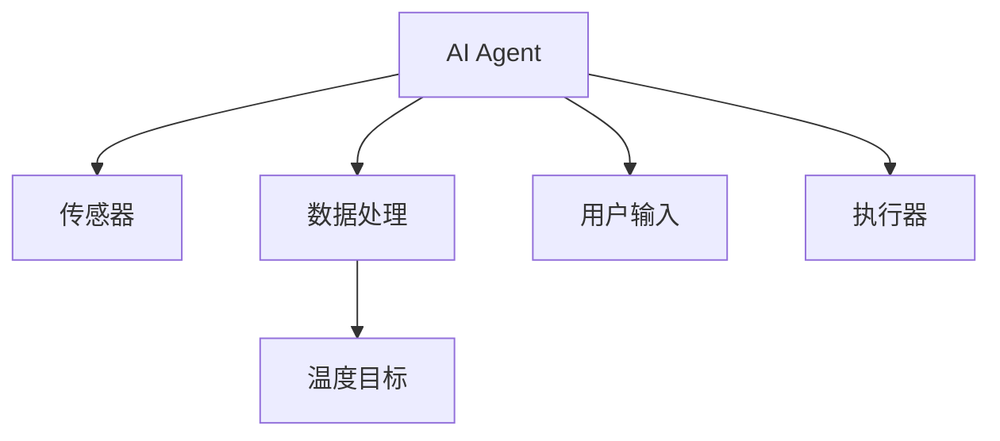
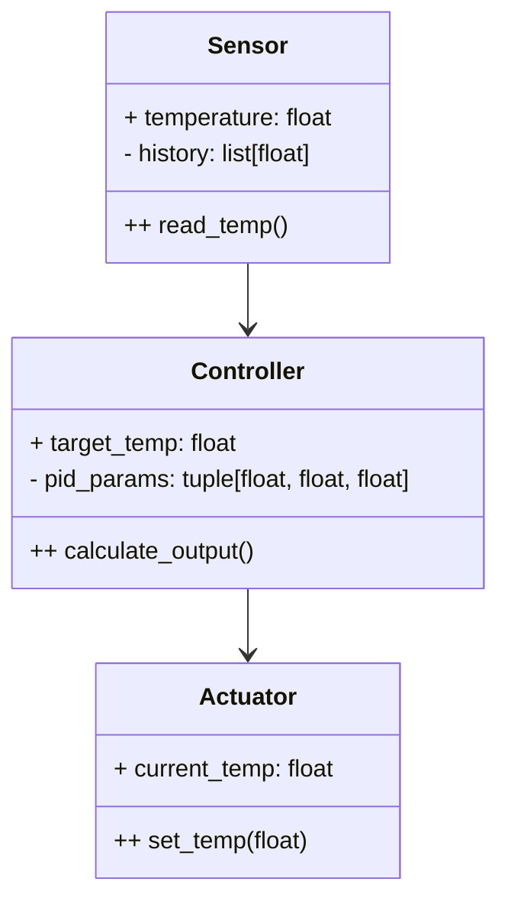
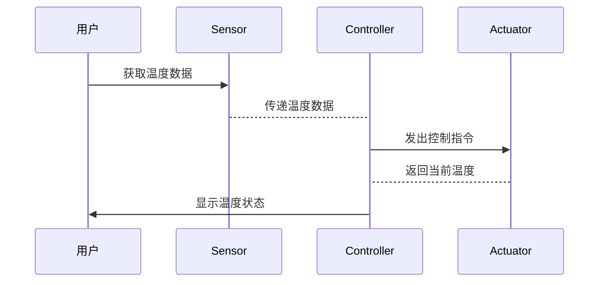

                 


# 智能厨具：AI Agent的烹饪温度控制

> 关键词：智能厨具，AI Agent，烹饪温度控制，物联网，人工智能，算法实现，系统设计

> 摘要：本文探讨了AI Agent在智能厨具中的应用，特别是在烹饪温度控制方面的技术实现。通过分析温度控制的背景、核心概念、算法原理和系统设计，本文详细介绍了AI Agent如何通过感知、推理和执行来实现精准的温度管理，为智能厨具的未来发展提供了理论和实践参考。

---

## 第一部分：智能厨具与AI Agent的背景与概念

### 第1章：智能厨具的发展现状

#### 1.1 智能厨具的定义与分类
智能厨具是指集成人工智能技术，能够通过传感器、网络通信和智能算法实现自动化操作的厨房设备。常见的智能厨具有智能烤箱、智能电磁炉、智能咖啡机等。根据功能的不同，智能厨具可以分为温度控制型、时间管理型和食材识别型三类。

#### 1.2 智能厨具的市场现状与发展趋势
近年来，随着智能家居和物联网技术的普及，智能厨具市场迅速增长。消费者对智能化、便捷化的需求推动了这一领域的快速发展。未来，智能厨具将更加注重人机交互体验，AI Agent将扮演越来越重要的角色。

#### 1.3 AI技术在厨具中的应用前景
AI技术在厨具中的应用主要体现在智能化控制、个性化推荐和远程管理等方面。AI Agent能够通过学习用户的烹饪习惯，优化温度控制策略，提升烹饪效率和品质。

---

### 第2章：AI Agent的基本概念与原理

#### 2.1 AI Agent的定义与特点
AI Agent是一种能够感知环境、自主决策并执行任务的智能实体。在智能厨具中，AI Agent负责接收用户指令、分析环境数据并执行相应的控制操作。

#### 2.2 AI Agent的核心技术与实现原理
AI Agent的核心技术包括感知技术（如温度、湿度传感器）、推理技术（基于规则或机器学习的决策算法）和执行技术（如电机控制）。通过这些技术的协同工作，AI Agent能够实现对烹饪过程的智能管理。

#### 2.3 AI Agent在智能厨具中的应用案例
例如，智能烤箱中的AI Agent可以根据用户的烹饪需求，自动调节温度和时间，确保食物达到最佳烹饪效果。

---

### 第3章：智能厨具中的温度控制技术

#### 3.1 温度控制的基本原理与方法
温度控制主要通过传感器采集数据，利用算法进行分析和调整。常见的控制方法包括比例积分微分（PID）控制和模糊控制。

#### 3.2 AI在温度控制中的优势与挑战
AI的优势在于能够根据历史数据和用户偏好，优化控制策略。然而，算法的复杂性和系统延迟是需要克服的挑战。

#### 3.3 温度控制系统的应用场景与需求分析
在智能烤箱中，温度控制需要考虑食材种类、烹饪时间和用户偏好等因素，以实现精准的温度调节。

---

## 第二部分：AI Agent在烹饪温度控制中的核心概念与联系

### 第4章：AI Agent与温度控制的关系

#### 4.1 AI Agent在温度控制中的角色与功能
AI Agent作为智能温度控制系统的核心，负责数据采集、决策制定和执行控制。

#### 4.2 温度控制系统的整体架构与模块划分
温度控制系统通常包括传感器模块、数据处理模块、控制执行模块和用户交互模块。各模块协同工作，实现温度的精准控制。

#### 4.3 AI Agent与其他系统组件的交互关系
AI Agent通过传感器获取环境数据，通过数据处理模块进行分析，然后通过执行模块调整温度，同时与用户进行交互。

---

### 第5章：温度控制系统的实体关系与流程图

#### 5.1 实体关系分析
在温度控制系统中，主要实体包括AI Agent、传感器、执行器和用户。AI Agent负责协调这些实体，实现温度控制。

#### 5.2 温度控制系统的流程图（Mermaid图）


---

## 第三部分：AI Agent温度控制算法的原理与实现

### 第6章：温度控制算法的基本原理

#### 6.1 基于PID控制的温度调节算法
PID控制是一种常用的反馈控制方法，通过比例、积分和微分三个参数调节输出，实现对温度的精准控制。

#### 6.2 基于机器学习的温度预测算法
机器学习算法（如神经网络）可以根据历史数据预测温度变化趋势，从而优化控制策略。

#### 6.3 算法的优缺点对比与适用场景分析
PID控制简单高效，适用于线性系统；机器学习算法具有更强的适应性，适用于复杂非线性系统。

---

### 第7章：AI Agent温度控制算法的数学模型与公式

#### 7.1 PID控制的数学模型
PID控制器的输出为：
$$ u(t) = K_p e(t) + K_i \int_{0}^{t} e(\tau) d\tau + K_d \frac{d e(t)}{dt} $$
其中，$e(t)$为误差，$K_p$、$K_i$、$K_d$为比例、积分和微分系数。

#### 7.2 机器学习模型的数学公式
神经网络模型通常采用多层感知机结构，其输出为：
$$ y = \sigma(w_2 \sigma(w_1 x + b_1) + b_2) $$
其中，$\sigma$为激活函数，$w$为权重，$b$为偏置。

#### 7.3 算法实现的代码示例
```python
def pid_control(current_temp, target_temp, Kp, Ki, Kd, prev_error, integral):
    error = target_temp - current_temp
    integral += error
    derivative = error - prev_error
    output = Kp * error + Ki * integral + Kd * derivative
    return output, error
```

---

## 第四部分：智能温度控制系统的设计与实现

### 第8章：系统设计与架构分析

#### 8.1 系统功能需求分析
智能温度控制系统需要实现温度采集、数据处理、控制输出和用户交互四大功能。

#### 8.2 系统功能模块划分与类图（Mermaid图）


#### 8.3 系统架构设计与部署方案
系统采用分层架构，包括感知层、数据处理层和应用层。各层通过接口进行交互。

#### 8.4 系统接口设计
主要接口包括传感器数据接口、用户输入接口和执行器控制接口。

#### 8.5 系统交互流程图（Mermaid图）


---

### 第9章：项目实战

#### 9.1 环境安装与配置
需要安装Python、传感器库和相关开发工具。

#### 9.2 系统核心实现源代码
```python
class PIDController:
    def __init__(self, Kp, Ki, Kd):
        self.Kp = Kp
        self.Ki = Ki
        self.Kd = Kd
        self.prev_error = 0
        self.integral = 0

    def calculate(self, current_temp, target_temp):
        error = target_temp - current_temp
        self.integral += error
        derivative = error - self.prev_error
        output = self.Kp * error + self.Ki * self.integral + self.Kd * derivative
        self.prev_error = error
        return output
```

#### 9.3 代码应用解读与分析
上述代码实现了PID控制算法，根据当前温度和目标温度计算输出值，用于调整加热设备。

#### 9.4 实际案例分析与详细讲解
以智能烤箱为例，AI Agent可以根据食材种类和用户偏好，自动调节温度和时间，确保最佳烹饪效果。

#### 9.5 项目小结
通过本项目，我们了解了AI Agent在温度控制中的应用，掌握了PID算法的实现方法，并熟悉了系统设计的基本流程。

---

## 第五部分：最佳实践与总结

### 第10章：最佳实践

#### 10.1 小结
本文详细介绍了AI Agent在智能厨具中的应用，特别是温度控制技术的实现方法。

#### 10.2 注意事项
在实际应用中，需要注意算法的实时性和系统的稳定性。

#### 10.3 拓展阅读
推荐阅读相关领域的书籍和论文，深入学习AI在智能家居中的应用。

---

## 作者

作者：AI天才研究院/AI Genius Institute & 禅与计算机程序设计艺术 /Zen And The Art of Computer Programming

---

以上是文章的完整目录和内容概述，每章内容需要进一步扩展，详细讲解每个部分的具体实现和细节。

