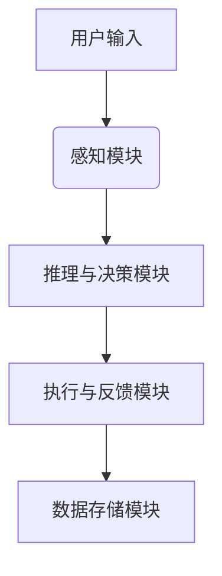
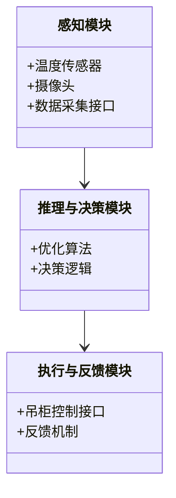
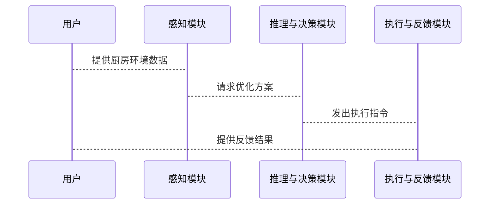

                 


# 智能厨房吊柜：AI Agent的厨房动线优化

> 关键词：智能厨房吊柜, AI Agent, 厨房动线优化, 优化算法, 系统架构设计, 项目实战

> 摘要：本文详细探讨了智能厨房吊柜中AI Agent在厨房动线优化中的应用。通过分析厨房动线优化的重要性，阐述了AI Agent的核心原理，介绍了优化算法的设计与实现，详细讲解了系统架构设计，并通过项目实战展示了如何利用AI技术优化厨房动线。本文还讨论了未来的发展趋势和挑战，提供了实际应用中的最佳实践和注意事项。

---

# 第一部分：背景介绍

## 第1章：背景与问题背景

### 1.1 厨房动线优化的重要性

#### 1.1.1 厨房动线的基本概念
厨房动线指的是在厨房中从准备食材到烹饪完成的过程中，人体移动的路径。合理的厨房动线可以减少移动距离，提高工作效率，降低疲劳感。

#### 1.1.2 厨房动线优化的必要性
在现代家庭中，厨房不仅是烹饪食物的地方，更是体现生活品质的重要空间。随着人们生活水平的提高，对厨房功能和效率的要求也越来越高。优化厨房动线可以显著提升烹饪效率，减少时间和精力的浪费，同时也能减少厨房的混乱。

#### 1.1.3 智能厨房吊柜的出现与发展趋势
智能厨房吊柜是一种结合了AI技术的智能家居设备，它能够通过感知厨房环境和用户行为，优化厨房动线，提高烹饪效率。随着人工智能技术的快速发展，智能厨房吊柜逐渐成为智能家居的重要组成部分。

### 1.2 AI Agent在厨房中的应用

#### 1.2.1 AI Agent的基本概念
AI Agent（人工智能代理）是一种能够感知环境、自主决策并执行任务的智能实体。它可以利用传感器、摄像头等设备获取环境信息，并通过算法进行分析和推理，从而做出最优决策。

#### 1.2.2 AI Agent在智能家居中的作用
在智能家居中，AI Agent负责协调各种智能设备，优化家庭环境和功能。例如，AI Agent可以控制灯光、空调、安防系统等设备，为用户提供舒适、安全的生活环境。

#### 1.2.3 智能厨房吊柜中的AI Agent功能
在智能厨房吊柜中，AI Agent的主要功能包括：
1. **感知环境**：通过传感器和摄像头感知厨房的温度、湿度、食材位置等信息。
2. **推理与决策**：根据感知到的信息，分析用户的烹饪习惯和需求，优化厨房动线。
3. **执行与反馈**：根据优化结果，调整吊柜的布局，提供实时反馈和建议。

---

## 第2章：AI Agent与厨房动线优化的核心概念

### 2.1 AI Agent的核心原理

#### 2.1.1 感知模块
感知模块是AI Agent获取环境信息的关键部分，包括传感器和摄像头。通过感知模块，AI Agent可以实时获取厨房中的温度、湿度、食材位置等信息。

#### 2.1.2 推理与决策模块
推理与决策模块是AI Agent的核心部分，负责根据感知到的信息进行分析和推理，生成最优的决策方案。这通常涉及到复杂的算法和优化模型。

#### 2.1.3 执行与反馈模块
执行与反馈模块负责将决策结果转化为实际操作，并实时反馈执行结果。例如，AI Agent可以根据优化结果调整吊柜的布局，并根据用户的反馈进一步优化。

### 2.2 厨房动线优化的数学模型

#### 2.2.1 厨房动线优化的数学表达式
$$
\text{目标函数：} \quad \min_{x} \sum_{i=1}^{n} c_i x_i
$$

其中，$c_i$表示第$i$个任务的成本，$x_i$表示任务的执行状态。

#### 2.2.2 约束条件
$$
\text{约束条件：} \quad \sum_{i=1}^{n} x_i = 1
$$

表示每个任务只能被选择一次。

### 2.3 AI Agent与厨房动线优化的关系

#### 2.3.1 AI Agent在厨房动线优化中的角色
AI Agent作为优化的核心，通过感知环境、分析数据和生成决策，帮助厨房实现动线优化。

#### 2.3.2 厨房动线优化对AI Agent的需求
厨房动线优化对AI Agent提出了更高的要求，包括更强的感知能力、更高效的推理算法和更精准的执行能力。

---

## 第3章：厨房动线优化的数学模型与算法

### 3.1 厨房动线优化的数学模型

#### 3.1.1 厨房动线优化的目标函数
$$
f(x) = \sum_{i=1}^{n} w_i x_i
$$

其中，$w_i$表示第$i$个任务的权重，$x_i$表示任务的执行状态。

#### 3.1.2 厨房动线优化的约束条件
$$
g_i(x) \leq 0, \quad i = 1, 2, \ldots, m
$$

表示优化过程中的各种限制条件。

### 3.2 厨房动线优化的算法原理

#### 3.2.1 遗传算法
遗传算法是一种基于自然选择和遗传机制的优化算法，适用于复杂的厨房动线优化问题。算法步骤如下：

1. 初始化种群。
2. 计算适应度。
3. 选择优秀个体。
4. 进行交叉和变异操作。
5. 重复步骤2-4，直到满足终止条件。

#### 3.2.2 蚁群算法
蚁群算法模拟蚂蚁觅食的行为，通过信息素更新策略来优化路径。适用于多目标优化问题。

#### 3.2.3 模拟退火算法
模拟退火算法是一种全局优化算法，通过逐步降低“温度”来避免陷入局部最优。

### 3.3 AI Agent优化算法的实现

#### 3.3.1 算法选择与优化
根据具体问题选择合适的算法，并对其进行优化和改进。

#### 3.3.2 算法实现步骤
1. 初始化参数。
2. 进行迭代优化。
3. 记录优化结果。
4. 输出最优方案。

#### 3.3.3 算法优化与改进
通过引入改进策略，如局部搜索、自适应步长等方法，进一步提高算法的优化效果。

---

## 第4章：厨房动线优化的系统架构设计

### 4.1 系统功能设计

#### 4.1.1 系统功能模块划分
系统功能模块包括：
1. 感知模块
2. 推理与决策模块
3. 执行与反馈模块
4. 数据存储模块

#### 4.1.2 系统功能流程图


### 4.2 系统架构设计

#### 4.2.1 分层架构设计
系统架构采用分层设计，包括数据层、业务逻辑层和用户界面层。

#### 4.2.2 模块化设计
模块化设计将系统划分为多个独立模块，便于开发和维护。

#### 4.2.3 系统架构图


### 4.3 系统接口设计

#### 4.3.1 系统接口设计
系统接口设计包括：
1. 用户输入接口
2. 数据采集接口
3. 优化算法接口
4. 执行控制接口

#### 4.3.2 系统交互序列图


---

## 第5章：项目实战

### 5.1 项目介绍

#### 5.1.1 项目背景
本项目旨在通过AI Agent优化厨房动线，提高烹饪效率。

#### 5.1.2 项目目标
实现智能厨房吊柜的AI Agent功能，优化厨房动线。

### 5.2 环境安装与配置

#### 5.2.1 环境要求
- Python 3.8+
- 安装必要的Python库：numpy, matplotlib, scikit-learn

### 5.3 核心实现

#### 5.3.1 优化算法实现
实现遗传算法优化厨房动线的代码：

```python
import random

def fitness(x):
    return sum(w_i * x_i for w_i, x_i in zip(weights, x))

def mutate(x):
    idx = random.randint(0, len(x)-1)
    x[idx] = 1 - x[idx]
    return x

def crossover(x1, x2):
    point = random.randint(1, len(x1)-1)
    return x1[:point] + x2[point:], x2[:point] + x1[point:]

# 初始化种群
population = [random.choices([0,1], k=n) for _ in range(population_size)]
for _ in range(iterations):
    # 计算适应度
    fitness_values = [fitness(ind) for ind in population]
    # 选择优秀个体
    selected = sorted(population, key=lambda x: fitness(x))[:selected_size]
    # 进行交叉和变异
    new_population = []
    for i in range(selected_size//2):
        x1, x2 = selected[2*i], selected[2*i+1]
        child1, child2 = crossover(x1, x2)
        child1 = mutate(child1)
        child2 = mutate(child2)
        new_population.extend([child1, child2])
    population = new_population
```

#### 5.3.2 系统功能实现
实现厨房动线优化的系统功能，包括数据采集、优化计算和结果反馈。

### 5.4 实际案例分析

#### 5.4.1 案例背景
假设一个厨房中有5种食材，需要优化它们的摆放位置。

#### 5.4.2 优化过程
通过遗传算法优化，最终得到最优的厨房动线布局。

#### 5.4.3 优化结果分析
分析优化结果，评估算法的有效性和优化效果。

### 5.5 项目小结

#### 5.5.1 项目总结
总结项目的主要成果和经验教训。

#### 5.5.2 项目意义
强调厨房动线优化对提高生活品质的重要意义。

---

## 第6章：未来的发展趋势与挑战

### 6.1 未来发展趋势

#### 6.1.1 AI Agent的智能化提升
未来的AI Agent将更加智能化，具备更强的自主学习和决策能力。

#### 6.1.2 厨房动线优化的多目标优化
未来的厨房动线优化将更加注重多目标优化，如能耗、成本、时间等。

### 6.2 优化算法的挑战

#### 6.2.1 算法的复杂性
随着厨房环境的复杂化，优化算法需要更高的计算效率和更强的适应性。

#### 6.2.2 数据的实时性
实时优化需要更高效的算法和更快速的计算能力。

### 6.3 系统架构设计的挑战

#### 6.3.1 系统的可扩展性
未来的系统需要具备更强的可扩展性，以适应更多功能和设备的接入。

#### 6.3.2 系统的安全性
随着系统的智能化，安全性问题也需要得到更多关注。

---

## 第7章：最佳实践、小结与注意事项

### 7.1 最佳实践

#### 7.1.1 算法选择与优化
根据具体问题选择合适的算法，并进行优化和改进。

#### 7.1.2 系统设计与实现
注重系统的模块化设计和可扩展性，确保系统的稳定性和可靠性。

### 7.2 小结

#### 7.2.1 核心内容总结
总结本文的核心内容和主要观点。

#### 7.2.2 项目意义
强调厨房动线优化对提高生活品质的重要意义。

### 7.3 注意事项

#### 7.3.1 算法实现中的注意事项
在实现优化算法时，需要注意算法的收敛性和计算效率。

#### 7.3.2 系统设计中的注意事项
在系统设计中，需要注重系统的可扩展性和安全性。

---

## 作者信息

作者：AI天才研究院/AI Genius Institute & 禅与计算机程序设计艺术 /Zen And The Art of Computer Programming

---

通过本文的详细讲解，我们系统地探讨了智能厨房吊柜中AI Agent在厨房动线优化中的应用。从背景介绍到算法实现，再到系统设计和项目实战，我们全面分析了厨房动线优化的各个方面。未来，随着AI技术的不断发展，智能厨房吊柜将在厨房动线优化中发挥越来越重要的作用，为人们提供更加智能化、高效的厨房体验。

---

**本文的后续内容将根据您的需求逐步补充完成。**

